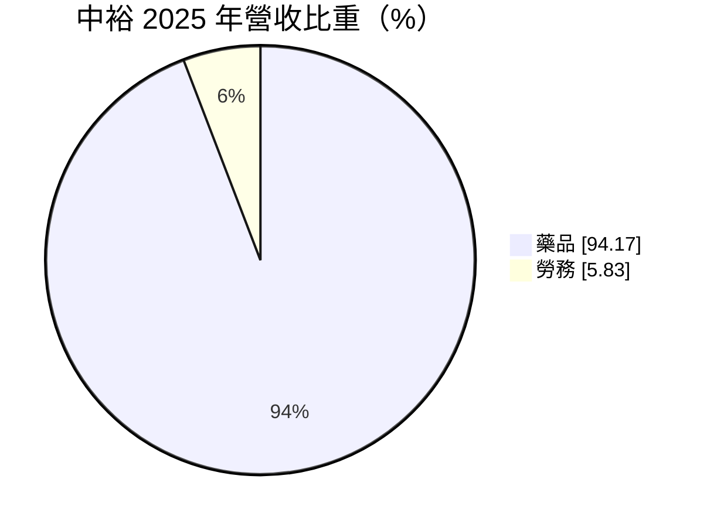
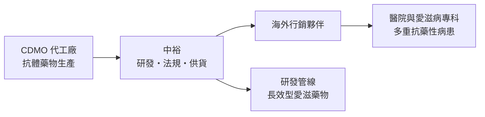
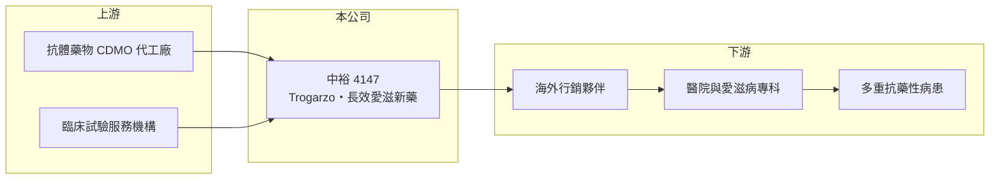

# 4147 中裕

> 上櫃｜[[產業索引-生技醫療業|生技醫療業]]｜上市（櫃）日期 2015/11/23

# 第一章：企業模式與商業藍圖

> [!info] 撰寫說明
> 本文由 Claude 依公開資料整理，架構比照 [[2330台積電]] 的四章研究，資料截至 2026-10-08。財務數字來源：MoneyDJ 理財網年度財務比率與公司基本資料（2025 年營收比重）、櫃買中心開放資料（基本資料、2026 年第二季財報、每月營收與備註）。產品 Trogarzo 的核准年份、銷售夥伴與研發管線進度有部分憑記憶整理，已標註待校對。#待校對

評估一家新藥公司，要分清楚它是還在燒錢做臨床試驗，還是已經有藥品在市場上賺錢。本章說明中裕新藥（股票代號：4147，以下簡稱中裕）的商業模式：它屬於後者，但獲利仍未跟上研發投入。

## 一、核心定位：已上市的愛滋病抗體新藥

中裕成立於 2007 年，總部位於台北市內湖區，2015 年在櫃買中心掛牌，董事長為陳明村，實收資本額約 27.3 億元。公司的核心產品是治療多重抗藥性愛滋病毒（HIV）感染的[[單株抗體]]新藥 Trogarzo（成分 ibalizumab），2018 年取得美國 [[FDA]] 核准（待校對）。依 MoneyDJ 資料，2025 年營收中藥品占 94.2%、勞務占 5.8%。

* **鎖定抗藥性病患的利基市場：** Trogarzo 用於其他藥物都已無效的多重抗藥性病患，病患人數不多，但沒有太多替代選擇，因此藥價高。
* **授權夥伴銷售：** 中裕不在各國自建業務團隊，而是透過行銷夥伴在美國等市場銷售（夥伴名稱待校對），中裕的營收來自出貨給夥伴的藥品。櫃買中心月營收備註也指出，每月營收會受「行銷夥伴每月進貨數量」影響。
* **委外生產：** 同一則備註提到營收受 [[CDMO]] 生產時程影響，代表藥品主要委由代工廠生產。

## 二、資本轉化邏輯

* **用既有產品養研發：** Trogarzo 帶來的營收，讓中裕可以用較少的外部資金推進下一代產品，這是新藥公司中少見的模式。
* **下一代產品：** 公司正在開發長效型雙抗體愛滋藥物 TMB-365/380（臨床進度待校對），目標是讓病患以更少的注射次數維持治療，市場規模可望遠大於目前的抗藥性利基市場。

## 三、長期方向

中裕的長期價值取決於兩件事：Trogarzo 能否在現有市場持續擴大使用，以及長效型新藥能否完成臨床、取得授權或上市。後者一旦成功，公司就能從利基藥廠轉型為主流愛滋病治療市場的參與者。

# 第二章：護城河深度與競爭優勢

護城河是企業抵禦競爭、長期維持超額利潤的機制。本章說明中裕的專利、臨床資料與利基市場優勢。

## 一、中裕護城河的核心組成要素

* **1. 上市新藥的法規門檻：** 新藥需要完成多期臨床試驗並取得藥證，Trogarzo 已經走完這段漫長且昂貴的流程，後進者需要多年才能複製。
* **2. 專利與獨特作用機轉：** 單株抗體藥物的結構與製程受專利保護，與傳統口服抗病毒藥的機轉不同，可用於其他藥物無效的病患。
* **3. 限制：** 利基市場規模有限，而且口服與長效注射藥物持續推陳出新，抗藥性病患的數量可能逐漸減少。

## 二、主要競爭對手格局

| 對手 | 定位 | 對中裕的影響 |
|---|---|---|
| Gilead | 全球愛滋病藥物龍頭 | 主流口服與長效藥物市場的主導者 |
| ViiV Healthcare（葛蘭素史克旗下） | 愛滋病藥物與長效注射劑 | 長效型治療的主要競爭者 |
| 其他多重抗藥性療法 | 新機轉藥物 | 搶同一批抗藥性病患 |

## 三、優勢轉化：守得住與守不住的地方

* **守得住：** 營收由 2018 年的極低水準成長到 2025 年約 6.1 億元（推算），毛利率約 42%，產品已有穩定的市場需求。
* **守不住：** 2019 至 2025 年營業利益率介於 -18% 至 -118% 之間，研發與營運費用遠大於毛利，公司尚未損益兩平。
* **觀察重點：** 長效型新藥的臨床結果與授權進度，以及 Trogarzo 營收能否持續成長。

# 第三章：財務體質與盈利規模

資料日期：2026-10-08。數字取自 MoneyDJ 理財網年度財務資料與櫃買中心開放資料，表格是撰寫當時的快照；最新月營收、毛利率、累計 EPS 由自動排程寫在本筆記的屬性欄位（月營收、毛利率、累計EPS 等）。#待校對

財務報表是檢驗護城河是否真實存在的最終標準。對新藥公司而言，重點是營收成長速度能否追上研發支出。

## 一、多年度財務表現

| 年度 | 營收（新台幣） | 每股營業額 | [[毛利率]] | [[營業利益率]] | EPS（元） | [[ROE]] |
|---|---|---|---|---|---|---|
| 2021 | 未查得 | 1.64 元 | 20.3% | -117.6% | -1.87 | -14.82% |
| 2022 | 未查得 | 2.23 元 | 38.3% | -34.1% | -1.07 | -9.52% |
| 2023 | 未查得 | 1.94 元 | 45.8% | -33.8% | -0.77 | -7.38% |
| 2024 | 約 6.1 億（推算） | 2.23 元 | 34.6% | -41.3% | -0.75 | -6.13% |
| 2025 | 約 6.1 億（推算） | 2.24 元 | 42.4% | -31.8% | -0.61 | -4.26% |

資料來源：MoneyDJ 理財網年度財務比率（合併報表）；營收以每股營業額乘目前股數約 2.73 億股推算。每股淨值由 2023 年的 10.14 元升到 2024 年的 14.73 元、負債比率由 34% 降到 20%，顯示 2024 年有增資，2023 年以前股本不同，故不推算。2026 年上半年（櫃買中心資料）營收約 3.22 億元、毛利率約 56.8%、營業損失約 0.72 億元、EPS -0.21 元；2026 年 1 至 8 月營收約 4.46 億元，較去年同期成長約 10.9%。

中裕近五年平均 ROE 約 -8.4%（推算），但虧損幅度逐年縮小：EPS 由 2021 年的 -1.87 元改善到 2025 年的 -0.61 元，2026 年上半年 EPS -0.21 元，虧損持續收斂。公司尚未發放現金股利。研發費用率未查得，但營業利益率長期為負，代表研發與營運費用仍超過毛利。

## 二、[[ROIC]] 與 [[WACC]]：價值創造利差

**ROIC 推算：** 2025 年營業損失約 1.95 億元（營收約 6.1 億元乘營業利益率 -31.8%，推算），虧損不計稅盾。2026 年第二季權益總計約 36.8 億元、負債總計約 8.2 億元，假設四成為有息負債約 3.3 億元（推估），投入資本約 40.1 億元，ROIC 約 -4.9%（推算）。

**WACC 推算：** 台灣 10 年期公債殖利率取 1.75%、市場風險溢酬 6%，新藥公司風險較高，β 取 1.1（同業常見值；MoneyDJ 顯示約 0.35，不採用），股東權益成本約 8.35%。負債成本假設 2.5%，稅率 20%，稅後約 2.0%。權益約占投入資本 92%，WACC 約 7.8%（推算）。

**結論：** ROIC 為負，低於 WACC 約 13 個百分點。對新藥公司來說，這是研發階段的正常現象，股東實際是在用資金換取新藥成功的機會；關鍵在於長效型新藥能否成功，讓未來的報酬補回這段期間的資本消耗。

# 第四章：總體風險與地緣政治

任何企業都無法脫離宏觀環境獨立存在。本章分析中裕長期必須面對的研發、市場與營運風險。

## 一、研發與法規風險

* **臨床失敗風險：** 長效型新藥若臨床結果不如預期，公司的長期成長故事會大打折扣。
* **藥證與法規：** 新適應症或新劑型都需要重新取得主管機關核准，時程不確定。

## 二、市場與夥伴風險

* **利基市場萎縮：** 新一代愛滋病藥物降低抗藥性發生率，可能讓 Trogarzo 的目標病患逐漸減少。
* **依賴行銷夥伴：** 營收受夥伴進貨節奏影響，夥伴策略改變或合約變動，會直接衝擊營收。
* **美國藥價政策：** 美國藥價改革與保險給付規定，會影響高價特殊藥的銷售。

## 三、營運風險

* **委外生產：** 依賴 CDMO 生產，代工廠的產能排程或品質問題可能造成斷貨。
* **匯率：** 營收以美元計價，新台幣升值會壓低以台幣計算的營收。

# 專有名詞解析

## 應用

- **[[FDA]]**：美國食品藥物管理局，負責藥品與醫療器材的上市審查，是全球最具指標性的主管機關。

## 金融

- **[[ROIC]]**：投入資本報酬率，稅後營業利益除以股東權益加有息負債，衡量本業運用資本的效率。
- **[[WACC]]**：加權平均資金成本，股東與債權人要求報酬率的加權平均，是 ROIC 要超越的門檻。

## 產業

- **[[單株抗體]]**：由單一細胞株產生、只辨認單一抗原位點的抗體，專一性高，用於研究、檢驗與治療。
- **[[CDMO]]**：委託開發暨製造服務，替客戶進行藥品製程開發與量產的代工模式。

# 核心供應鏈

## 1. 上游：生產與臨床服務
- 抗體藥物 CDMO 代工廠、臨床試驗服務機構（名稱未查得）

## 2. 中游：中裕與同業
- 國際愛滋病藥物廠：Gilead、ViiV Healthcare

## 3. 下游：客戶
- 海外行銷夥伴，透過醫院與愛滋病專科供應多重抗藥性病患

## 最新新聞
<!-- news:start -->
<!-- news:end -->

## 相關連結
- [公開資訊觀測站](https://mopsov.twse.com.tw/mops/web/t05st03?step=1&firstin=1&co_id=4147)
- [Goodinfo](https://goodinfo.tw/tw/StockDetail.asp?STOCK_ID=4147)
- [Yahoo 股市](https://tw.stock.yahoo.com/quote/4147)
- [鉅亨網新聞](https://www.cnyes.com/twstock/4147/news)
