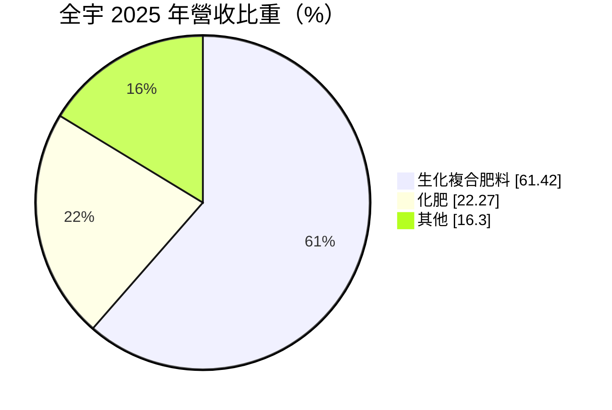
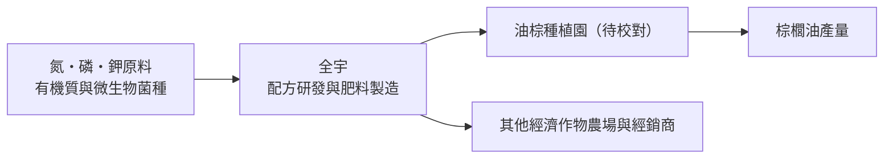
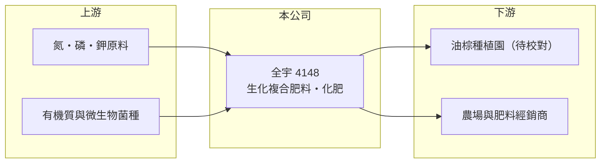

# 4148 全宇生技-KY

> 上市｜[[產業索引-生技醫療業|生技醫療業]]｜上市（櫃）日期 2017/06/08

# 第一章：企業模式與商業藍圖

> [!info] 撰寫說明
> 本文由 Claude 依公開資料整理，架構比照 [[2330台積電]] 的四章研究，資料截至 2026-10-08。財務數字來源：MoneyDJ 理財網年度財務比率與公司基本資料（2025 年營收比重）、證交所開放資料（基本資料、2026 年第二季財報與營益分析、每月營收、股利）。營運據點（馬來西亞）與油棕園客戶為憑記憶與新聞網址整理，已標註待校對。#待校對

全宇生技雖然被歸在生技醫療類股，實際本業是農業用的肥料。評估肥料公司，要看它賺的是原料價格的波動，還是產品配方帶來的穩定溢價。本章說明全宇生技（股票代號：4148，以下簡稱全宇）的商業模式。

## 一、核心定位：以生化複合肥料服務大型種植園

全宇為開曼群島註冊的控股公司，2010 年成立，2017 年在證交所上市，董事長兼總經理為彭士豪，實收資本額約 6.7 億元。依 MoneyDJ 資料，2025 年營收中生化[[複合肥料]]占 61.4%、化肥占 22.3%、其他占 16.3%。公司主要營運據點在馬來西亞，客戶以油棕種植園為主（待校對）。

* **生化複合肥料是主力：** 在傳統化學肥料中加入微生物或有機成分，強調改善土壤、提高養分利用率。這類產品有配方差異，毛利率高於一般化肥。
* **化肥是規模型產品：** 一般化肥同質性高，價格跟著國際氮、磷、鉀原料行情走，毛利較低，但能補足客戶的完整施肥需求。

## 二、資本轉化邏輯

* **原料成本轉嫁：** 肥料的主要成本是國際原料，原料上漲時能否轉嫁給客戶，決定毛利率。2022 年肥料行情高漲時，全宇的營業利益率升到 18.0%、EPS 5.75 元，是近年高峰。
* **客戶的收入決定肥料預算：** 種植園的施肥量與棕櫚油價格連動，油價好時願意多施肥、用高階肥料。

## 三、長期方向

全球人口成長與耕地有限，使提高單位面積產量成為長期需求，這是複合肥料與[[生物肥料]]的結構性動能。全宇的長期課題，是擴大高毛利生化複合肥料的比重，並把客戶群從單一作物、單一國家往外延伸（新廠與新市場進度待校對）。

# 第二章：護城河深度與競爭優勢

護城河是企業抵禦競爭、長期維持超額利潤的機制。本章說明全宇在肥料市場的優勢與限制。

## 一、全宇護城河的核心組成要素

* **1. 配方與田間驗證：** 生化複合肥料的效果需要在種植園長期試驗，累積的田間數據讓客戶願意持續採用。
* **2. 地緣與客戶關係：** 肥料體積大、運費高，在地生產並貼近種植園客戶，具有運輸成本優勢。
* **3. 限制：** 肥料整體仍屬大宗商品，原料價格與競爭對手的定價都會壓縮溢價空間。

## 二、主要競爭對手格局

| 對手 | 定位 | 對全宇的影響 |
|---|---|---|
| 國際肥料大廠（Yara、Nutrien 等） | 全球化肥原料與成品 | 掌握原料與規模優勢 |
| 東南亞本地肥料廠 | 一般化肥與複合肥 | 價格競爭 |
| [[1722台肥]] | 台灣肥料龍頭 | 同為肥料業者，市場不同 |

## 三、優勢轉化：守得住與守不住的地方

* **守得住：** 2018 年以來每年都維持正的營業利益，負債比率長期低於 31%，財務穩健。
* **守不住：** 營業利益率在 4% 到 18% 之間大幅波動，代表獲利仍受原料與農產品價格循環左右，配方溢價不足以完全抵銷週期。
* **觀察重點：** 生化複合肥料占比能否持續提高，以及 2026 年營收成長能否延續。

# 第三章：財務體質與盈利規模

資料日期：2026-10-08。數字取自 MoneyDJ 理財網年度財務資料與證交所開放資料，表格是撰寫當時的快照；最新月營收、毛利率、累計 EPS 由自動排程寫在本筆記的屬性欄位（月營收、毛利率、累計EPS 等）。#待校對

財務報表是檢驗護城河是否真實存在的最終標準。本章用五年的三率、ROE、配息與資本報酬，檢視全宇的獲利品質。

## 一、多年度財務表現

| 年度 | 營收（新台幣） | 每股營業額 | [[毛利率]] | [[營業利益率]] | EPS（元） | [[ROE]] |
|---|---|---|---|---|---|---|
| 2021 | 約 23.1 億（推算） | 34.31 元 | 27.1% | 12.4% | 3.09 | 9.98% |
| 2022 | 約 38.9 億（推算） | 57.82 元 | 30.7% | 18.0% | 5.75 | 17.40% |
| 2023 | 約 29.7 億（推算） | 44.14 元 | 20.8% | 6.7% | 2.18 | 6.67% |
| 2024 | 約 25.8 億（推算） | 38.40 元 | 27.2% | 6.3% | 2.01 | 5.87% |
| 2025 | 約 29.5 億（推算） | 43.86 元 | 28.1% | 10.1% | 2.28 | 6.27% |

資料來源：MoneyDJ 理財網年度財務比率（合併報表）；營收以每股營業額乘目前股數約 6,724 萬股推算，股本多年變動不大，但仍屬推算。2026 年上半年（證交所資料）營收約 15.1 億元、毛利率 29.0%、營業利益率 10.1%、EPS 1.22 元；2026 年 1 至 8 月營收約 22.4 億元，較去年同期成長約 26.6%，月營收備註說明主因為客戶訂單需求增加。

全宇近五年平均 ROE 約 9.2%（推算），2021 至 2025 年營收年複合成長率約 6.3%（推算），但中間經歷 2022 年的高峰與 2023 至 2024 年的回落，週期性明顯。公司採半年配息，依證交所資料，2025 年下半年配發每股 1.0 元現金股利。另外，2026 年第二季權益總計約 35.0 億元，其中歸屬母公司約 27.7 億元，[[非控制權益]]約 7.3 億元，合併報表的獲利有一部分不歸母公司股東。

## 二、[[ROIC]] 與 [[WACC]]：價值創造利差

**ROIC 推算：** 2025 年營業利益約 3.0 億元（營收約 29.5 億元乘營業利益率 10.06%，推算），稅後約 2.4 億元。2026 年第二季權益總計約 35.0 億元、負債總計約 10.4 億元，假設四成為有息負債約 4.2 億元（推估），投入資本約 39.2 億元，ROIC 約 6.1%（推算）。2022 年高峰時 ROIC 推估約 14%。

**WACC 推算：** 台灣 10 年期公債殖利率取 1.75%、市場風險溢酬 6%、β 取原物料同業常見值 0.9（MoneyDJ 顯示約 -0.02，不具參考性，不採用），股東權益成本約 7.15%。負債成本假設 2.5%，稅率 20%，稅後約 2.0%。權益約占投入資本 89%，WACC 約 6.6%（推算）。

**結論：** 2025 年 ROIC 略低於 WACC，利差約 -0.5 個百分點；只有在 2022 年這類肥料景氣高峰，ROIC 才明顯超過資金成本。這代表全宇長期大致賺回資金成本，但尚未建立持續創造超額價值的能力。

# 第四章：總體風險與地緣政治

任何企業都無法脫離宏觀環境獨立存在。本章分析全宇長期必須面對的原物料、農業與政策風險。

## 一、原物料與產業週期風險

* **肥料原料價格：** 氮、磷、鉀價格受天然氣價格、出口國政策與地緣衝突影響，波動劇烈，直接衝擊毛利率。
* **棕櫚油價格：** 客戶的收入與棕櫚油價格連動，油價下跌時種植園會減少施肥預算（客戶結構待校對）。

## 二、政策與環境風險

* **永續與環保法規：** 歐盟對棕櫚油的毀林法規等永續要求，可能影響種植園擴張與肥料需求。
* **天候：** 聖嬰現象等極端氣候影響作物產量與施肥時程。

## 三、其他風險

* **匯率：** 營收以當地貨幣計價（待校對），兌新台幣匯率波動會影響帳面營收與配息能力。
* **非控制權益：** 部分子公司有其他股東，母公司股東實際分到的獲利比合併數字少。

# 專有名詞解析

## 金融

- **[[非控制權益]]**：合併報表中，子公司不屬於母公司持有的那部分權益，對應的獲利不歸母公司股東。
- **[[ROIC]]**：投入資本報酬率，稅後營業利益除以股東權益加有息負債，衡量本業運用資本的效率。
- **[[WACC]]**：加權平均資金成本，股東與債權人要求報酬率的加權平均，是 ROIC 要超越的門檻。

## 產業

- **[[複合肥料]]**：含有氮、磷、鉀中兩種以上養分的肥料，可依作物需求調整配方。
- **[[生物肥料]]**：含有益微生物的肥料，透過固氮、解磷等作用提高土壤養分利用率。

# 核心供應鏈

## 1. 上游：原料
- 國際氮、磷、鉀原料供應商，有機質與微生物菌種（名稱未查得）

## 2. 中游：全宇與同業
- 肥料同業：[[1722台肥]]、Yara、Nutrien

## 3. 下游：客戶
- 油棕種植園、其他經濟作物農場與肥料經銷商（客戶名稱未查得）

## 最新新聞
<!-- news:start -->
<!-- news:end -->

## 相關連結
- [公開資訊觀測站](https://mopsov.twse.com.tw/mops/web/t05st03?step=1&firstin=1&co_id=4148)
- [Goodinfo](https://goodinfo.tw/tw/StockDetail.asp?STOCK_ID=4148)
- [Yahoo 股市](https://tw.stock.yahoo.com/quote/4148)
- [鉅亨網新聞](https://www.cnyes.com/twstock/4148/news)
