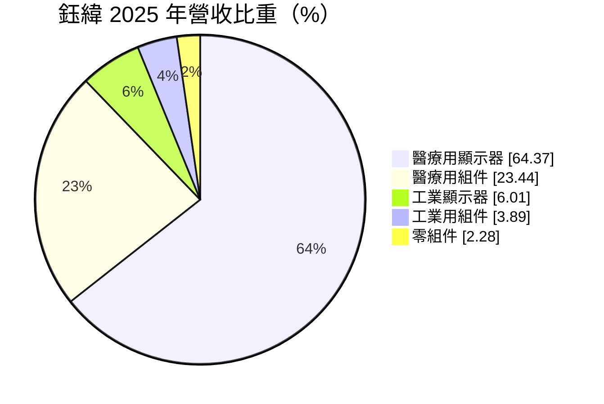
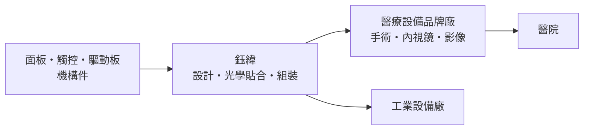
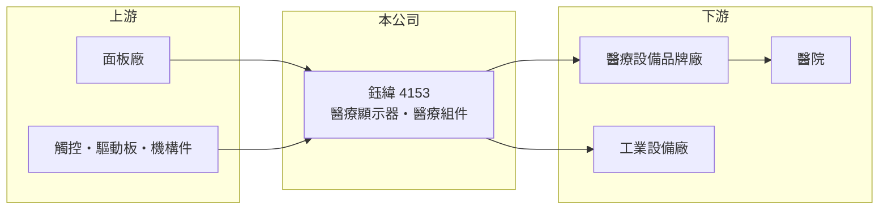

# 4153 鈺緯

> 上櫃｜[[產業索引-生技醫療業|生技醫療業]]｜上市（櫃）日期 2013/05/23

# 第一章：企業模式與商業藍圖

> [!info] 撰寫說明
> 本文由 Claude 依公開資料整理，架構比照 [[2330台積電]] 的四章研究，資料截至 2026-10-08。財務數字來源：MoneyDJ 理財網年度財務比率與公司基本資料（2025 年營收比重）、櫃買中心開放資料（基本資料、2026 年第二季財報、每月營收、本益比殖利率）、自由時報報導標題（手術房用顯示器產品）。客戶與銷售地區未查得，產業描述為整理性內容，已標註待校對。#待校對

醫療設備的螢幕看起來只是零件，但它必須跟著整台設備通過醫療法規認證，這讓它和一般消費性螢幕的生意完全不同。本章說明鈺緯科技（股票代號：4153，以下簡稱鈺緯）的商業模式。

## 一、核心定位：醫療設備廠的顯示器與組件供應商

鈺緯成立於 1995 年，總部位於新北市中和區，2013 年在櫃買中心掛牌，董事長為黃漢州，實收資本額約 5.9 億元。依 MoneyDJ 資料，2025 年營收中[[醫療用顯示器]]占 64.4%、醫療用組件占 23.4%、[[工業顯示器]]占 6.0%、工業用組件占 3.9%、零組件占 2.3%，醫療相關合計接近九成。

* **醫療用顯示器：** 用於手術室、內視鏡、超音波與影像診斷等設備的螢幕，需要高亮度、色彩準確與長期穩定。依自由時報報導標題，鈺緯的手術房用[[光學貼合]] LCD 顯示器獲客戶青睞，代表產品已切入要求最高的手術室場景。
* **醫療用組件：** 除了螢幕本身，也提供設備所需的相關組件，讓公司從單一零件供應商往次系統供應商發展。

## 二、資本轉化邏輯

* **小量多樣、長生命週期：** 醫療設備的生產量不大，但一款機型往往銷售多年，零件規格不能隨意更改。這種特性讓供應商一旦被設計導入，就能長期穩定出貨。
* **毛利介於零件與品牌之間：** 2025 年[[毛利率]]約 30.4%，高於一般消費性面板模組，但低於醫材品牌廠，反映它在供應鏈中的位置。

## 三、長期方向

人口老化與微創手術普及，使手術室與影像設備的數量長期增加，醫療用顯示器的需求也隨之成長。鈺緯的長期課題，是從提供螢幕延伸到更多醫療組件與次系統，提高每台設備的供貨價值。

# 第二章：護城河深度與競爭優勢

護城河是企業抵禦競爭、長期維持超額利潤的機制。本章說明鈺緯在醫療顯示器市場的優勢與限制。

## 一、鈺緯護城河的核心組成要素

* **1. 設計導入的轉換成本：** 醫療設備廠一旦把顯示器納入設備並完成法規認證，更換供應商就要重新驗證，因此客戶黏著度高。
* **2. 醫療規格的製造能力：** 光學貼合、高亮度與長期供貨承諾，是一般面板模組廠不一定願意做的小量多樣生意。
* **3. 限制：** 鈺緯本身不生產面板，關鍵零件仰賴面板廠供應，議價能力有限。

## 二、主要競爭對手格局

| 對手 | 定位 | 對鈺緯的影響 |
|---|---|---|
| EIZO、Barco | 國際醫療顯示器品牌 | 在影像診斷高階市場領先 |
| [[2465麗臺]] | 台灣繪圖卡與專業顯示器廠（醫療顯示器業務待校對） | 台灣同業 |
| [[3022威強電]] | 工業電腦與顯示器 | 工業顯示器市場競爭 |

## 三、優勢轉化：守得住與守不住的地方

* **守得住：** 營業利益率由 2021 年的 3.2% 升到 2024 年的 12.9%，2025 年仍有 11.8%，代表產品組合改善後的獲利能力已經站穩。
* **守不住：** 營收規模多年停在 9 億元上下（推算），成長有限。
* **觀察重點：** 新設計導入的醫療設備專案能否放量，以及醫療組件占比能否持續提升。

# 第三章：財務體質與盈利規模

資料日期：2026-10-08。數字取自 MoneyDJ 理財網年度財務資料與櫃買中心開放資料，表格是撰寫當時的快照；最新月營收、毛利率、累計 EPS 由自動排程寫在本筆記的屬性欄位（月營收、毛利率、累計EPS 等）。#待校對

財務報表是檢驗護城河是否真實存在的最終標準。本章用五年的三率、ROE、配息與資本報酬，檢視鈺緯的獲利品質。

## 一、多年度財務表現

| 年度 | 營收（新台幣） | 每股營業額 | [[毛利率]] | [[營業利益率]] | EPS（元） | [[ROE]] |
|---|---|---|---|---|---|---|
| 2021 | 約 7.1 億（推算） | 12.14 元 | 25.5% | 3.2% | 0.37 | 2.21% |
| 2022 | 約 9.5 億（推算） | 16.18 元 | 28.0% | 8.9% | 0.85 | 4.96% |
| 2023 | 約 8.9 億（推算） | 15.24 元 | 28.1% | 10.3% | 1.25 | 7.19% |
| 2024 | 約 8.6 億（推算） | 14.70 元 | 30.2% | 12.9% | 1.60 | 8.97% |
| 2025 | 約 8.7 億（推算） | 14.81 元 | 30.4% | 11.8% | 1.54 | 8.69% |

資料來源：MoneyDJ 理財網年度財務比率（合併報表）；營收以每股營業額乘目前股數約 5,867 萬股推算，每股淨值多年維持在 16.8 至 18.0 元，股本變動應不大，但仍屬推算。2026 年上半年（櫃買中心資料）營收約 4.68 億元、毛利率約 28.6%、營業利益約 0.59 億元、EPS 0.96 元；2026 年 1 至 8 月營收約 6.31 億元，較去年同期成長約 9.3%。

鈺緯近五年平均 ROE 約 6.4%（推算），但趨勢一路向上，由 2021 年的 2.2% 升到 2024 至 2025 年的 9% 左右；2021 至 2025 年營收年複合成長率約 5.1%（推算）。依櫃買中心資料，最近一次現金股利為每股 2.0 元，高於 2025 年 EPS 1.54 元，配息率超過 100%，代表公司傾向把現金發還股東。

## 二、[[ROIC]] 與 [[WACC]]：價值創造利差

**ROIC 推算：** 2025 年營業利益約 1.0 億元（營收約 8.7 億元乘營業利益率 11.77%，推算），稅後約 0.82 億元。2026 年第二季權益總計約 9.7 億元、負債總計約 5.0 億元，假設四成為有息負債約 2.0 億元（推估），投入資本約 11.7 億元，ROIC 約 7.0%（推算）。

**WACC 推算：** 台灣 10 年期公債殖利率取 1.75%、市場風險溢酬 6%、β 取醫材與電子零組件同業常見值 0.9（MoneyDJ 顯示約 0.06，不具參考性，不採用），股東權益成本約 7.15%。負債成本假設 2.5%，稅率 20%，稅後約 2.0%。權益約占投入資本 83%，WACC 約 6.3%（推算）。

**結論：** ROIC 略高於 WACC，利差約 0.7 個百分點，代表鈺緯在 2023 年以後已能賺回資金成本並小幅創造價值。要擴大利差，需要營收規模成長，讓固定費用進一步攤薄。

# 第四章：總體風險與地緣政治

任何企業都無法脫離宏觀環境獨立存在。本章分析鈺緯長期必須面對的客戶、供應鏈與法規風險。

## 一、客戶與產業週期風險

* **客戶集中：** 醫療設備品牌廠數量有限，若營收集中在少數客戶，單一客戶的機型換代或庫存調整會明顯影響業績（客戶結構待校對）。
* **醫院資本支出週期：** 醫院採購設備受預算與政策影響，景氣不佳時會延後汰換。

## 二、供應鏈風險

* **面板供應：** 關鍵面板仰賴面板廠，面板廠停產特定規格時，鈺緯必須重新設計與驗證，增加成本。
* **零件漲價：** 面板與電子零件價格上漲時，未必能即時轉嫁給客戶。

## 三、法規與匯率風險

* **醫材法規：** 醫療設備法規趨嚴，供應商需要配合客戶提供更多文件與品質紀錄。
* **匯率：** 若以外銷為主，新台幣升值會壓縮營收與毛利（銷售地區待校對）。

# 專有名詞解析

## 金融

- **[[ROIC]]**：投入資本報酬率，稅後營業利益除以股東權益加有息負債，衡量本業運用資本的效率。
- **[[WACC]]**：加權平均資金成本，股東與債權人要求報酬率的加權平均，是 ROIC 要超越的門檻。

## 產業

- **[[醫療用顯示器]]**：用於手術室、內視鏡與影像診斷設備的螢幕，需要高亮度、色彩準確與長期供貨。
- **[[工業顯示器]]**：用於工廠、交通與戶外設備的螢幕，強調耐用、寬溫與長期供貨。
- **[[光學貼合]]**：以光學膠把觸控面板或保護玻璃直接貼合在顯示面板上，減少反光並提高耐用度。

# 核心供應鏈

## 1. 上游：面板與零件
- 面板：[[2409友達]]、[[3481群創]]（是否為主要供應商待校對）
- 觸控、驅動板與機構件供應商（名稱未查得）

## 2. 中游：鈺緯與同業
- 醫療與工業顯示器同業：[[2465麗臺]]、[[3022威強電]]、EIZO、Barco

## 3. 下游：客戶
- 醫療設備品牌廠（手術、內視鏡、影像診斷設備），最終用於醫院；工業設備廠

## 最新新聞
<!-- news:start -->
<!-- news:end -->

## 相關連結
- [公開資訊觀測站](https://mopsov.twse.com.tw/mops/web/t05st03?step=1&firstin=1&co_id=4153)
- [Goodinfo](https://goodinfo.tw/tw/StockDetail.asp?STOCK_ID=4153)
- [Yahoo 股市](https://tw.stock.yahoo.com/quote/4153)
- [鉅亨網新聞](https://www.cnyes.com/twstock/4153/news)
