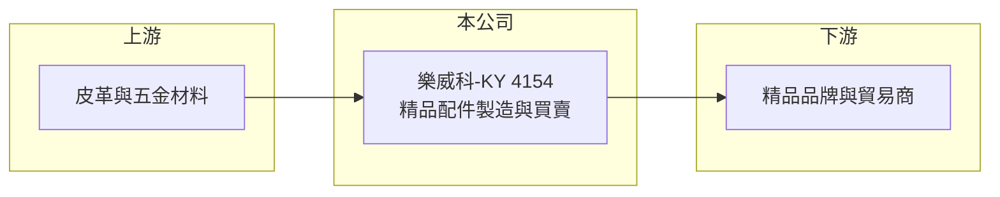

# 4154 樂威科-KY

> 上櫃｜[[產業索引-其他業|其他業]]｜上市（櫃）日期 2011/12/28

# 第一章：企業模式與商業藍圖

> [!info] 撰寫說明
> 精簡版，由 Claude 依公開資料整理，架構比照 [[2330台積電]]，資料截至 2026-10-07。來源：nStock 樂威科-KY公司簡介、winvest 營收快訊。公開資料有限。#待校對

樂威科-KY 是開曼註冊的外國企業，經營精品配件製造與買賣，營收規模小且仍在虧損。

- **核心業務：** 製造與買賣[[精品配件]]，本次未查到具體產品類別。
- **營收結構：** 本次未查到產品或地區營收比重。
- **營運據點：** 2010 年 8 月於開曼群島設立，2018 年 3 月設立台灣分公司，生產據點本次未查到。
- **長期方向：** 2026 年營收大幅成長，觀察能否擴大規模轉虧為盈。

# 第二章：護城河深度與競爭優勢

精品配件屬於品牌主導的市場，代工或配件廠的議價能力有限。

- **競爭優勢：** 本次未查到明確的技術或客戶優勢。
- **主要對手：** 國內外精品配件與皮件代工廠（推估）。
- **觀察重點：** 2026 年 7、8 月營收年增率超過 100%，觀察成長的來源與持續性。

# 第三章：財務體質與盈利規模

資料日期：2026-10-07，以下數字是撰寫當時的快照；最新月營收、毛利率、累計 EPS 由自動排程寫在本筆記的屬性欄位（月營收、毛利率、累計EPS 等）。#待校對

樂威科-KY 營收從低基期回升，但規模仍小。

- **營收規模：** 2025 年全年營收 0.27 億元；2026 年 1 至 8 月累計 0.23 億元，年增 67.15%，7 月營收 545.5 萬元、8 月 487 萬元。
- **獲利：** 2025 年全年 EPS -1.82 元；2026 年第二季[[毛利率]] 24.99%。
- **財務特色：** 近年虧損，近五年無配息。

# 第四章：總體風險與地緣政治

樂威科-KY 的風險集中在規模小、虧損與外國企業資訊透明度。

- **產業週期：** 精品需求受全球消費景氣與中國市場影響。
- **營運風險：** 營收規模小，固定成本難以分攤，虧損持續會侵蝕資本。
- **其他風險：** [[KY股]]的營運與資產多在海外，資訊揭露與查核難度較高；匯率變動影響成本與報價。

# 專有名詞解析

## 金融

- **[[KY股]]**：在海外註冊、來台第一上市櫃的公司，代號名稱後加註 KY。
- **[[毛利率]]**：毛利除以營收，反映產品或服務本身的獲利能力。

## 產業

- **[[精品配件]]**：搭配精品品牌銷售的小型配件，例如皮件、飾品、五金扣件等，多由品牌委外生產。

# 核心供應鏈

- 上游：皮革、金屬五金與包材供應商（推估）
- 下游／客戶：精品品牌與貿易商（推估）
- 同業：國內外精品配件代工廠（本次未查到具體名單）

## 最新新聞
<!-- news:start -->
<!-- news:end -->

## 相關連結
- [公開資訊觀測站](https://mopsov.twse.com.tw/mops/web/t05st03?step=1&firstin=1&co_id=4154)
- [Goodinfo](https://goodinfo.tw/tw/StockDetail.asp?STOCK_ID=4154)
- [Yahoo 股市](https://tw.stock.yahoo.com/quote/4154)
- [鉅亨網新聞](https://www.cnyes.com/twstock/4154/news)
