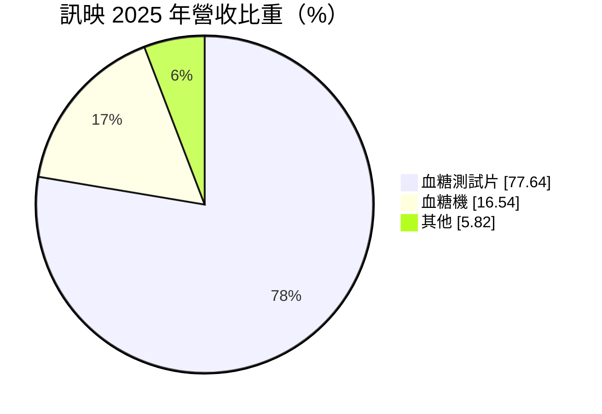
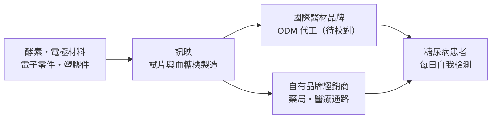
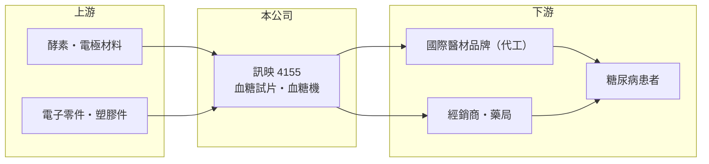

# 4155 訊映

> 上市｜[[產業索引-生技醫療業|生技醫療業]]｜上市（櫃）日期 2017/12/05

# 第一章：企業模式與商業藍圖

> [!info] 撰寫說明
> 本文由 Claude 依公開資料整理，架構比照 [[2330台積電]] 的四章研究，資料截至 2026-10-08。財務數字來源：MoneyDJ 理財網年度財務比率與公司基本資料（2025 年營收比重）、證交所開放資料（基本資料、2026 年第二季財報與營益分析、每月營收、股利）。公司股本近期有變動，年度營收無法可靠推算，表格中寫「未查得」。英文名稱、代工與品牌比重、銷售地區為整理性內容，已標註待校對。#待校對

血糖機本身不太賺錢，真正的生意是糖尿病患者每天都要消耗的試片。本章說明訊映光電（股票代號：4155，英文名 OK Biotech 待校對，以下簡稱訊映）以[[血糖試片]]為核心的商業模式。

## 一、核心定位：血糖試片與血糖機製造商

訊映成立於 2004 年，總部位於新竹市，2017 年在證交所上市，董事長兼總經理為賴家德。依 MoneyDJ 資料，2025 年營收中血糖測試片占 77.6%、[[血糖機]]占 16.5%、其他占 5.8%。

* **「機器帶耗材」模式：** 血糖機往往以低價甚至搭贈方式提供，病患之後必須持續購買相容的試片，試片才是穩定且重複的營收來源。訊映營收有近八成來自試片，正好反映這個模式。
* **代工與品牌並行：** 台灣血糖檢測廠常同時替國際品牌 [[ODM]] 代工，以及經營自有品牌（訊映的比重待校對）。代工靠規模與成本，自有品牌則需要通路與法規認證。

## 二、資本轉化邏輯

* **規模經濟：** 試片是大量生產的精密耗材，產量愈大、良率愈高，單位成本愈低。2025 年[[毛利率]]由前一年的 16.5% 升到 27.6%，顯示產品組合或產能利用率出現明顯改善。
* **法規認證是門票：** 血糖監測產品須符合 ISO 15197 等準確度標準，並取得各國醫材許可，才能進入市場。

## 三、長期方向

全球糖尿病人口持續增加，血糖自我監測是長期穩定的需求。不過[[連續血糖監測]]（CGM）的普及，正在改變重度患者的檢測方式。訊映的長期課題，是在傳統試片市場維持成本競爭力，同時評估是否投入新一代監測技術。

# 第二章：護城河深度與競爭優勢

護城河是企業抵禦競爭、長期維持超額利潤的機制。本章說明訊映在血糖檢測市場的優勢與限制。

## 一、訊映護城河的核心組成要素

* **1. 試片與機器的綁定：** 試片只能搭配相容的血糖機使用，病患一旦使用某款機器，就會長期購買同系列試片。
* **2. 製造與法規門檻：** 試片的精準度要求高，量產良率與各國認證需要長期累積。
* **3. 限制：** 若以代工為主，客戶是國際品牌，議價能力在客戶手上；客戶若轉單，營收會明顯波動。

## 二、主要競爭對手格局

| 對手 | 定位 | 對訊映的影響 |
|---|---|---|
| [[4736泰博]] | 台灣血糖檢測與代工龍頭 | 在代工訂單上直接競爭 |
| [[1733五鼎]] | 台灣血糖檢測品牌與製造 | 台灣同業 |
| [[4737華廣]] | 台灣血糖檢測 | 台灣同業 |
| 國際品牌（羅氏、亞培等） | 血糖監測與 CGM | 主導品牌市場並推動 CGM |

## 三、優勢轉化：守得住與守不住的地方

* **守得住：** 2018 至 2025 年除 2023 年外，每年都有正的營業利益，代表試片生意具有基本的獲利能力。
* **守不住：** 營業利益率在 -1% 到 12% 之間大幅波動，2023 年幾乎沒有獲利，顯示訂單與價格受客戶與競爭影響很大。
* **觀察重點：** 2025 年以來的毛利率改善能否延續，以及股本變動背後的原因（併購、增資或其他，待校對）。

# 第三章：財務體質與盈利規模

資料日期：2026-10-08。數字取自 MoneyDJ 理財網年度財務資料與證交所開放資料，表格是撰寫當時的快照；最新月營收、毛利率、累計 EPS 由自動排程寫在本筆記的屬性欄位（月營收、毛利率、累計EPS 等）。#待校對

財務報表是檢驗護城河是否真實存在的最終標準。本章用五年的三率、ROE 與資本報酬，檢視訊映的獲利品質。

## 一、多年度財務表現

| 年度 | 營收（新台幣） | 每股營業額 | [[毛利率]] | [[營業利益率]] | EPS（元） | [[ROE]] |
|---|---|---|---|---|---|---|
| 2021 | 未查得 | 13.31 元 | 14.8% | 0.6% | 0.46 | 1.83% |
| 2022 | 未查得 | 14.91 元 | 23.3% | 6.9% | 1.51 | 7.70% |
| 2023 | 未查得 | 8.18 元 | 16.5% | -1.0% | 0.02 | -0.08% |
| 2024 | 未查得 | 11.36 元 | 16.5% | 3.4% | 0.66 | 4.29% |
| 2025 | 未查得 | 10.75 元 | 27.6% | 6.9% | 0.58 | 3.78% |

資料來源：MoneyDJ 理財網年度財務比率（合併報表）。證交所基本資料的實收資本額約 12.5 億元，但 2026 年第二季資產負債表的股本約 14.5 億元、MoneyDJ 顯示約 14.0 億元，股本正在變動，以每股營業額推算的營收和月營收累計數對不上，因此年度營收寫「未查得」。可供參考的是證交所月營收：2025 年 1 至 8 月營收約 10.8 億元，2026 年同期約 11.7 億元，成長約 8.2%。2026 年上半年營收約 8.2 億元、毛利率 30.8%、營業利益率 13.6%、EPS 0.74 元。

訊映近五年平均 ROE 約 3.5%（推算），獲利波動大。2026 年上半年營業利益率升到 13.6%，是近年最好的水準，代表獲利結構正在改善。依證交所資料，2025 年度配發每股 0.3 元現金股利，以當年 EPS 0.58 元計，配息率約 52%（推算）。

## 二、[[ROIC]] 與 [[WACC]]：價值創造利差

**ROIC 推算：** 由於 2025 年營收無法可靠推算，改用 2026 年上半年年化。上半年營業利益約 1.12 億元，年化約 2.24 億元，稅後約 1.79 億元（推算）。2026 年第二季權益總計約 25.7 億元、負債總計約 14.2 億元，假設四成為有息負債約 5.7 億元（推估），投入資本約 31.4 億元，ROIC 約 5.7%（推算）。以 2025 年營業利益率 6.9% 的水準計，ROIC 推估只有 3% 左右。

**WACC 推算：** 台灣 10 年期公債殖利率取 1.75%、市場風險溢酬 6%、β 取醫材同業常見值 0.9（MoneyDJ 顯示約 0.13，不具參考性，不採用），股東權益成本約 7.15%。負債成本假設 2.5%，稅率 20%，稅後約 2.0%。權益約占投入資本 82%，WACC 約 6.2%（推算）。

**結論：** 即使以 2026 年上半年的較佳水準計算，ROIC 仍略低於 WACC，代表訊映尚未持續創造超額價值。若毛利率能穩定在三成以上、營收持續成長，才有機會讓 ROIC 超過資金成本。

# 第四章：總體風險與地緣政治

任何企業都無法脫離宏觀環境獨立存在。本章分析訊映長期必須面對的技術、客戶與法規風險。

## 一、技術演進風險

* **連續血糖監測普及：** CGM 讓病患不必每天扎手指測血糖，若價格下降、保險給付擴大，傳統試片市場可能長期萎縮。

## 二、客戶與競爭風險

* **代工客戶集中：** 若營收集中在少數國際品牌客戶，客戶轉單或砍價會直接衝擊營收與毛利。
* **價格競爭：** 中國血糖檢測廠以低價搶市，壓縮試片價格。
* **醫保招標：** 各國醫保與集中採購壓低試片價格。

## 三、法規、匯率與資本風險

* **醫材法規：** 各國對血糖監測準確度的要求提高，產品需要持續更新認證。
* **匯率：** 外銷以美元計價（待校對），新台幣升值會壓低毛利。
* **股本變動：** 股本近期增加，若是增資或併購，需觀察新資本能否帶來相應的獲利，避免稀釋每股盈餘。

# 專有名詞解析

## 金融

- **[[ROIC]]**：投入資本報酬率，稅後營業利益除以股東權益加有息負債，衡量本業運用資本的效率。
- **[[WACC]]**：加權平均資金成本，股東與債權人要求報酬率的加權平均，是 ROIC 要超越的門檻。

## 產業

- **[[血糖試片]]**：搭配血糖機使用的一次性檢測耗材，病患每天需多次使用，是血糖檢測產業的主要營收來源。
- **[[血糖機]]**：讀取試片反應、顯示血糖數值的手持式儀器，常以低價銷售以帶動試片需求。
- **[[連續血糖監測]]**：在皮下植入感測器、持續量測組織液葡萄糖濃度的技術，可取代多數扎手指檢測。
- **[[ODM]]**：原廠委託設計製造，代工廠負責設計與生產，產品以客戶品牌銷售。

# 核心供應鏈

## 1. 上游：材料與零件
- 酵素、電極材料、電子零件與塑膠件供應商（名稱未查得）

## 2. 中游：訊映與同業
- 台灣血糖檢測同業：[[4736泰博]]、[[1733五鼎]]、[[4737華廣]]
- 國際品牌：羅氏、亞培

## 3. 下游：客戶
- 國際醫材品牌代工客戶、經銷商與藥局（名稱未查得），最終為糖尿病患者

## 最新新聞
<!-- news:start -->
<!-- news:end -->

## 相關連結
- [公開資訊觀測站](https://mopsov.twse.com.tw/mops/web/t05st03?step=1&firstin=1&co_id=4155)
- [Goodinfo](https://goodinfo.tw/tw/StockDetail.asp?STOCK_ID=4155)
- [Yahoo 股市](https://tw.stock.yahoo.com/quote/4155)
- [鉅亨網新聞](https://www.cnyes.com/twstock/4155/news)
