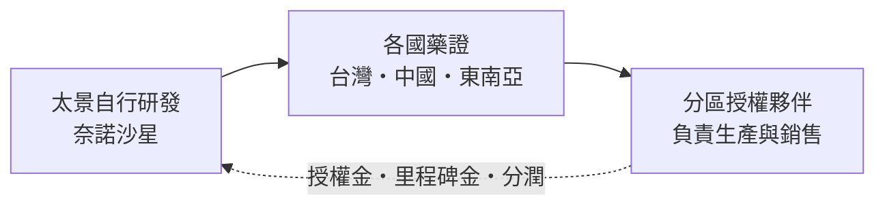
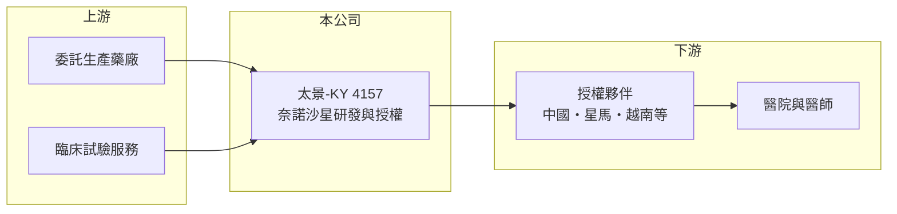

# 4157 太景-KY

> 上櫃｜[[產業索引-生技醫療業|生技醫療業]]｜上市（櫃）日期 2013/08/30

# 第一章：企業模式與商業藍圖

> [!info] 撰寫說明
> 精簡版，由 Claude 依公開資料整理，架構比照 [[2330台積電]] 的四章研究，資料截至 2026-10-08。來源：Goodinfo 年度經營績效、櫃買中心開放資料（基本資料、2026 年第二季資產負債與損益、本益比殖利率）、工商時報與旺得富新聞標題（2025 年越南授權）。產品上市年份與授權夥伴多憑記憶整理，已標「待校對」。公開資料有限。#待校對

新藥公司的價值不在當年營收，而在它手上藥物的權利能賣到多少市場。本章說明太景醫藥研發控股（股票代號：4157，以下簡稱太景）如何以一顆自行研發的抗生素，走「自己拿藥證、再分區授權」的路線。

- **核心業務：** 太景是開曼註冊的控股公司，屬 [[KY股]]，2005 年設立，研發與營運主要在台灣，2014 年起在櫃買中心交易，董事長為黃國龍。公司的主力產品是自行研發的喹諾酮類[[抗生素]]太捷信（成分奈諾沙星，nemonoxacin），用於社區型肺炎等呼吸道感染。依記憶，口服劑型約在 2014 年取得台灣藥證、約 2016 年取得中國藥證，針劑約在 2021 年於中國核准（待校對）。
- **營收結構：** 營收來自三個部分：授權夥伴支付的[[授權金]]與[[里程碑金]]、銷售原料或成品給夥伴的收入，以及各地上市後的銷售分潤。這類收入的特色是毛利率極高（2021 至 2025 年在 89% 至 99% 之間），但金額取決於簽約時點，年度間落差很大，因此不適合用單一年度營收判斷公司規模。
- **營運據點：** 研發與行政中心在台北，產品委由合作藥廠生產，各國銷售交給當地被授權夥伴，自己不建大型業務團隊。依新聞標題，2025 年 10 月子公司太景生技與越南藥廠 Fideschem 及 Newsun Pharmaceutical 簽署太捷信越南授權，在新加坡、馬來西亞之後持續擴大東南亞版圖。
- **長期方向：** 太景的長期價值取決於兩件事：一是太捷信能否在更多國家取得藥證並放量，讓權利金變成穩定的經常性收入；二是後續管線，例如幹細胞動員劑 burixafor 與抗流感候選藥（依記憶，待校對）能否推進到下一階段或對外授權。這兩條路都需要時間，但成功時能以很小的資本換來高毛利收入。

# 第二章：護城河深度與競爭優勢

新藥公司的護城河主要是專利與藥證，但也會隨著專利到期與競品出現而變淺。本章說明太景的競爭位置。

- **競爭優勢：** 太捷信是台灣少數走完研發、臨床到國際藥證全流程的自研新藥，專利與各國藥證構成法定進入門檻。授權模式讓太景不需在每個市場自建通路，夥伴熟悉當地醫院與招標規則，太景只需專注在註冊與技術支援，固定成本因此維持很低。
- **主要對手：** 在呼吸道感染領域，太捷信面對的是左氧氟沙星、莫西沙星等已大量[[學名藥]]化的喹諾酮類藥物，以及其他類別抗生素。這些藥價格低、醫師熟悉，新藥要靠抗藥菌療效或安全性的差異說服醫師。台灣新藥同業如 [[4147中裕]]、[[6446藥華藥]]、[[4174浩鼎]] 走不同疾病領域，但在資金與人才上同樣競爭。
- **觀察重點：** 抗生素是醫院控管最嚴格的藥品類別之一，中國等市場的集中採購與醫保議價會壓低售價，因此銷售量增加不一定帶來等比例的分潤成長。長期要觀察的是新授權國家是否持續增加、既有市場的分潤能否逐年累積，以及管線產品有沒有新的授權交易。

# 第三章：財務體質與盈利規模

資料日期：2026-10-08，表格是撰寫當時的快照；最新月營收、毛利率、累計 EPS 由自動排程寫在本筆記的屬性欄位（月營收、毛利率、累計EPS 等）。#待校對

財務報表最能看出授權型新藥公司的收入波動。本章用五年數據說明太景的獲利型態。

| 年度 | 營收（新台幣） | [[毛利率]] | [[營業利益率]] | EPS（元） | [[ROE]] |
|---|---|---|---|---|---|
| 2021 | 12.9 億 | 99.0% | 69.5% | 1.08 | 91.5% |
| 2022 | 0.36 億 | 89.7% | -766% | -0.33 | -21.3% |
| 2023 | 1.23 億 | 90.7% | -142% | 0.19 | 13.1% |
| 2024 | 1.51 億 | 89.3% | -81% | -0.05 | -3.51% |
| 2025 | 2.59 億 | 93.0% | 26.7% | 0.06 | 4.19% |

資料來源：Goodinfo 年度經營績效（合併報表）。2026 年上半年（櫃買中心資料）營收約 0.19 億元、營業損失約 0.64 億元、EPS -0.05 元。

- **營收規模：** 2021 年營收 12.9 億元、營業利益率近七成，屬一次性授權金入帳的型態（交易內容未查得）；2022 年營收掉到 0.36 億元，之後三年逐步回升到 2025 年的 2.59 億元。以 2021 年為起點的年複合成長率為負，沒有參考意義，較合理的看法是 2022 至 2025 年營收呈逐年墊高。
- **獲利：** 2023 年營業虧損但 EPS 為正，代表當年有業外收益；2025 年則是本業轉為獲利，營業利益率 26.7%。近五年平均 ROE 約 16.8%（推算），但完全被 2021 年拉高，扣除該年平均為負，顯示公司仍處於「偶爾有大額授權、平時小幅虧損」的階段。
- **財務特色：** 2026 年第二季權益約 10.2 億元、負債僅約 0.38 億元，幾乎沒有借款，資產多為現金。股本以美元面額計，發行約 7.1 億股，EPS 數字天生偏小。依櫃買中心資料目前沒有配發現金股利。

**[[ROIC]] 與 [[WACC]]：** 以 2025 年計，營業利益約 0.69 億元（營收 2.59 億元乘營業利益率 26.7%），稅率 20% 後約 0.55 億元；投入資本以權益約 10.2 億元計，有息負債視為零（官方資料未拆分，負債總額僅 0.38 億元），ROIC 約 5.4%（推算）。WACC 以台灣 10 年期公債 1.75%、市場風險溢酬 6%、新藥股常見 β 1.2（假設）計，權益成本約 9.0%，無負債時 WACC 即約 9.0%（推算）。ROIC 低於 WACC，加上 2026 年上半年又回到營業虧損，代表太景尚未長期創造超過資金成本的報酬，價值仍建立在授權擴張與管線的未來性上。

# 第四章：總體風險與地緣政治

新藥公司的風險集中在研發、法規與單一產品依賴。本章整理太景必須長期面對的風險。

- **產業週期：** 抗生素需求與景氣關係不大，但與流感季、疫情後就醫習慣及各國抗生素管理政策相關。各國推動合理使用抗生素，長期會限制新抗生素的用量成長。
- **營運風險：** 營收高度依賴單一產品太捷信與少數授權夥伴，夥伴的銷售力道、付款條件與合約續約，都會直接影響太景收入。管線研發失敗或延遲，則會讓公司長期缺乏第二個收入來源。
- **其他風險：** 中國市場的集中採購與醫保議價可能壓低價格；開曼註冊的 KY 結構在資訊揭露與股東權益保障上與本國公司不同；收入以外幣計價為主，新台幣匯率變動也會影響帳面損益。

# 專有名詞解析

## 產業

- **[[KY股]]**：在台灣掛牌的境外註冊公司，代號後加 KY，主要營運據點多在海外。
- **[[抗生素]]**：抑制或殺死細菌的藥物，因抗藥性問題，各國都對其使用有嚴格管理。
- **[[授權金]]**：藥廠將藥物開發或銷售權利授權給其他公司時收取的簽約金與里程碑金，通常屬一次性收入。
- **[[里程碑金]]**：授權合約中，被授權方在藥物達到臨床、藥證或銷售等特定階段時支付給授權方的款項。
- **[[學名藥]]**：原廠藥專利到期後，由其他藥廠生產、成分與療效相同的藥品，價格通常較低。

# 核心供應鏈

- 上游：委託生產的原料藥與製劑廠、臨床試驗服務機構（個別廠商未查得）。
- 下游／客戶：各地被授權藥廠，依 2025 年新聞標題包括越南的 Fideschem 與 Newsun Pharmaceutical；中國授權夥伴依記憶為浙江醫藥（待校對）。
- 同業：台灣新藥公司 [[4147中裕]]、[[6446藥華藥]]、[[4174浩鼎]]、[[6576逸達]]。

## 最新新聞
<!-- news:start -->
<!-- news:end -->

## 相關連結
- [公開資訊觀測站](https://mopsov.twse.com.tw/mops/web/t05st03?step=1&firstin=1&co_id=4157)
- [Goodinfo](https://goodinfo.tw/tw/StockDetail.asp?STOCK_ID=4157)
- [Yahoo 股市](https://tw.stock.yahoo.com/quote/4157)
- [鉅亨網新聞](https://www.cnyes.com/twstock/4157/news)
