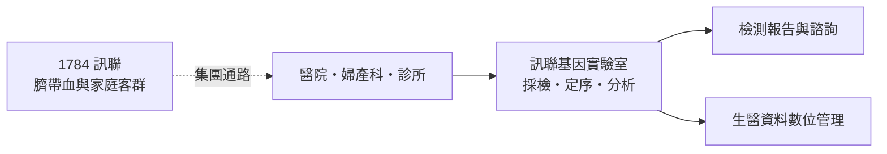
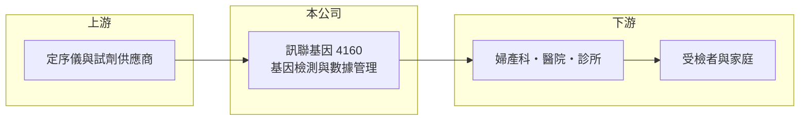

# 4160 訊聯基因

> 上櫃｜[[產業索引-生技醫療業|生技醫療業]]｜上市（櫃）日期 2012/09/17

# 第一章：企業模式與商業藍圖

> [!info] 撰寫說明
> 精簡版，由 Claude 依公開資料整理，架構比照 [[2330台積電]] 的四章研究，資料截至 2026-10-08。來源：Goodinfo 年度經營績效、nStock 公司簡介（主要業務、控制股東、2023 年更名）、Yahoo 股市新聞標題（2024 年 EPS 與配息）、櫃買中心開放資料（基本資料、2026 年第二季財報、本益比殖利率）。檢測項目細節與公司沿革部分憑記憶整理，已標「待校對」。公開資料有限。#待校對

基因檢測公司賣的不是一次性商品，而是一套從採檢、實驗室分析到報告解讀的服務流程。本章說明訊聯基因數位（股票代號：4160，以下簡稱訊聯基因）的商業模式。

- **核心業務：** 訊聯基因 2008 年設立，2012 年起在櫃買中心交易，主要業務是[[基因檢測]]服務，以及生物、化學與材料資料的數位管理系統開發與建置。2023 年 7 月經經濟部核准更名為現名。依記憶，公司前身以產前與新生兒相關檢測起家，近年擴及癌症與遺傳疾病檢測（待校對）。
- **營收結構：** 營收來自醫療院所與個人委託的檢測服務費，以及數位系統建置收入，各項比重未查得。檢測服務的[[毛利率]]長期在 37% 至 42% 之間，代表它不是純軟體式的高毛利生意，實驗室人力、試劑與定序設備都是主要成本。
- **營運據點：** 以台灣為主要市場，透過婦產科、醫院與診所接觸受檢者。依 nStock 資料，[[1784訊聯]]持有約 25.36% 股權，雙方經營團隊重疊，訊聯被認定為最終控制者，訊聯本業是[[臍帶血]]儲存，兩家公司在客群上可共享新生兒與家庭市場的通路。
- **長期方向：** 基因檢測的長期趨勢是[[次世代定序]]的成本持續下降、檢測項目持續增加，市場會從少數高價項目走向大量、例行化的檢測。訊聯基因的長期課題是把檢測量做大以攤薄實驗室固定成本，並藉由數位資料管理累積可再利用的資料資產。

# 第二章：護城河深度與競爭優勢

基因檢測服務的護城河來自實驗室認證、醫師通路與資料累積，而不是單一技術。本章分析訊聯基因的競爭位置。

- **競爭優勢：** 與 [[1784訊聯]] 同屬一個集團，能接觸大量新生兒家庭，這是取得檢體與建立品牌信任的通路優勢。實驗室要取得主管機關的檢驗認證，並與婦產科醫師建立長期合作，新進者需要數年才能補齊，因此在既有客群內有一定黏著度。
- **主要對手：** 國內有多家醫學實驗室與基因檢測公司，醫學中心也自行設立檢驗部門，國際大廠則以套組與設備切入。檢測項目一旦普及，價格競爭會加劇，毛利率很難大幅提升；2021 至 2025 年營業利益率只在 -0.9% 至 7.5% 之間，反映這個行業的費用負擔與價格壓力。
- **觀察重點：** 長期要看檢測量能否持續成長並帶動營業利益率擴張，以及新檢測項目（例如癌症相關檢測）能否形成新的收入支柱。若健保或政府補助擴大納入特定基因檢測，市場會變大，但定價也會受到管制。

# 第三章：財務體質與盈利規模

資料日期：2026-10-08，表格是撰寫當時的快照；最新月營收、毛利率、累計 EPS 由自動排程寫在本筆記的屬性欄位（月營收、毛利率、累計EPS 等）。#待校對

本章用五年數據檢視訊聯基因的規模與獲利穩定度。

| 年度 | 營收（新台幣） | [[毛利率]] | [[營業利益率]] | EPS（元） | [[ROE]] |
|---|---|---|---|---|---|
| 2021 | 5.20 億 | 37.6% | -0.87% | 0.32 | 2.54% |
| 2022 | 5.48 億 | 41.3% | 3.68% | 1.06 | 7.79% |
| 2023 | 5.92 億 | 40.0% | 3.14% | 1.12 | 7.40% |
| 2024 | 6.62 億 | 42.3% | 7.48% | 2.05 | 11.2% |
| 2025 | 6.03 億 | 41.5% | 1.96% | 0.80 | 3.71% |

資料來源：Goodinfo 年度經營績效（合併報表）。2026 年上半年（櫃買中心資料）營收約 3.00 億元、毛利率約 41.0%、營業利益約 -0.02 億元、EPS 0.24 元。

- **營收規模：** 2021 至 2025 年營收由 5.2 億元增加到 6.0 億元，年複合成長率約 3.8%（推算），屬於穩定但緩慢的成長；2024 年是近年高點。
- **獲利：** EPS 長期高於營業利益所能支撐的水準，代表業外的投資收益與利息收入占獲利相當比重。近五年平均 ROE 約 6.5%（推算）。2026 年上半年其他綜合損益約 -1.15 億元，顯示公司持有的金融資產價格波動對權益影響不小。
- **財務特色：** 2026 年第二季權益約 4.94 億元、負債約 2.24 億元，財務結構保守。依新聞標題，2024 年 EPS 2.05 元、配息約 1.84 元，櫃買中心資料最近一次現金股利約 0.50 元，配息率高但金額隨獲利起伏。

**[[ROIC]] 與 [[WACC]]：** 以 2025 年計，營業利益約 0.12 億元（營收 6.03 億元乘營業利益率 1.96%），稅後約 0.09 億元；投入資本以權益約 4.94 億元計，有息負債官方資料未拆分，視為零，ROIC 約 1.9%（推算）。即使以 2024 年較好的營業利益率 7.48% 計算，ROIC 也只有約 8%（推算）。WACC 以台灣 10 年期公債 1.75%、市場風險溢酬 6%、檢驗服務業常見 β 0.9（假設）計，權益成本約 7.2%，WACC 約 7%（推算）。本業 ROIC 多數年度低於 WACC，公司的股東報酬較依賴業外收益，本業要長期創造價值，需要營業利益率穩定站上 7% 以上。

# 第四章：總體風險與地緣政治

基因檢測的風險同時來自法規、技術進步與醫療支付制度。本章整理訊聯基因的長期風險。

- **產業週期：** 產前與新生兒檢測的需求直接受出生數影響，台灣出生數長期下滑，是這類業務最根本的逆風。需要靠提高每位受檢者的檢測項目數，或擴展到成人與癌症檢測，才能抵銷人口結構的壓力。
- **營運風險：** 定序技術進步很快，設備與檢測方法可能數年就需更新；檢測價格隨技術普及而下降，若量的成長追不上價格下滑，毛利率會被壓縮。
- **其他風險：** 實驗室開發檢測（LDTs）相關管理制度的變化會影響檢測上市流程與成本；個人基因資料涉及隱私法規；持有的金融資產價格波動，會透過其他綜合損益影響淨值。

# 專有名詞解析

## 應用

- **[[臍帶血]]**：新生兒出生時臍帶與胎盤內的血液，含有造血幹細胞，可冷凍保存供未來治療使用。

## 金融

- **[[業外收益]]**：本業以外的收入，例如利息、投資收益或處分資產利益，通常不具持續性。

## 產業

- **[[基因檢測]]**：分析人體 DNA 以判斷疾病風險、遺傳狀況或用藥反應的檢驗服務。
- **[[次世代定序]]**：可同時讀取大量 DNA 片段的定序技術，讓基因檢測成本大幅下降。

# 核心供應鏈

- 上游：次世代定序儀器與試劑供應商（個別廠商未查得）。
- 下游／客戶：婦產科、醫院、診所與個人受檢者；集團關係企業 [[1784訊聯]]。
- 同業：國內醫學實驗室與基因檢測業者（多數未上市櫃）。

## 最新新聞
<!-- news:start -->
<!-- news:end -->

## 相關連結
- [公開資訊觀測站](https://mopsov.twse.com.tw/mops/web/t05st03?step=1&firstin=1&co_id=4160)
- [Goodinfo](https://goodinfo.tw/tw/StockDetail.asp?STOCK_ID=4160)
- [Yahoo 股市](https://tw.stock.yahoo.com/quote/4160)
- [鉅亨網新聞](https://www.cnyes.com/twstock/4160/news)
