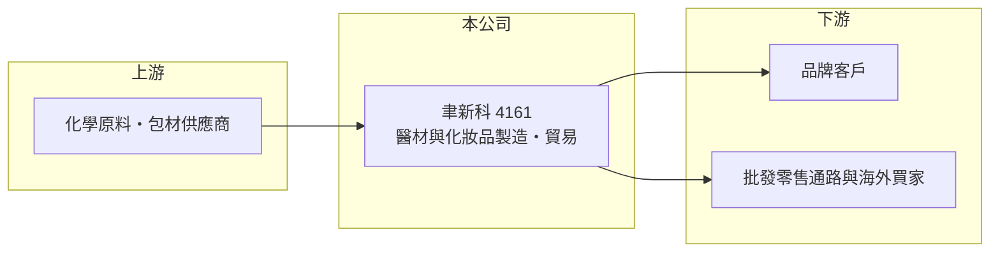

# 4161 聿新科

> 上櫃｜[[產業索引-生技醫療業|生技醫療業]]｜上市（櫃）日期 2013/06/26

# 第一章：企業模式與商業藍圖

> [!info] 撰寫說明
> 精簡版，由 Claude 依公開資料整理，架構比照 [[2330台積電]] 的四章研究，資料截至 2026-10-08。來源：Goodinfo 年度經營績效、nStock 公司簡介（主要業務、2024 年股利）、櫃買中心開放資料（基本資料、2026 年第二季財報、本益比殖利率）。具體產品、客戶與營收比重未查得，本文以業務型態與財務數字分析為主。公開資料有限。#待校對

一家公司同時做製造與貿易時，要先看它賺的是製造的附加價值，還是轉手的價差。本章說明聿新科技（股票代號：4161，以下簡稱聿新科）的業務型態。

- **核心業務：** 聿新科 1999 年設立，2013 年起在櫃買中心交易，董事長為楊金昌。依 nStock 公司簡介，公司與子公司從事生技醫療器材及[[化妝品]]的製造、批發零售與國際貿易，另有其他化學材料製造。換句話說，它橫跨醫材與美容保養兩個市場，並同時擁有工廠與貿易通路。
- **營收結構：** 各產品線的營收比重與主要客戶未查得。從財務數字看，2021 至 2025 年[[毛利率]]在 22% 至 31% 之間，低於一般自有品牌醫材公司，接近 [[OEM]] 代工或貿易型態，推估營收中有相當比重來自代工製造與貿易轉售（推估）。
- **營運據點：** 公司總部與生產據點的詳細資訊未查得。2026 年第二季資產負債表中非流動資產約 6.3 億元，占總資產約四成，代表公司持有相當規模的廠房與設備，並非純貿易商。
- **長期方向：** 毛利率由 2021 年的 22.2% 提升到 2023 至 2025 年的約 29% 至 31%，顯示產品組合往較高附加價值移動。長期能否持續拉高自有品牌或醫材產品的比重，是決定獲利能力的關鍵。

# 第二章：護城河深度與競爭優勢

製造與貿易型公司的護城河通常不深，優勢多半來自客戶關係、法規認證與生產效率。本章分析聿新科的競爭位置。

- **競爭優勢：** 醫療器材與化妝品都需要符合主管機關的製造與標示規範，取得[[醫材許可證]]與工廠認證需要時間，對新進者形成基本門檻。同時具備製造與貿易能力，讓公司可以替客戶從生產一路處理到出口，增加客戶更換供應商的麻煩。
- **主要對手：** 台灣化妝品與保養品代工廠、醫療耗材製造商，以及中國與東南亞的低成本工廠。這類產品同質性較高，價格競爭激烈，這也是公司營業利益率長期只在 5% 至 11% 之間的原因。
- **觀察重點：** 長期要看毛利率能否維持在三成左右甚至更高，以及營收能否突破 2024 年 8.65 億元的高點。2025 年營收微降至 8.37 億元、營業利益率由 10.4% 降到 8.0%，顯示規模擴張還不穩定。

# 第三章：財務體質與盈利規模

資料日期：2026-10-08，表格是撰寫當時的快照；最新月營收、毛利率、累計 EPS 由自動排程寫在本筆記的屬性欄位（月營收、毛利率、累計EPS 等）。#待校對

本章用五年數據檢視聿新科的成長與獲利品質。

| 年度 | 營收（新台幣） | [[毛利率]] | [[營業利益率]] | EPS（元） | [[ROE]] |
|---|---|---|---|---|---|
| 2021 | 7.38 億 | 22.2% | 4.84% | 0.47 | 2.87% |
| 2022 | 7.68 億 | 23.1% | 5.14% | 1.00 | 6.66% |
| 2023 | 8.29 億 | 28.9% | 10.9% | 1.68 | 11.0% |
| 2024 | 8.65 億 | 31.0% | 10.4% | 1.84 | 10.7% |
| 2025 | 8.37 億 | 29.1% | 7.97% | 1.23 | 7.43% |

資料來源：Goodinfo 年度經營績效（合併報表）。2026 年上半年（櫃買中心資料）營收約 4.62 億元、毛利率約 28.0%、營業利益率約 7.8%、EPS 0.96 元，其中[[業外收益]]約 0.29 億元。

- **營收規模：** 2021 至 2025 年營收年複合成長率約 3.2%（推算），成長溫和。2023 年是獲利結構的轉折點，毛利率一年提升近 6 個百分點，營業利益率翻倍。
- **獲利：** 近五年平均 ROE 約 7.7%（推算），2023 與 2024 年曾超過 10%。2026 年上半年 EPS 0.96 元，其中業外收入占稅前淨利約四成五，本業貢獻比例需要留意。
- **財務特色：** 2026 年第二季權益約 9.93 億元、負債約 6.30 億元，負債多為流動負債。依 nStock 資料，2024 年度配發現金股利 0.3 元與[[股票股利]] 1.3 元，股本因此由約 5.3 億元增加到約 6.0 億元，攤薄了每股盈餘；櫃買中心資料最近一次現金股利為 0.7 元。

**[[ROIC]] 與 [[WACC]]：** 以 2025 年計，營業利益約 0.67 億元（營收 8.37 億元乘營業利益率 7.97%），稅後約 0.53 億元。投入資本以權益約 9.93 億元，加上以非流動負債約 1.02 億元代替有息負債（官方資料未拆分，推估），約 10.95 億元，ROIC 約 4.9%（推算）。WACC 以台灣 10 年期公債 1.75%、市場風險溢酬 6%、製造業常見 β 0.9（假設）計，權益成本約 7.2%；負債成本假設 2.5%、稅後約 2.0%，負債權重約一成，WACC 約 6.6%（推算）。ROIC 略低於 WACC，2023、2024 年較好時則大致打平，代表聿新科目前大致在資金成本附近經營，尚未建立長期超額報酬。

# 第四章：總體風險與地緣政治

製造型中小企業的風險多半來自客戶集中與成本波動。本章整理聿新科的長期風險。

- **產業週期：** 化妝品與保養品需求與消費景氣、觀光與跨境電商相關，景氣轉弱時品牌客戶會先砍庫存與代工訂單。醫療耗材需求較穩，但價格受醫院採購壓力影響。
- **營運風險：** 產品與客戶資訊揭露有限，若營收集中於少數品牌客戶，單一客戶轉單就會造成營收明顯波動。股票股利擴大股本後，未來需要更高的獲利才能維持每股盈餘。
- **其他風險：** 化學原料與包材價格、各國化妝品與醫材法規的變動、出口市場的匯率與關稅，都會影響毛利率。

# 專有名詞解析

## 金融

- **[[股票股利]]**：以新發行股票代替現金分配給股東的股利，會擴大股本並攤薄每股盈餘。
- **[[業外收益]]**：本業以外的收入，例如利息、投資收益或處分資產利益，通常不具持續性。

## 產業

- **[[化妝品]]**：用於清潔、保養或美化外表的產品，在台灣依化粧品衛生安全管理法規範，進入門檻低於藥品。
- **[[醫材許可證]]**：醫療器材在各國上市前須取得的主管機關核准，是進入當地市場的門票。
- **[[OEM]]**：原廠委託製造，代工廠依品牌客戶的設計與規格生產，產品掛品牌商的商標。

# 核心供應鏈

- 上游：化學原料與包材供應商（個別廠商未查得）。
- 下游／客戶：醫材與化妝品品牌客戶、批發零售通路與海外貿易客戶（個別客戶未查得）。
- 同業：化妝品與醫療耗材相關業者，例如 [[1786科妍]]、[[4107邦特]]（業務重疊有限，僅供比較）。

## 最新新聞
<!-- news:start -->
<!-- news:end -->

## 相關連結
- [公開資訊觀測站](https://mopsov.twse.com.tw/mops/web/t05st03?step=1&firstin=1&co_id=4161)
- [Goodinfo](https://goodinfo.tw/tw/StockDetail.asp?STOCK_ID=4161)
- [Yahoo 股市](https://tw.stock.yahoo.com/quote/4161)
- [鉅亨網新聞](https://www.cnyes.com/twstock/4161/news)
