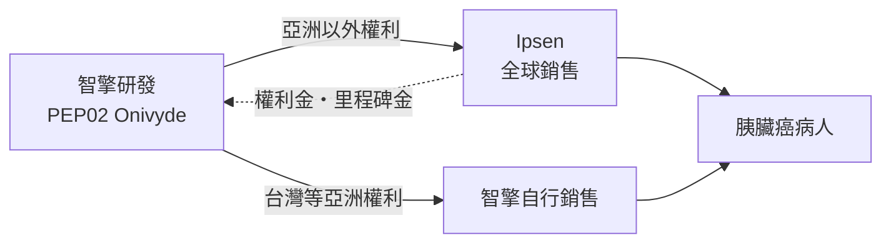
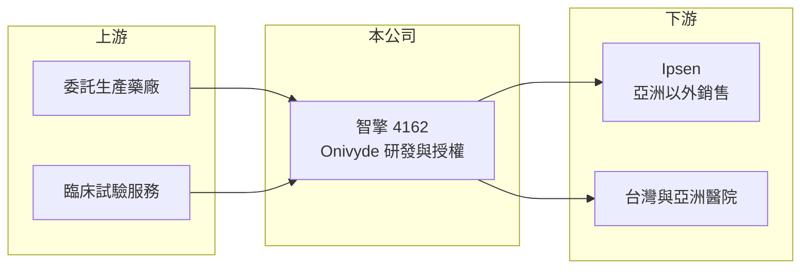

# 4162 智擎

> 上櫃｜[[產業索引-生技醫療業|生技醫療業]]｜上市（櫃）日期 2012/09/18

# 第一章：企業模式與商業藍圖

> [!info] 撰寫說明
> 精簡版，由 Claude 依公開資料整理，架構比照 [[2330台積電]] 的四章研究，資料截至 2026-10-08。來源：Goodinfo 年度經營績效、nStock 公司簡介與新聞標題（2024 年里程碑金、股利）、櫃買中心開放資料（基本資料、2026 年第二季財報、本益比殖利率）。Onivyde 的授權沿革、核准年份與研發管線多憑記憶整理，已標「待校對」。#待校對

智擎是台灣少數真正靠「新藥權利金」穩定賺錢的公司。本章說明智擎生技製藥（股票代號：4162，以下簡稱智擎）如何以一顆胰臟癌用藥，建立接近收租型的商業模式。

- **核心業務：** 智擎 2002 年設立，2012 年起在櫃買中心交易，主要業務是癌症[[新藥]]開發。公司最重要的資產是微脂體包覆的抗癌藥 Onivyde（台灣商品名安能得，研發代號 PEP02），用於轉移性胰臟癌。依記憶，智擎約在 2011 年把亞洲以外權利授權給美國 Merrimack，2017 年由法國 Ipsen 接手；美國 [[FDA]] 約在 2015 年核准二線治療、2024 年核准一線合併療法（待校對）。
- **營收結構：** 營收主要來自 Ipsen 依全球銷售支付的[[權利金]]、達成藥證或銷售目標時的[[里程碑金]]，以及智擎自己在台灣等亞洲市場的藥品銷售。權利金幾乎沒有對應成本，所以[[毛利率]]長期在 92% 至 98%。依新聞標題，2024 年認列約 5,000 萬美元里程碑金，使當年營收跳升到 25.2 億元。
- **營運據點：** 總部與研發團隊在台北，不自建大型藥廠，生產委外，國際銷售交給 Ipsen。這種「研發加授權」的輕資產模式，讓公司以極少的固定資產支撐高比例的獲利。
- **長期方向：** Onivyde 一線治療適應症的放量，決定未來數年權利金的成長幅度；長期則要靠新的研發管線，例如依記憶的 PEP07（CHK1 抑制劑）等早期抗癌藥（待校對），在 Onivyde 專利到期前接棒。

# 第二章：護城河深度與競爭優勢

權利金型公司的護城河來自藥物本身的專利、臨床數據與被授權方的銷售能力。本章分析智擎的競爭位置。

- **競爭優勢：** Onivyde 在胰臟癌這個治療選擇很少、預後很差的疾病中取得一線與二線的 FDA 適應症，臨床數據就是最大的進入門檻。銷售由國際藥廠 Ipsen 負責，智擎不必承擔全球行銷費用，卻能分享營收成長，這是輕資產、高毛利的結構性優勢。
- **主要對手：** 在胰臟癌治療上，主要對照是 FOLFIRINOX 與 gemcitabine 加 nab-paclitaxel 等既有化療組合，以及未來的標靶與免疫療法。若新一代療法顯著改善存活率，Onivyde 的使用量可能被取代。台灣新藥同業如 [[6446藥華藥]]、[[4147中裕]]、[[4174浩鼎]] 在資本市場上是比較對象，但治療領域不同。
- **觀察重點：** 長期最重要的是 Onivyde 專利與市場獨占期還有多久、學名藥何時進入，以及智擎能否把累積的現金投入新管線並成功授權，形成第二個權利金來源。

# 第三章：財務體質與盈利規模

資料日期：2026-10-08，表格是撰寫當時的快照；最新月營收、毛利率、累計 EPS 由自動排程寫在本筆記的屬性欄位（月營收、毛利率、累計EPS 等）。#待校對

本章用五年數據檢視智擎的權利金收入與股東報酬。

| 年度 | 營收（新台幣） | [[毛利率]] | [[營業利益率]] | EPS（元） | [[ROE]] |
|---|---|---|---|---|---|
| 2021 | 6.55 億 | 94.3% | 55.4% | 2.95 | 10.7% |
| 2022 | 6.54 億 | 92.4% | 43.2% | 2.22 | 8.16% |
| 2023 | 7.68 億 | 93.7% | 36.1% | 1.91 | 7.10% |
| 2024 | 25.2 億 | 98.1% | 81.4% | 12.19 | 37.8% |
| 2025 | 9.11 億 | 94.3% | 46.7% | 2.70 | 7.51% |

資料來源：Goodinfo 年度經營績效（合併報表）；nStock 另列 2025 年營收 8.54 億元，兩者口徑不同，以 Goodinfo 為準。2026 年上半年（櫃買中心資料）營收約 4.98 億元、毛利率約 93.1%、營業利益率約 49.5%、EPS 1.89 元。

- **營收規模：** 扣除 2024 年里程碑金的特殊年度，經常性營收由 2021 年的 6.55 億元增加到 2025 年的 9.11 億元，年複合成長率約 8.6%（推算），反映權利金隨 Onivyde 銷售成長。
- **獲利：** 營業利益率多在 36% 至 55%，研發費用是主要支出，研發投入增加的年度利益率就下降。近五年平均 ROE 約 14.3%（推算），扣除 2024 年約 8.4%，偏低的原因是帳上累積大量現金。
- **財務特色：** 2026 年第二季資產約 54.2 億元，其中流動資產約 53.7 億元，負債僅約 5.1 億元，幾乎是一家「現金加權利金」的公司。依 nStock 資料，2024 年度配發現金股利 6 元；櫃買中心資料最近一次為 2 元，以 2025 年 EPS 2.70 元計配息率約 74%（推算），股利政策大方但隨里程碑金起伏。

**[[ROIC]] 與 [[WACC]]：** 以 2025 年計，營業利益約 4.25 億元（營收 9.11 億元乘營業利益率 46.7%），稅後約 3.40 億元；投入資本以權益約 49.1 億元計、無有息負債，ROIC 約 6.9%（推算）。若扣除約 50 億元的流動資產（多為現金與金融資產），實際投入營運的資本極小，ROIC 遠高於 100%（推算）。WACC 以台灣 10 年期公債 1.75%、市場風險溢酬 6%、新藥股常見 β 1.0（假設）計，權益成本約 7.75%，無負債時 WACC 約 7.75%（推算）。結論是：智擎的本業創造價值能力非常強，但大量閒置現金把整體報酬率拉低到資金成本附近；長期股東報酬取決於這些現金是發回股東，還是投入能成功的新管線。

# 第四章：總體風險與地緣政治

權利金公司的風險集中在單一產品與授權夥伴。本章整理智擎的長期風險。

- **產業週期：** 抗癌藥需求不受景氣影響，但受各國藥價政策影響。美國藥價改革與醫療保險議價，可能壓低 Onivyde 在主要市場的售價，進而減少權利金。
- **營運風險：** 營收高度依賴 Onivyde 與 Ipsen 一家夥伴，Ipsen 的推廣力道、策略調整或合約爭議都會直接影響智擎；專利到期後學名藥進入，權利金將明顯下滑。新管線多在早期階段，失敗機率高。
- **其他風險：** 權利金以美元或歐元計價，新台幣升值會減少帳面收入；大量現金部位的利率與投資收益波動，也會影響業外損益。

# 專有名詞解析

## 應用

- **[[FDA]]**：美國食品藥物管理局，負責審查美國上市的藥品與醫療器材，其核准常被視為全球藥證的重要指標。

## 產業

- **[[新藥]]**：含有新成分、新療效或新給藥途徑的藥品，需完成完整臨床試驗才能取得上市許可。
- **[[權利金]]**：被授權方依產品銷售額按比例支付給授權方的費用，幾乎沒有對應的生產成本。
- **[[里程碑金]]**：授權合約中，被授權方在藥物達到臨床、藥證或銷售等特定階段時支付給授權方的款項。
- **[[微脂體]]**：以磷脂質包覆藥物的奈米級載體，可延長藥物在體內的作用時間並降低副作用。

# 核心供應鏈

- 上游：委託生產藥廠與臨床試驗服務機構（個別廠商未查得）。
- 下游／客戶：被授權方 Ipsen（依記憶，待校對）；台灣與亞洲的醫院與腫瘤科醫師。
- 同業：台灣新藥公司 [[6446藥華藥]]、[[4147中裕]]、[[4174浩鼎]]、[[4157太景-KY]]。

## 最新新聞
<!-- news:start -->
<!-- news:end -->

## 相關連結
- [公開資訊觀測站](https://mopsov.twse.com.tw/mops/web/t05st03?step=1&firstin=1&co_id=4162)
- [Goodinfo](https://goodinfo.tw/tw/StockDetail.asp?STOCK_ID=4162)
- [Yahoo 股市](https://tw.stock.yahoo.com/quote/4162)
- [鉅亨網新聞](https://www.cnyes.com/twstock/4162/news)
