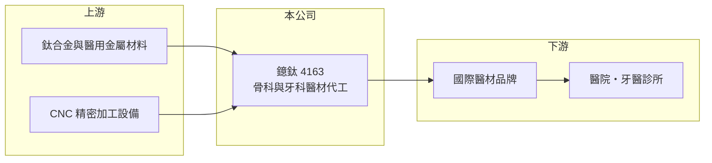

# 4163 鐿鈦

> 上櫃｜[[產業索引-生技醫療業|生技醫療業]]｜上市（櫃）日期 2012/11/15

# 第一章：企業模式與商業藍圖

> [!info] 撰寫說明
> 精簡版，由 Claude 依公開資料整理，架構比照 [[2330台積電]] 的四章研究，資料截至 2026-10-08。來源：MoneyDJ 理財網季度財務比率（2024 年第三季至 2026 年第二季）、櫃買中心開放資料（基本資料、2026 年第二季財報、本益比殖利率）、理財媒體標題（與聯合骨科比較）。Goodinfo 年度頁未取得資料，2021 至 2024 年度數字多未查得；產品與客戶描述多憑記憶整理，已標「待校對」。公開資料有限。#待校對

醫療器材代工和電子代工最大的不同，是每一個零件都要跟著客戶的產品一起通過法規審查。本章說明鐿鈦科技（股票代號：4163，以下簡稱鐿鈦）以精密加工切入醫材供應鏈的商業模式。

- **核心業務：** 鐿鈦 2004 年設立，2012 年起在櫃買中心交易，董事長為鍾兆塤。依記憶，公司以鈦合金等金屬的精密加工為核心，替國際醫材品牌代工[[骨科植入物]]、牙科植入物與手術器械，屬於醫材 [[OEM]] 與 ODM 型態（待校對）。
- **營收結構：** 產品別與地區別比重未查得。從 MoneyDJ 季度資料看，2024 年第三季至 2026 年第二季的[[毛利率]]在 42% 至 46% 之間，明顯高於一般金屬加工業，反映醫材代工需要的認證、品質系統與小量多樣的生產能力能換取較好的價格。
- **營運據點：** 生產基地以台灣為主，2026 年第二季非流動資產約 25.7 億元、占總資產超過一半，代表公司持續投資廠房與精密加工設備，屬於資本密集的製造業。海外據點細節未查得。
- **長期方向：** 人口老化讓骨科與牙科植入物需求長期成長，國際醫材大廠為降低成本與分散產地，持續把精密零組件外包。鐿鈦的長期機會在於從單純加工往上延伸到設計協作與新材料（例如積層製造）的能力，提升每件產品的附加價值。

# 第二章：護城河深度與競爭優勢

醫材代工的護城河來自法規認證與客戶驗證週期。本章分析鐿鈦的競爭位置。

- **競爭優勢：** 植入物的製程一旦隨客戶產品送審，更換代工廠就必須重新驗證與申報，往往需要一到數年，客戶因此很少輕易轉單。鐿鈦長期累積的醫材品質系統與加工經驗，使它在高毛利的醫材代工中站穩位置，季度營業利益率維持在 8% 至 13%。
- **主要對手：** 國際上有美國、歐洲的大型醫材代工廠，台灣則有自有品牌的 [[4129聯合]] 等骨科公司（依理財媒體標題，市場常拿兩者比較，但聯合以自有品牌為主，模式不同）。中國與東南亞的精密加工廠也在爭取低階訂單。
- **觀察重點：** 長期要看客戶集中度是否下降、新產品導入是否持續，以及新增廠房的產能利用率能否撐起折舊。毛利率若能維持在四成以上，代表議價能力仍在。

# 第三章：財務體質與盈利規模

資料日期：2026-10-08，表格是撰寫當時的快照；最新月營收、毛利率、累計 EPS 由自動排程寫在本筆記的屬性欄位（月營收、毛利率、累計EPS 等）。#待校對

本章用可取得的年度與季度數據檢視鐿鈦的獲利能力。

| 年度 | 營收（新台幣） | [[毛利率]] | [[營業利益率]] | EPS（元） | [[ROE]] |
|---|---|---|---|---|---|
| 2021 | 未查得 | 未查得 | 未查得 | 未查得 | 未查得 |
| 2022 | 未查得 | 未查得 | 未查得 | 未查得 | 未查得 |
| 2023 | 未查得 | 未查得 | 未查得 | 未查得 | 未查得 |
| 2024 | 未查得 | 下半年約 42% 至 44% | 下半年約 8% 至 12% | 未查得 | 未查得 |
| 2025 | 未查得 | 約 42.9% 至 46.4%（各季） | 約 10.4% 至 13.2%（各季） | 約 5.13（四季加總，推算） | 約 11%（各季加總，推算） |
| 2026 上半年 | 約 13.0 億 | 約 42.2% | 約 12.2% | 2.95 | 未查得 |

資料來源：MoneyDJ 理財網季度財務比率；2026 年上半年取自櫃買中心開放資料。

- **營收規模：** 2026 年上半年營收約 13.0 億元，年化約 26 億元（推算）。多年度營收與年複合成長率未查得。
- **獲利：** 2025 年四季 EPS 分別約 1.67、0.30、1.59、1.57 元，第二季明顯偏低，可能受匯率或一次性因素影響（原因未查得）。2026 年上半年營業利益約 1.59 億元，稅後淨利約 1.42 億元，本業貢獻占大部分。
- **財務特色：** 2026 年第二季權益約 27.6 億元、負債約 20.0 億元（其中非流動負債約 8.4 億元），負債比約四成二，比新藥與通路同業高，與持續擴廠相符。櫃買中心資料最近一次現金股利 3.5 元，以 2025 年 EPS 約 5.13 元計配息率約 68%（推算）。

**[[ROIC]] 與 [[WACC]]：** 以 2026 年上半年營業利益約 1.59 億元年化約 3.19 億元，稅後約 2.55 億元；投入資本以權益約 27.6 億元加上以非流動負債約 8.4 億元代替有息負債（官方資料未拆分，推估），約 36.0 億元，ROIC 約 7.1%（推算）。WACC 以台灣 10 年期公債 1.75%、市場風險溢酬 6%、醫材製造業常見 β 0.9（假設）計，權益成本約 7.15%；負債成本假設 2.5%、稅後約 2.0%，負債權重約 23%，WACC 約 6.0%（推算）。ROIC 略高於 WACC，代表鐿鈦目前小幅創造價值，但利差不大，新廠產能能否填滿將決定利差能否擴大。

# 第四章：總體風險與地緣政治

醫材代工的風險來自客戶、法規與匯率。本章整理鐿鈦的長期風險。

- **產業週期：** 骨科與牙科手術量長期穩定成長，但國際醫材品牌會定期調整庫存，代工廠的訂單因此出現季節與年度波動。
- **營運風險：** 若客戶集中於少數國際品牌，單一客戶的產品轉換或自製比例提高，會直接影響營收；擴廠帶來的折舊與利息，在需求放緩時會壓低獲利。
- **其他風險：** 主要客戶在歐美，美元匯率與美國關稅政策會影響報價與毛利；美國 [[FDA]] 與歐盟醫材法規（MDR）的變動會增加驗證與文件成本。

# 專有名詞解析

## 應用

- **[[FDA]]**：美國食品藥物管理局，負責審查美國上市的藥品與醫療器材，其核准常被視為全球藥證的重要指標。

## 產業

- **[[骨科植入物]]**：植入人體以固定、修復或取代骨骼與關節的醫材，例如骨釘、骨板、人工關節與脊椎固定器。
- **[[OEM]]**：原廠委託製造，代工廠依品牌客戶的設計與規格生產，產品掛品牌商的商標。
- **[[醫材法規]]**：各國對醫療器材設計、製造、上市與上市後監督的規範，例如美國 FDA 與歐盟 MDR。

# 核心供應鏈

- 上游：鈦合金與醫用金屬材料、精密加工設備供應商（個別廠商未查得）。
- 下游／客戶：國際骨科與牙科醫材品牌（個別客戶未查得）。
- 同業：[[4129聯合]]（骨科自有品牌）、[[4106雃博]]、[[4107邦特]]（醫材製造，產品不同）。

## 最新新聞
<!-- news:start -->
<!-- news:end -->

## 相關連結
- [公開資訊觀測站](https://mopsov.twse.com.tw/mops/web/t05st03?step=1&firstin=1&co_id=4163)
- [Goodinfo](https://goodinfo.tw/tw/StockDetail.asp?STOCK_ID=4163)
- [Yahoo 股市](https://tw.stock.yahoo.com/quote/4163)
- [鉅亨網新聞](https://www.cnyes.com/twstock/4163/news)
