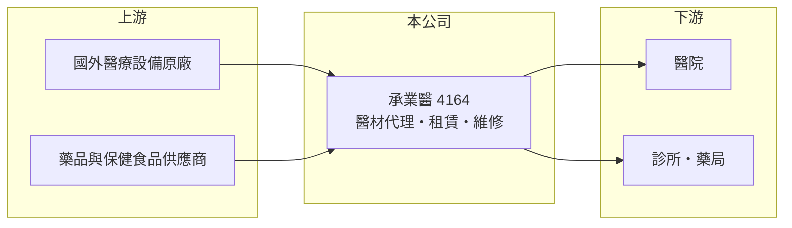

# 4164 承業醫

> 上市｜[[產業索引-生技醫療業|生技醫療業]]｜上市（櫃）日期 2012/10/24

# 第一章：企業模式與商業藍圖

> [!info] 撰寫說明
> 精簡版，由 Claude 依公開資料整理，架構比照 [[2330台積電]] 的四章研究，資料截至 2026-10-08。來源：Goodinfo 年度經營績效、nStock 公司簡介（主要營業項目）、證交所開放資料（基本資料、2026 年第二季資產負債與損益、營益分析、2025 年度股利、本益比殖利率）。子公司名稱、代理品牌與營收比重未查得。公開資料有限。#待校對

醫療通路公司的價值在於把國外原廠的設備與藥品，穩定地送進醫院並負責後續服務。本章說明承業生醫投資控股（股票代號：4164，以下簡稱承業醫）的商業模式。

- **核心業務：** 承業醫是 2009 年設立的[[控股公司]]，2012 年在證交所上市，董事長為李典穎。依 nStock 公司簡介，集團主要營業項目為藥品及[[保健食品]]買賣，以及醫療器材的銷售、出租、安裝與維修。換句話說，它以[[醫材代理]]為主，同時賺設備銷售的價差，以及設備裝機後長期的租賃與維修收入。
- **營收結構：** 各業務比重未查得。2021 至 2025 年[[毛利率]]由 34.8% 降到 21% 至 26% 的區間，推估是毛利較低的代理銷售比重提高（推估）。2026 年上半年毛利率約 24.4%、營業利益率約 7.4%，屬於典型通路業的獲利水準。
- **營運據點：** 總部位於台北市內湖，主要市場在台灣醫院體系，海外布局未查得。2026 年第二季總資產約 161.8 億元，遠大於年營收規模，其中非流動資產約 109.5 億元，代表集團持有大量長期資產（可能包括出租設備、不動產或轉投資，內容未查得）。
- **長期方向：** 營收由 2021 年的 24.4 億元成長到 2025 年的 44.0 億元，年複合成長率約 15.9%（推算），規模擴張明顯。2025 年股本由約 16.7 億元增加到約 19.5 億元，代表公司以增資支應擴張。長期關鍵在於擴張後的資產能否帶來相應的獲利率回升。

# 第二章：護城河深度與競爭優勢

醫療通路的護城河來自代理權、醫院關係與售後服務網路。本章分析承業醫的競爭位置。

- **競爭優勢：** 醫療設備進入醫院需要參與招標、通過醫院評估，並提供長期的維修保固，通路商累積的醫院關係與工程師團隊是新進者難以短期複製的資產。設備裝機後的維修、耗材與租賃收入具有延續性，能平滑單年設備銷售的波動。
- **主要對手：** 國內醫材與藥品通路商眾多，包括 [[4104佳醫]]、[[4126太醫]]、[[4173久裕]] 等上市櫃同業，以及國際原廠在台設立的直營分公司。原廠一旦收回代理改為直營，通路商就會失去該品牌營收，這是通路業最大的結構性威脅。
- **觀察重點：** 營業利益率由 2021 年的 20.2% 降到 2024 年的 6.6%，2025 年回升到 9.0%。長期要看獲利率能否回到兩位數，以及大量長期資產的報酬率能否改善。

# 第三章：財務體質與盈利規模

資料日期：2026-10-08，表格是撰寫當時的快照；最新月營收、毛利率、累計 EPS 由自動排程寫在本筆記的屬性欄位（月營收、毛利率、累計EPS 等）。#待校對

本章用五年數據檢視承業醫在擴張過程中的獲利品質。

| 年度 | 營收（新台幣） | [[毛利率]] | [[營業利益率]] | EPS（元） | [[ROE]] |
|---|---|---|---|---|---|
| 2021 | 24.4 億 | 34.8% | 20.2% | 2.43 | 6.18% |
| 2022 | 29.7 億 | 30.3% | 16.0% | 2.21 | 6.11% |
| 2023 | 38.8 億 | 27.6% | 15.8% | 2.55 | 6.45% |
| 2024 | 36.0 億 | 21.1% | 6.63% | 1.01 | 2.72% |
| 2025 | 44.0 億 | 26.1% | 9.04% | 1.00 | 3.07% |

資料來源：Goodinfo 年度經營績效（合併報表）。2026 年上半年（證交所資料）營收約 23.4 億元、毛利率 24.36%、營業利益率 7.37%、EPS 0.45 元。

- **營收規模：** 五年間營收增加約八成，但 EPS 由 2.43 元降到 1.00 元，代表營收擴張並沒有轉化為每股獲利，原因包括毛利率下降與股本增加。
- **獲利：** 近五年平均 ROE 約 4.9%（推算），2024 至 2025 年只有約 3%，資本效率偏低。2026 年上半年業外為淨損失約 0.38 億元，可能與利息費用有關（推估）。
- **財務特色：** 2026 年第二季權益約 78.6 億元、負債約 83.2 億元，其中非流動負債約 52.3 億元，負債比約五成一，在生技醫療類股中屬於槓桿偏高的公司。依證交所股利資料，2025 年度擬配現金股利 1.1 元，總額約 2.15 億元，高於當年淨利約 1.86 億元，部分動用以前年度盈餘，章程規定可分配盈餘至少提撥 50% 分派。

**[[ROIC]] 與 [[WACC]]：** 以 2025 年計，營業利益約 3.98 億元（營收 44.0 億元乘營業利益率 9.04%），稅後約 3.18 億元。投入資本以權益約 78.6 億元加上以非流動負債約 52.3 億元代替有息負債（官方資料未拆分，推估），約 130.9 億元，ROIC 約 2.4%（推算）。WACC 以台灣 10 年期公債 1.75%、市場風險溢酬 6%、通路業常見 β 0.8（假設）計，權益成本約 6.55%；負債成本假設 2.5%、稅後約 2.0%，負債權重約四成，WACC 約 4.7%（推算）。ROIC 明顯低於 WACC，代表目前的資產規模尚未賺回資金成本；股價淨值比約 0.74 倍，也反映市場對其資本報酬的保留態度。

# 第四章：總體風險與地緣政治

醫療通路業的風險多來自政策與原廠關係。本章整理承業醫的長期風險。

- **產業週期：** 醫院設備採購與醫院預算、健保總額與政府補助相關，景氣影響較小，但採購時點集中，容易造成年度間營收波動。
- **營運風險：** 代理權可能因原廠策略改變而收回或改由他人代理；擴張主要以增資與負債支應，若新投資的報酬率持續偏低，會長期稀釋股東權益報酬。
- **其他風險：** [[健保藥價]]與醫材給付價格調整會壓縮藥品與耗材的毛利；進口設備以外幣計價，新台幣貶值會提高成本；利率上升會加重負債的利息負擔。

# 專有名詞解析

## 產業

- **[[控股公司]]**：本身主要持有子公司股權、透過子公司經營業務的公司型態，常用於整合多家公司。
- **[[保健食品]]**：以補充營養或維持健康為訴求的食品，不屬藥品，進入門檻低、品牌競爭激烈。
- **[[醫材代理]]**：代理國外醫療器材品牌在國內銷售、安裝與維修，賺取進銷差價與服務收入。
- **[[健保藥價]]**：全民健保給付藥品的價格，由主管機關核定並定期調整，直接影響國內藥廠的營收與毛利。

# 核心供應鏈

- 上游：國外醫療設備與藥品原廠（代理品牌未查得）。
- 下游／客戶：醫學中心、區域醫院、診所與藥局。
- 同業：[[4104佳醫]]、[[4126太醫]]、[[4173久裕]]、[[4175杏一]]（醫療通路，業務型態不同）。

## 最新新聞
<!-- news:start -->
<!-- news:end -->

## 相關連結
- [公開資訊觀測站](https://mopsov.twse.com.tw/mops/web/t05st03?step=1&firstin=1&co_id=4164)
- [Goodinfo](https://goodinfo.tw/tw/StockDetail.asp?STOCK_ID=4164)
- [Yahoo 股市](https://tw.stock.yahoo.com/quote/4164)
- [鉅亨網新聞](https://www.cnyes.com/twstock/4164/news)
