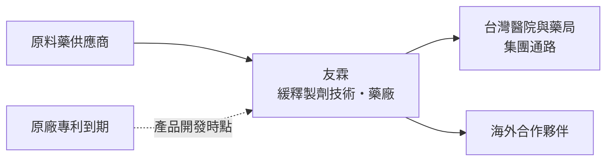
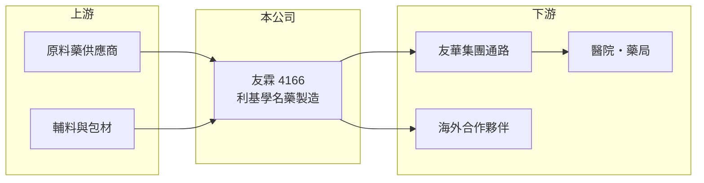

# 4166 友霖

> 上櫃｜[[產業索引-生技醫療業|生技醫療業]]｜上市（櫃）日期 2025/08/21

# 第一章：企業模式與商業藍圖

> [!info] 撰寫說明
> 精簡版，由 Claude 依公開資料整理，架構比照 [[2330台積電]] 的四章研究，資料截至 2026-10-08。來源：Goodinfo 年度經營績效、nStock 公司簡介（主要業務、2025 年上櫃）、旺得富與聯合新聞網新聞標題（2025 年 8 月上櫃、友華集團、利基藥品策略）、櫃買中心開放資料（基本資料、2026 年第二季財報）。產品線與海外市場細節多憑記憶整理，已標「待校對」。#待校對

利基學名藥公司的生意，是在原廠專利到期時搶先推出不容易仿製的藥品。本章說明友霖生技醫藥（股票代號：4166，以下簡稱友霖）的商業模式。

- **核心業務：** 友霖 2008 年設立，董事長為蔡正弘，是 [[4120友華]] 集團旗下的藥廠，2025 年 8 月 21 日在櫃買中心掛牌。依 nStock 資料，公司經營西藥與醫療器材的製造、批發、零售與國際貿易。依新聞標題，公司策略是掌握專利到期與市場缺口，結合核心技術平台打造差異化產品，也就是聚焦技術門檻較高的利基型[[學名藥]]。
- **營收結構：** 產品別比重未查得。依記憶，友霖以緩釋劑型等製劑技術見長，產品涵蓋中樞神經（例如注意力不足過動症用藥）與疼痛等領域，並以 [[505(b)(2)]] 等途徑開發改良劑型（待校對）。2025 年[[毛利率]]約 56.5%，明顯高於一般學名藥廠，顯示產品組合偏向高技術門檻品項。
- **營運據點：** 生產基地以台灣為主，透過集團與合作夥伴銷售到台灣與海外市場，美國等海外市場的比重未查得（待校對）。2026 年第二季非流動資產約 17.3 億元，占總資產近六成，代表公司已建置相當規模的藥廠與設備。
- **長期方向：** 2021 年營收 4.63 億元、仍處虧損，2025 年成長到 14.0 億元、營業利益率 18.6%，五年營收年複合成長率約 31.9%（推算）。這段成長代表新產品陸續取得藥證並放量，長期要看後續管線能否在原廠專利到期時準時上市。

# 第二章：護城河深度與競爭優勢

利基學名藥的護城河來自製劑技術難度與藥證取得的時間差。本章分析友霖的競爭位置。

- **競爭優勢：** 緩釋或特殊劑型的學名藥，需要證明藥物在體內的釋放曲線與原廠相同，開發難度與失敗率都高於一般錠劑，能做到的廠商少，價格競爭因此較緩和。與 [[4120友華]] 同屬一個集團，可利用集團的醫院業務與行銷資源，降低自建通路的成本。
- **主要對手：** 國內有 [[1795美時]]、[[6472保瑞]]、[[4114健喬]] 等製劑與學名藥廠，國際上則有印度、以色列等大型學名藥廠。一旦某個利基品項有多家廠商取得藥證，價格就會快速下滑。
- **觀察重點：** 毛利率由 2022 年的 30.3% 提升到 2025 年的 56.5%，是公司轉型成功的最重要訊號。長期要看這個毛利率能否在新競爭者進入後維持，以及每年能否有新的藥證接續老產品的價格下滑。

# 第三章：財務體質與盈利規模

資料日期：2026-10-08，表格是撰寫當時的快照；最新月營收、毛利率、累計 EPS 由自動排程寫在本筆記的屬性欄位（月營收、毛利率、累計EPS 等）。#待校對

本章用五年數據檢視友霖由虧轉盈的過程。

| 年度 | 營收（新台幣） | [[毛利率]] | [[營業利益率]] | EPS（元） | [[ROE]] |
|---|---|---|---|---|---|
| 2021 | 4.63 億 | 30.8% | -28.8% | -0.55 | -8.80% |
| 2022 | 5.12 億 | 30.3% | -8.15% | -0.15 | -2.61% |
| 2023 | 8.90 億 | 52.7% | 2.73% | 0.10 | 1.61% |
| 2024 | 12.2 億 | 53.3% | 12.9% | 0.48 | 6.21% |
| 2025 | 14.0 億 | 56.5% | 18.6% | 0.90 | 9.58% |

資料來源：Goodinfo 年度經營績效（合併報表）。2026 年上半年（櫃買中心資料）營收約 7.58 億元、毛利率約 54.1%、營業利益率約 16.4%、EPS 0.40 元。

- **營收規模：** 營收由 4.63 億元增加到 14.0 億元，年複合成長率約 31.9%（推算），2023 年是關鍵轉折，毛利率一年提升超過 20 個百分點，代表高毛利新品開始貢獻。
- **獲利：** 營業利益率由 -28.8% 提升到 18.6%，是典型的[[營運槓桿]]：藥廠的折舊、研發與人事屬固定成本，營收跨過損益兩平後，獲利率快速擴張。近五年平均 ROE 只有約 1.2%（推算），但趨勢逐年向上，2025 年接近 10%。
- **財務特色：** 2026 年第二季權益約 26.6 億元、負債約 3.5 億元，負債比約一成二，財務保守。股本由 2022 年的 18.7 億元增加到 2025 年的 24.3 億元，主要來自增資與上櫃承銷，每股盈餘因此被稀釋。櫃買中心資料顯示目前尚無現金股利紀錄。

**[[ROIC]] 與 [[WACC]]：** 以 2025 年計，營業利益約 2.60 億元（營收 14.0 億元乘營業利益率 18.6%），稅後約 2.08 億元。投入資本以權益約 26.6 億元加上以非流動負債約 1.8 億元代替有息負債（官方資料未拆分，推估），約 28.4 億元，ROIC 約 7.3%（推算）。WACC 以台灣 10 年期公債 1.75%、市場風險溢酬 6%、製藥業常見 β 1.0（假設）計，權益成本約 7.75%；負債權重約 6%、稅後成本約 2.0%，WACC 約 7.4%（推算）。ROIC 與 WACC 大致打平，代表友霖剛走到開始創造價值的門檻；若營業利益率持續提升，利差有機會轉正並擴大。

# 第四章：總體風險與地緣政治

學名藥廠的風險來自價格、法規與產品更替速度。本章整理友霖的長期風險。

- **產業週期：** 藥品需求穩定，但學名藥價格會在競爭者進入後逐年下滑，公司必須持續推出新產品，才能抵銷舊產品的價格侵蝕。
- **營運風險：** 新產品的藥證時程不確定，若主力產品遇到新競爭者或專利訴訟，營收會明顯回落；藥廠的 PIC/S GMP 稽核若出現缺失，可能影響出貨。
- **其他風險：** 台灣[[健保藥價]]定期調降壓縮國內產品毛利；海外市場的法規、匯率與通路夥伴變動，會影響外銷收入。

# 專有名詞解析

## 金融

- **[[營運槓桿]]**：固定成本占比高的企業，營收增加時獲利增幅會大於營收增幅，反之亦然。

## 產業

- **[[學名藥]]**：原廠藥專利到期後，由其他藥廠生產、成分與療效相同的藥品，價格通常較低。
- **[[505(b)(2)]]**：美國 FDA 的新藥申請途徑，可引用既有藥品的資料，用於新劑型、新配方等改良型新藥。
- **[[PIC S GMP]]**：國際醫藥品稽查協約組織的藥品優良製造規範，是台灣藥廠必須符合的製造標準。
- **[[健保藥價]]**：全民健保給付藥品的價格，由主管機關核定並定期調整，直接影響國內藥廠的營收與毛利。

# 核心供應鏈

- 上游：原料藥、輔料與包材供應商，例如 [[4746台耀]]、[[1789神隆]]（同業原料藥廠，是否為供應商未查得）。
- 下游／客戶：母集團 [[4120友華]]、台灣醫院與藥局、海外合作夥伴。
- 同業：[[1795美時]]、[[6472保瑞]]、[[4114健喬]]、[[4123晟德]]。

## 最新新聞
<!-- news:start（自動產生，請勿手動編輯此範圍） -->
- 2026-10-09 📰 媒體 08:50｜營收速報 - 友霖(4166)9月營收1.49億元年增率高達41.18％｜[鉅亨網](https://news.cnyes.com/news/id/6626638)

完整紀錄：[[4166友霖 新聞]]
<!-- news:end -->

## 相關連結
- [公開資訊觀測站](https://mopsov.twse.com.tw/mops/web/t05st03?step=1&firstin=1&co_id=4166)
- [Goodinfo](https://goodinfo.tw/tw/StockDetail.asp?STOCK_ID=4166)
- [Yahoo 股市](https://tw.stock.yahoo.com/quote/4166)
- [鉅亨網新聞](https://www.cnyes.com/twstock/4166/news)
