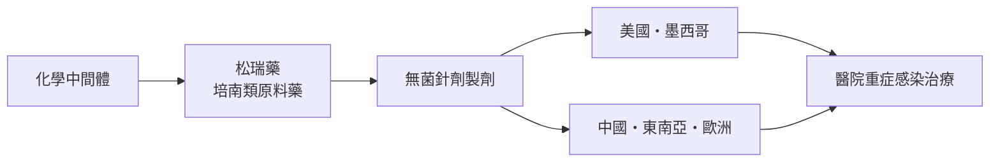
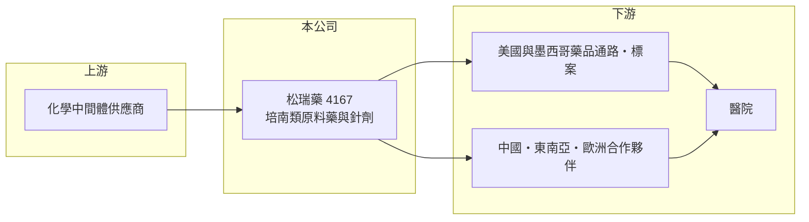

# 4167 松瑞藥

> 上櫃｜[[產業索引-生技醫療業|生技醫療業]]｜上市（櫃）日期 2015/09/08

# 第一章：企業模式與商業藍圖

> [!info] 撰寫說明
> 精簡版，由 Claude 依公開資料整理，架構比照 [[2330台積電]] 的四章研究，資料截至 2026-10-08。來源：Goodinfo 年度經營績效、聯合新聞網 2025 年上半年財報報導（產品、市場、產能、處分廠房）、櫃買中心開放資料（基本資料、2026 年第二季財報、本益比殖利率）。公司沿革與更名前身憑記憶整理，已標「待校對」。#待校對

抗生素原料藥是一門看似成熟、其實門檻很高的生意，特別是需要獨立廠房的培南類藥物。本章說明松瑞製藥（股票代號：4167，以下簡稱松瑞藥）的商業模式。

- **核心業務：** 松瑞藥 2004 年設立，2015 年起在櫃買中心交易。依 2025 年報導，公司核心產品是[[培南類抗生素]]（carbapenem）中的厄他培南（ertapenem），並已把美洛培南（meropenem）銷往美國、歐洲與東南亞，採自製[[原料藥]]加製劑（針劑）的垂直整合模式。依記憶，公司前身為展旺生命科技（待校對）。
- **營收結構：** 各產品比重未查得，但厄他培南被公司形容為供不應求的主力產品。另有子公司與瑞澤生技合作推出保健品牌，進入藥妝店、藥局、診所與電商通路，屬於規模較小的多角化業務。
- **營運據點：** 生產基地在台灣，依 2025 年報導，第三條產線接近完工並進入驗證試產；同年上半年處分竹南廠房，認列處分利益。市場方面，美國厄他培南自 2025 年初市占居首、墨西哥取得國家級年度標案、中國於 2025 年 4 月取得核准，產品註冊已布局二十多國。
- **長期方向：** 公司目標是成為全球具影響力的培南類抗生素供應商。培南類藥物屬於醫院用於嚴重感染的最後防線用藥，需求穩定，長期成長來自更多國家的藥證與標案，以及新產線帶來的產能。

# 第二章：護城河深度與競爭優勢

培南類抗生素的護城河來自專用廠房、無菌製程與多國藥證。本章分析松瑞藥的競爭位置。

- **競爭優勢：** 培南類（β-內醯胺類）藥物為避免交叉污染，法規要求使用獨立廠房與設備，建廠成本高、驗證時間長，全球供應商數量有限。松瑞藥從原料藥到針劑一條龍生產，成本與品質都能自行掌握，並已在美國取得領先市占，這些都是新進者難以短期追上的條件。
- **主要對手：** 國際學名藥大廠、印度與中國的抗生素原料藥與針劑廠。中國廠商成本低、產能大，是價格競爭的主要來源；台灣同業如 [[1789神隆]] 專注抗癌原料藥，[[6535順藥]] 走特殊劑型，與松瑞藥的產品重疊有限。
- **觀察重點：** [[毛利率]]由 2022 年的 10.3% 提升到 2025 年的 35.2%，代表產品組合與產能利用率大幅改善。長期要看新產線投產後毛利率能否維持在三成以上，以及中國等新市場的放量速度。

# 第三章：財務體質與盈利規模

資料日期：2026-10-08，表格是撰寫當時的快照；最新月營收、毛利率、累計 EPS 由自動排程寫在本筆記的屬性欄位（月營收、毛利率、累計EPS 等）。#待校對

本章用五年數據檢視松瑞藥的獲利轉折，並區分本業與一次性收益。

| 年度 | 營收（新台幣） | [[毛利率]] | [[營業利益率]] | EPS（元） | [[ROE]] |
|---|---|---|---|---|---|
| 2021 | 17.4 億 | 17.7% | 1.68% | 0.03 | 0.30% |
| 2022 | 12.7 億 | 10.3% | -7.45% | 0.11 | 1.09% |
| 2023 | 10.5 億 | 21.0% | -0.23% | 0.09 | 0.82% |
| 2024 | 12.2 億 | 28.5% | 9.77% | 0.57 | 5.19% |
| 2025 | 12.0 億 | 35.2% | 15.2% | 1.72 | 14.6% |

資料來源：Goodinfo 年度經營績效（合併報表）。2026 年上半年（櫃買中心資料）營收約 5.20 億元、毛利率約 34.1%、營業利益率約 6.7%、EPS 2.60 元，其中[[業外收益]]約 8.39 億元。

- **營收規模：** 2021 至 2025 年營收由 17.4 億元降到 12.0 億元，年複合成長率約 -8.9%（推算），但這段期間毛利率大幅提升，代表公司收掉或縮減低毛利產品，轉向高毛利的培南類主力（推估）。
- **獲利：** 2025 年 EPS 1.72 元、ROE 14.6%，部分來自處分竹南廠房的一次性利益；依 2025 年報導，當年上半年 EPS 1.17 元。2026 年上半年 EPS 2.60 元中，業外收益約占稅前淨利九成以上（來源未查得），本業營業利益率只有約 6.7%，評估長期獲利應以本業為準。近五年平均 ROE 約 4.4%（推算）。
- **財務特色：** 2026 年第二季權益約 43.9 億元、負債約 7.7 億元，流動資產約 36.5 億元，財務非常寬裕。櫃買中心資料最近一次現金股利約 1.48 元。

**[[ROIC]] 與 [[WACC]]：** 以 2025 年計，營業利益約 1.82 億元（營收 12.0 億元乘營業利益率 15.2%），稅後約 1.46 億元。投入資本以權益約 43.9 億元加上以非流動負債約 1.8 億元代替有息負債（官方資料未拆分，推估），約 45.7 億元，ROIC 約 3.2%（推算）。WACC 以台灣 10 年期公債 1.75%、市場風險溢酬 6%、製藥業常見 β 1.0（假設）計，權益成本約 7.75%，負債比重低，WACC 約 7.6%（推算）。本業 ROIC 低於 WACC，主因是處分資產後帳上累積大量現金，營運資本報酬被稀釋；若扣除現金，本業的資本報酬會明顯較高。長期價值取決於這些現金是投入產能擴充，還是回饋股東。

# 第四章：總體風險與地緣政治

抗生素供應商的風險來自價格競爭、法規稽核與單一產品依賴。本章整理松瑞藥的長期風險。

- **產業週期：** [[抗生素]]需求穩定，但各國醫院與政府標案以價格競標為主，中國與印度產能擴充時，國際報價容易下滑。標案得標與否也會讓年度營收出現跳動。
- **營運風險：** 營收集中在少數培南類產品，若美國 FDA 稽核出現缺失、主要市場出現新競爭者，或第三條產線驗證延遲，都會直接影響營收與毛利。
- **其他風險：** 外銷以美元計價為主，新台幣升值會壓縮毛利；美國對進口藥品的關稅與供應鏈在地化政策，可能改變出口條件；近年獲利含有一次性業外收益，不宜直接外推。

# 專有名詞解析

## 金融

- **[[業外收益]]**：本業以外的收入，例如利息、投資收益或處分資產利益，通常不具持續性。

## 產業

- **[[抗生素]]**：抑制或殺死細菌的藥物，因抗藥性問題，各國都對其使用有嚴格管理。
- **[[原料藥]]**：藥品中具有療效的活性成分（API），由原料藥廠生產後賣給製劑廠做成藥品。
- **[[培南類抗生素]]**：碳青黴烯類廣效抗生素，常作為醫院治療多重抗藥性細菌感染的最後防線藥物。

# 核心供應鏈

- 上游：化學中間體與無菌包材供應商（個別廠商未查得）。
- 下游／客戶：美國、墨西哥、中國、東南亞與歐洲的藥品經銷商與醫院標案。
- 同業：國際與中國、印度抗生素藥廠；台灣原料藥同業 [[1789神隆]]、[[4746台耀]]、[[4119旭富]]。

## 最新新聞
<!-- news:start（自動產生，請勿手動編輯此範圍） -->
- 2026-10-08 📰 媒體 19:51｜營收速報 - 松瑞藥(4167)9月營收1.04億元年增率高達33.74％｜[鉅亨網](https://news.cnyes.com/news/id/6625882)

完整紀錄：[[4167松瑞藥 新聞]]
<!-- news:end -->

## 相關連結
- [公開資訊觀測站](https://mopsov.twse.com.tw/mops/web/t05st03?step=1&firstin=1&co_id=4167)
- [Goodinfo](https://goodinfo.tw/tw/StockDetail.asp?STOCK_ID=4167)
- [Yahoo 股市](https://tw.stock.yahoo.com/quote/4167)
- [鉅亨網新聞](https://www.cnyes.com/twstock/4167/news)
