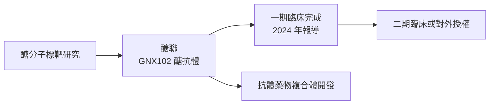
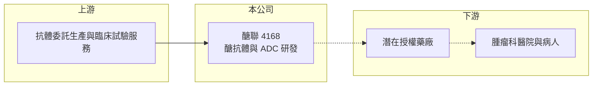

# 4168 醣聯

> 上櫃｜[[產業索引-生技醫療業|生技醫療業]]｜上市（櫃）日期 2012/12/18

# 第一章：企業模式與商業藍圖

> [!info] 撰寫說明
> 精簡版，由 Claude 依公開資料整理，架構比照 [[2330台積電]] 的四章研究，資料截至 2026-10-08。來源：Goodinfo 年度經營績效、工商時報 2024 年 6 月報導（GNX102 一期臨床與專利）、櫃買中心開放資料（基本資料、2026 年第二季財報）。授權交易與臨床年份未查得。公開資料有限。#待校對

尚未有產品上市的新藥公司，評估重點不是營收，而是研發管線的進度與手上現金能撐多久。本章說明台灣醣聯生技醫藥（股票代號：4168，以下簡稱醣聯）的商業模式。

- **核心業務：** 醣聯 2001 年設立，2012 年起在櫃買中心交易，董事長為張東玄、總經理為楊玫君。公司專注於「醣抗體」平台，也就是辨認癌細胞表面異常醣分子的[[單株抗體]]。主力候選藥 GNX102 是人源化單株抗體，依 2024 年 6 月報導已完成一期人體臨床試驗，數據顯示可能用於大腸癌、胰臟癌與肺癌等實體腫瘤。
- **營收結構：** 營收規模極小，2021 至 2025 年每年只有約 0.03 億至 0.38 億元，推估來自抗體相關技術服務或試劑（推估）。在研發型新藥公司中，這種營收不具評價意義，真正的價值來源是未來的授權金與里程碑金。
- **營運據點：** 研發據點在台灣，2026 年第二季非流動資產約 7.9 億元，占總資產過半，推估包含實驗室與生產相關設備（推估）。依 2024 年報導，GNX102 先後取得美國專利，之後陸續在日本、韓國、俄羅斯與台灣取得專利。
- **長期方向：** 公司表示將以 GNX102 為基礎，積極開發[[抗體藥物複合體]]，也就是把抗體與細胞毒性藥物結合，把藥物精準送到腫瘤部位，並以次世代定序分析大量腫瘤檢體，找出適合的病人族群。長期要看能否推進到二期臨床並對外授權。

# 第二章：護城河深度與競爭優勢

早期新藥公司的護城河主要是專利與獨特的標靶。本章分析醣聯的競爭位置。

- **競爭優勢：** 醣分子標靶在抗體藥物中相對少見，醣聯長期累積的醣抗體篩選經驗與多國專利，是其差異化所在。若醣標靶的療效獲得驗證，這類「first-in-class」藥物在授權談判中通常能取得較好的條件。
- **主要對手：** 抗癌抗體與抗體藥物複合體是全球藥廠競爭最激烈的領域，國際大藥廠與中國生技公司都在開發同類適應症的藥物。台灣同業如 [[4174浩鼎]] 同樣以醣分子（Globo H）為標靶並轉向抗體藥物複合體，是最接近的比較對象。
- **觀察重點：** 長期要觀察 GNX102 的下一階段臨床能否啟動、是否有國際藥廠簽署授權，以及公司是否需要頻繁增資來支應研發。

# 第三章：財務體質與盈利規模

資料日期：2026-10-08，表格是撰寫當時的快照；最新月營收、毛利率、累計 EPS 由自動排程寫在本筆記的屬性欄位（月營收、毛利率、累計EPS 等）。#待校對

研發型新藥公司的財務重點是現金消耗與資本結構。本章用五年數據說明。

| 年度 | 營收（新台幣） | [[毛利率]] | [[營業利益率]] | EPS（元） | [[ROE]] |
|---|---|---|---|---|---|
| 2021 | 0.05 億 | 63.2% | -3,560% | -1.78 | -11.9% |
| 2022 | 0.30 億 | 46.4% | -793% | -2.21 | -15.7% |
| 2023 | 0.03 億 | 39.1% | -10,223% | -1.65 | -13.1% |
| 2024 | 0.15 億 | 49.8% | -1,674% | -2.12 | -19.8% |
| 2025 | 0.38 億 | 62.1% | -660% | -2.16 | -23.2% |

資料來源：Goodinfo 年度經營績效（合併報表）。2026 年上半年（櫃買中心資料）營收約 0.14 億元、營業損失約 1.37 億元、EPS -1.16 元。

- **營收規模：** 營收極小且不穩定，營業利益率因分母太小而呈現上千個百分點的負值，不具比較意義。
- **獲利：** 每年 EPS 約 -1.65 至 -2.21 元，以 2025 年營業損失約 2.5 億元推估（營收 0.38 億元乘 -660%，推算），每年研發與管理費用約 2.5 億元。近五年平均 ROE 約 -16.7%（推算），且虧損幅度逐年擴大，反映臨床推進後研發支出增加。
- **財務特色：** 2026 年第二季流動資產約 6.0 億元、權益約 8.5 億元、負債約 5.4 億元，其中非流動負債約 4.8 億元（性質未查得，可能含可轉換公司債或長期借款，待校對）。以每年約 2.5 億元的現金消耗推算，流動資產約可支應兩年多（推算），之後仍需增資、借款或授權收入。股本由 2021 年的 9.75 億元增加到 2025 年的 11.3 億元，顯示公司持續以增資籌措研發資金。無現金股利。

**[[ROIC]] 與 [[WACC]]：** 以 2025 年營業損失約 2.5 億元計（虧損不計稅盾），投入資本以權益約 8.5 億元加上非流動負債約 4.8 億元，約 13.3 億元，ROIC 約 -19%（推算）。WACC 以台灣 10 年期公債 1.75%、市場風險溢酬 6%、早期新藥股常見 β 1.3（假設）計，權益成本約 9.55%；負債成本假設 2.5%、稅後約 2.0%，負債權重約 36%，WACC 約 6.8%（推算），若以全權益計約 9.5%。ROIC 為負是研發型新藥公司的常態，代表目前持續消耗股東資本；能否轉為創造價值，完全取決於授權或上市後的未來收入，而不是現在的財報。

# 第四章：總體風險與地緣政治

早期新藥公司的風險最高，成敗多半取決於少數臨床結果。本章整理醣聯的長期風險。

- **產業週期：** 生技新藥的資金環境受利率與資本市場情緒影響很大，市場冷淡時增資困難、授權條件變差，研發進度可能因此放慢。
- **營運風險：** 管線集中在 GNX102 與相關抗體平台，臨床失敗會使公司價值大幅縮水；持續虧損需要反覆增資，對既有股東造成稀釋。
- **其他風險：** 抗體藥物複合體領域競爭者眾多、技術迭代快，即使臨床成功也可能面臨更強的競品；國際臨床試驗與專利維護費用以外幣計價，匯率波動會影響支出。

# 專有名詞解析

## 產業

- **[[單株抗體]]**：由單一細胞株產生、只辨認單一抗原位點的抗體，專一性高，用於研究、檢驗與治療。
- **[[抗體藥物複合體]]**：ADC，把抗體與細胞毒性藥物以連接子結合，讓藥物精準送到癌細胞的治療方式。
- **[[臨床試驗]]**：新藥上市前在人體進行的分階段試驗，一期看安全性、二期看初步療效、三期確認療效。
- **[[授權金]]**：藥廠將藥物開發或銷售權利授權給其他公司時收取的簽約金與里程碑金，通常屬一次性收入。

# 核心供應鏈

- 上游：抗體委託生產（例如 [[6589台康生技]] 這類 CDMO，是否為合作對象未查得）與臨床試驗服務機構。
- 下游／客戶：潛在的國際授權藥廠（目前未查得已簽約夥伴）。
- 同業：[[4174浩鼎]]、[[6576逸達]]、[[4147中裕]]、[[6446藥華藥]]。

## 最新新聞
<!-- news:start -->
<!-- news:end -->

## 相關連結
- [公開資訊觀測站](https://mopsov.twse.com.tw/mops/web/t05st03?step=1&firstin=1&co_id=4168)
- [Goodinfo](https://goodinfo.tw/tw/StockDetail.asp?STOCK_ID=4168)
- [Yahoo 股市](https://tw.stock.yahoo.com/quote/4168)
- [鉅亨網新聞](https://www.cnyes.com/twstock/4168/news)
