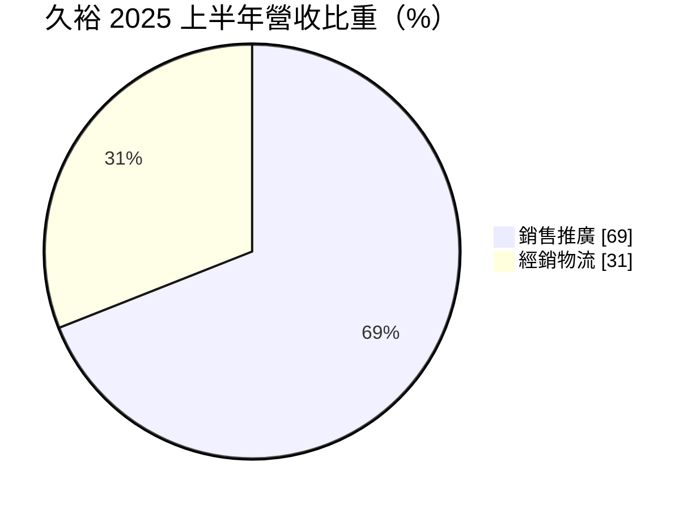
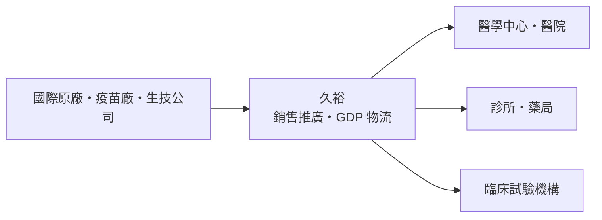
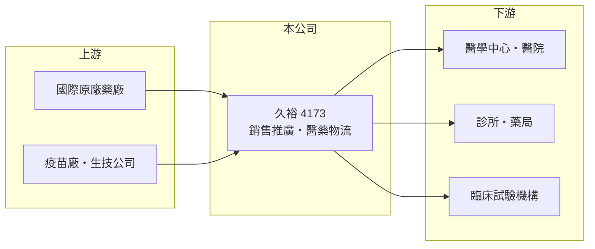

# 4173 久裕

> 上櫃｜[[產業索引-生技醫療業|生技醫療業]]｜上市（櫃）日期 2013/10/31

# 第一章：企業模式與商業藍圖

> [!info] 撰寫說明
> 精簡版，由 Claude 依公開資料整理，架構比照 [[2330台積電]] 的四章研究，資料截至 2026-10-08。來源：Goodinfo 年度經營績效、富果研究 2025 年 8 月法說會整理（業務比重、物流中心、策略）、櫃買中心開放資料（基本資料、2026 年第二季財報、本益比殖利率）。#待校對

醫藥通路公司不研發藥品，而是替國際藥廠把藥品賣進台灣、送到醫院。本章說明久裕企業（股票代號：4173，以下簡稱久裕）如何以「推廣加物流」建立醫藥整合通路平台。

- **核心業務：** 久裕 1980 年設立，2013 年起在櫃買中心交易，董事長為張明正。依 2025 年法說會整理，公司定位為醫藥整合通路平台，兩大核心業務是代理國際原廠藥品的銷售推廣，以及[[醫藥物流]]服務，後者包括倉儲、配送、訂單處理、醫院招投標、藥價申報與帳務管理。
- **營收結構：** 2025 年上半年銷售推廣約占 69%、經銷物流約占 31%。銷售推廣的客戶是醫學中心、醫院、診所與藥局；經銷物流的客戶則是國際藥廠、疫苗廠、生技公司與臨床試驗機構。[[毛利率]]長期約 20%，符合通路業「量大、毛利薄」的特性。
- **營運據點：** 物流中心位於桃園，服務空間約 5,000 坪，符合 [[GDP]] 規範的倉儲棧板量超過 7,100 個，並有自有 GPS 追蹤車隊。由於現有空間趨近飽和，公司規劃尋找新倉儲，目標在 2027 年完成查核並啟用。
- **長期方向：** 公司的策略是短期把銷售推廣從診所、藥局擴展到大型醫院，中期以物流為基礎開發醫材客戶，長期與國際原廠洽談更深度的客製化供應鏈方案，並投資自動化倉儲與資訊系統。

# 第二章：護城河深度與競爭優勢

醫藥通路的護城河來自法規合規的物流設施、原廠信任與醫院網路。本章分析久裕的競爭位置。

- **競爭優勢：** 藥品與疫苗的倉儲運送必須符合 GDP 溫控與追溯要求，建置合規倉儲與車隊需要長期投資與稽核紀錄，國際原廠更換物流商的風險與成本都高。久裕同時提供推廣與物流，對規模較小、不想在台灣自建團隊的國際藥廠來說，是「一站式」的進入台灣市場方案。
- **主要對手：** 國際醫藥物流業者（依記憶例如裕利、大昌華嘉在台據點，待校對）、國內藥品[[代理商]]與經銷商，以及 [[4104佳醫]]、[[4126太醫]]、[[4164承業醫]] 等醫療通路同業。大型國際物流商規模大、議價能力強，是久裕爭取大客戶時的主要對手。
- **觀察重點：** 營收由 2021 年的 9.46 億元成長到 2025 年的 15.5 億元，代表新代理案與物流客戶持續增加。長期要看新倉儲能否如期在 2027 年啟用，以及營業利益率能否在規模擴大後提升。

# 第三章：財務體質與盈利規模

資料日期：2026-10-08，表格是撰寫當時的快照；最新月營收、毛利率、累計 EPS 由自動排程寫在本筆記的屬性欄位（月營收、毛利率、累計EPS 等）。#待校對

本章用五年數據檢視久裕的成長與資本效率。

| 年度 | 營收（新台幣） | [[毛利率]] | [[營業利益率]] | EPS（元） | [[ROE]] |
|---|---|---|---|---|---|
| 2021 | 9.46 億 | 22.0% | 5.76% | 0.74 | 3.07% |
| 2022 | 10.2 億 | 20.3% | 6.30% | 0.84 | 3.38% |
| 2023 | 11.4 億 | 20.5% | 7.18% | 1.03 | 3.92% |
| 2024 | 13.0 億 | 19.5% | 7.34% | 1.26 | 4.76% |
| 2025 | 15.5 億 | 20.1% | 6.56% | 1.16 | 4.41% |

資料來源：Goodinfo 年度經營績效（合併報表）。2026 年上半年（櫃買中心資料）營收約 7.88 億元、毛利率約 19.3%、營業利益率約 4.9%、EPS 0.42 元。

- **營收規模：** 2021 至 2025 年營收年複合成長率約 13.1%（推算），每年穩定成長，股本維持 7.46 億元未變，成長沒有靠增資稀釋。
- **獲利：** EPS 由 0.74 元提升到 1.16 至 1.26 元，但 ROE 只有 3% 至 5%，近五年平均約 3.9%（推算）。原因是權益約 18.9 億元中，有約 2.7 億元屬於其他權益（推估多為持有金融資產的未實現評價），資本並未全部投入通路本業。2026 年上半年其他綜合損益約 -0.75 億元，也顯示這些投資的價格波動會影響淨值。
- **財務特色：** 2026 年第二季流動負債約 31.5 億元，主要是代理與物流業務產生的應付帳款（推估），屬通路業正常結構。櫃買中心資料最近一次現金股利約 1.04 元，以 2025 年 EPS 1.16 元計配息率約九成（推算），殖利率約 6%，股價淨值比約 0.68 倍。

**[[ROIC]] 與 [[WACC]]：** 以 2025 年計，營業利益約 1.02 億元（營收 15.5 億元乘營業利益率 6.56%），稅後約 0.81 億元。投入資本以權益約 18.9 億元加上以非流動負債約 1.4 億元代替有息負債（官方資料未拆分，推估），約 20.3 億元，ROIC 約 4.0%（推算）。WACC 以台灣 10 年期公債 1.75%、市場風險溢酬 6%、通路業常見 β 0.6（假設）計，權益成本約 5.35%；負債權重約 7%、稅後成本約 2.0%，WACC 約 5.1%（推算）。ROIC 略低於 WACC，主因是帳上有不少非營運的金融資產；若只計算通路本業實際使用的資本，報酬率應高於此數字（推估）。長期是否創造價值，要看新倉儲投資後營業利益能否同步放大。

# 第四章：總體風險與地緣政治

醫藥通路的風險主要來自代理權變動與政策。本章整理久裕的長期風險。

- **產業週期：** 藥品需求穩定，與景氣關聯低，但疫苗等季節性產品與政府採購時點，會讓個別年度營收波動。
- **營運風險：** 代理推廣業務依賴國際原廠的合約，原廠若被併購、改變台灣策略或收回自營，久裕可能失去主要營收來源。物流中心空間飽和，若新倉儲延後啟用，會限制接新客戶的能力。
- **其他風險：** [[健保藥價]]調降會壓縮代理藥品的價差；持有的金融資產價格波動會影響淨值；人力與運輸成本上升會侵蝕本就偏薄的毛利。

# 專有名詞解析

## 產業

- **[[醫藥物流]]**：負責藥品與醫材的倉儲、配送與推廣，須符合 GDP 等藥品運銷規範。
- **[[GDP]]**：藥品優良運銷規範，要求藥品在儲存與運送過程中維持品質。
- **[[健保藥價]]**：全民健保給付藥品的價格，由主管機關核定並定期調整，直接影響國內藥廠的營收與毛利。
- **[[代理商]]**：向原廠採購產品再轉售給下游客戶的通路業者，價值在於庫存、配送與信用服務。

# 核心供應鏈

- 上游：委託代理或物流的國際原廠、疫苗廠與生技公司（個別客戶未查得）。
- 下游／客戶：醫學中心、各級醫院、診所、藥局與臨床試驗機構。
- 同業：[[4104佳醫]]、[[4126太醫]]、[[4164承業醫]]；國際醫藥物流業者。

## 最新新聞
<!-- news:start -->
<!-- news:end -->

## 相關連結
- [公開資訊觀測站](https://mopsov.twse.com.tw/mops/web/t05st03?step=1&firstin=1&co_id=4173)
- [Goodinfo](https://goodinfo.tw/tw/StockDetail.asp?STOCK_ID=4173)
- [Yahoo 股市](https://tw.stock.yahoo.com/quote/4173)
- [鉅亨網新聞](https://www.cnyes.com/twstock/4173/news)
