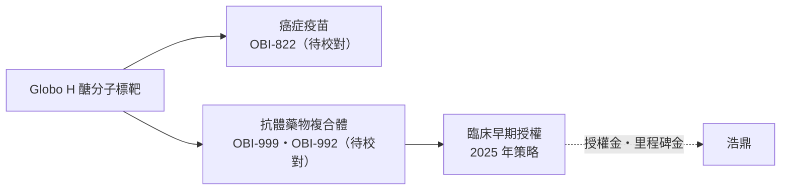
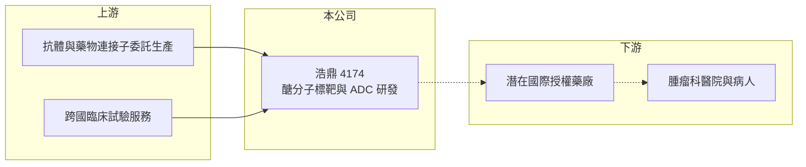

# 4174 浩鼎

> 上櫃｜[[產業索引-生技醫療業|生技醫療業]]｜上市（櫃）日期 2015/03/23

# 第一章：企業模式與商業藍圖

> [!info] 撰寫說明
> 精簡版，由 Claude 依公開資料整理，架構比照 [[2330台積電]] 的四章研究，資料截至 2026-10-08。來源：Goodinfo 年度經營績效、ETtoday 財經雲 2025 年 9 月減資報導（累積虧損、減資比例、ADC 策略）、櫃買中心開放資料（基本資料、2026 年第二季財報）。研發管線代號與歷史臨床結果多憑記憶整理，已標「待校對」。#待校對

台灣生技股中，浩鼎是市場關注度最高、波動也最大的新藥公司之一。本章說明台灣浩鼎生技（股票代號：4174，以下簡稱浩鼎）的研發策略與轉型方向。

- **核心業務：** 浩鼎 2002 年設立，2015 年起在櫃買中心交易，董事長為梁賡義。公司以癌細胞表面的醣分子 Globo H 為核心標靶，依記憶，最早的主力是[[癌症疫苗]] OBI-822（adagloxad simolenin），用於乳癌，後續延伸到以 Globo H 為標靶的[[抗體藥物複合體]] OBI-999，以及 TROP2 標靶的 OBI-992（待校對）。
- **營收結構：** 營收極小，2021 至 2025 年每年只有約 0.05 億至 0.63 億元，[[毛利率]]為負，代表目前沒有成熟的商業化產品。公司價值完全取決於研發管線的臨床結果與授權交易。
- **營運據點：** 研發總部在台北，臨床試驗在美國、台灣與亞洲多國進行（待校對）。2026 年第二季非控制權益約 7.07 億元，代表合併報表中有其他股東參與持股的子公司（名稱未查得）。
- **長期方向：** 依 2025 年 9 月報導，公司表示未來將專注於次世代抗體藥物複合體的開發，並積極尋求臨床早期授權與全球合作。也就是從「自己做到三期、自己上市」的路線，轉為「早期授權給大藥廠」的路線，以降低資金需求與單一臨床失敗的衝擊。

# 第二章：護城河深度與競爭優勢

新藥公司的護城河是專利、臨床數據與平台技術。本章分析浩鼎的競爭位置。

- **競爭優勢：** 浩鼎在醣分子標靶累積二十年以上的研發經驗與專利，是全球少數深入研究 Globo H 的團隊。抗體藥物複合體是近年全球授權交易最熱門的領域之一，若早期臨床數據亮眼，有機會以較早的階段換取[[授權金]]，這是公司轉型策略的核心依據。
- **主要對手：** 抗體藥物複合體領域有第一三共、阿斯特捷利康、輝瑞等國際大廠，以及大量中國生技公司以快速開發與低價授權搶占市場。TROP2 標靶已有多個上市藥物，後進者需要證明更好的療效或安全性。台灣同業 [[4168醣聯]] 同樣以醣分子為標靶，是最接近的比較對象。
- **觀察重點：** 長期要看是否真正簽下國際授權交易、授權條件（簽約金與里程碑金規模），以及研發支出能否在授權後由合作夥伴分擔。依記憶，OBI-822 在 2016 年的二／三期試驗未達主要指標，曾造成股價大幅波動（待校對），說明單一臨床結果對公司價值的影響極大。

# 第三章：財務體質與盈利規模

資料日期：2026-10-08，表格是撰寫當時的快照；最新月營收、毛利率、累計 EPS 由自動排程寫在本筆記的屬性欄位（月營收、毛利率、累計EPS 等）。#待校對

研發型新藥公司的財務重點是現金消耗、累積虧損與股本變化。本章用五年數據說明。

| 年度 | 營收（新台幣） | [[毛利率]] | [[營業利益率]] | EPS（元） | [[ROE]] |
|---|---|---|---|---|---|
| 2021 | 0.19 億 | -136% | -9,141% | -7.69 | -39.5% |
| 2022 | 0.05 億 | -852% | -45,060% | -7.27 | -38.0% |
| 2023 | 0.42 億 | -177% | -5,030% | -4.57 | -22.8% |
| 2024 | 0.63 億 | -122% | -3,784% | -9.89 | -51.0% |
| 2025 | 0.59 億 | -132% | -3,703% | -15.61 | -59.8% |

資料來源：Goodinfo 年度經營績效（合併報表）。2025 年減資五成後股數減半，EPS 數字因此放大，與前幾年不能直接比較。2026 年上半年（櫃買中心資料）營收約 0.21 億元、營業損失約 6.65 億元、歸屬母公司淨損約 6.38 億元、EPS -4.85 元。

- **營收規模：** 營收極小，營業利益率呈現數千到數萬個百分點的負值，不具比較意義。
- **獲利：** 以 2025 年營收 0.59 億元乘營業利益率 -3,703% 推算，年度營業損失約 21.8 億元（推算）；2026 年上半年營業損失約 6.65 億元，年化約 13 億元，支出較 2025 年收斂。近五年平均 ROE 約 -42.2%（推算）。
- **財務特色：** 依 2025 年 9 月報導，截至 2024 年底累積虧損約 78.79 億元，董事會決議[[減資彌補虧損]] 50%、銷除約 1.32 億股以彌補虧損，減資後實收資本額約 13.16 億元。減資只是會計上的彌補，不會增加現金。2026 年第二季流動資產約 8.4 億元、歸屬母公司權益約 14.9 億元、資本公積約 94.4 億元，代表過去累積募集的資金規模龐大。以目前的現金消耗速度推算，流動資產不足以支應兩年的營運（推算），未來仍需要增資或授權收入。無現金股利。

**[[ROIC]] 與 [[WACC]]：** 以 2025 年營業損失約 21.8 億元計（虧損不計稅盾），投入資本以權益總計約 21.9 億元加上非流動負債約 2.7 億元，約 24.6 億元，ROIC 約 -89%（推算）。WACC 以台灣 10 年期公債 1.75%、市場風險溢酬 6%、新藥股常見 β 1.3（假設）計，權益成本約 9.55%，負債比重低，WACC 約 9%（推算）。ROIC 大幅為負，是尚無商業化產品的新藥公司的常態，代表股東資本持續被研發消耗；能否轉為創造價值，完全取決於未來的授權交易與藥物上市，不能用現有財報評價。

# 第四章：總體風險與地緣政治

高投入、尚未商業化的新藥公司，風險集中在臨床、資金與稀釋。本章整理浩鼎的長期風險。

- **產業週期：** 生技資金環境與全球利率、授權市場熱度高度相關。抗體藥物複合體目前是授權熱門領域，但若市場轉冷，授權條件可能變差，公司籌資也會更困難。
- **營運風險：** 臨床試驗失敗或延遲會直接打擊公司價值；過去多年的大額虧損已需要減資彌補，未來若持續虧損，仍可能需要增資，對股東造成稀釋。
- **其他風險：** 全球抗體藥物複合體競爭激烈，中國藥廠以更快速度推進同類藥物，壓縮授權價格；海外臨床費用以美元計價，匯率波動會影響支出。

# 專有名詞解析

## 金融

- **[[減資彌補虧損]]**：公司以減少股本的方式沖銷帳上累積虧損，股數變少但現金不變，屬會計上的整理。

## 產業

- **[[抗體藥物複合體]]**：ADC，把抗體與細胞毒性藥物以連接子結合，讓藥物精準送到癌細胞的治療方式。
- **[[授權金]]**：藥廠將藥物開發或銷售權利授權給其他公司時收取的簽約金與里程碑金，通常屬一次性收入。
- **[[癌症疫苗]]**：刺激病人自身免疫系統辨認並攻擊癌細胞的治療性疫苗，與預防性疫苗不同。

# 核心供應鏈

- 上游：抗體與藥物連接子的委託生產廠、跨國臨床試驗服務機構（個別廠商未查得）。
- 下游／客戶：潛在的國際授權藥廠（2025 年報導未提及已完成的交易）。
- 同業：[[4168醣聯]]、[[6446藥華藥]]、[[4147中裕]]、[[6576逸達]]、[[4162智擎]]。

## 最新新聞
<!-- news:start（自動產生，請勿手動編輯此範圍） -->
- 2026-10-08 🏛️ 重訊 21:07｜公告本公司放棄參與鼎晉子公司115年現金增資發行新股轉予 本公司全體股東認購一案，訂定其他利益基準日｜[觀測站](https://mops.twse.com.tw/mops/#/web/t05st01)
- 2026-10-05 🏛️ 重訊 17:50｜本公司有價證券於集中交易市場達公布注意交易資訊標準，故公告 相關訊息，以利投資人區別暸解｜[觀測站](https://mops.twse.com.tw/mops/#/web/t05st01)

完整紀錄：[[4174浩鼎 新聞]]
<!-- news:end -->

## 相關連結
- [公開資訊觀測站](https://mopsov.twse.com.tw/mops/web/t05st03?step=1&firstin=1&co_id=4174)
- [Goodinfo](https://goodinfo.tw/tw/StockDetail.asp?STOCK_ID=4174)
- [Yahoo 股市](https://tw.stock.yahoo.com/quote/4174)
- [鉅亨網新聞](https://www.cnyes.com/twstock/4174/news)
