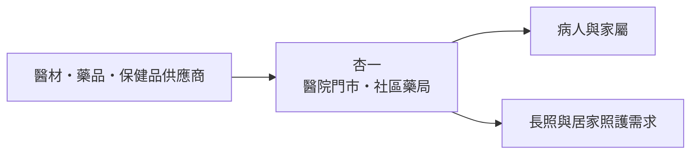
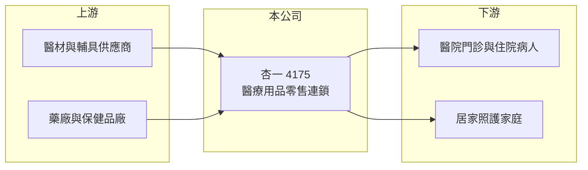

# 4175 杏一

> 上櫃｜[[產業索引-生技醫療業|生技醫療業]]｜上市（櫃）日期 2014/04/23

# 第一章：企業模式與商業藍圖

> [!info] 撰寫說明
> 精簡版，由 Claude 依公開資料整理，架構比照 [[2330台積電]] 的四章研究，資料截至 2026-10-08。來源：Goodinfo 年度經營績效、新聞標題（2022 年營收 72 億元與展店目標）、櫃買中心開放資料（基本資料、2026 年第二季財報、本益比殖利率）。門市型態、集團關係與海外據點多憑記憶整理，已標「待校對」。#待校對

醫療用品零售的核心，是把門市開在病人與家屬最需要的地方。本章說明杏一醫療用品（股票代號：4175，以下簡稱杏一）以醫院門市為基礎的零售通路模式。

- **核心業務：** 杏一 1992 年設立，2014 年起在櫃買中心交易，董事長為陳麗如。依記憶，公司經營醫療用品與藥品的零售連鎖，門市多設在醫院內或醫院周邊，販售輔具、護理耗材、營養品、[[保健食品]]與藥品，並經營社區藥局（待校對）。依記憶，杏一與 [[4104佳醫]] 集團有股權關係（待校對）。
- **營收結構：** 產品別與通路別比重未查得。[[毛利率]]長期在 29% 至 33% 之間，接近藥妝與專門零售業的水準，代表杏一除了賣藥，也靠自有品牌與高毛利的照護用品拉高獲利。
- **營運據點：** 以台灣為主要市場，依記憶在中國也有門市布局（待校對）。依新聞標題，2022 年營收約 72 億元，並以每年新增約一成門市為目標。2026 年第二季非流動資產約 49.9 億元、非流動負債約 29.2 億元，推估多為門市租約依 [[IFRS 16]] 認列的使用權資產與[[租賃負債]]（推估）。
- **長期方向：** 人口老化讓居家照護、輔具與營養品需求長期成長，醫院門市則受惠於門診與住院人次。杏一的長期策略是持續展店擴大規模，並提高高毛利商品比重，讓營業利益率由目前的 2% 至 3% 往上提升。

# 第二章：護城河深度與競爭優勢

零售通路的護城河來自店點位置、規模採購與品牌信任。本章分析杏一的競爭位置。

- **競爭優勢：** 醫院內的門市位置有限，通常需透過醫院招標或長期租約取得，一旦取得就能接觸穩定的門診與住院人流，這是一般藥局難以複製的據點優勢。全台連鎖的規模讓杏一在向供應商採購時有議價空間，也能發展自有品牌。
- **主要對手：** 連鎖藥局 [[6469大樹]]、其他藥局與醫療用品店，以及電商平台。大樹以社區藥局快速展店，在保健品與嬰幼兒用品上與杏一正面競爭；電商則以價格與便利性搶走標準化商品的銷售。
- **觀察重點：** 營業利益率長期只有 1.4% 至 3.2%，代表零售的租金與人事成本吃掉大部分毛利。長期要看展店後的單店營收能否提升，以及高毛利商品比重能否持續拉高。

# 第三章：財務體質與盈利規模

資料日期：2026-10-08，表格是撰寫當時的快照；最新月營收、毛利率、累計 EPS 由自動排程寫在本筆記的屬性欄位（月營收、毛利率、累計EPS 等）。#待校對

本章用五年數據檢視杏一的規模成長與獲利品質。

| 年度 | 營收（新台幣） | [[毛利率]] | [[營業利益率]] | EPS（元） | [[ROE]] |
|---|---|---|---|---|---|
| 2021 | 65.4 億 | 29.5% | 1.73% | 1.97 | 5.84% |
| 2022 | 72.2 億 | 30.5% | 3.15% | 4.83 | 14.9% |
| 2023 | 74.5 億 | 30.5% | 1.42% | 1.13 | 3.61% |
| 2024 | 77.3 億 | 30.8% | 1.59% | 1.65 | 4.80% |
| 2025 | 80.1 億 | 32.5% | 2.63% | 3.68 | 10.3% |

資料來源：Goodinfo 年度經營績效（合併報表）。2026 年上半年（櫃買中心資料）營收約 39.6 億元、毛利率約 33.6%、營業利益率約 2.6%、EPS 1.82 元。

- **營收規模：** 2021 至 2025 年營收由 65.4 億元增加到 80.1 億元，年複合成長率約 5.2%（推算），成長穩定，主要來自展店。2023 年股本由 3.52 億元增加到 4.22 億元，每股數字因此被稀釋。
- **獲利：** 2022 年 EPS 4.83 元是近年高點，推估與疫情期間防疫用品需求有關（推估）；2023 年回落後逐步回升，2025 年 EPS 3.68 元。近五年平均 ROE 約 7.9%（推算）。毛利率由 29.5% 逐年提升到 32.5%，是獲利改善的主要來源。
- **財務特色：** 2026 年第二季權益約 15.3 億元、負債約 57.8 億元，帳面負債比近八成，但主要是租賃負債與應付帳款，而非銀行借款（推估）。櫃買中心資料最近一次現金股利 3 元，以 2025 年 EPS 3.68 元計配息率約 82%（推算），屬於高配息的零售股。

**[[ROIC]] 與 [[WACC]]：** 以 2025 年計，營業利益約 2.11 億元（營收 80.1 億元乘營業利益率 2.63%），稅後約 1.69 億元。若把非流動負債約 29.2 億元（推估多為租賃負債）視為有息負債，投入資本約 44.5 億元，ROIC 約 3.8%（推算）；若只以權益約 15.3 億元計，ROIC 約 11%（推算）。WACC 以台灣 10 年期公債 1.75%、市場風險溢酬 6%、零售業常見 β 0.6（假設）計，權益成本約 5.35%；把租賃負債視為負債、成本假設 2.5%（稅後約 2.0%），權重約三分之二，WACC 約 3.1%（推算），以全權益計則約 5.35%。不論哪一種口徑，ROIC 與 WACC 大致相當或略高，代表杏一勉強創造價值，關鍵在於營業利益率能否從 2% 多往 4% 以上提升。

# 第四章：總體風險與地緣政治

零售通路的風險來自租金、人力與競爭。本章整理杏一的長期風險。

- **產業週期：** 醫療用品需求與景氣關聯低，但保健品與自費商品會受消費力影響；疫情等特殊事件會造成短期需求暴增，之後回落。
- **營運風險：** 醫院門市的租約到期後需要重新招標，失去重要醫院據點會直接影響營收；租金與基本工資上升會壓縮本就偏薄的營業利益率。
- **其他風險：** [[健保藥價]]與醫材給付政策影響藥品銷售的價差；電商與連鎖藥局的價格競爭；海外門市的經營與匯率風險（待校對）。

# 專有名詞解析

## 金融

- **[[IFRS 16]]**：國際財務報導準則第 16 號「租賃」，規定承租人把長期租約認列為使用權資產與租賃負債。

## 產業

- **[[租賃負債]]**：企業承租店面或設備時，依會計準則把未來租金折現認列的負債，零售與餐飲業金額通常很大。
- **[[健保藥價]]**：全民健保給付藥品的價格，由主管機關核定並定期調整，直接影響國內藥廠的營收與毛利。
- **[[保健食品]]**：以補充營養或維持健康為訴求的食品，不屬藥品，進入門檻低、品牌競爭激烈。

# 核心供應鏈

- 上游：醫材、輔具、藥品與保健品供應商，例如 [[4106雃博]]（輔具與醫材，是否為供應商未查得）。
- 下游／客戶：醫院門診與住院病人、家屬及居家照護家庭。
- 同業：[[6469大樹]]、[[4104佳醫]]、[[4164承業醫]]。

## 最新新聞
<!-- news:start（自動產生，請勿手動編輯此範圍） -->
- 2026-10-07 🏛️ 重訊 23:47｜本公司接獲消費者反映疑似個資外洩事件｜[觀測站](https://mops.twse.com.tw/mops/#/web/t05st01)

完整紀錄：[[4175杏一 新聞]]
<!-- news:end -->

## 相關連結
- [公開資訊觀測站](https://mopsov.twse.com.tw/mops/web/t05st03?step=1&firstin=1&co_id=4175)
- [Goodinfo](https://goodinfo.tw/tw/StockDetail.asp?STOCK_ID=4175)
- [Yahoo 股市](https://tw.stock.yahoo.com/quote/4175)
- [鉅亨網新聞](https://www.cnyes.com/twstock/4175/news)
