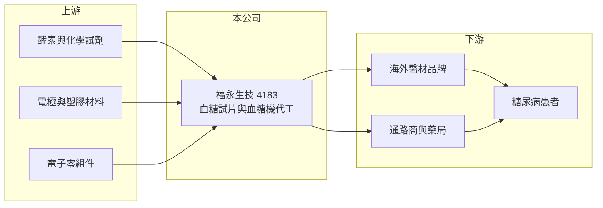

# 4183 福永生技

> 上櫃｜[[產業索引-生技醫療業|生技醫療業]]｜上市（櫃）日期 2017/03/09

# 第一章：企業模式與商業藍圖

> [!info] 撰寫說明
> 精簡版，由 Claude 依公開資料整理，架構比照 [[2330台積電]] 的四章研究，資料截至 2026-10-08。來源：Goodinfo 年度經營績效頁（2019 至 2025 年）、櫃買中心開放資料（基本資料、2026 年第二季資產負債與綜合損益、每月營收）、nStock 公司簡介；客戶與產品細節憑既有知識撰寫，已標「待校對」。公開資料有限。#待校對

福永生物科技（股票代號：4183，以下簡稱福永）是一家位於新竹科學園區的醫療器材製造商，主力是血糖量測系統。理解福永的關鍵，是把它看成「替品牌商生產血糖試片與血糖機的代工廠」，而不是自有品牌的醫療器材公司。

- **核心業務：** 福永 2002 年成立，2009 年遷入新竹科學工業園區，2017 年 3 月上櫃（nStock、櫃買中心開放資料）。營業項目為研究、開發、製造與銷售糖尿病生化量測系統，也就是[[血糖機]]與配套試片，另有助眠相關感測器與肝硬化檢測系統等開發項目。血糖量測是「機器便宜、試片長期消耗」的耗材型生意，試片的重複購買才是主要獲利來源。
- **營收結構：** 產品別與地區別營收比重本次未查得。依既有知識，福永以 [[OEM]]／[[ODM]] 代工為主，客戶多為海外醫材品牌與通路商，產品大部分外銷（推估）。#待校對 代工模式代表營收高度依賴少數客戶的訂單節奏，單一客戶的庫存調整就可能讓全年營收大幅波動。
- **營運據點：** 生產與研發集中在新竹科學園區。血糖試片屬於需要精密塗佈與品質管控的醫材，工廠須維持 ISO 13485 等醫材品質系統，這是代工廠能長期接單的基本門檻。
- **長期方向：** 營收規模長期停在 4.5 億至 5 億元，2025 年雖然營收回到 5.00 億元，毛利率卻降到 17.4%，2026 年上半年營收更衰退至 1.69 億元（櫃買中心資料）。公司要擺脫低價代工的困境，需要靠新的感測產品或更高附加價值的客戶，但這些新產品線的量產進度本次未查得。

# 第二章：護城河深度與競爭優勢

福永的競爭力來自醫材製造的認證與量產經驗，但在血糖量測這個價格競爭激烈的市場裡，代工廠的議價能力有限。

- **競爭優勢：** 血糖試片需要酵素配方、電極印刷與校正技術，加上各國醫材許可證的取得與維持，新進者很難短期進入。代工客戶一旦完成產品驗證與法規登記，更換代工廠的成本不低，這讓既有客戶關係具有一定黏著度。
- **主要對手：** 台灣同樣做血糖量測的廠商有 [[4736泰博]]、[[4737華廣]]、[[1733五鼎]]，國際上則有 Roche、Abbott 等大廠，以及中國與印度的低價業者。#待校對 福永的規模在台灣同業中偏小，在報價與研發投入上都處於相對弱勢。
- **結構性挑戰：** [[連續血糖監測]]（CGM）正逐步取代傳統指尖採血的血糖機，尤其在歐美成熟市場。傳統試片的需求成長因此受限，價格壓力也更大，這是 2024 至 2025 年毛利率持續下滑的可能原因之一（推估）。
- **觀察重點：** 第一，毛利率能否從 2025 年的 17.4% 回到過去 23% 至 28% 的區間；第二，新的感測產品能否形成營收；第三，2026 年營收衰退是否只是客戶庫存調整，或是訂單流失。

# 第三章：財務體質與盈利規模

資料日期：2026-10-08，表格是撰寫當時的快照；最新月營收、毛利率、累計 EPS 由自動排程寫在本筆記的屬性欄位（月營收、毛利率、累計EPS 等）。#待校對

福永的財務特徵是營收規模穩定但很小，獲利率逐年變薄，2025 年轉為營業虧損。

| 年度 | 營收（新台幣） | [[毛利率]] | [[營業利益率]] | EPS（元） | [[ROE]] |
|---|---|---|---|---|---|
| 2021 | 4.80 億 | 25.1% | 6.88% | 0.78 | 6.13% |
| 2022 | 4.63 億 | 23.2% | 3.46% | 1.07 | 8.35% |
| 2023 | 4.70 億 | 24.6% | 5.30% | 0.88 | 6.83% |
| 2024 | 4.51 億 | 21.3% | 1.20% | 0.73 | 5.67% |
| 2025 | 5.00 億 | 17.4% | -1.82% | -0.33 | -2.69% |
| 2026 上半年 | 1.69 億 | 17.4% | -9.4% | -0.58 | 未查得 |

- **營收規模：** 2020 至 2025 年營收年複合成長率約 0.9%（推算），幾乎沒有成長。2026 年 1 至 8 月累計營收較去年同期衰退約 31%（櫃買中心每月營收），顯示訂單出現明顯缺口。
- **獲利：** 2021 至 2025 年平均 ROE 約 4.9%（推算），毛利率由 2020 年的 28.2% 一路降到 2025 年的 17.4%。2022 至 2024 年 EPS 高於營業利益所隱含的水準，推估有業外收益挹注（推估）。
- **財務特色：** 2026 年第二季底股本 2.38 億元、權益總計 2.67 億元、總負債 2.36 億元（櫃買中心資料）。2025 年度虧損，未配發現金股利（櫃買中心本益比殖利率資料）。

**[[ROIC]] 與 [[WACC]]：**
- ROIC（推算）：2025 年營業利益約 5.00 億元 × -1.82% ≈ -0.09 億元。投入資本以權益 2.67 億元加上推估有息負債約 1.0 億元（假設，開放資料只有總負債），合計約 3.7 億元，ROIC 約 -2.5%（推算）。2026 年上半年營業虧損 0.16 億元，年化後 ROIC 約 -8.6%（推算）。2021 至 2023 年營業利益率 3% 至 7% 時，ROIC 約在 4% 至 8%（推算）。
- WACC（推算）：無風險利率 1.75%、市場風險溢酬 6%，β 取小型醫材代工廠常見值 0.8（假設），股東權益成本約 6.6%；負債成本 2.5%、稅後 2.0%，負債占投入資本約 27%，WACC 約 5.3%（推算）。
- 結論：2021 至 2023 年 ROIC 大致與 WACC 打平，2024 年後明顯低於資金成本。長期來看，福永目前沒有持續創造價值的能力，關鍵在於能否恢復毛利率。

# 第四章：總體風險與地緣政治

福永的風險集中在客戶集中、產品世代交替與規模太小三個方面。

- **產業週期：** 血糖試片是長期消耗品，終端需求穩定，但代工廠面對的是品牌客戶的庫存循環。客戶一旦調整庫存或轉單，代工廠的營收就會像 2026 年上半年那樣出現大幅下滑。
- **營運風險：** 營收規模約 5 億元，固定成本攤提壓力大，產能利用率下降時毛利率會快速惡化。若營業虧損持續，公司需要動用資本或借款，對小股東權益是稀釋壓力。
- **技術替代風險：** 連續血糖監測普及後，傳統血糖機的市場會逐步萎縮，尤其是價格較高的歐美市場。福永若不能跟上新一代感測技術，長期可能只剩下價格競爭的低階市場。
- **其他風險：** 產品以外銷為主（推估），新台幣升值會壓縮毛利；各國醫材法規（例如歐盟 [[CE MDR]]）趨嚴，也會增加取證與維持成本。

# 專有名詞解析

## 產業

- **[[血糖機]]**：以指尖採血搭配試片量測血糖的家用醫材，機器價格低，主要獲利來自長期消耗的試片。
- **[[連續血糖監測]]**：在皮下植入感測器、連續數天自動量測血糖的醫材（CGM），正逐步取代指尖採血。
- **[[OEM]]**：代工廠依客戶提供的設計生產，產品掛客戶品牌銷售。
- **[[ODM]]**：代工廠自行設計並生產，產品掛客戶品牌銷售，附加價值高於單純 OEM。
- **[[CE MDR]]**：歐盟醫療器材法規，2021 年起取代舊指令，對臨床證據與上市後監督的要求更嚴格。

# 核心供應鏈

- 上游：試片用酵素與化學試劑、電極與塑膠材料、血糖機電子零組件供應商。
- 下游／客戶：海外醫材品牌與通路商（推估），最終使用者為糖尿病患者。#待校對
- 同業：[[4736泰博]]、[[4737華廣]]、[[1733五鼎]]，以及 Roche、Abbott 等國際血糖量測品牌。

## 最新新聞
<!-- news:start -->
<!-- news:end -->

## 相關連結
- [公開資訊觀測站](https://mopsov.twse.com.tw/mops/web/t05st03?step=1&firstin=1&co_id=4183)
- [Goodinfo](https://goodinfo.tw/tw/StockDetail.asp?STOCK_ID=4183)
- [Yahoo 股市](https://tw.stock.yahoo.com/quote/4183)
- [鉅亨網新聞](https://www.cnyes.com/twstock/4183/news)
