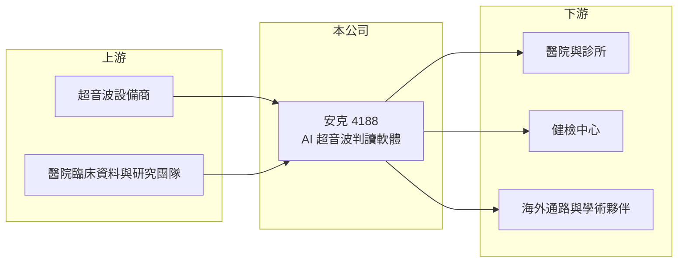

# 4188 安克

> 上櫃｜[[產業索引-生技醫療業|生技醫療業]]｜上市（櫃）日期 2015/03/24

# 第一章：企業模式與商業藍圖

> [!info] 撰寫說明
> 精簡版，由 Claude 依公開資料整理，架構比照 [[2330台積電]] 的四章研究，資料截至 2026-10-08。來源：Goodinfo 年度經營績效頁（2019 至 2025 年）、櫃買中心開放資料（基本資料、2026 年第二季資產負債與綜合損益、每月營收）、工商時報 2025 年 2 月報導；公司沿革細節憑既有知識撰寫，已標「待校對」。公開資料有限。#待校對

安克生醫（股票代號：4188，以下簡稱安克）是一家開發 AI 超音波影像[[AI 輔助診斷軟體]]的醫材公司。它的商業模式更接近「醫療軟體新創」，營收很小、長期虧損，價值主要建立在產品取證、醫院採用與健保給付的進度上。

- **核心業務：** 安克 2008 年成立，2015 年 3 月上櫃（櫃買中心開放資料）。主力產品「安克甲狀偵」是甲狀腺超音波輔助判讀軟體，協助醫師在不開刀的情況下判斷甲狀腺結節是良性或惡性；「安克呼止偵」則用超音波檢查上呼吸道，約十分鐘完成[[睡眠呼吸中止症]]篩檢（工商時報 2025 年 2 月）。公司技術源自台大醫院的研究團隊（待校對）。
- **營收結構：** 營收來源比重未揭露。安克甲狀偵已取得台灣 TFDA、美國 [[FDA]]、歐盟 CE 與中國上市許可，並在全球 200 多家醫院推廣（工商時報 2025 年 2 月）。不過 2025 年全年營收只有約 3,000 萬元（Goodinfo），代表取證並沒有直接轉換成規模化的銷售。
- **營運據點：** 研發與總部在台灣，海外以合作夥伴與學術機構推廣，例如與美國太平洋大學合作睡眠牙科應用、與史丹佛睡眠醫學中心的研究專案（工商時報 2025 年 2 月）。
- **長期方向：** 公司的關鍵里程碑是安克甲狀偵能否納入台灣[[健保給付]]，2025 年 2 月時仍在等待共擬會議（工商時報）。健保給付會決定醫院是否願意常規使用，是軟體醫材能否形成穩定收入的分水嶺。2025 年公司辦理[[私募]] 1,500 萬股，用於營運資金、新產品與臨床測試（工商時報 2025 年 2 月）。

# 第二章：護城河深度與競爭優勢

安克的優勢在於較早取得多國許可的 AI 醫材，但 AI 影像判讀的門檻正在快速下降，護城河仍待證明。

- **競爭優勢：** 醫療 AI 軟體必須通過臨床驗證與各國醫材審查，安克甲狀偵同時擁有台、美、歐、中四地許可，這在台灣同業中並不常見。超音波判讀依賴醫師經驗，若軟體能降低不必要的穿刺或手術，對醫院與保險支付方都有價值。
- **主要對手：** 國際醫學影像大廠（GE、Philips、Siemens 等）把 AI 功能直接整合進超音波機器，對獨立軟體公司形成壓力；中國與韓國也有多家 AI 影像新創。#待校對 安克規模小、行銷資源有限，必須依靠設備商或通路合作才能擴大市場。
- **商業化難題：** 醫院採用新軟體需要付費機制，沒有健保或保險給付時，醫院多半只在研究或自費健檢中使用。這解釋了為何安克取證多年，營收仍停留在每年數千萬元。
- **觀察重點：** 第一，安克甲狀偵何時正式納入健保給付；第二，能否與超音波設備大廠簽下授權或整合合約；第三，安克呼止偵能否在睡眠醫學與牙科市場找到付費模式。

# 第三章：財務體質與盈利規模

資料日期：2026-10-08，表格是撰寫當時的快照；最新月營收、毛利率、累計 EPS 由自動排程寫在本筆記的屬性欄位（月營收、毛利率、累計EPS 等）。#待校對

安克仍處於研發與市場開拓期，財務數字的重點是「每年燒多少錢、手上還有多少錢」，而不是獲利率。

| 年度 | 營收（新台幣） | [[毛利率]] | [[營業利益率]] | EPS（元） | [[ROE]] |
|---|---|---|---|---|---|
| 2021 | 0.86 億 | 70.7% | -42.9% | -0.48 | -4.58% |
| 2022 | 0.62 億 | 61.7% | -104% | -1.01 | -9.89% |
| 2023 | 0.65 億 | 62.9% | -82.7% | -0.85 | -8.65% |
| 2024 | 0.53 億 | 62.0% | -122% | -0.88 | -9.26% |
| 2025 | 0.30 億 | 32.9% | -289% | -0.88 | -11.3% |
| 2026 上半年 | 0.13 億 | 42.6% | -311% | -0.45 | 未查得 |

- **營收規模：** 2020 至 2025 年營收年複合成長率約 -14%（推算），營收從 2021 年的 0.86 億元降到 2025 年的 0.30 億元。對一家軟體醫材公司而言，營收連年下滑代表商業化遇到瓶頸。
- **獲利：** 每年均為虧損，2021 至 2025 年平均 ROE 約 -8.7%（推算）。2025 年營業虧損約 0.87 億元（推算），主要是研發與推廣費用，毛利率也從 60% 以上降到 32.9%。
- **財務特色：** 2026 年第二季底總資產 6.17 億元、總負債僅 0.29 億元，權益總計 5.88 億元，其中母公司業主權益 5.16 億元（櫃買中心資料）。幾乎沒有負債，以目前每年約 0.7 億至 0.9 億元的虧損速度，資金可支應數年，但長期仍需要增資或授權收入。

**[[ROIC]] 與 [[WACC]]：**
- ROIC（推算）：2025 年營業利益約 0.30 億元 × -289% ≈ -0.87 億元，虧損不計稅。投入資本以權益 5.88 億元計（有息負債趨近於零，假設為 0），ROIC 約 -15%（推算）。ROIC 為負代表本業還在消耗資本，這是研發型醫材公司在商業化之前的常態，但也意味股東承擔較高風險。
- WACC（推算）：無風險利率 1.75%、市場風險溢酬 6%，β 取生技新創常見值 1.2（假設），股東權益成本約 9.0%；幾乎無負債，WACC 約 9%（推算）。
- 結論：ROIC 遠低於 WACC，目前沒有創造價值。安克的投資價值取決於未來健保給付或授權能否讓營收放大數倍，屬於高不確定性的選擇權型標的。

# 第四章：總體風險與地緣政治

安克的風險主要來自商業化進度、資金消耗與技術競爭。

- **產業週期：** 醫療 AI 的需求不受景氣影響太大，但醫院預算與健保給付政策決定採用速度。給付審查時程不可控，延後一年就代表多燒一年的錢。
- **營運風險：** 營收規模太小，研發與行銷費用相對固定，營收若無法放大，虧損會持續。2025 年以私募籌資，未來若再增資，會稀釋既有股東。
- **技術風險：** AI 影像判讀模型的開發門檻快速下降，大型設備商內建 AI 功能後，獨立軟體的差異化可能被削弱。軟體醫材每次更新也需要重新送審，維持多國許可的成本不低。
- **其他風險：** 海外市場依賴合作夥伴推廣，各國醫材法規與資料隱私規範不同；中國市場另有政策與付款風險。

# 專有名詞解析

## 應用

- **[[睡眠呼吸中止症]]**：睡眠時上呼吸道反覆塌陷造成呼吸暫停的疾病，傳統須在睡眠中心過夜檢查。

## 金融

- **[[私募]]**：公司向特定對象發行新股籌資，價格可低於市價，但股票有三年轉讓限制。

## 產業

- **[[FDA]]**：美國食品藥物管理局，負責藥品與醫療器材的上市審查，取得許可才能在美國銷售。
- **[[AI 輔助診斷軟體]]**：以人工智慧分析醫學影像、協助醫師判讀的軟體醫材，須依醫療器材法規取得許可。
- **[[健保給付]]**：醫療項目納入全民健保支付，醫院使用時可向健保申請費用，是醫材普及的關鍵。

# 核心供應鏈

- 上游：超音波設備（軟體搭配的影像來源）、醫院臨床資料與合作研究團隊。
- 下游／客戶：醫院、診所、健檢中心，以及海外合作通路與學術機構。
- 同業：國際影像設備大廠內建的 AI 功能、各國 AI 醫學影像新創。#待校對

## 最新新聞
<!-- news:start -->
<!-- news:end -->

## 相關連結
- [公開資訊觀測站](https://mopsov.twse.com.tw/mops/web/t05st03?step=1&firstin=1&co_id=4188)
- [Goodinfo](https://goodinfo.tw/tw/StockDetail.asp?STOCK_ID=4188)
- [Yahoo 股市](https://tw.stock.yahoo.com/quote/4188)
- [鉅亨網新聞](https://www.cnyes.com/twstock/4188/news)
