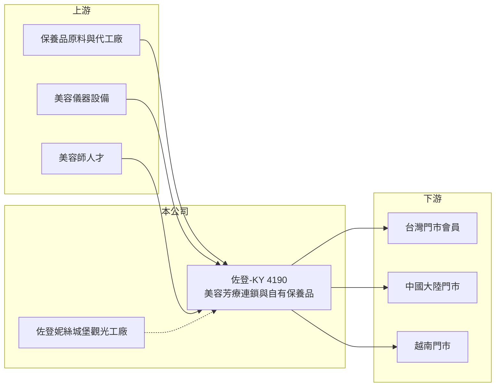

# 4190 佐登-KY

> 上市｜[[產業索引-生技醫療業|生技醫療業]]｜上市（櫃）日期 2015/10/21

# 第一章：企業模式與商業藍圖

> [!info] 撰寫說明
> 精簡版，由 Claude 依公開資料整理，架構比照 [[2330台積電]] 的四章研究，資料截至 2026-10-08。來源：Goodinfo 年度經營績效頁（2019 至 2025 年）、證交所開放資料（基本資料、2026 年第二季資產負債、綜合損益與營益分析、股利）、工商時報 2025 年 10 月報導；品牌沿革憑既有知識撰寫，已標「待校對」。#待校對

佐登妮絲集團（股票代號：4190，以下簡稱佐登）是以台灣為基地、在兩岸與越南經營生活美容與芳療連鎖的集團，註冊地在開曼群島。佐登的生意本質是「會員制的服務業加上自有保養品」，獲利取決於門市效率、客單價與會員回流率。

- **核心業務：** 佐登 2010 年在開曼設立控股公司，2015 年 10 月在台灣上市，董事長為陳正雄、集團總經理為陳佳琦（證交所開放資料）。集團經營生活美容與芳療門市、自有保養品，以及位於台中的[[觀光工廠]]「佐登妮絲城堡」（工商時報 2025 年 10 月）。品牌起源可追溯至 1980 年代的台中美容事業（待校對）。
- **營收結構：** 地區別營收比重本次未查得。毛利率長期在 60% 至 77%（Goodinfo），反映營收主要來自美容服務與自有保養品，而不是低毛利的代理商品。服務業的成本主要是美容師人力與店租，屬於費用而非銷貨成本，所以高毛利不等於高獲利。
- **營運據點：** 台灣約 120 家門市，中國大陸自 2024 年起整併門市，越南則以 3 年拓展到 150 家店為目標（工商時報 2025 年 10 月）。觀光工廠每年約有 1.2 億元的固定折舊攤提，是集團虧損的主要來源之一（同上）。
- **長期方向：** 公司規劃從 2026 年起把部分[[加盟]]店轉為與美容師合夥的模式，若順利，未來台灣半數門市可望轉為共享空間；同時推動門市精品化、觀光工廠轉型為類商場模式，以及設立芳療學院（工商時報 2025 年 10 月）。這代表佐登正從「開店擴張」轉向「提高單店效率與客單價」。

# 第二章：護城河深度與競爭優勢

佐登的護城河是品牌、會員基礎與自有產品，但美容服務業的進入門檻低，規模擴張受限於人才。

- **競爭優勢：** 長期經營累積的品牌知名度與[[會員經濟]]是主要資產，會員預付的課程款提供穩定的現金流，回流消費也降低獲客成本。自有保養品可以在門市搭配服務銷售，毛利遠高於代理商品，2025 年其「肌光緊緻系列」獲得 Monde Selection 金獎（工商時報 2025 年 10 月）。
- **主要對手：** 生活美容市場高度分散，對手包括其他連鎖美容品牌、大量獨立工作室，以及醫美診所。#待校對 醫美療程的普及，使部分高消費客群從生活美容轉向醫美，壓縮傳統美容 SPA 的成長空間。
- **人才是關鍵限制：** 美容服務仰賴美容師，優秀美容師可能自行開業並帶走客戶。公司推動「與美容師合夥」的模式，本質上就是把人才流失風險轉為利益共享，能否成功將影響長期店數與獲利。
- **觀察重點：** 第一，觀光工廠轉型能否降低折舊拖累；第二，越南展店是否真正開始貢獻獲利；第三，合夥店模式推行後，單店營收與費用率的變化。

# 第三章：財務體質與盈利規模

資料日期：2026-10-08，表格是撰寫當時的快照；最新月營收、毛利率、累計 EPS 由自動排程寫在本筆記的屬性欄位（月營收、毛利率、累計EPS 等）。#待校對

佐登的財務走勢清楚分成兩段：2021 年以前獲利穩定，2022 年後營業利益接近零，2024 年起轉為虧損。

| 年度 | 營收（新台幣） | [[毛利率]] | [[營業利益率]] | EPS（元） | [[ROE]] |
|---|---|---|---|---|---|
| 2021 | 28.2 億 | 73.2% | 12.0% | 4.98 | 13.4% |
| 2022 | 27.8 億 | 68.1% | 0.72% | 0.24 | 0.63% |
| 2023 | 29.8 億 | 67.6% | 1.03% | 0.00 | -0.01% |
| 2024 | 22.8 億 | 61.5% | -12.5% | -4.87 | -15.2% |
| 2025 | 23.1 億 | 64.1% | -4.04% | -1.59 | -5.53% |
| 2026 上半年 | 10.74 億 | 64.0% | -5.5% | -1.06 | 未查得 |

- **營收規模：** 2020 至 2025 年營收年複合成長率約 -3.3%（推算）。2019 年營收曾達 32.5 億元、EPS 8.05 元（Goodinfo），之後因中國市場萎縮與門市整併而下滑。
- **獲利：** 毛利率維持 60% 以上，但營業利益率從 2019 年的 21.3% 降到負值，顯示問題出在人事、租金與折舊等固定費用，而不是產品毛利。2021 至 2025 年平均 ROE 約 -1.3%（推算）。
- **財務特色：** 2026 年第二季底總資產 72.5 億元、總負債 56.3 億元、權益 16.1 億元（證交所資料），負債比約 78%。負債中推估有相當比重是會員[[預收款]]與租賃負債（推估），屬於服務業的營運性負債。2025 年雖然虧損，仍配發每股 0.5 元現金股利（證交所股利資料）。

**[[ROIC]] 與 [[WACC]]：**
- ROIC（推算）：2025 年營業利益約 23.1 億元 × -4.04% ≈ -0.93 億元，虧損不計稅。有息負債未查得，假設約 15 億元，加上權益 16.1 億元，投入資本約 31 億元，ROIC 約 -3.0%（推算）。2019 年營業利益率 21% 時，ROIC 推估可達 15% 以上（推算）。
- WACC（推算）：無風險利率 1.75%、市場風險溢酬 6%，β 取消費服務業常見值 0.8（假設），股東權益成本約 6.6%；負債成本 2.5%、稅後 2.0%，負債約占投入資本 48%，WACC 約 4.4%（推算）。
- 結論：2019 至 2021 年 ROIC 明顯高於 WACC，2022 年後低於資金成本，近年在消耗價值。若觀光工廠折舊壓力減輕、台灣與中國美容本業如公司所說已經獲利，ROIC 才有機會回到 WACC 之上。

# 第四章：總體風險與地緣政治

佐登的風險來自消費景氣、中國市場與重資產投資。

- **產業週期：** 美容服務屬於可選消費，經濟不好時消費者會先減少療程次數與預購課程。中國大陸消費降溫是 2022 年後營收下滑的重要背景（推估）。
- **營運風險：** 觀光工廠每年約 1.2 億元折舊，是固定成本負擔；門市租金與美容師人事費用也難以隨營收縮減。會員預收款若遇到展店失敗或關店，也會帶來退費與商譽風險。
- **其他風險：** 中國與越南的經營須面對當地法規、匯率與消費者保護規範；註冊在開曼群島的 KY 公司，資訊揭露與股東權益保障也較本國公司複雜。

# 專有名詞解析

## 金融

- **[[預收款]]**：顧客先付款、公司尚未提供服務的金額，在帳上列為負債，服務完成後轉為營收。

## 產業

- **[[會員經濟]]**：以預付課程或會員方案綁定顧客，帶來穩定現金流與回流消費的經營模式。
- **[[加盟]]**：品牌授權加盟主開店經營，加盟主出資並支付加盟金或權利金，總部負責品牌與供貨。
- **[[觀光工廠]]**：結合生產與參觀、體驗、銷售的工廠，需要大額土地與建築投資。

# 核心供應鏈

- 上游：保養品原料與代工、美容儀器設備供應商，以及美容師人才。
- 下游／客戶：台灣、中國大陸與越南的門市會員與觀光工廠遊客。
- 同業：其他生活美容與 SPA 連鎖品牌、醫美診所；同樣做健康美容消費的上市櫃公司如 [[4728雙美]] 位於醫美材料端，業務不同。#待校對

## 最新新聞
<!-- news:start -->
<!-- news:end -->

## 相關連結
- [公開資訊觀測站](https://mopsov.twse.com.tw/mops/web/t05st03?step=1&firstin=1&co_id=4190)
- [Goodinfo](https://goodinfo.tw/tw/StockDetail.asp?STOCK_ID=4190)
- [Yahoo 股市](https://tw.stock.yahoo.com/quote/4190)
- [鉅亨網新聞](https://www.cnyes.com/twstock/4190/news)
