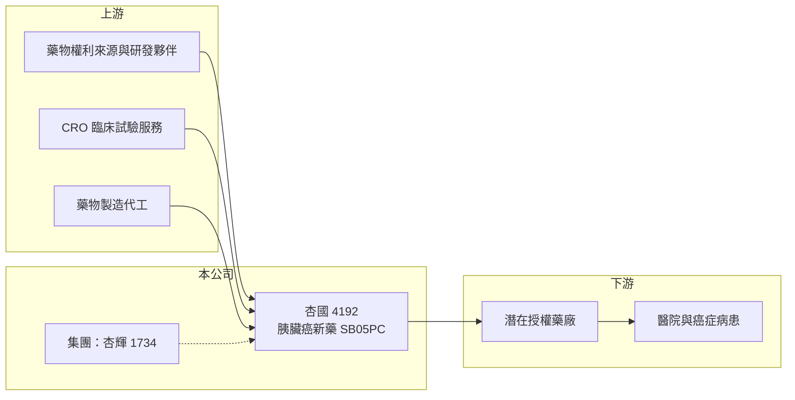

# 4192 杏國

> 上櫃｜[[產業索引-生技醫療業|生技醫療業]]｜上市（櫃）日期 2014/10/28

# 第一章：企業模式與商業藍圖

> [!info] 撰寫說明
> 精簡版，由 Claude 依公開資料整理，架構比照 [[2330台積電]] 的四章研究，資料截至 2026-10-08。來源：Goodinfo 年度經營績效頁（2019 至 2025 年）、櫃買中心開放資料（基本資料、2026 年第二季資產負債與綜合損益、每月營收）、科技新報 2022 年 5 月報導；集團關係與藥物授權來源憑既有知識撰寫，已標「待校對」。公開資料有限。#待校對

杏國新藥（股票代號：4192，以下簡稱杏國）是一家以抗癌新藥開發為主的小型生技公司。對投資人而言，杏國的價值幾乎全部繫於少數臨床藥物的進度，日常營收很小，屬於典型的[[新藥開發]]型公司。

- **核心業務：** 杏國 2008 年成立，2014 年 10 月上櫃（櫃買中心開放資料），屬於 [[1734杏輝]] 集團旗下的新藥公司（待校對）。核心藥物是胰臟癌新藥 SB05PC（EndoTAG-1），一種帶正電荷的[[微脂體]]抗癌藥，鎖定轉移性胰臟癌患者在 FOLFIRINOX 化療失敗後的二線治療（科技新報 2022 年 5 月）。這個藥物的權利推估是從歐洲藥廠引進（待校對）。
- **營收結構：** 2025 年營收約 0.27 億元（Goodinfo），2026 年上半年約 0.12 億元（櫃買中心資料），營收來源與產品別比重本次未查得。這個規模的營收無法支應研發費用，公司實質上是靠股東資金推進臨床試驗。
- **重要里程碑：** 2022 年 4 月 7 日美國 [[FDA]] 准予執行 SB05PC 第三期臨床試驗，4 月 26 日台灣食藥署也核准，但 5 月 18 日杏國公告，在與 FDA 視訊會議後結論為停止執行該三期試驗，並將依 FDA 正式文件修正計畫書後再補件（科技新報 2022 年 5 月）。這次轉折說明新藥開發中法規審查的不確定性有多高。
- **長期方向：** 公司未來能否重啟或調整三期試驗、能否以[[新藥授權]]方式把權利交給國際藥廠，是決定長期價值的核心。相關的最新進度本次未查得，需持續追蹤公司公告。

# 第二章：護城河深度與競爭優勢

新藥公司的護城河來自專利與臨床數據，而杏國目前的核心資產仍停留在尚未完成三期的單一藥物。

- **競爭優勢：** 胰臟癌是存活率最低的癌症之一，二線治療的選擇很少，若藥物能證明延長存活，市場價值高。專利與臨床資料是新藥公司唯一的護城河，杏國累積的二期資料與 FDA 溝通經驗是主要資產。
- **主要對手：** 全球大型藥廠與生技公司都在開發胰臟癌藥物，包括標靶藥、免疫療法與新型化療組合。#待校對 台灣同樣開發抗癌新藥的公司有 [[4174浩鼎]]、[[6446藥華藥]] 等，但適應症與技術不同。
- **集團支持：** 身為杏輝集團成員，杏國在資金與營運支援上可獲得母集團協助（推估）。不過集團支持也意味著重大決策可能由集團主導，小股東對研發方向的影響力有限。
- **觀察重點：** 第一，SB05PC 三期試驗計畫的修正與重啟進度；第二，是否出現授權或共同開發夥伴；第三，現金水位能支撐多少年的研發。

# 第三章：財務體質與盈利規模

資料日期：2026-10-08，表格是撰寫當時的快照；最新月營收、毛利率、累計 EPS 由自動排程寫在本筆記的屬性欄位（月營收、毛利率、累計EPS 等）。#待校對

杏國的財務數字反映的是「研發燒錢速度」，營業利益率動輒負數千個百分點，毛利率與營業利益率對評價的參考意義很低。

| 年度 | 營收（新台幣） | [[毛利率]] | [[營業利益率]] | EPS（元） | [[ROE]] |
|---|---|---|---|---|---|
| 2021 | 0.07 億 | 42.8% | -6,609% | -4.04 | -91.4% |
| 2022 | 0.16 億 | 57.3% | -1,207% | -1.64 | -54.5% |
| 2023 | 0.20 億 | 2.58% | -225% | -1.19 | -12.6% |
| 2024 | 0.23 億 | 55.2% | -247% | -1.54 | -16.7% |
| 2025 | 0.27 億 | 78.0% | -175% | -1.30 | -16.9% |
| 2026 上半年 | 0.12 億 | 66.3% | -219% | -0.75 | 未查得 |

- **營收規模：** 營收從 2020 年的 0.13 億元增加到 2025 年的 0.27 億元，年複合成長率約 16%（推算），但基期極小，對公司價值影響有限。
- **研發支出：** 2021 年營業虧損約 4.6 億元（推算），2022 年三期試驗停止後，2023 至 2025 年營業虧損縮小到每年約 0.4 億至 0.6 億元（推算）。虧損收斂代表研發活動規模縮小，而不是商業化成功。
- **財務特色：** 2026 年第二季底股本 3.52 億元、權益 2.19 億元、總負債僅 0.21 億元（櫃買中心資料），權益已低於股本，反映累積虧損。2021 至 2025 年平均 ROE 約 -38%（推算），沒有配發股利。

**[[ROIC]] 與 [[WACC]]：**
- ROIC（推算）：2025 年營業利益約 0.27 億元 × -175% ≈ -0.47 億元，虧損不計稅。投入資本以權益 2.19 億元計（有息負債趨近於零，假設為 0），ROIC 約 -21%（推算）。新藥公司在取得藥證或授權前 ROIC 為負是常態，數字本身反映的是研發投入，不代表管理失當。
- WACC（推算）：無風險利率 1.75%、市場風險溢酬 6%，β 取新藥公司常見值 1.3（假設），股東權益成本約 9.6%；幾乎無負債，WACC 約 9.6%（推算）。
- 結論：ROIC 遠低於 WACC，現階段不創造會計上的價值。杏國的價值完全取決於未來授權金或藥物上市後的現金流，屬於高風險、結果二元化的投資。

# 第四章：總體風險與地緣政治

杏國的風險集中在臨床、資金與單一藥物依賴。

- **臨床風險：** 新藥能否上市取決於三期試驗結果，2022 年三期試驗在核准後一個多月即停止，顯示即使取得 FDA 許可，執行層面仍可能出現重大變數。胰臟癌臨床試驗失敗率高是全球共通的現象。
- **資金風險：** 權益約 2.2 億元，以每年約 0.4 億至 0.5 億元的虧損計，資金可支應數年；但若重啟大型三期試驗，所需資金遠高於現有規模，勢必需要增資或尋求授權夥伴，可能稀釋既有股東。
- **其他風險：** 藥物權利若來自國外授權，需支付權利金並受原授權合約限制（待校對）；各國藥政法規變動、匯率與國際藥價壓力也會影響授權價值。

# 專有名詞解析

## 產業

- **[[新藥開發]]**：從臨床前研究到一至三期人體試驗、取得藥證的漫長過程，通常需要十年以上與大量資金。
- **[[新藥授權]]**：新藥公司把藥物的開發或銷售權利授權給其他藥廠，換取簽約金、里程碑金與銷售權利金。
- **[[微脂體]]**：以脂質雙層包覆藥物的奈米載體，可改變藥物在體內的分布、降低副作用。
- **[[FDA]]**：美國食品藥物管理局，負責藥品與醫療器材的上市審查，取得許可才能在美國銷售。

# 核心供應鏈

- 上游：藥物權利來源（待校對）、臨床試驗受託研究機構（CRO）、藥物製造代工廠。
- 下游／客戶：潛在的國際授權藥廠，最終為醫院與胰臟癌病患。
- 同業：[[4174浩鼎]]、[[6446藥華藥]] 等台灣新藥公司，以及全球開發胰臟癌藥物的藥廠；集團母公司為 [[1734杏輝]]（待校對）。

## 最新新聞
<!-- news:start -->
<!-- news:end -->

## 相關連結
- [公開資訊觀測站](https://mopsov.twse.com.tw/mops/web/t05st03?step=1&firstin=1&co_id=4192)
- [Goodinfo](https://goodinfo.tw/tw/StockDetail.asp?STOCK_ID=4192)
- [Yahoo 股市](https://tw.stock.yahoo.com/quote/4192)
- [鉅亨網新聞](https://www.cnyes.com/twstock/4192/news)
