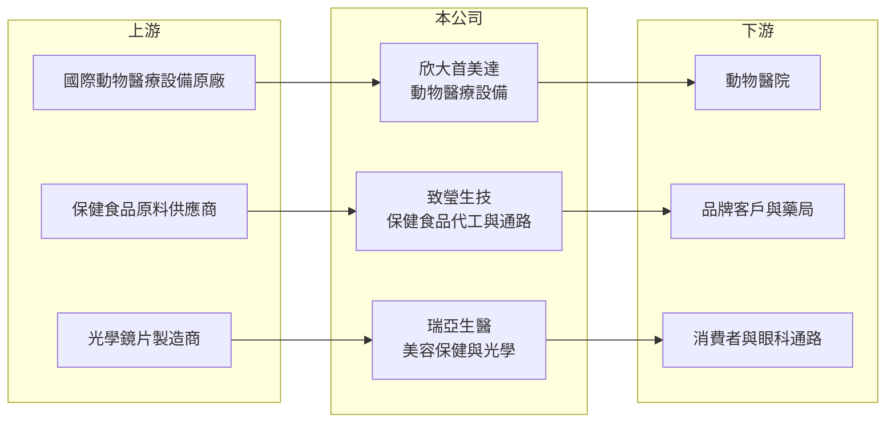

# 4198 欣大健康

> 上櫃｜[[產業索引-生技醫療業|生技醫療業]]｜上市（櫃）日期 2014/12/23

# 第一章：企業模式與商業藍圖

> [!info] 撰寫說明
> 精簡版，由 Claude 依公開資料整理，架構比照 [[2330台積電]] 的四章研究，資料截至 2026-10-08。來源：Goodinfo 年度經營績效頁（2019 至 2025 年）、櫃買中心開放資料（基本資料、2026 年第二季資產負債與綜合損益、每月營收）、富果研究 2025 年 12 月欣大健康法說會整理。公開資料有限。#待校對

欣大健康投資控股（股票代號：4198，以下簡稱欣大健康）是一家控股公司，旗下子公司分別經營動物醫療設備代理、保健食品代工與通路，以及角膜塑型等光學產品。它不是單一產品的製造商，而是由幾個規模不大的健康相關事業拼成的集團，理解它要先分開看每個事業的角色。

- **核心業務：** 欣大健康 2013 年成立，2014 年 12 月上櫃（櫃買中心開放資料）。子公司欣大首美達以[[代理商]]角色銷售 MRI、CT、超音波等高單價動物醫療設備，市場涵蓋台灣、中港澳與泰國；致瑩生技提供保健食品[[OEM]]代工與行銷服務，並以自有品牌經營藥局通路；瑞亞生醫經營美容保健品銷售與[[角膜塑型鏡片]]等光學產品（富果研究 2025 年 12 月）。
- **營收結構：** 各子公司營收比重未揭露。2025 年前三季合併營收約 1.48 億元、毛利率約 34%（富果研究整理），全年營收約 2.04 億元（Goodinfo）。動物醫療設備屬於單價高、出貨不規律的代理生意，營收容易隨大型設備交機時點波動。
- **營運據點：** 以台灣為主，動物醫療設備延伸到中港澳與泰國，2025 年下半年在泰國推出動物保健品並取得約 200 家客戶（富果研究整理）。
- **長期方向：** 管理層規劃在設備銷售之外投資新的動物醫院做垂直整合、2026 年成立原料部門推出專利保健原料、2026 年第二季擴充東南亞人力，並爭取角膜塑型產品在中國的許可證（富果研究整理）。這些都是規劃中的目標，能否實現仍待驗證。

# 第二章：護城河深度與競爭優勢

欣大健康的競爭力分散在幾個小市場，各事業都不大，尚未看到明確的規模優勢。

- **競爭優勢：** 動物醫療是[[寵物經濟]]中成長較快的領域，高階影像設備需要原廠代理權與技術服務團隊，取得代理權後具有一定排他性。保健食品代工則依賴工廠認證與配方開發能力，公司表示已升級工廠設備（富果研究整理）。
- **主要對手：** 動物醫療設備代理面對其他醫療設備代理商與原廠直營；保健食品代工市場競爭激烈，台灣有大量中小型代工廠；角膜塑型鏡片則有國際眼科大廠與 [[6491晶碩]] 等台灣隱形眼鏡廠。#待校對
- **事業組合的問題：** 三個事業之間的綜效有限，管理資源分散，任何一個事業都還沒有做到足以支撐集團費用的規模。2025 年前三季營業費用約 0.84 億元，高於毛利約 0.50 億元（富果研究整理），這個缺口就是虧損的來源。
- **觀察重點：** 第一，營業費用能否持續下降；第二，動物醫院投資是否帶來穩定收入；第三，專利保健原料與角膜塑型產品的取證時程。

# 第三章：財務體質與盈利規模

資料日期：2026-10-08，表格是撰寫當時的快照；最新月營收、毛利率、累計 EPS 由自動排程寫在本筆記的屬性欄位（月營收、毛利率、累計EPS 等）。#待校對

欣大健康長期處於營業虧損，2023 年的正 EPS 並非本業獲利所致。

| 年度 | 營收（新台幣） | [[毛利率]] | [[營業利益率]] | EPS（元） | [[ROE]] |
|---|---|---|---|---|---|
| 2021 | 1.22 億 | -6.48% | -84.4% | -1.30 | -118% |
| 2022 | 2.54 億 | 15.1% | -43.4% | -3.77 | -44.7% |
| 2023 | 2.55 億 | 14.0% | -36.5% | 4.49 | 33.2% |
| 2024 | 2.40 億 | 31.2% | -28.3% | -1.71 | -13.4% |
| 2025 | 2.04 億 | 32.9% | -22.8% | -1.96 | -16.1% |
| 2026 上半年 | 0.73 億 | 35.3% | -36.1% | -0.78 | 未查得 |

- **營收規模：** 2020 年營收 1.01 億元，2025 年 2.04 億元，年複合成長率約 15%（推算），成長主要來自 2022 年的事業組合變動（推估）。2023 至 2025 年營收逐年下滑，2026 年 1 至 8 月累計營收也較去年同期減少約 18%（櫃買中心每月營收）。
- **獲利：** 毛利率從負值改善到 30% 以上，營業利益率也由 -84% 收斂到 -23%，方向是正確的，但仍未轉正。2023 年營業虧損下 EPS 仍為 4.49 元，推估來自處分資產或投資的業外收益（推估，原因未查得）。2021 至 2025 年平均 ROE 約 -32%（推算）。
- **財務特色：** 2026 年第二季底總資產 3.54 億元、總負債 1.02 億元、權益 2.52 億元，其中母公司業主權益 2.04 億元（櫃買中心資料）。沒有配發股利。

**[[ROIC]] 與 [[WACC]]：**
- ROIC（推算）：2025 年營業利益約 2.04 億元 × -22.8% ≈ -0.47 億元，虧損不計稅。有息負債未查得，假設約 0.5 億元，加上權益 2.52 億元，投入資本約 3.0 億元，ROIC 約 -15%（推算）。
- WACC（推算）：無風險利率 1.75%、市場風險溢酬 6%，β 取小型健康消費公司常見值 1.0（假設），股東權益成本約 7.8%；負債成本 2.5%、稅後 2.0%，負債約占投入資本 17%，WACC 約 6.8%（推算）。
- 結論：ROIC 長期為負、遠低於 WACC，公司仍在消耗股東資本。要創造價值，至少需要營收擴大一倍以上或大幅降低費用，讓營業利益轉正。

# 第四章：總體風險與地緣政治

欣大健康的風險在於規模太小、事業分散與資金消耗。

- **產業週期：** 動物醫療設備屬於醫院的資本支出，受寵物醫院投資意願影響；保健食品則受消費景氣與通路競爭影響。兩者週期不同，雖可分散風險，但也讓營收缺乏主軸。
- **營運風險：** 營業費用長期高於毛利，若營收無法成長，持續虧損會侵蝕權益。動物醫院的垂直整合需要資本投入，小公司承擔這類投資的能力有限。
- **其他風險：** 動物醫療設備多為進口代理，受匯率與原廠代理權續約影響；角膜塑型產品屬醫療器材，中國等海外市場的取證時程不確定；保健食品則面對各國法規與標示規範。

# 專有名詞解析

## 應用

- **[[角膜塑型鏡片]]**：夜間配戴、暫時改變角膜形狀以矯正近視的硬式隱形眼鏡，屬醫療器材。

## 產業

- **[[OEM]]**：代工廠依客戶提供的設計生產，產品掛客戶品牌銷售。
- **[[代理商]]**：向原廠採購產品再轉售給下游客戶的通路業者，價值在於庫存、配送與信用服務。
- **[[寵物經濟]]**：寵物飼養數量增加帶動的飼料、醫療、保險與用品等消費市場。

# 核心供應鏈

- 上游：國際動物醫療影像設備原廠、保健食品原料供應商、角膜塑型鏡片製造夥伴。
- 下游／客戶：台灣、中港澳與泰國的動物醫院，保健食品品牌客戶與藥局通路，眼科醫院通路與一般消費者。
- 同業：醫療設備代理商、保健食品代工廠；隱形眼鏡領域有 [[6491晶碩]]、[[1565精華]]。#待校對

## 最新新聞
<!-- news:start -->
<!-- news:end -->

## 相關連結
- [公開資訊觀測站](https://mopsov.twse.com.tw/mops/web/t05st03?step=1&firstin=1&co_id=4198)
- [Goodinfo](https://goodinfo.tw/tw/StockDetail.asp?STOCK_ID=4198)
- [Yahoo 股市](https://tw.stock.yahoo.com/quote/4198)
- [鉅亨網新聞](https://www.cnyes.com/twstock/4198/news)
