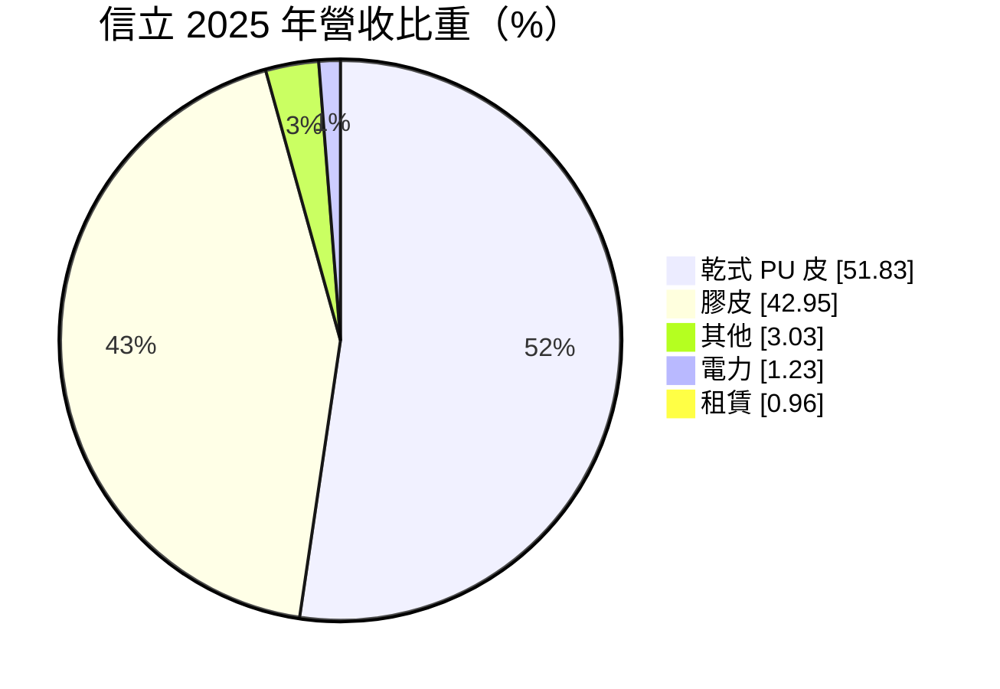
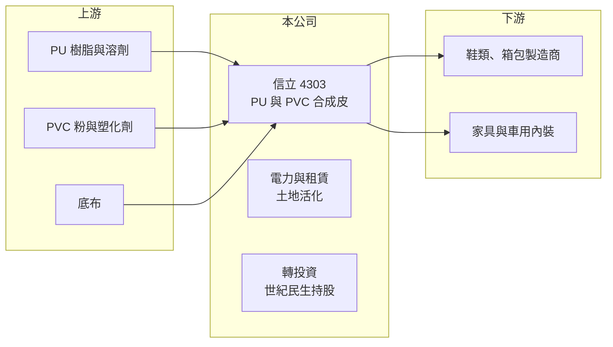

# 4303 信立

> 上櫃｜[[產業索引-塑膠工業|塑膠工業]]｜上市（櫃）日期 1999/03/10

# 第一章：企業模式與商業藍圖

> [!info] 撰寫說明
> 精簡版，由 Claude 依公開資料整理，架構比照 [[2330台積電]]，資料截至 2026-10-08。來源：Goodinfo 年度經營績效、富邦 e 點通（MoneyDJ）公司基本資料、旺得富 2025 年 9 月報導、nstock。2024 至 2025 年營收大幅跳升的原因未查得。#待校對

本章說明信立（4303）的合成皮本業，以及近年獲利主要來自哪裡。

- **核心業務：** 信立化學工業成立於 1973 年，1999 年上櫃，總部與工廠在台南學甲，主要從事 PVC 與 PU [[合成皮]]的製造與買賣，子公司普大應材負責應用研發。依 nstock 資料，最終母公司是上曜建設開發，也就是 [[1316上曜]] 集團的一員。
- **營收結構：** 依 2025 年營收比重，[[乾式PU]]皮占 51.8%，膠皮（MoneyDJ 原文作「榔皮」）占 43.0%，電力占 1.2%、租賃占 1.0%。電力與租賃比重雖小，但顯示公司已開始活化土地與廠房，在本業之外建立小額的穩定收入。
- **獲利來源：** 信立近年的高 EPS 主要不是來自本業。依旺得富報導，公司 2025 年 8 月底到 9 月初第四度處分世紀民生股票，處分 3,725 張、獲利約 2.88 億元，處分後仍持股 2.86%。2024 年與 2025 年本業都是營業虧損，但 EPS 分別達 17.66 元與 11.15 元，主要來自這類[[一次性收益]]。
- **長期方向：** 公司對外說明的策略是「產能升級、永續材料、國際拓展」，包括無溶劑製程、可回收材料與綠色複合加工，回應品牌商的減碳要求。同時也規劃生產基地優化與土地資產活化。

# 第二章：護城河深度與競爭優勢

本章分析信立合成皮本業的競爭條件，以及它真正的價值所在。

- **競爭優勢：** 信立是經營五十年的老牌合成皮廠，在台南有自有土地與廠房，這些資產可以轉為光電與租賃收入。另一個優勢是轉投資，世紀民生持股多年累積的增值，讓公司在本業虧損期間仍能維持獲利與配息。
- **主要對手：** 合成皮市場的大型業者包括 [[1303南亞]]、[[1307三芳]]，以及在越南就近供貨的 [[1341富林-KY]]。台灣的鞋類與箱包代工已大量移往東南亞，留在台灣的合成皮廠需要以高階、環保或特殊規格產品區隔，否則難以和海外工廠的成本競爭。
- **觀察重點：** 第一是本業營業利益率能否轉正，2021 年曾有 5.09%，2023 年以後轉為 -10% 到 -20%。第二是世紀民生剩餘持股的處分節奏，因為這決定未來幾年的業外收益規模。第三是土地活化與永續材料能否形成可重複的收入。

# 第三章：財務體質與盈利規模

資料日期：2026-10-08，表格是撰寫當時的快照；最新月營收、毛利率、累計 EPS 由自動排程寫在本筆記的屬性欄位（月營收、毛利率、累計EPS 等）。#待校對

本章用五年數字區分信立的本業獲利與業外收益。

| 年度 | 營收（新台幣） | [[毛利率]] | [[營業利益率]] | EPS（元） | [[ROE]] |
|---|---|---|---|---|---|
| 2021 | 3.65 億 | 16.9% | 5.09% | 1.96 | 15.0% |
| 2022 | 3.25 億 | 19.0% | 5.30% | -0.61 | -4.64% |
| 2023 | 1.62 億 | 5.64% | -18.6% | 1.83 | 13.9% |
| 2024 | 3.74 億 | 11.7% | -19.8% | 17.66 | 68.8% |
| 2025 | 9.88 億 | 17.8% | -10.2% | 11.15 | 30.5% |

- **營收規模：** 營收從 2023 年的 1.62 億元跳升到 2025 年的 9.88 億元，2021 至 2025 年年複合成長率約 28%（推算）。但同期營業利益率仍為負，代表新增的營收沒有帶來本業獲利，原因（例如新增合併子公司或貿易性營收）未查得，需查閱年報確認。
- **獲利：** 近五年平均 ROE 約 24.7%（推算），看起來很高，但主要由 2024 與 2025 年處分投資的一次性收益撐起。只看本業，2023 年以後毛利率偏低、營業利益率為負，本業並沒有創造價值。
- **財務特色：** 負債比例約 21%，財務穩健。每股淨值從 2021 年的 13.93 元升到 2025 年的 36.91 元，增加的部分大多來自投資處分利益；股本從 7 億元增加到 9.46 億元。Goodinfo 統計的歷年平均現金股利約 1.14 元。
- **[[ROIC]] 與 [[WACC]]：** 2025 年營業利益約 -1.01 億元（9.88 億 × -10.2%），虧損不計稅；股東權益約 34.9 億元（每股淨值 36.91 元 × 0.946 億股），總負債約 9.3 億元、假設一半為有息負債約 4.7 億元，ROIC 約 -2.5%（推算）；2021 年本業尚有獲利時也只有約 1%（推算）。WACC 以 CAPM 推估：無風險利率 1.75%、市場風險溢酬 6%，MoneyDJ 揭露 β 為 0.55，保守改用傳產同業常見值 0.8，股東權益成本約 6.55%；稅後負債成本約 2%，WACC 約 6.0%（推算）。本業 ROIC 長期低於 WACC，信立的價值主要來自轉投資與土地資產，而不是合成皮本業的超額報酬。

# 第四章：總體風險與地緣政治

本章整理信立長期必須面對的風險。

- **產業週期：** 合成皮需求跟著鞋類、箱包與家具的消費景氣走，品牌商去化庫存時訂單會明顯縮減。台灣下游代工廠持續外移，國內客戶基礎長期萎縮。
- **營運風險：** 獲利過度依賴處分轉投資，業外收益不會每年發生；世紀民生持股處分完畢後，若本業仍虧損，EPS 會大幅回落。持股市價下跌時，未處分部分也可能帶來評價損失。
- **其他風險：** PU 與 PVC 原料、溶劑價格隨油價波動。環保法規對溶劑型製程愈來愈嚴格，無溶劑與可回收製程的轉換需要資本支出，若投入不足，可能失去品牌客戶的供應資格。

# 專有名詞解析

## 金融

- **[[一次性收益]]**：不會每年重複發生的收益，例如處分土地或子公司，分析獲利時通常要排除。
- **[[業外收益]]**：本業以外的收入，例如利息、匯兌利益、投資收益，不代表本業競爭力。
- **[[ROIC]]**：投入資本報酬率，稅後營業利益除以投入資本，衡量本業運用資金創造報酬的能力。
- **[[WACC]]**：加權平均資金成本，股東與債權人要求報酬率的加權平均，ROIC 高於 WACC 才代表創造價值。

## 產業

- **[[合成皮]]**：以塑膠樹脂塗佈在布料上製成、外觀類似真皮的材料，用於鞋子、包包、家具與汽車座椅。
- **[[乾式PU]]**：先把 PU 樹脂塗在離型紙上乾燥成膜，再貼合到底布的合成皮製法，表面紋路細緻。

# 核心供應鏈

- 上游：PU 樹脂、PVC 粉與塑化劑、底布，台灣供應商如 [[1301台塑]]、[[1313聯成]]（產業參考，信立實際供應商未查得）。
- 下游／客戶：鞋類、箱包、家具與車用內裝製造商，具體客戶名單未查得。
- 集團：最終母公司為上曜建設開發，屬 [[1316上曜]] 集團。
- 同業：[[1303南亞]]、[[1307三芳]]、[[1341富林-KY]]。

## 最新新聞
<!-- news:start -->
<!-- news:end -->

## 相關連結
- [公開資訊觀測站](https://mopsov.twse.com.tw/mops/web/t05st03?step=1&firstin=1&co_id=4303)
- [Goodinfo](https://goodinfo.tw/tw/StockDetail.asp?STOCK_ID=4303)
- [Yahoo 股市](https://tw.stock.yahoo.com/quote/4303)
- [鉅亨網新聞](https://www.cnyes.com/twstock/4303/news)
