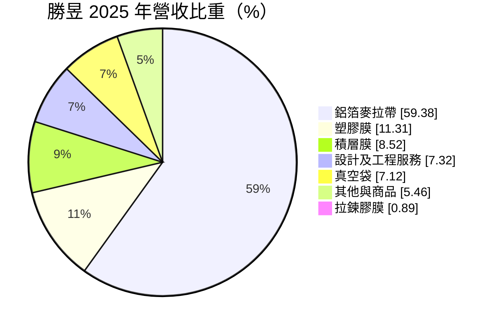
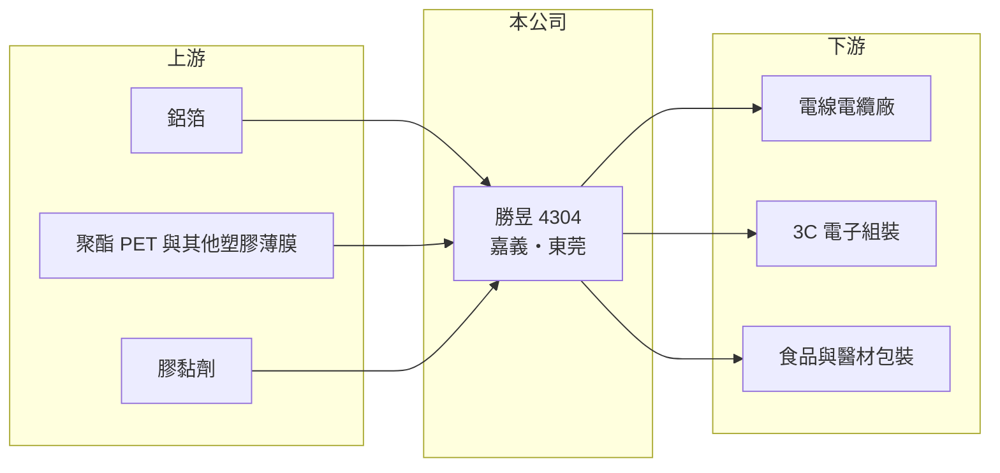

# 4304 勝昱

> 上櫃｜[[產業索引-塑膠工業|塑膠工業]]｜上市（櫃）日期 2000/01/27

# 第一章：企業模式與商業藍圖

> [!info] 撰寫說明
> 精簡版，由 Claude 依公開資料整理，架構比照 [[2330台積電]]，資料截至 2026-10-08。來源：Goodinfo 年度經營績效、富邦 e 點通（MoneyDJ）公司基本資料、理財周刊公司介紹、nstock。公開資料有限，主要客戶與 2025 年增資細節未查得。#待校對

本章說明勝昱（4304）的產品、用途與營運模式。

- **核心業務：** 勝昱成立於 1982 年，前身為琨詰科技，2000 年在櫃買中心掛牌，主要從事包裝材料、絕緣材料與塑膠、金屬薄膜的製造加工。主力產品是 [[EMI]] 遮蔽用的[[鋁箔麥拉帶]]，用於電線電纜與 3C 電子產品，防止電磁雜訊干擾訊號。另一條產品線是食品與醫療器材用的軟性複合積層包材。
- **營收結構：** 依 2025 年營收比重，鋁箔麥拉帶占 59.4%，塑膠膜 11.3%，積層膜 8.5%，設計及工程服務 7.3%，真空袋 7.1%，其他與商品銷售約 5.5%，拉鍊膠膜 0.9%。設計及工程服務是近年新增的業務項目，顯示公司正在嘗試增加本業以外的收入來源。
- **營運據點：** 工廠位於台灣嘉義與中國東莞，兩地皆通過 ISO-9001 與 ISO-14001 認證，產品符合 RoHS 規範。總部在台北松山區。
- **長期方向：** 公司對外說明的方針包括改善設備以降低損耗、調整產品結構、研發新產品以降低材料成本，以及開發新市場與新客戶分散風險。從營收規模約 3 至 5 億元來看，勝昱是一家小型材料加工廠，能否擴大高附加價值產品比重，是本業能否轉盈的核心。

# 第二章：護城河深度與競爭優勢

本章分析勝昱的競爭條件與面臨的挑戰。

- **競爭優勢：** 鋁箔麥拉帶屬於電線電纜的必要材料，客戶一旦把規格寫入產品設計，通常會長期採購。勝昱有台灣與東莞兩地產能，可以就近服務兩岸的線材與電子組裝客戶。不過毛利率長年在 3% 至 7% 之間，顯示產品差異化有限，競爭優勢並不強。
- **主要對手：** 鋁箔麥拉帶與軟性包材的技術門檻不高，中國有大量同類型加工廠，價格競爭激烈。下游電線電纜大廠如 [[1608華榮]]、[[1609大亞]] 等也有自己的供應鏈選擇（產業參考，是否為勝昱客戶未查得）。
- **觀察重點：** 第一是毛利率能否穩定回到兩位數，並讓營業利益率長期轉正，這是判斷產品組合調整是否見效的核心指標。另需觀察設計及工程服務等新業務的穩定性，以及 2025 年增資後的資金用途。

# 第三章：財務體質與盈利規模

資料日期：2026-10-08，表格是撰寫當時的快照；最新月營收、毛利率、累計 EPS 由自動排程寫在本筆記的屬性欄位（月營收、毛利率、累計EPS 等）。#待校對

本章用五年數字檢視勝昱的本業獲利能力與資本結構變化。

| 年度 | 營收（新台幣） | [[毛利率]] | [[營業利益率]] | EPS（元） | [[ROE]] |
|---|---|---|---|---|---|
| 2021 | 3.83 億 | 5.96% | -10.5% | 4.22 | 80.0% |
| 2022 | 5.13 億 | 4.57% | -10.8% | -1.56 | -23.7% |
| 2023 | 4.56 億 | 4.07% | -11.3% | -3.35 | -80.7% |
| 2024 | 3.77 億 | 2.57% | -16.9% | -1.37 | -76.9% |
| 2025 | 3.41 億 | 6.83% | -12.8% | -1.16 | -24.7% |

- **營收規模：** 營收在 3.4 至 5.1 億元之間，2021 至 2025 年年複合成長率約 -2.9%（推算），規模小且沒有成長。
- **獲利：** 五年營業利益率都在 -10% 到 -17% 之間，毛利率連營業費用都無法涵蓋，本業長期虧損。2021 年 EPS 4.22 元、ROE 80% 並非本業成果，而是營業虧損下的[[一次性收益]]（來源推估為資產處分，未查得細節）。近五年平均 ROE 約 -25%（推算），且因淨值很小，ROE 波動被放大。
- **財務特色：** 每股淨值從 2021 年的 7.39 元一路降到 2024 年的 1.09 元，股東權益幾乎被虧損耗盡。2025 年股本由 3.6 億元增加到 6.1 億元、每股淨值回到 5.15 元，推估是現金增資補充資本。負債比例約 53%，幾乎沒有配發現金股利。
- **[[ROIC]] 與 [[WACC]]：** 2025 年營業利益約 -0.44 億元（3.41 億 × -12.8%），虧損不計稅；股東權益約 3.1 億元（每股淨值 5.15 元 × 0.61 億股），總負債約 3.5 億元、假設一半為有息負債約 1.75 億元，ROIC 約 -8.9%（推算）。WACC 以 CAPM 推估：無風險利率 1.75%、市場風險溢酬 6%，β 用小型電子材料股常見值 0.9（來源未揭露），股東權益成本約 7.15%；稅後負債成本約 2%，股權權重約 64%，WACC 約 5.3%（推算）。ROIC 長期為負、遠低於 WACC，代表本業持續毀損價值，公司是靠增資而非本業獲利維持營運。

# 第四章：總體風險與地緣政治

本章整理勝昱長期必須面對的風險。

- **產業週期：** 鋁箔麥拉帶的需求跟著電線電纜與 3C 電子產品景氣走，PC、手機與網通設備出貨下滑時，線材廠會減少採購。包材則受食品與醫療需求影響，相對穩定但毛利低。
- **營運風險：** 本業長期虧損，淨值一度降到每股 1 元左右，雖然 2025 年增資改善，但若無法轉盈，資本會再度被侵蝕。公司規模小，固定成本分攤不易，營收稍有下滑就會擴大虧損。
- **其他風險：** 鋁箔與塑膠薄膜原料價格受鋁價與油價影響，成本難以完全轉嫁。東莞廠受中國環保、工資與兩岸關係影響；經營團隊與增資資金的運用透明度，也是小型公司投資人需要關注的治理問題。

# 專有名詞解析

## 金融

- **[[一次性收益]]**：不會每年重複發生的收益，例如處分土地或子公司，分析獲利時通常要排除。
- **[[ROIC]]**：投入資本報酬率，稅後營業利益除以投入資本，衡量本業運用資金創造報酬的能力。
- **[[WACC]]**：加權平均資金成本，股東與債權人要求報酬率的加權平均，ROIC 高於 WACC 才代表創造價值。

## 產業

- **[[EMI]]**：電磁干擾，電子產品運作時產生或受到的電磁雜訊，需要以屏蔽與吸波材料抑制。
- **[[鋁箔麥拉帶]]**：把鋁箔與聚酯薄膜貼合成的膠帶，包覆在電線電纜外層以遮蔽電磁干擾。
- **[[積層膜]]**：把多層不同功能的塑膠薄膜或鋁箔貼合而成的軟性包材，用於食品與醫療器材包裝。

# 核心供應鏈

- 上游：鋁箔、PET 等塑膠薄膜與膠黏劑，具體供應商未查得。
- 下游／客戶：電線電纜、3C 電子產品製造商，以及食品與醫療器材包裝業者；台灣線纜業者如 [[1608華榮]]、[[1609大亞]]（產業參考，是否為客戶未查得）。
- 同業：中國與台灣的 EMI 遮蔽材料與軟性包材加工廠。

## 最新新聞
<!-- news:start -->
<!-- news:end -->

## 相關連結
- [公開資訊觀測站](https://mopsov.twse.com.tw/mops/web/t05st03?step=1&firstin=1&co_id=4304)
- [Goodinfo](https://goodinfo.tw/tw/StockDetail.asp?STOCK_ID=4304)
- [Yahoo 股市](https://tw.stock.yahoo.com/quote/4304)
- [鉅亨網新聞](https://www.cnyes.com/twstock/4304/news)
