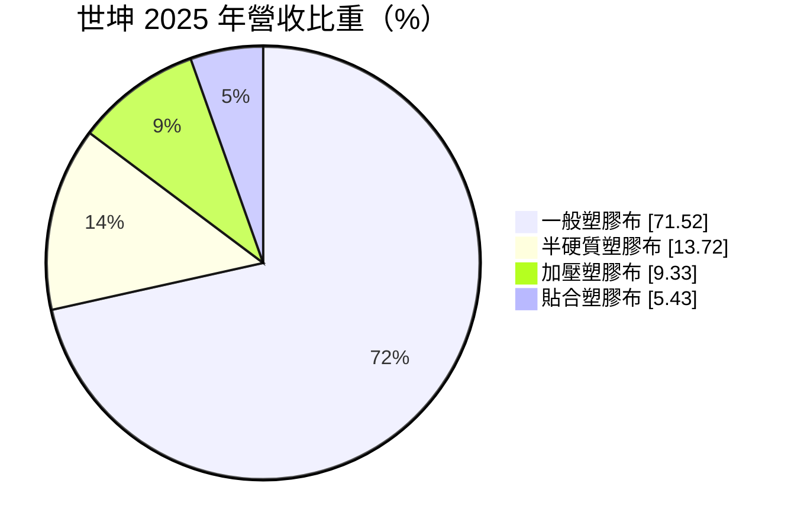
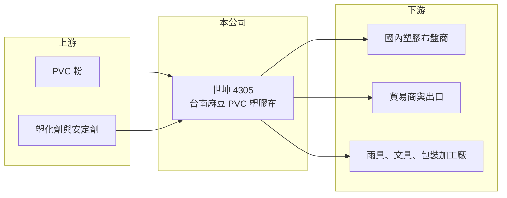

# 4305 世坤

> 上櫃｜[[產業索引-塑膠工業|塑膠工業]]｜上市（櫃）日期 2000/09/28

# 第一章：企業模式與商業藍圖

> [!info] 撰寫說明
> 精簡版，由 Claude 依公開資料整理，架構比照 [[2330台積電]]，資料截至 2026-10-08。來源：Goodinfo 年度經營績效、富邦 e 點通（MoneyDJ）公司基本資料、富果研究 2025 年 12 月法說會整理。公開資料有限，產能與終端用途未查得。#待校對

本章說明世坤（4305）如何在成熟的 PVC 塑膠布市場中穩定獲利。

- **核心業務：** 世坤塑膠成立於 1986 年，2000 年上櫃，總部與工廠在台南麻豆，生產 [[PVC]] 硬質、半硬質與軟質[[塑膠布]]，並兼營貿易與出口。塑膠布是用途很廣的基礎材料，可加工成雨具、文具、包裝、桌布與各種日用品，屬於成熟但需求穩定的產業。
- **營收結構：** 依 2025 年營收比重，一般塑膠布占 71.5%，半硬質塑膠布 13.7%，加壓塑膠布 9.3%，貼合塑膠布 5.4%。產品全部集中在塑膠布，沒有其他事業。
- **市場與客戶：** 依法說會資料，內銷比重約九成，2023 年 89.0%、2024 年 89.1%、2025 年前三季 90.9%，客戶是國內塑膠布盤商、貿易商，以及直接使用塑膠布生產的製造商。以盤商為主的通路，讓公司不必面對大量終端客戶，但也代表價格容易受盤商比價影響。
- **長期方向：** 公司策略很單純：專注 PVC 塑膠布本業、維持低負債與健康現金流，並以穩定而高的配息回饋股東。這是典型的「小而穩」傳產經營模式，不追求擴張，而是追求每年穩定的現金回報。

# 第二章：護城河深度與競爭優勢

本章分析世坤在塑膠布市場的競爭條件。

- **競爭優勢：** 世坤的優勢在於成本控管與在地通路。近五年毛利率從 19.6% 一路升到 31.4%，在塑膠布這種同質性高的產品中相當少見，推估來自原料成本下降、產品組合調整與產線效率，具體原因法說會未說明。長期與台灣盤商合作，熟悉多樣小量的規格需求，也讓大型廠不容易取代。
- **主要對手：** 台灣塑膠布市場最大的業者是 [[1303南亞]]，另有 [[1305華夏]] 等 PVC 加工廠，以及中國與東南亞的進口產品。大型廠有原料一貫化的成本優勢，世坤則以彈性與服務競爭。
- **觀察重點：** 第一是毛利率能否維持在 25% 以上，因為原料 PVC 價格回升時，高毛利可能回落。第二是內需市場是否萎縮，台灣下游加工業外移會減少塑膠布需求。第三是配息率能否維持在八成上下。

# 第三章：財務體質與盈利規模

資料日期：2026-10-08，表格是撰寫當時的快照；最新月營收、毛利率、累計 EPS 由自動排程寫在本筆記的屬性欄位（月營收、毛利率、累計EPS 等）。#待校對

本章用五年數字檢視世坤的獲利品質與股東回報。

| 年度 | 營收（新台幣） | [[毛利率]] | [[營業利益率]] | EPS（元） | [[ROE]] |
|---|---|---|---|---|---|
| 2021 | 11.7 億 | 19.6% | 13.2% | 2.03 | 10.9% |
| 2022 | 9.10 億 | 20.1% | 12.1% | 2.67 | 13.9% |
| 2023 | 9.41 億 | 25.8% | 17.9% | 2.91 | 14.4% |
| 2024 | 10.4 億 | 27.0% | 19.2% | 3.97 | 18.5% |
| 2025 | 10.8 億 | 31.4% | 23.7% | 3.83 | 17.1% |

- **營收規模：** 營收穩定在 9 至 12 億元之間，2021 至 2025 年年複合成長率約 -2%（推算），規模沒有成長，但獲利明顯提升。這說明世坤的進步來自「每一塊錢營收賺更多」，而不是賣得更多。
- **獲利：** 營業利益率從 13.2% 升到 23.7%，EPS 從 2.03 元升到 3.83 元。近五年平均 ROE 約 15%（推算），在傳統塑膠加工業中屬於高水準。
- **財務特色：** 依法說會，2025 年 9 月底總資產 14.06 億元、負債 2.2 億元、負債比約 16%，幾乎沒有財務槓桿。配息率長期偏高：2022 至 2024 年每股現金股利分別為 2.0、2.5、3.2 元，配發率 75%、86%、81%。股本 5.5 億元多年未變，沒有稀釋股東權益。
- **[[ROIC]] 與 [[WACC]]：** 2025 年營業利益約 2.56 億元（10.8 億 × 23.7%），以 20% 稅率計算稅後營業利益約 2.05 億元；股東權益約 12.5 億元（每股淨值 22.8 元 × 0.55 億股），總負債約 2.4 億元、假設一半為有息負債約 1.2 億元，ROIC 約 14.9%（推算）；2021 年約 10.7%（推算）。WACC 以 CAPM 推估：無風險利率 1.75%、市場風險溢酬 6%，MoneyDJ 的 β 僅 0.02 不具代表性，改用穩定型傳產常見值 0.7，股東權益成本約 5.95%；稅後負債成本約 2%，股權權重約 91%，WACC 約 5.6%（推算）。ROIC 長期高於 WACC，且差距逐年擴大，代表世坤的本業持續創造價值，而且大部分以現金股利分給股東。

# 第四章：總體風險與地緣政治

本章整理世坤長期必須面對的風險。

- **產業週期：** 塑膠布需求跟著台灣內需與加工業景氣走，屬於成熟市場，長期需求很難大幅成長。若下游加工廠持續外移，國內客戶會逐漸減少。
- **營運風險：** 產品與市場都高度集中，九成營收在台灣、全部是塑膠布。公司規模小，單一工廠停工或大盤商轉單都會對營收造成明顯影響。
- **其他風險：** PVC 粉與塑化劑是主要[[原物料]]，價格隨油價與中國 PVC 供需波動，原料上漲時毛利率可能回落。PVC 製品也面臨減塑與環保法規壓力，長期可能需要開發替代材料。

# 專有名詞解析

## 金融

- **[[配息率]]**：現金股利占每股盈餘的比例，反映公司把多少獲利分給股東。
- **[[ROIC]]**：投入資本報酬率，稅後營業利益除以投入資本，衡量本業運用資金創造報酬的能力。
- **[[WACC]]**：加權平均資金成本，股東與債權人要求報酬率的加權平均，ROIC 高於 WACC 才代表創造價值。

## 產業

- **[[PVC]]**：聚氯乙烯，用於水管、電線被覆、地板與建材的通用塑膠，台塑起家的產品。
- **[[塑膠布]]**：以 PVC 等塑膠壓延成的薄片或布狀材料，可加工成雨具、文具、包裝與各類日用品。
- **[[原物料]]**：生產所需的基本原料，價格波動會直接影響下游廠商的成本與毛利。

# 核心供應鏈

- 上游：PVC 粉與塑化劑，台灣主要供應商如 [[1301台塑]]、[[1305華夏]]、[[1313聯成]]（產業參考，世坤實際供應商未查得）。
- 下游／客戶：國內塑膠布盤商、貿易商與直接使用塑膠布的製造商。
- 同業：[[1303南亞]]、[[1305華夏]]，以及進口塑膠布業者。

## 最新新聞
<!-- news:start -->
<!-- news:end -->

## 相關連結
- [公開資訊觀測站](https://mopsov.twse.com.tw/mops/web/t05st03?step=1&firstin=1&co_id=4305)
- [Goodinfo](https://goodinfo.tw/tw/StockDetail.asp?STOCK_ID=4305)
- [Yahoo 股市](https://tw.stock.yahoo.com/quote/4305)
- [鉅亨網新聞](https://www.cnyes.com/twstock/4305/news)
