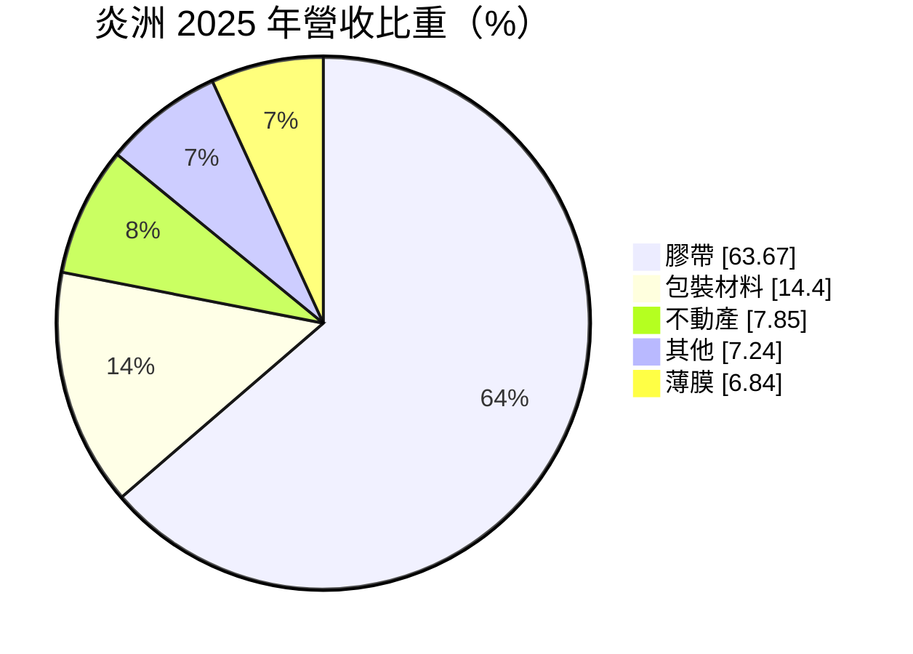
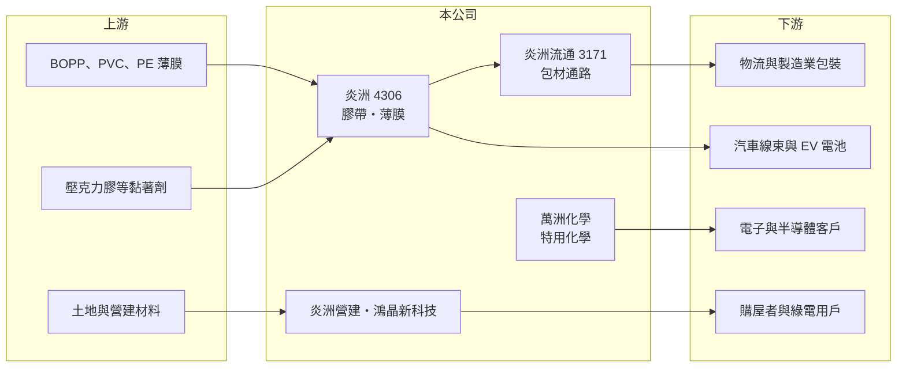

# 4306 炎洲

> 上市｜[[產業索引-塑膠工業|塑膠工業]]｜上市（櫃）日期 2008/01/21

# 第一章：企業模式與商業藍圖

> [!info] 撰寫說明
> 精簡版，由 Claude 依公開資料整理，架構比照 [[2330台積電]]，資料截至 2026-10-08。來源：Goodinfo 年度經營績效、富邦 e 點通（MoneyDJ）公司基本資料、富果研究 2026 年 9 月法說會整理。#待校對

本章說明炎洲（4306）以膠帶為核心、多角化經營的集團模式。

- **核心業務：** 炎洲成立於 1978 年，2000 年上櫃，總部在台北內湖，是台灣主要的[[膠帶]]製造商之一，產品包括 OPP、PVC、PE 膠帶、汽車線束膠帶與特殊膠帶，由炎洲與子公司萬洲化學生產。膠帶是工業與物流的基本耗材，需求跟著製造業與包裝出貨量走，單價低但用量穩定。
- **營收結構：** 依 2025 年營收比重，膠帶占 63.7%，包裝材料 14.4%，不動產 7.9%，薄膜 6.8%，其他 7.2%。依 2026 年上半年法說會的事業群分類，膠帶事業約 71%，流通事業 19%，房地產 5%，特用化學 3%，新能源 2%。
- **集團架構：** 流通事業由上櫃子公司 [[3171炎洲流通]] 經營，從事包材、包裝機台買賣與禮贈品設計，2025 年第三季併購後規模擴大；房地產由炎洲營建負責土地開發與營造；特用化學由萬洲化學發展半導體製程化學品與回收技術；新能源由鴻晶新科技經營太陽能 [[EPC]]、電廠維運與綠電交易。
- **長期方向：** 公司正把膠帶從一般包裝用往高階應用升級，例如 EV 電池 FPC 固定膠帶與汽車線束膠帶，並推動無溶劑 PVC 膠帶、回收再生薄膜等環保產品。特化方面，彰濱工業區新廠預計 2028 年第四季投產，定位為半導體與電子級特化品基地；中國上海嘉定的閒置廠房則在處分中。

# 第二章：護城河深度與競爭優勢

本章分析炎洲的護城河，以及多角化對競爭力的意義。

- **競爭優勢：** 炎洲在台灣膠帶市場經營近五十年，產品線齊全，從一般封箱膠帶到汽車線束膠帶都有，既有產線稼動率在八成以上。透過炎洲流通掌握包材通路與「包大師」品牌，等於同時擁有製造與通路，能把自家膠帶直接賣給中小企業客戶。
- **主要對手：** 膠帶市場的國際大廠有 3M、日東電工、德莎（tesa）等，在高階電子與汽車膠帶具技術領先；台灣與中國則有大量中小型膠帶廠在一般包裝膠帶削價競爭。炎洲的位置介於兩者之間，往高階升級是擺脫價格戰的主要途徑。
- **觀察重點：** 第一是車用與電子膠帶能否打入國際大型供應鏈，提高膠帶事業的毛利率。第二是彰濱特化新廠能否如期在 2028 年投產並通過客戶驗證。第三是房地產事業的交屋節奏，因為營建收入認列集中，會讓集團獲利年度間波動加大。

# 第三章：財務體質與盈利規模

資料日期：2026-10-08，表格是撰寫當時的快照；最新月營收、毛利率、累計 EPS 由自動排程寫在本筆記的屬性欄位（月營收、毛利率、累計EPS 等）。#待校對

本章用五年數字檢視炎洲集團的獲利能力與資本效率。

| 年度 | 營收（新台幣） | [[毛利率]] | [[營業利益率]] | EPS（元） | [[ROE]] |
|---|---|---|---|---|---|
| 2021 | 172 億 | 16.9% | 7.59% | 1.47 | 8.10% |
| 2022 | 147 億 | 17.7% | 7.16% | 1.72 | 9.88% |
| 2023 | 132 億 | 16.5% | 5.09% | 1.30 | 6.98% |
| 2024 | 159 億 | 16.5% | 6.47% | 1.27 | 6.71% |
| 2025 | 133 億 | 15.3% | 3.87% | 0.26 | 1.95% |

- **營收規模：** 合併營收在 130 至 170 億元之間，2021 至 2025 年年複合成長率約 -6.2%（推算）。營收起伏除了膠帶景氣，也受房地產交屋時點影響，例如有建案交屋的年度營收就會明顯跳升。
- **獲利：** 毛利率長年在 15% 至 18% 之間，營業利益率約 4% 至 8%，屬於薄利的工業耗材與通路模式。近五年平均 ROE 約 6.7%（推算），2025 年降到 1.95%。由於股本高達 67.7 億元，即使合併稅後淨利有 8 至 10 億元，換算 EPS 也只有 1 元多，股本規模本身就壓低了每股獲利。
- **財務特色：** 負債比例約 63%，遠高於一般膠帶廠，主因是房地產購地與在建工程需要大量資金。股本約 67.7 億元，Goodinfo 統計的歷年平均現金股利約 0.61 元，配發穩定但金額不高。法說會指出 2026 年上半年營業現金流出 1.5 億元，主因房地產購地與在建工程投入。
- **[[ROIC]] 與 [[WACC]]：** 2025 年營業利益約 5.15 億元（133 億 × 3.87%），以 20% 稅率計算稅後營業利益約 4.12 億元；歸屬母公司股東權益約 132 億元（每股淨值 19.49 元 × 6.77 億股），以負債比 63% 推算總負債約 225 億元、假設一半為有息負債約 112 億元，ROIC 約 1.7%（推算）；2022 年約 3.6%（推算）。WACC 以 CAPM 推估：無風險利率 1.75%、市場風險溢酬 6%，MoneyDJ 的 β 為 0.19 不具代表性，改用傳產同業常見值 0.8，股東權益成本約 6.55%；稅後負債成本約 2%，股權權重約 54%，WACC 約 4.5%（推算）。ROIC 長期低於 WACC，代表多角化與房地產占用了大量資本，卻沒有帶來足夠的本業報酬；膠帶本業若單獨計算，報酬率推估會高於集團整體。

# 第四章：總體風險與地緣政治

本章整理炎洲長期必須面對的風險。

- **產業週期：** 膠帶與包材需求跟著製造業出貨與物流量走，景氣下滑時訂單會同步減少。房地產事業則受台灣房市、利率與信用管制影響，交屋與銷售時程不確定。
- **營運風險：** 多角化讓集團橫跨膠帶、通路、營建、特化與新能源，管理複雜度高，資本分散到報酬率不同的事業，容易拉低整體 ROIC。特化新廠需要長時間客戶驗證，投資回收期長；建案也曾出現部分戶數涉及訴訟協商的情況。
- **其他風險：** 膠帶主要原料是 BOPP 薄膜、PVC 與壓克力膠等石化[[原物料]]，價格隨油價波動。高負債比使集團對利率上升較敏感；中國廠房處分與兩岸政策也會影響資產回收。

# 專有名詞解析

## 金融

- **[[ROIC]]**：投入資本報酬率，稅後營業利益除以投入資本，衡量本業運用資金創造報酬的能力。
- **[[WACC]]**：加權平均資金成本，股東與債權人要求報酬率的加權平均，ROIC 高於 WACC 才代表創造價值。

## 產業

- **[[膠帶]]**：在塑膠薄膜或紙基材上塗佈黏著劑的產品，用於封箱、電子固定、線束包覆與工業組裝。
- **[[OPP]]**：定向聚丙烯薄膜，透明、強度高，是封箱膠帶最常用的基材。
- **[[EPC]]**：設計（Engineering）、採購（Procurement）、施工（Construction）一次承包的工程模式。
- **[[原物料]]**：生產所需的基本原料，價格波動會直接影響下游廠商的成本與毛利。

# 核心供應鏈

- 上游：BOPP、PVC、PE 等塑膠薄膜與黏著劑原料，具體供應商未查得。
- 集團：子公司 [[3171炎洲流通]]（包材通路）、萬洲化學（膠帶與特化）、炎洲營建（房地產）、鴻晶新科技（太陽能）。
- 下游／客戶：物流與製造業包裝、汽車線束、EV 電池與電子製造客戶，具體客戶名單未查得。
- 同業：3M、日東電工、德莎等國際膠帶大廠，以及台灣與中國的中小型膠帶廠。

## 最新新聞
<!-- news:start（自動產生，請勿手動編輯此範圍） -->
- 2026-10-07 🏛️ 重訊 16:20｜公告本公司取得有價證券｜[觀測站](https://mops.twse.com.tw/mops/#/web/t05st01)

完整紀錄：[[4306炎洲 新聞]]
<!-- news:end -->

## 相關連結
- [公開資訊觀測站](https://mopsov.twse.com.tw/mops/web/t05st03?step=1&firstin=1&co_id=4306)
- [Goodinfo](https://goodinfo.tw/tw/StockDetail.asp?STOCK_ID=4306)
- [Yahoo 股市](https://tw.stock.yahoo.com/quote/4306)
- [鉅亨網新聞](https://www.cnyes.com/twstock/4306/news)
