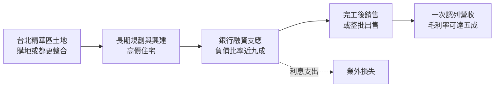
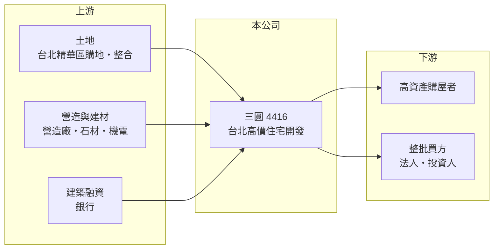

# 4416 三圓

> 上櫃｜[[產業索引-建材營造業|建材營造業]]｜上市（櫃）日期 2000/05/06

# 第一章：企業模式與商業藍圖

> [!info] 撰寫說明
> 本文由 Claude 依公開資料整理，架構比照 [[2330台積電]] 的四章研究，資料截至 2026-10-08。財務數字來源：MoneyDJ 理財網年度財務比率與損益表、櫃買中心開放資料（基本資料、2026 年第二季財報）；業務描述參考經濟日報、工商時報、旺得富（中時）的新聞標題。公開資料有限，個別建案內容與業外損益的組成未逐項查證。#待校對

在評估一家建商的長期價值時，第一步是看懂它鎖定的客群與產品，以及這種定位帶來的財務特性。本章針對三圓建設（股票代號：4416，以下簡稱三圓）的商業模式進行定性分析，說明一家以台北高價住宅為主的小型建商，為何同時具備高毛利與高財務風險兩種特徵。

## 一、核心定位：台北精華區的高價住宅開發商

三圓成立於 1979 年，2000 年在櫃買中心掛牌，總部位於台北市中山區南京東路，董事長為王雅萱，總經理為白昌明，實收資本額約 7.4 億元。公司以台北市精華地段的高價住宅為主要產品，依經濟日報報導，三圓曾以約 14.5 億元售出「敦北長城」建案的部分房地。

* **高單價、少戶數：** 高價住宅單戶總價高，一個建案只要賣出幾戶就能貢獻數億元營收。2026 年上半年營收約 21.6 億元，已超過 2025 年全年的 14.6 億元，顯示近年正處於交屋高峰。
* **營收在交屋時認列：** 和所有建商一樣，三圓採[[建案交屋]]認列營收。2018 至 2023 年營收每年只有約 0.7 億至 1.4 億元，可能以租金等其他收入為主（推估）；2024 年起建案完工，營收才明顯放大。

## 二、資本轉化邏輯：長時間持有土地的高槓桿模式

* **土地取得期長：** 台北精華區的土地取得往往需要整合多位地主，從購地到完工可能長達五年以上。期間的利息與持有成本，都會在財報上以業外損失或資本化成本的形式出現。
* **高財務槓桿：** 三圓的負債比率自 2018 年以來長期在 78% 至 89% 之間，2025 年約 88%。2026 年第二季底總資產約 135 億元，負債約 115 億元，股東權益只有約 19.4 億元。

## 三、長期方向：完成既有建案交屋、降低負債

三圓的長期關鍵在於把在建與待售的高價住宅順利變現。依新聞標題，政策衝擊使豪宅銷售卡關，公司以整批出售部分房地的方式回收資金。對高槓桿建商而言，交屋回收資金、償還融資、降低負債比率，是比擴大推案更優先的課題。

# 第二章：護城河深度與競爭優勢

護城河是企業抵禦競爭、長期維持超額利潤的機制。本章分析三圓在台北高價住宅市場的競爭優勢、主要對手，以及這些優勢能守住多少。

## 一、三圓護城河的核心組成要素

* **1. 稀缺的精華區土地：** 台北市精華區可開發土地極少，已經掌握在手的土地本身就是競爭優勢。只要地段夠好，產品就有長期的保值性與需求。
* **2. 高價產品的毛利空間：** 2021 至 2023 年[[毛利率]]超過 50%，2025 年約 36%，2026 年上半年約 56%。高價住宅的售價與土地成本之間差距大，是毛利率高的原因。
* **3. 長期經營的資歷：** 公司成立超過四十年，在台北累積的地主關係與產品經驗，有助於取得都更或整合型土地。

## 二、主要競爭對手格局

| 對手 | 定位 | 對三圓的威脅 |
|---|---|---|
| [[2545皇翔]] | 台北高價住宅開發 | 同一客群與地段直接競爭 |
| [[5534長虹]] | 台北住宅與商辦 | 在台北精華區搶地 |
| [[2520冠德]] | 台北老牌建商 | 品牌與規模優勢 |
| [[5522遠雄]]、[[2548華固]] | 豪宅與商辦 | 品牌知名度與資金成本優勢 |

## 三、優勢轉化：哪些守得住、哪些守不住

* **守得住：** 已握有的精華區土地與高毛利產品，只要能順利銷售，單一建案的獲利貢獻很大。
* **守不住：** 高價住宅的買方對[[信用管制]]與稅制最敏感，政策收緊時去化速度會大幅放慢。三圓的高負債使它無法長期等待，必要時只能整批出售。
* **觀察重點：** 第一，負債比率能否隨交屋明顯下降；第二，業外損失（推估以利息為主）能否隨融資償還而縮小；第三，下一批土地的取得與推案。

# 第三章：財務體質與盈利規模

資料日期：2026-10-08。數字取自 MoneyDJ 理財網年度財務資料與櫃買中心開放資料，表格是撰寫當時的快照；最新月營收、毛利率、累計 EPS 由自動排程寫在本筆記的屬性欄位（月營收、毛利率、累計EPS 等）。#待校對

財務報表是檢驗護城河是否真實存在的最終標準。本章用多年度的三率、ROE 與資本報酬，檢視三圓的獲利品質與財務風險。

## 一、獲利能力的基石：三率

| 年度 | 營收（新台幣） | [[毛利率]] | [[營業利益率]] | EPS（元） | [[ROE]] |
|---|---|---|---|---|---|
| 2021 | 0.91 億 | 52.0% | -41.6% | 17.34 | 56.8% |
| 2022 | 0.96 億 | 54.2% | 0.36% | -4.71 | -13.5% |
| 2023 | 1.17 億 | 54.8% | 23.6% | -0.03 | -0.09% |
| 2024 | 4.04 億 | 27.0% | 14.1% | 0.10 | 0.34% |
| 2025 | 14.6 億 | 35.6% | 24.4% | -0.64 | -2.64% |

資料來源：MoneyDJ 理財網年度損益表與財務比率。2026 年上半年（櫃買中心資料）營收約 21.6 億元、毛利率約 56.3%、營業利益率約 52.2%、業外損失約 8.31 億元、EPS 3.87 元。

這張表最重要的訊息是：營業利益和最終獲利常常不一致。2021 年營業虧損，卻有稅後淨利約 9.8 億元、EPS 17.34 元，應來自處分資產等[[一次性收益]]（推估）；2025 年營業利益約 3.55 億元，最後卻是稅後虧損約 0.44 億元，2026 年上半年也有約 8.31 億元的業外損失，推估主要是建案完工後不再資本化的利息費用與其他財務成本。對三圓而言，本業毛利率高，但財務成本會吃掉大部分利潤。

## 二、營建業指標：推案量、已售未入帳與存貨

公司未公開完整的推案量與[[已售未入帳]]金額（未查得）。2026 年第二季底流動資產約 115 億元，約為 2025 年營收的八倍，代表大量資金仍壓在土地與待售房地上。流動負債約 69.5 億元、非流動負債約 45.6 億元，負債比率約 86%。

## 三、[[ROE]] 與股利

2021 至 2025 年平均 ROE 約 8.2%（推算），但幾乎全部來自 2021 年的一次性獲利；扣除該年度，其餘四年平均 ROE 為負。依櫃買中心資料，目前未配發現金股利。股東權益只有約 19.4 億元，低股本加上高負債，使 EPS 對單一交易非常敏感。

## 四、[[ROIC]] 與 [[WACC]]：價值創造利差

**ROIC 推算：** 2025 年營業利益約 3.55 億元，稅後約 2.84 億元。官方資料只揭露負債總計約 115 億元，假設其中六成為有息負債約 69.1 億元（推估），加上股東權益約 19.4 億元，投入資本約 88.5 億元，ROIC 約 3.2%（推算）；以 2021 至 2025 年平均營業利益計算約 0.7%（推算）。

**WACC 推算：** 台灣 10 年期公債殖利率取 1.75%、市場風險溢酬 6%、β 取營建同業常見值 0.9（未查得公司實際 β；高槓桿下實際 β 可能更高），股東權益成本約 7.2%。負債成本假設 3%，稅率 20%，稅後約 2.4%。權益只占投入資本約 22%，WACC 約 3.4%（推算）。

**結論：** 三圓的 ROIC 長期低於或接近 WACC，2026 年上半年的高毛利交屋才讓單期報酬明顯改善。這家公司的價值主要取決於手中土地的市值能否在償還債務後留下足夠的股東權益，而不是穩定的經營報酬。

# 第四章：總體風險與地緣政治

任何企業都無法脫離宏觀環境獨立存在。本章分析三圓長期必須面對的政策、財務與營運風險。

## 一、政策與產業週期風險

* **高價住宅最受政策影響：** 央行[[信用管制]]對高價住宅的貸款成數限制最嚴，房地合一稅與囤房稅也主要衝擊高總價產品。依新聞標題，政策衝擊已使豪宅銷售卡關。
* **房市週期：** 高價住宅的買方多為資產族群，對景氣、股市與利率的變化較敏感，景氣轉弱時成交量下降最快。

## 二、財務風險

* **高負債與利息負擔：** 負債比率長期接近九成，是本文涵蓋的建商中財務槓桿最高的一群。建案完工後的利息費用直接衝擊獲利，若銷售延遲，利息會持續侵蝕股東權益。
* **融資續借：** 高槓桿建商依賴銀行持續展延融資，若銀行收緊不動產放款，可能被迫降價出售資產。
* **低股東權益：** 股東權益約 19.4 億元，對照百億以上的資產，若房價下跌一成，就可能大幅侵蝕淨值。

## 三、營運風險

* **案量集中：** 營收依賴少數高價建案，單一建案的銷售成績就決定整年的盈虧。
* **一次性損益：** 財報常受處分資產、整批出售或利息資本化影響，投資人不宜用單年 EPS 推估常態獲利。

# 專有名詞解析

## 金融

- **[[一次性收益]]**：處分資產、土地或投資等不會每年重複的收益，會讓單期 EPS 偏離本業實力。
- **[[信用管制]]**：央行限制購屋與建商貸款成數的政策，會影響房市成交與建商資金。
- **[[ROIC]]**：投入資本報酬率，稅後營業利益除以股東權益加有息負債，衡量本業運用資本的效率。
- **[[WACC]]**：加權平均資金成本，股東與債權人要求報酬率的加權平均，是 ROIC 要超越的門檻。

## 產業

- **[[建案交屋]]**：建商在房屋完工並交付買方時才認列營收，因此營建公司的營收常集中在交屋年度。
- **[[已售未入帳]]**：已經賣出、但尚未完工交屋而未認列營收的建案金額，是建商未來營收的主要能見度指標。

# 核心供應鏈

## 1. 上游：土地、營造與資金
- 土地來源：台北市精華區購地與整合
- 營造：外部發包營造廠（合作對象未查得）；建材如 [[1101台泥]]、[[2002中鋼]]
- 資金：銀行建築與土地融資

## 2. 中游：三圓與同業
- 台北高價住宅同業：[[2545皇翔]]、[[5534長虹]]、[[2520冠德]]

## 3. 下游：客戶
- 台北高資產購屋者、整批承購的法人或投資人

## 最新新聞
<!-- news:start（自動產生，請勿手動編輯此範圍） -->
- 2026-10-07 🏛️ 重訊 15:05｜公告本公司可轉換公司債到期還款說明｜[觀測站](https://mops.twse.com.tw/mops/#/web/t05st01)
- 2026-10-07 🏛️ 重訊 15:05｜公告本公司關係人遭臺灣臺北地方法院民事裁定事宜｜[觀測站](https://mops.twse.com.tw/mops/#/web/t05st01)
- 2026-10-05 🏛️ 重訊 16:37｜公告本公司之關係人退票事宜｜[觀測站](https://mops.twse.com.tw/mops/#/web/t05st01)
- 2026-10-05 🏛️ 重訊 16:36｜公告本公司本週到期票據、應償還借款及利息等相關資訊｜[觀測站](https://mops.twse.com.tw/mops/#/web/t05st01)
- 2026-10-05 🏛️ 重訊 16:36｜公告本公司可轉換公司債到期還款計劃說明｜[觀測站](https://mops.twse.com.tw/mops/#/web/t05st01)

完整紀錄：[[4416三圓 新聞]]
<!-- news:end -->

## 相關連結
- [公開資訊觀測站](https://mopsov.twse.com.tw/mops/web/t05st03?step=1&firstin=1&co_id=4416)
- [Goodinfo](https://goodinfo.tw/tw/StockDetail.asp?STOCK_ID=4416)
- [Yahoo 股市](https://tw.stock.yahoo.com/quote/4416)
- [鉅亨網新聞](https://www.cnyes.com/twstock/4416/news)
