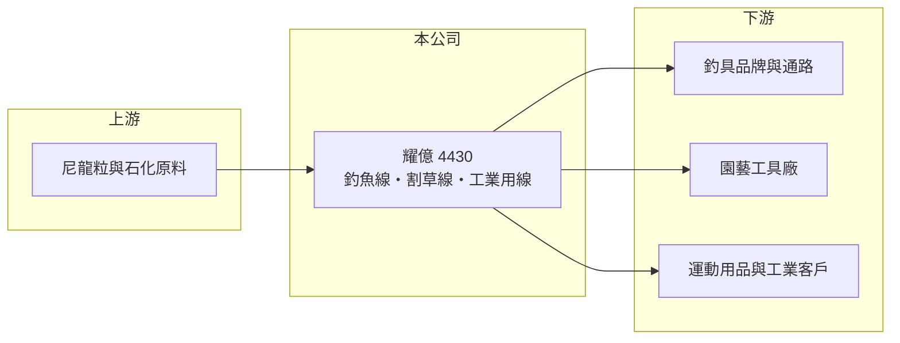

# 4430 耀億

> 上櫃｜[[產業索引-其他業|其他業]]｜上市（櫃）日期 2011/06/09

# 第一章：企業模式與商業藍圖

> [!info] 撰寫說明
> 精簡版，由 Claude 依公開資料整理，架構比照 [[2330台積電]]，資料截至 2026-10-07。來源：nStock 耀億公司簡介、winvest 營收快訊。#待校對

耀億是線材製造廠，產品涵蓋釣魚線、割草線、球拍線與工業用線，以外銷為主。

- **核心業務：** 製造釣魚線、[[割草線]]、尼龍線、工業用線、羽球與網球拍線，以及[[不織布]]製品與寬緊帶。
- **營收結構：** 本次未查到各產品營收比重。
- **營運據點：** 本次未查到具體營運據點；營業項目載明以外銷為主。
- **長期方向：** 2026 年營收回升，觀察能否帶動獲利轉正。

# 第二章：護城河深度與競爭優勢

耀億的產品屬於利基型線材，但多數品項技術門檻不高。

- **競爭優勢：** 產品線涵蓋休閒、運動與工業多種用途，可分散單一市場風險（推估）。
- **主要對手：** 日本與中國的釣魚線、割草線及尼龍單絲廠商（推估）。
- **觀察重點：** 2026 年 8 月營收年增 31.7%，觀察成長能否反映到毛利率與 EPS。

# 第三章：財務體質與盈利規模

資料日期：2026-10-07，以下數字是撰寫當時的快照；最新月營收、毛利率、累計 EPS 由自動排程寫在本筆記的屬性欄位（月營收、毛利率、累計EPS 等）。#待校對

耀億營收規模約 20 億元，但近期處於小幅虧損。

- **營收規模：** 2025 年全年營收 20.38 億元；2026 年 1 至 8 月累計 15.54 億元，年增 9.92%，8 月營收 2.06 億元，年增 31.7%。
- **獲利：** 2025 年全年 EPS -0.19 元；2026 年第二季 EPS -0.12 元，[[毛利率]] 21.34%。
- **財務特色：** 營收成長但仍未獲利，費用與業外項目侵蝕本業毛利（推估）。

# 第四章：總體風險與地緣政治

耀億的風險在於原料價格、匯率與外銷需求。

- **產業週期：** 釣具與園藝產品需求受歐美消費景氣與季節影響。
- **營運風險：** 尼龍原料屬石化產品，價格隨油價波動，影響毛利率。
- **其他風險：** 以外銷為主，新台幣升值會壓縮營收與毛利；美國關稅政策亦可能影響出口。

# 專有名詞解析

## 金融

- **[[毛利率]]**：毛利除以營收，反映產品或服務本身的獲利能力。

## 產業

- **[[割草線]]**：裝在割草機上、以高速旋轉切割草叢的尼龍線，屬於消耗品。
- **[[不織布]]**：不經紡織、以纖維直接黏合或熱壓成型的布料，用於衛材、過濾與包裝。

# 核心供應鏈

- 上游：尼龍粒與石化原料供應商（推估）
- 下游／客戶：釣具品牌、園藝工具廠、球拍與運動用品廠、工業客戶（推估）
- 同業：國內外尼龍單絲與釣魚線廠（本次未查到具體名單）

## 最新新聞
<!-- news:start -->
<!-- news:end -->

## 相關連結
- [公開資訊觀測站](https://mopsov.twse.com.tw/mops/web/t05st03?step=1&firstin=1&co_id=4430)
- [Goodinfo](https://goodinfo.tw/tw/StockDetail.asp?STOCK_ID=4430)
- [Yahoo 股市](https://tw.stock.yahoo.com/quote/4430)
- [鉅亨網新聞](https://www.cnyes.com/twstock/4430/news)
