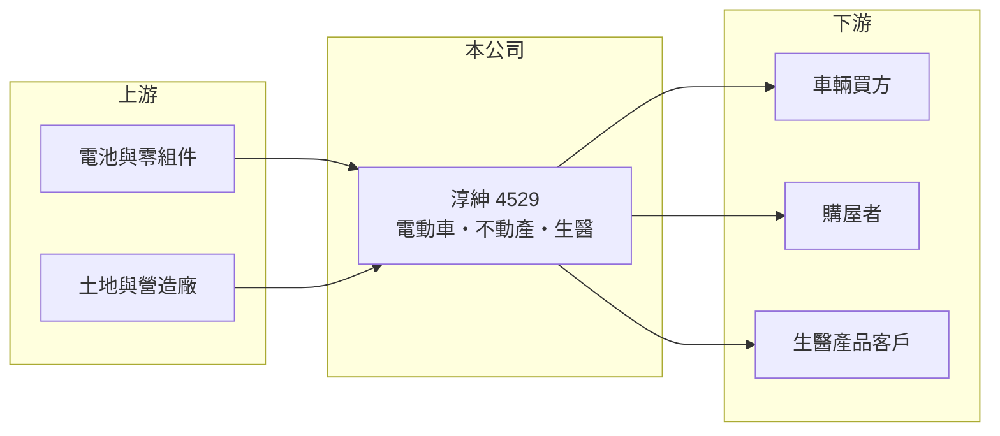

# 4529 淳紳

> 上櫃｜[[產業索引-其他業|其他業]]｜上市（櫃）日期 2001/05/04

# 第一章：企業模式與商業藍圖

> [!info] 撰寫說明
> 精簡版，由 Claude 依公開資料整理，架構比照 [[2330台積電]]，資料截至 2026-10-07。來源：nStock 淳紳公司簡介、winvest 營收快訊。公開資料有限。#待校對

淳紳是營收規模很小的公司，業務橫跨電動車、不動產開發與生醫科技。

- **核心業務：** 營業項目包括[[電動車]]開發製造銷售、投資、不動產開發與生醫科技業務。
- **營收結構：** 本次未查到各業務營收比重。
- **營運據點：** 本次未查到具體營運據點資訊。
- **長期方向：** 2026 年營收較低基期大幅成長，但規模仍小，本次未查到具體發展計畫。

# 第二章：護城河深度與競爭優勢

淳紳採[[多角化經營]]，每項業務規模都小，目前看不出明顯護城河。

- **競爭優勢：** 本次未查到明確的技術、品牌或規模優勢。
- **主要對手：** 電動車、建商與生醫業者眾多，競爭者規模多遠大於公司。
- **觀察重點：** 營收能否持續放大，並找出主要獲利來源。

# 第三章：財務體質與盈利規模

資料日期：2026-10-07，以下數字是撰寫當時的快照；最新月營收、毛利率、累計 EPS 由自動排程寫在本筆記的屬性欄位（月營收、毛利率、累計EPS 等）。#待校對

淳紳營收從極低基期回升，但仍處於虧損。

- **營收規模：** 2025 年全年營收 0.05 億元；2026 年 1 至 9 月累計 0.18 億元，年增 328.02%，8 月營收 206.8 萬元。
- **獲利：** 2025 年全年 EPS -0.74 元；2026 年第二季 EPS -0.13 元，[[毛利率]] 42.88%。
- **財務特色：** 資本額 8.45 億元，近五年無配息。

# 第四章：總體風險與地緣政治

淳紳的風險在於業務尚未形成規模與持續虧損。

- **產業週期：** 電動車市場競爭激烈且價格下滑；不動產受房市景氣與政策影響。
- **營運風險：** 營收不足以支應營運費用，虧損持續會侵蝕淨值。
- **其他風險：** 生醫業務需法規審查，投入期長且結果不確定。

# 專有名詞解析

## 應用

- **[[電動車]]**：以電池與馬達驅動的車輛，包括電動機車與電動汽車。

## 金融

- **[[毛利率]]**：毛利除以營收，反映產品或服務本身的獲利能力。

## 產業

- **[[多角化經營]]**：同時經營多個不相關業務，可分散風險，但資源分散時各業務難以形成規模。

# 核心供應鏈

- 上游：電池與車用零組件供應商、土地與營造廠（推估）
- 下游／客戶：車輛買方、購屋者、生醫產品客戶（推估）
- 同業：電動車業者、建商與生醫公司（本次未查到具體名單）

## 最新新聞
<!-- news:start（自動產生，請勿手動編輯此範圍） -->
- 2026-10-05 📰 媒體 18:50｜營收速報 - 淳紳(4529)9月營收265萬元年增率高達452.19％｜[鉅亨網](https://news.cnyes.com/news/id/6621911)

完整紀錄：[[4529淳紳 新聞]]
<!-- news:end -->

## 相關連結
- [公開資訊觀測站](https://mopsov.twse.com.tw/mops/web/t05st03?step=1&firstin=1&co_id=4529)
- [Goodinfo](https://goodinfo.tw/tw/StockDetail.asp?STOCK_ID=4529)
- [Yahoo 股市](https://tw.stock.yahoo.com/quote/4529)
- [鉅亨網新聞](https://www.cnyes.com/twstock/4529/news)
