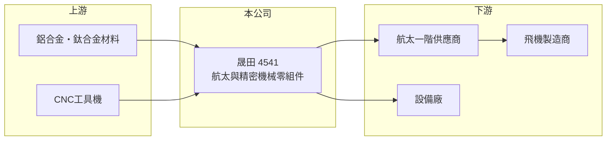

# 4541 晟田

> 上櫃｜[[產業索引-其他業|其他業]]｜上市（櫃）日期 2014/07/22

# 第一章：企業模式與商業藍圖

> [!info] 撰寫說明
> 精簡版，由 Claude 依公開資料整理，架構比照 [[2330台積電]]，資料截至 2026-10-07。來源：nStock 晟田公司簡介、winvest 營收快訊。產品細節本次未查到原始資料，標示推估。#待校對

晟田是機械與航空器零組件製造廠，2026 年營收明顯成長，單月營收創十年同期新高。

- **核心業務：** 登記營業項目為機械設備、航空器及一般儀器製造，推估以[[CNC]]精密加工生產[[航太零組件]]與設備零件。
- **營收結構：** 本次未查到各產品營收比重。
- **營運據點：** 本次未查到具體據點資訊，推估生產基地在台灣。
- **長期方向：** 受惠航空業復甦與設備需求，2026 年營收持續雙位數年增（推估方向）。

# 第二章：護城河深度與競爭優勢

航太零件需要長時間認證，進入門檻較高，是晟田主要的競爭基礎。

- **競爭優勢：** 航太供應鏈須取得[[AS9100]]等品質認證並通過客戶審核，新進者不易切入（推估）。
- **主要對手：** 國內航太零件廠如[[2634漢翔]]、[[4572駐龍]]等（推估）。
- **觀察重點：** 2026 年 6 至 8 月營收年增 23% 至 59%，觀察成長能否延續並反映在毛利率。

# 第三章：財務體質與盈利規模

資料日期：2026-10-07，以下數字是撰寫當時的快照；最新月營收、毛利率、累計 EPS 由自動排程寫在本筆記的屬性欄位（月營收、毛利率、累計EPS 等）。#待校對

晟田 2025 年獲利穩定，2026 年營收持續成長。

- **營收規模：** 2025 年全年營收 16.44 億元；2026 年 6 月營收 1.99 億元（年增 58.68%）、7 月 1.95 億元（年增 39.16%）、8 月 1.75 億元（年增 23.57%）。
- **獲利：** 2025 年全年 EPS 2.03 元；2026 年第二季[[毛利率]] 26.99%。
- **財務特色：** 精密加工屬資本密集，產能擴充需持續投入機台設備（推估）。

# 第四章：總體風險與地緣政治

晟田的風險在於航空業景氣與客戶集中。

- **產業週期：** 航太零件需求跟隨飛機製造商交機進度，波音與空中巴士的產能調整會直接影響訂單。
- **營運風險：** 推估客戶集中於少數航太與設備廠，單一客戶訂單變化影響大。
- **其他風險：** 以美元計價的外銷比重推估較高，新台幣升值會壓縮毛利；鋁、鈦等金屬原料價格波動也影響成本。

# 專有名詞解析

## 金融

- **[[毛利率]]**：毛利除以營收，反映產品或服務本身的獲利能力。

## 產業

- **[[CNC]]**：電腦數值控制加工，以程式控制機台進行切削，用於高精度金屬零件。
- **[[航太零組件]]**：飛機結構件、引擎零件與內裝件等，需通過嚴格品質認證才能供貨。
- **[[AS9100]]**：航太產業的品質管理系統標準，是進入航太供應鏈的基本門檻。

# 核心供應鏈

- 上游：鋁合金與鈦合金材料商、工具機廠（推估）
- 下游／客戶：航太一階供應商、波音與空中巴士供應鏈、設備廠（推估）
- 同業：[[2634漢翔]]、[[4572駐龍]]等航太零件廠（推估）

## 最新新聞
<!-- news:start（自動產生，請勿手動編輯此範圍） -->
- 2026-10-06 🏛️ 重訊 15:30｜公告本公司115年現金增資收足股款暨增資基準日｜[觀測站](https://mops.twse.com.tw/mops/#/web/t05st01)

完整紀錄：[[4541晟田 新聞]]
<!-- news:end -->

## 相關連結
- [公開資訊觀測站](https://mopsov.twse.com.tw/mops/web/t05st03?step=1&firstin=1&co_id=4541)
- [Goodinfo](https://goodinfo.tw/tw/StockDetail.asp?STOCK_ID=4541)
- [Yahoo 股市](https://tw.stock.yahoo.com/quote/4541)
- [鉅亨網新聞](https://www.cnyes.com/twstock/4541/news)
