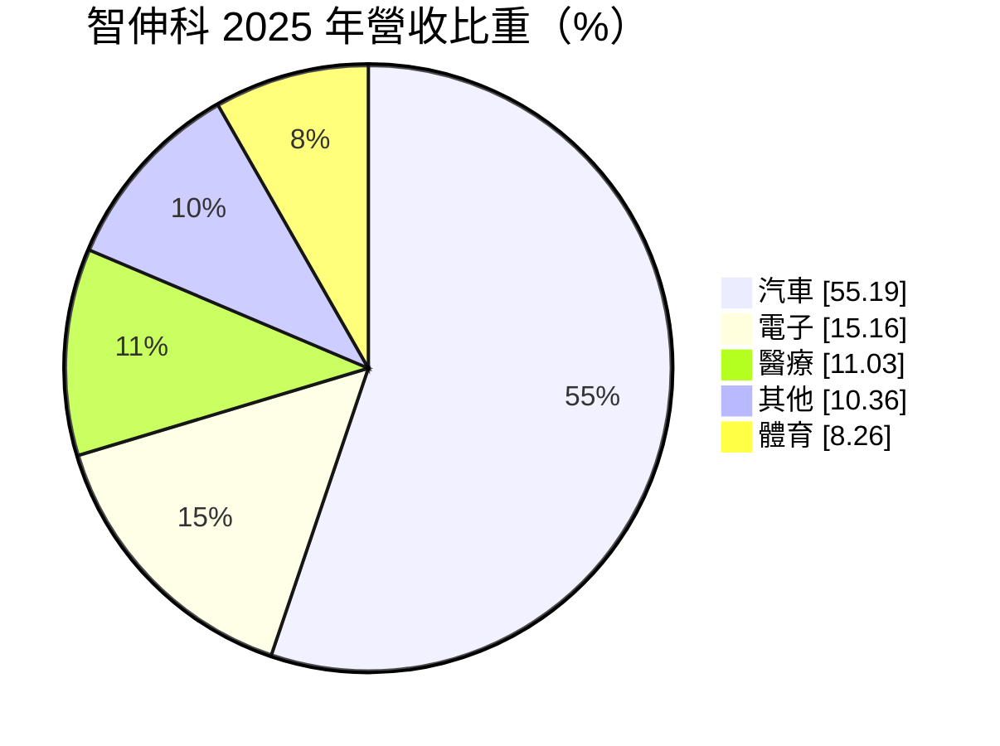
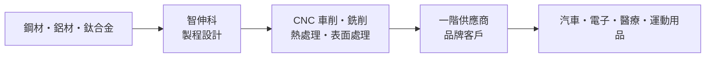
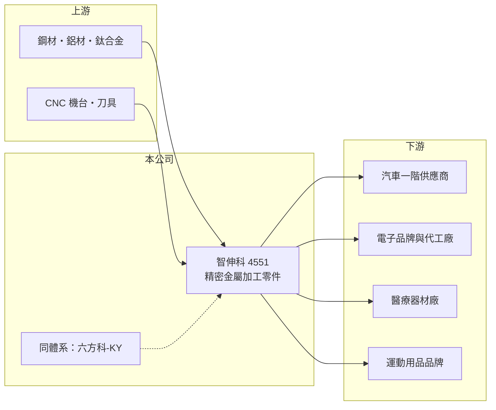

# 4551 智伸科

> 上市｜[[產業索引-汽車工業|汽車工業]]｜上市（櫃）日期 2015/08/10

# 第一章：企業模式與商業藍圖

> [!info] 撰寫說明
> 本文由 Claude 依公開資料整理，架構比照 [[2330台積電]] 的四章研究，資料截至 2026-10-08。財務數字來源：Goodinfo 台灣股市資訊網年度經營績效、MoneyDJ 理財網個股基本資料（營收比重）、證交所開放資料（本筆記 _data 快照）。產品應用、據點與集團關係憑既有知識整理並標「待校對」。#待校對

在評估單一個股的長期投資價值時，首要步驟是拆解企業的底層獲利邏輯。本章說明智伸科（股票代號：4551）如何以精密金屬加工，橫跨汽車、電子、醫療與運動用品四個市場。

## 一、核心定位：多產業的精密金屬零件廠

智伸科成立於 1987 年，2015 年上市。依 MoneyDJ，2025 年營收中汽車占 55.19%、電子 15.16%、醫療 11.03%、其他 10.36%、體育 8.26%。董事長為法人六方精機股份有限公司（MoneyDJ），與 [[4569六方科-KY]] 同屬六方體系（集團關係細節待校對）。

智伸科的核心能力是[[CNC 車削]]、銑削與後段處理的精密金屬加工，產品例如汽車的燃油、煞車、轉向系統零件，電子產品的金屬結構件，醫療器材的骨科或手術器械零件，以及運動用品的金屬件（產品細項待校對）。同一套加工能力服務多個產業，是它與單一產業零件廠最大的不同。

## 二、資本轉化邏輯

精密加工是資本密集的生意，需要大量 CNC 機台，但只要[[產能利用率]]高、良率穩定，就能維持不錯的毛利率。智伸科 2019 至 2022 年毛利率約 26% 至 28%、營業利益率約 17%（Goodinfo），在零件業中屬於高水準。多產業布局的好處是單一產業景氣下滑時，其他產業可以部分抵銷。

## 三、企業長期方向

智伸科的長期方向是提高醫療與電子等高附加價值產品比重，並跟著客戶在中國以外的地區布局產能（推估）。資本配置上配息穩定，2025 年度現金股利 4.2 元，以 EPS 6.04 元計算配息率約 70%（推算）。2026 年 1 至 8 月營收 61.8 億元，較前一年同期 51.1 億元成長約 21%（證交所開放資料）。

# 第二章：護城河深度與競爭優勢

在長期價值投資中，「護城河」指企業抵禦競爭、維持超額利潤的保護機制。本章分析智伸科的優勢。

## 一、護城河的核心組成要素

* **1. 多產業的認證資格：** 汽車需要 IATF 16949、醫療需要 ISO 13485 等品質系統認證（待校對），取得這些資格需要多年的投資與紀錄，新進者難以同時跨入多個產業。
* **2. 製程經驗與良率：** 精密零件的公差常在微米等級，長期累積的製程參數與治具設計決定良率與成本，這是智伸科毛利率高於一般加工廠的原因。
* **3. 客戶分散：** 四大產業加上多個客戶，降低單一客戶或單一產業的風險。

## 二、主要對手

| 對手 | 定位 | 對智伸科的威脅 |
|---|---|---|
| 中國精密加工廠 | 成本低、產能大 | 在一般汽車零件上價格競爭 |
| 歐美日精密零件廠 | 高階醫療與汽車零件 | 品牌與實績較深 |
| [[4569六方科-KY]] | 同體系精密加工 | 業務部分重疊（分工待校對） |

## 三、守得住／守不住／觀察重點

* **守得住：** 需要認證的醫療零件，以及高精度的汽車安全零件。
* **守不住：** 一般加工件的價格，以及燃油車相關零件的長期需求。
* **觀察重點：** 2023 年毛利率降到 21.7%，2025 年回到 23.1%、2026 年上半年 24.03%，能否回到 27% 左右的高峰是判斷競爭力是否恢復的指標。

# 第三章：財務體質與盈利規模

資料日期：2026-10-08。數字取自 Goodinfo 年度經營績效與證交所開放資料快照，表格是撰寫當時的快照；最新月營收、毛利率、累計 EPS 由自動排程寫在本筆記的屬性欄位（月營收、毛利率、累計EPS 等）。#待校對

財務報表是檢驗護城河是否真實存在的最終標準。本章用多年度數字檢視智伸科的獲利品質。

## 一、多年度三率與 ROE

| 年度 | 營收（新台幣） | [[毛利率]] | [[營業利益率]] | EPS（元） | [[ROE]] |
|---|---|---|---|---|---|
| 2021 | 88.1 億 | 27.6% | 17.6% | 10.47 | 18.0% |
| 2022 | 92.4 億 | 27.1% | 17.6% | 12.20 | 18.2% |
| 2023 | 71.2 億 | 21.7% | 10.1% | 4.47 | 6.4% |
| 2024 | 76.9 億 | 20.3% | 10.3% | 8.29 | 11.4% |
| 2025 | 78.2 億 | 23.1% | 13.4% | 6.04 | 7.82% |
| 2026 上半年 | 45.5 億 | 24.03% | 14.40% | 4.77 | 未查得 |

* **[[毛利率]]：** 2021 至 2022 年約 27%，2023 至 2024 年降到 20% 至 22%，近期回升。
* **[[營業利益率]]：** 長期維持兩位數，2026 年上半年 14.40%，是本業體質穩健的證明。
* **長期指標：** 2020 至 2025 年營收年複合成長率約 1.8%（推算）；2021 至 2025 年平均 ROE 約 12.4%（推算）。Goodinfo 統計歷年平均現金股利約 3.76 元，配息穩定。

## 二、財務結構

2026 年第二季底資產 148.3 億元、負債 55.8 億元，負債比約 38%，每股淨值 80.32 元（證交所開放資料），財務結構穩健。

## 三、[[ROIC]] 與 [[WACC]]

2025 年營業利益約 10.5 億元（78.2 億元 × 13.4%），稅後約 8.4 億元。投入資本以權益 92.5 億元加非流動負債 6.7 億元近似（約 99.2 億元，有息負債細項未查得），ROIC 約 8.4%（推算）；2022 年高峰時營業利益約 16.3 億元、稅後約 13.0 億元，以相同資本基礎約 13%（推算）。WACC 以 CAPM 推估：無風險利率 1.5% 至 2%、市場風險溢酬 6%、β 未查得，取 1.0（假設），權益成本約 7.5% 至 8%；負債成本假設 3%，負債約占資本兩成，WACC 約 6.5% 至 7%（推算）。ROIC 長期高於 WACC，雖然 2023 年後利差縮小，智伸科整體仍在創造價值。

# 第四章：總體風險與地緣政治

任何企業都無法脫離宏觀環境獨立存在。本章整理智伸科長期必須面對的風險。

## 一、地緣政治與政策

* **生產據點與關稅：** 若部分產能在中國（待校對），美國關稅與供應鏈移轉要求可能迫使公司增加海外投資。

## 二、產業週期與市場結構

* **燃油車零件需求下降：** 汽車占營收過半，若產品集中在引擎、燃油系統，電動化會長期壓縮需求；轉向電動車零件是必要的調整。
* **電子與運動用品循環：** 消費性產品需求波動大，2023 年營收下滑約兩成即反映多產業同時降溫。

## 三、營運風險

* **原物料與人力：** 鋼材、鈦合金價格與技術人力成本上升會壓縮毛利。
* **匯率：** 外銷比重高（推估），新台幣升值會影響獲利。

## 四、技術演進

* **自動化與新製程：** 金屬 3D 列印與一體化成形可能取代部分切削加工，智伸科需要持續投資自動化以維持成本優勢。

# 專有名詞解析

## 金融

- **[[產能利用率]]**：實際產出占總產能的比例，固定成本高的製造業毛利率高度取決於此數字。
- **[[ROIC]]**：投入資本報酬率，衡量公司用股東與債權人資金創造本業稅後利潤的效率。
- **[[WACC]]**：加權平均資金成本，依股權與負債比重加權的資金成本，是 ROIC 要超過的門檻。

## 產業

- **[[CNC 車削]]**：以電腦數值控制的車床切削旋轉中的金屬棒材，做出軸、套筒等圓形精密零件。
- **[[IATF 16949]]**：汽車產業的品質管理系統標準，是供應汽車零件的基本門檻。
- **[[ISO 13485]]**：醫療器材產業的品質管理系統標準，醫療零件供應商必須取得。

# 核心供應鏈

## 1. 上游：原物料與設備
- 鋼材、鋁材、鈦合金，CNC 機台與刀具（供應商名稱未查得）

## 2. 中游：智伸科本身
- 精密車削、銑削、熱處理與表面處理
- 同體系：[[4569六方科-KY]]（關係待校對）

## 3. 下游：客戶
- 汽車一階供應商、電子、醫療器材與運動用品品牌（客戶名單未查得）

## 4. 同業
- 台股精密零件：[[4569六方科-KY]]、[[2250IKKA-KY]]

## 最新新聞
<!-- news:start -->
<!-- news:end -->

## 相關連結
- [公開資訊觀測站](https://mopsov.twse.com.tw/mops/web/t05st03?step=1&firstin=1&co_id=4551)
- [Goodinfo](https://goodinfo.tw/tw/StockDetail.asp?STOCK_ID=4551)
- [Yahoo 股市](https://tw.stock.yahoo.com/quote/4551)
- [鉅亨網新聞](https://www.cnyes.com/twstock/4551/news)
