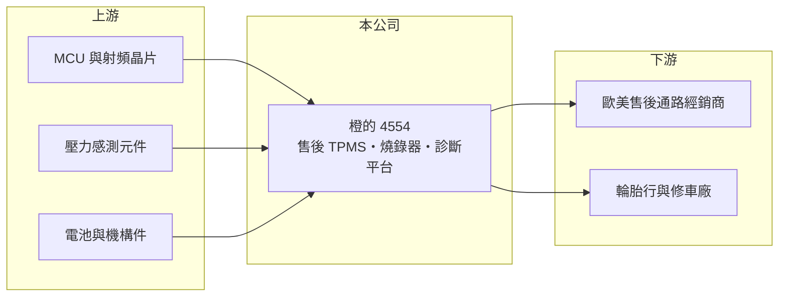

# 4554 橙的

> 上櫃｜[[產業索引-其他電子業|其他電子業]]｜上市（櫃）日期 2016/08/05

# 第一章：企業模式與商業藍圖

> [!info] 撰寫說明
> 精簡版，由 Claude 依公開資料整理，架構比照 [[2330台積電]]，資料截至 2026-10-07。來源：旺得富／中時（2026 年 5 月橙的營運報導）、nstock.tw 橙的公司概況、winvest.tw 營收快訊。營收比重未查到。#待校對

橙的是專做胎壓偵測系統的車用電子廠，主攻歐美售後維修市場。

- **核心業務：** 橙的電子以胎壓偵測系統（[[TPMS]]）為主，搭配自行研發、取得多國專利的燒錄器，提供「零件、診斷、軟體校正與系統整合」的完整服務。
- **營收結構：** 本次未查到產品與地區比重；主要客戶為歐美[[售後市場]]的通路與維修廠。
- **營運據點：** 公司位於台中中部科學園區。
- **長期方向：** 推動「經銷加直營」轉型，在德國約 5,500 家輪胎與修車通路中已打入逾 3,000 家，計畫複製到其他歐洲主要市場。

# 第二章：護城河深度與競爭優勢

橙的的優勢在售後市場的軟體與通路，而非單純賣感測器。

- **競爭優勢：** 售後 TPMS 需要針對不同車款燒錄設定，橙的以專利燒錄器與數位平台綁定維修廠，提高通路黏著度。
- **主要對手：** [[2231為升]]、[[1536和大]]（推估），以及 Schrader、Continental 等國際 TPMS 大廠。
- **觀察重點：** 第一季因晶片短缺毛利率降到 39%，第二季回升至 48.2%，需追蹤替代晶片方案是否已完全解決供貨問題。

# 第三章：財務體質與盈利規模

資料日期：2026-10-07，以下數字是撰寫當時的快照；最新月營收、毛利率、累計 EPS 由自動排程寫在本筆記的屬性欄位（月營收、毛利率、累計EPS 等）。#待校對

橙的年營收約 5 億元，毛利率高但季度獲利起伏大。

- **營收規模：** 2025 年全年營收 4.93 億元；2026 年 1 至 8 月累計 3.55 億元、年增 10.74%，8 月營收 4,365 萬元。
- **獲利：** 2025 年全年 EPS 2.12 元；2026 年第一季 EPS 0.04 元、毛利率 39%，第二季 EPS 0.88 元、[[毛利率]] 48.2%。
- **財務特色：** 2025 年度配發現金股利 0.5 元與股票股利 1.5 元，近五年平均現金股利 0.75 元。

# 第四章：總體風險與地緣政治

橙的的風險在於晶片供應、歐洲市場集中與匯率。

- **產業週期：** 售後市場需求跟著車齡與換胎頻率，歐洲平均車齡達 12.7 年有利維修需求，但景氣差時車主可能延後更換。
- **營運風險：** 關鍵晶片短缺曾直接壓低毛利率；營收規模小，單一通路或大客戶變動影響明顯。
- **其他風險：** 營收以歐元、美元計價，匯率波動影響獲利；歐美 TPMS 法規與車廠原廠規格變化。

# 專有名詞解析

## 應用

- **[[TPMS]]**：胎壓偵測系統，以輪胎內的感測器即時回報胎壓與溫度，美國與歐盟已強制新車配備。

## 金融

- **[[毛利率]]**：毛利除以營收，代表產品扣除直接成本後的獲利空間。

## 產業

- **[[售後市場]]**：車輛出廠後的維修、保養與零件更換市場，相對於供應車廠新車的前裝市場。

# 核心供應鏈

- 上游：MCU 與射頻晶片、壓力感測元件、電池與機構件供應商
- 下游／客戶：歐美售後市場經銷商、德國等地輪胎行與修車廠
- 同業：[[2231為升]]、[[1536和大]]、Schrader、Continental

## 最新新聞
<!-- news:start -->
<!-- news:end -->

## 相關連結
- [公開資訊觀測站](https://mopsov.twse.com.tw/mops/web/t05st03?step=1&firstin=1&co_id=4554)
- [Goodinfo](https://goodinfo.tw/tw/StockDetail.asp?STOCK_ID=4554)
- [Yahoo 股市](https://tw.stock.yahoo.com/quote/4554)
- [鉅亨網新聞](https://www.cnyes.com/twstock/4554/news)
