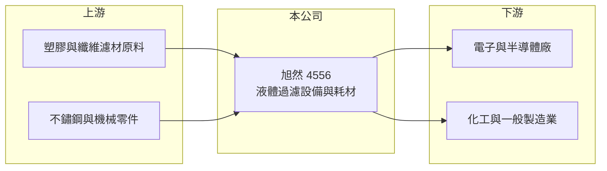

# 4556 旭然

> 上櫃｜[[產業索引-其他業|其他業]]｜上市（櫃）日期 2015/12/22

# 第一章：企業模式與商業藍圖

> [!info] 撰寫說明
> 精簡版，由 Claude 依公開資料整理，架構比照 [[2330台積電]]，資料截至 2026-10-07。來源：nStock 旭然公司簡介、winvest 營收快訊。#待校對

旭然國際是工業用液體過濾設備與耗材廠，營收以耗材為主的重複性收入（推估）。

- **核心業務：** 研發、製造與銷售工業用[[液體過濾]]暨分離設備及耗材。
- **營收結構：** 本次未查到設備與耗材的營收比重；推估[[濾材耗材]]占比較高，需定期更換。
- **營運據點：** 本次未查到具體營運據點資訊。
- **長期方向：** 製程用水與化學品過濾需求隨電子、化工產業擴產成長（推估）。

# 第二章：護城河深度與競爭優勢

過濾耗材一旦通過客戶製程驗證，後續會持續回購，這是旭然的主要護城河。

- **競爭優勢：** 濾材需配合客戶製程規格，更換供應商需重新驗證，客戶黏著度較高（推估）。
- **主要對手：** 國際過濾大廠如 Pall、3M、Parker 等（推估）。
- **觀察重點：** 2026 年 7 月營收年增 67.43%，觀察是否為設備出貨帶動的一次性成長。

# 第三章：財務體質與盈利規模

資料日期：2026-10-07，以下數字是撰寫當時的快照；最新月營收、毛利率、累計 EPS 由自動排程寫在本筆記的屬性欄位（月營收、毛利率、累計EPS 等）。#待校對

旭然毛利率接近四成，但費用占比高，淨利率偏低。

- **營收規模：** 2025 年全年營收 6.78 億元；2026 年 1 至 8 月累計 4.93 億元，年增 16.84%，8 月營收 6,445.1 萬元。
- **獲利：** 2025 年全年 EPS 0.92 元；2026 年上半年累計 EPS 0.37 元，第二季 EPS 0.24 元；第二季[[毛利率]] 39.45%、[[營業利益率]] 7.44%、[[淨利率]] 5.76%。
- **財務特色：** 毛利率高但營業利益率低，研發與銷售費用占比較大（推估）。

# 第四章：總體風險與地緣政治

旭然的風險在於下游產業景氣與國際大廠競爭。

- **產業週期：** 耗材需求跟隨客戶產能利用率，電子與化工景氣下滑時採購減少。
- **營運風險：** 營業費用占比高，營收若下滑，獲利受影響較大。
- **其他風險：** 濾材原料多為塑膠與纖維，原料價格與匯率變動影響成本。

# 專有名詞解析

## 金融

- **[[毛利率]]**：毛利除以營收，反映產品或服務本身的獲利能力。
- **[[營業利益率]]**：營業利益除以營收，反映本業扣除營業費用後的獲利能力。
- **[[淨利率]]**：稅後淨利除以營收，包含業外損益與稅負後的最終獲利能力。

## 產業

- **[[液體過濾]]**：以濾材去除液體中的顆粒或雜質，用於製程用水、化學品與食品等產業。
- **[[濾材耗材]]**：濾袋、濾芯等需定期更換的過濾材料，形成重複性營收。

# 核心供應鏈

- 上游：塑膠、纖維濾材原料與不鏽鋼零件供應商（推估）
- 下游／客戶：電子、化工與一般製造業工廠（推估）
- 同業：Pall、3M、Parker 等國際過濾廠（推估）

## 最新新聞
<!-- news:start（自動產生，請勿手動編輯此範圍） -->
- 2026-10-07 🏛️ 重訊 14:31｜本公司有價證券近期多次達公布注意交易資訊標準，故公告 相關訊息，以利投資人區別暸解｜[觀測站](https://mops.twse.com.tw/mops/#/web/t05st01)
- 2026-10-06 🏛️ 重訊 15:41｜本公司董事會決議辦理現金增資發行新股｜[觀測站](https://mops.twse.com.tw/mops/#/web/t05st01)
- 2026-10-06 🏛️ 重訊 15:39｜本公司董事會決議辦理發行國內第三次有擔保轉換公司債｜[觀測站](https://mops.twse.com.tw/mops/#/web/t05st01)

完整紀錄：[[4556旭然 新聞]]
<!-- news:end -->

## 相關連結
- [公開資訊觀測站](https://mopsov.twse.com.tw/mops/web/t05st03?step=1&firstin=1&co_id=4556)
- [Goodinfo](https://goodinfo.tw/tw/StockDetail.asp?STOCK_ID=4556)
- [Yahoo 股市](https://tw.stock.yahoo.com/quote/4556)
- [鉅亨網新聞](https://www.cnyes.com/twstock/4556/news)
