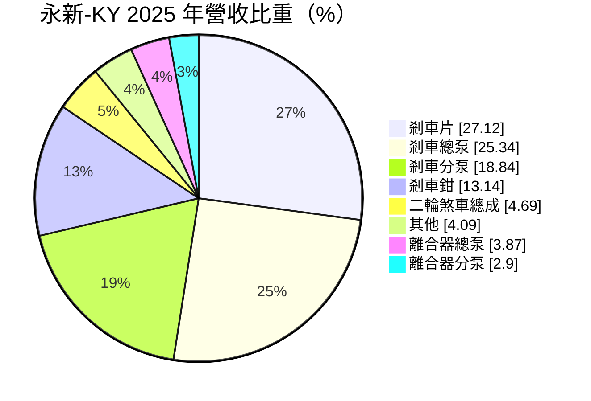
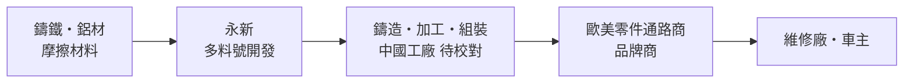
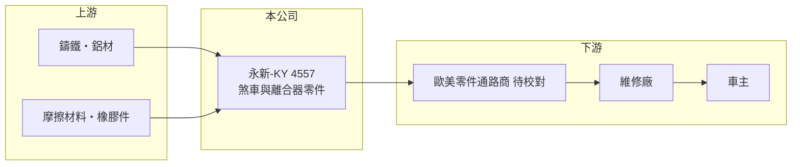

# 4557 永新-KY

> 上市｜[[產業索引-汽車工業|汽車工業]]｜上市（櫃）日期 2015/10/12

# 第一章：企業模式與商業藍圖

> [!info] 撰寫說明
> 本文由 Claude 依公開資料整理，架構比照 [[2330台積電]] 的四章研究，資料截至 2026-10-08。財務數字來源：Goodinfo 台灣股市資訊網年度經營績效、MoneyDJ 理財網個股基本資料（營收比重）、證交所開放資料（本筆記 _data 快照）。銷售市場、生產據點與 2025 年虧損原因憑既有知識整理並標「待校對」。#待校對

在評估單一個股的長期投資價值時，首要步驟是拆解企業的底層獲利邏輯。本章說明永新-KY（股票代號：4557，以下簡稱永新）如何以煞車系統零件，在汽車[[售後市場]]建立穩定的獲利模式。

## 一、核心定位：煞車系統的完整產品線

永新是開曼註冊的控股公司，2011 年設立、2015 年上市。依 MoneyDJ，2025 年營收中剎車片占 27.12%、剎車總泵 25.34%、剎車分泵 18.84%、剎車鉗 13.14%、二輪煞車總成 4.69%、其他 4.09%、離合器總泵 3.87%、離合器分泵 2.90%。從摩擦材料到液壓元件，幾乎涵蓋整套煞車系統。

據既有資料，永新主要供應售後維修市場，客戶以歐美的汽車零件通路商與品牌商為主，生產基地在中國（待校對）。售後市場的特點是：車輛在路上跑多久，就需要更換煞車片與煞車元件多久，需求跟新車銷量的關聯較低。

## 二、資本轉化邏輯

售後零件的關鍵是「料號廣度」：路上有上千種車型，每種車的煞車零件規格都不同，通路商偏好能一次供應大量料號的供應商。永新的完整產品線讓它能成為通路商的主力供應商，2019 至 2024 年毛利率維持在 26% 至 32%（Goodinfo），高於一般新車零件廠。

## 三、企業長期方向

營收從 2020 年的 14.9 億元成長到 2025 年的 39.7 億元（Goodinfo），成長來自料號擴充與客戶增加。但 2025 年營業利益率驟降到約零、EPS -0.67 元，2026 年 1 至 8 月營收 23.4 億元，較前一年同期 27.9 億元減少約 16%（證交所開放資料），顯示經營環境出現變化，可能與美國關稅及產能調整有關（推估）。長期方向是分散生產據點並維持料號優勢。

# 第二章：護城河深度與競爭優勢

在長期價值投資中，「護城河」指企業抵禦競爭、維持超額利潤的保護機制。本章分析永新的優勢與近年的挑戰。

## 一、護城河的核心組成要素

* **1. 料號廣度與開發速度：** 售後市場需要隨新車型持續開發新料號，累積的模具與規格資料庫是永新的主要資產。料號越完整，通路商越不容易更換供應商。
* **2. 煞車屬於安全件：** 煞車零件攸關行車安全，通路商重視品質穩定與退貨率，長期合作的供應商不容易被低價競爭者取代。
* **3. 售後需求穩定：** 煞車片是消耗品，只要路上車輛保有量增加，更換需求就持續存在，受新車景氣影響小。

## 二、主要對手

| 對手 | 定位 | 對永新的威脅 |
|---|---|---|
| 國際煞車品牌（如博世、愛德克斯） | 原廠與售後雙市場 | 品牌與通路優勢 |
| 中國煞車零件廠 | 成本低、產能大 | 在一般料號上價格競爭 |
| 東南亞、墨西哥新興產能 | 規避關稅的替代產地 | 承接美國客戶的轉單 |

## 三、守得住／守不住／觀察重點

* **守得住：** 料號完整度與長期通路關係。
* **守不住：** 若生產集中在中國而美國關稅持續存在，價格優勢會被削弱（推估）。
* **觀察重點：** 營業利益率能否回到 10% 以上，以及生產據點是否分散到中國以外。

# 第三章：財務體質與盈利規模

資料日期：2026-10-08。數字取自 Goodinfo 年度經營績效與證交所開放資料快照，表格是撰寫當時的快照；最新月營收、毛利率、累計 EPS 由自動排程寫在本筆記的屬性欄位（月營收、毛利率、累計EPS 等）。#待校對

財務報表是檢驗護城河是否真實存在的最終標準。本章用多年度數字檢視永新從高獲利轉為虧損的變化。

## 一、多年度三率與 ROE

| 年度 | 營收（新台幣） | [[毛利率]] | [[營業利益率]] | EPS（元） | [[ROE]] |
|---|---|---|---|---|---|
| 2021 | 20.0 億 | 26.3% | 11.6% | 5.16 | 12.4% |
| 2022 | 29.9 億 | 30.5% | 17.1% | 12.11 | 26.4% |
| 2023 | 32.3 億 | 31.1% | 14.9% | 9.02 | 18.3% |
| 2024 | 39.2 億 | 29.0% | 14.4% | 10.19 | 19.1% |
| 2025 | 39.7 億 | 29.6% | -0.01% | -0.67 | -1.09% |
| 2026 上半年 | 16.0 億 | 24.25% | 4.49% | 0.84 | 未查得 |

* **[[毛利率]]：** 2025 年仍有 29.6%，但營業利益率降到約零，代表費用大幅增加，可能包含一次性的費用或損失（推估，原因未查得）。2026 年上半年毛利率降到 24.25%。
* **[[營業利益率]]：** 2022 至 2024 年約 14% 至 17%，2026 年上半年回到 4.49%。
* **長期指標：** 2020 至 2025 年營收年複合成長率約 22%（推算，14.9 億到 39.7 億）；2021 至 2025 年平均 ROE 約 15%（推算）。2025 年雖虧損仍配發現金股利 2 元（證交所開放資料），顯示公司重視股利延續。

## 二、財務結構

2026 年第二季底資產 57.5 億元、負債 29.8 億元，負債比約 52%，每股淨值 52.89 元（證交所開放資料），股價淨值比約 0.95 倍。權益總計 27.7 億元中，非控制權益約 2.3 億元。

## 三、[[ROIC]] 與 [[WACC]]

2024 年營業利益約 5.6 億元（39.2 億元 × 14.4%），稅後約 4.5 億元，以權益 27.7 億元近似投入資本，ROIC 約 16%（推算）；2025 年營業利益約為零，ROIC 接近 0%。有息負債細項未查得，若加計，ROIC 會更低。WACC 以 CAPM 推估：無風險利率 1.5% 至 2%、市場風險溢酬 6%、β 未查得，取 1.0（假設），權益成本約 7.5% 至 8%；負債成本假設 3%，負債約占資本三成，WACC 約 6% 至 6.5%（推算）。2021 至 2024 年 ROIC 明顯高於 WACC，是創造價值的時期；2025 年後利差消失，能否恢復取決於生產布局調整的成效。

# 第四章：總體風險與地緣政治

任何企業都無法脫離宏觀環境獨立存在。本章整理永新長期必須面對的風險。

## 一、地緣政治與政策

* **美國關稅：** 若主要市場在美國、生產在中國（待校對），美國對中國汽車零件的關稅會直接削弱價格競爭力，迫使公司投資海外產能。

## 二、產業週期與市場結構

* **售後市場相對穩定：** 煞車零件需求跟著車輛保有量與行駛里程，景氣循環影響較小，這是永新的長期優點。
* **通路整合：** 歐美零件通路商持續整併，大型通路商的議價能力提高，可能壓縮供應商毛利。

## 三、營運風險

* **原物料：** 鑄鐵、鋁、銅與摩擦材料價格波動影響成本。
* **匯率：** 以美元或歐元銷售、以人民幣生產（推估），匯率變化影響毛利。

## 四、技術演進

* **電動車的再生煞車：** 電動車大量使用[[再生煞車]]，傳統煞車片的磨耗變慢，長期可能降低更換頻率；但電動車較重，煞車元件規格要求也提高。

# 專有名詞解析

## 應用

- **[[再生煞車]]**：電動車減速時讓馬達反轉發電、回收動能的煞車方式，可減少傳統煞車片磨耗。

## 金融

- **[[ROIC]]**：投入資本報酬率，衡量公司用股東與債權人資金創造本業稅後利潤的效率。
- **[[WACC]]**：加權平均資金成本，依股權與負債比重加權的資金成本，是 ROIC 要超過的門檻。

## 產業

- **[[售後市場]]**：新車出廠後的維修、保養與替換零件市場，需求跟著車輛保有量而非新車銷量。
- **[[料號]]**：零件的規格編號，售後零件廠需要大量料號才能涵蓋路上眾多車型。

# 核心供應鏈

## 1. 上游：原物料
- 鑄鐵、鋁材、摩擦材料與橡膠密封件（供應商名稱未查得）

## 2. 中游：永新本身
- 剎車片、剎車總泵與分泵、剎車鉗、離合器總泵與分泵

## 3. 下游：客戶
- 歐美汽車零件通路商與品牌商、維修廠（客戶名單待校對）

## 4. 同業
- 台股售後零件：[[1522堤維西]]、[[4551智伸科]]
- 國際：博世、愛德克斯

## 最新新聞
<!-- news:start -->
<!-- news:end -->

## 相關連結
- [公開資訊觀測站](https://mopsov.twse.com.tw/mops/web/t05st03?step=1&firstin=1&co_id=4557)
- [Goodinfo](https://goodinfo.tw/tw/StockDetail.asp?STOCK_ID=4557)
- [Yahoo 股市](https://tw.stock.yahoo.com/quote/4557)
- [鉅亨網新聞](https://www.cnyes.com/twstock/4557/news)
