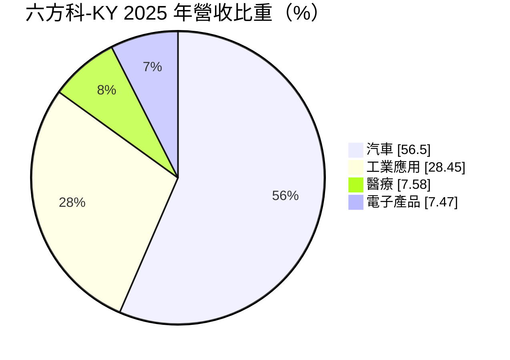
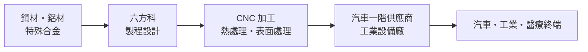
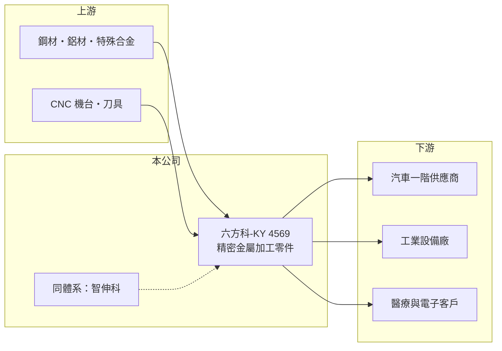

# 4569 六方科-KY

> 上市｜[[產業索引-汽車工業|汽車工業]]｜上市（櫃）日期 2023/07/31

# 第一章：企業模式與商業藍圖

> [!info] 撰寫說明
> 本文由 Claude 依公開資料整理，架構比照 [[2330台積電]] 的四章研究，資料截至 2026-10-08。財務數字來源：Goodinfo 台灣股市資訊網年度經營績效（2020 年起）、MoneyDJ 理財網個股基本資料（營收比重）、證交所開放資料（本筆記 _data 快照）。與智伸科的集團關係、生產據點與產品細項憑既有知識整理並標「待校對」。公開資料有限。#待校對

在評估單一個股的長期投資價值時，首要步驟是拆解企業的底層獲利邏輯。本章說明六方科-KY（股票代號：4569，以下簡稱六方科）的精密加工業務，以及它與 [[4551智伸科]] 的關係。

## 一、核心定位：以汽車與工業零件為主的精密加工廠

六方科是開曼註冊的控股公司，2020 年設立、2023 年 7 月上市。依 MoneyDJ，2025 年營收中汽車占 56.50%、工業應用 28.45%、醫療 7.58%、電子產品 7.47%。智伸科的董事長為法人六方精機股份有限公司，兩家公司同屬六方體系（集團關係與業務分工待校對）。生產據點以海外為主（地點待校對）。

六方科的核心能力與智伸科相似，都是 [[CNC 車削]]、銑削等精密金屬加工。產品組合中工業應用比重較高（28.45%），例如機械、液壓或自動化設備的零件（推估），與智伸科偏重汽車、電子、運動用品的組合有所區隔。

## 二、資本轉化邏輯

精密加工的獲利取決於[[產能利用率]]與良率。六方科的毛利率在 19% 至 30% 之間波動（Goodinfo），2021 年需求旺盛時營業利益率達 19.3%，2023 年降到 4.81%，說明固定成本占比高、景氣敏感度大。

## 三、企業長期方向

六方科上市時間短，長期方向以擴大汽車與工業應用客戶、提高醫療零件比重為主（推估）。營收從 2020 年的 12.6 億元成長到 2025 年的 18.2 億元（Goodinfo），2026 年 1 至 8 月營收 13.1 億元，較前一年同期 12.2 億元成長約 7%（證交所開放資料）。資本配置偏重配息，2025 年度現金股利總額 0.99 億元，換算每股約 3.23 元（推算，以股本 3.06 億元計），配息率約 78%（推算）。

# 第二章：護城河深度與競爭優勢

在長期價值投資中，「護城河」指企業抵禦競爭、維持超額利潤的保護機制。本章分析六方科的競爭位置。

## 一、護城河的核心組成要素

* **1. 品質認證與客戶驗證：** 汽車與醫療零件需要品質系統認證與客戶的長期驗證，量產後不易更換供應商。
* **2. 集團製程經驗：** 與智伸科同屬六方體系（待校對），可以共享製程技術與客戶資源，這是單一小型加工廠沒有的優勢。
* **3. 規模較小：** 營收不到 20 億元，議價能力與產能彈性有限，護城河屬於窄護城河。

## 二、主要對手

| 對手 | 定位 | 對六方科的威脅 |
|---|---|---|
| 中國精密加工廠 | 成本低、產能大 | 在一般零件上價格競爭 |
| 東南亞精密加工廠 | 供應鏈移轉受惠者 | 爭取同一批轉單客戶 |
| [[4551智伸科]] | 同體系精密加工 | 業務部分重疊（分工待校對） |

## 三、守得住／守不住／觀察重點

* **守得住：** 已通過驗證的汽車與工業零件長期訂單。
* **守不住：** 一般加工件的價格，景氣下滑時產能利用率下降。
* **觀察重點：** 營業利益率能否穩定在 10% 以上，以及工業應用與醫療比重是否提升。

# 第三章：財務體質與盈利規模

資料日期：2026-10-08。數字取自 Goodinfo 年度經營績效與證交所開放資料快照，表格是撰寫當時的快照；最新月營收、毛利率、累計 EPS 由自動排程寫在本筆記的屬性欄位（月營收、毛利率、累計EPS 等）。#待校對

財務報表是檢驗護城河是否真實存在的最終標準。本章用多年度數字檢視六方科的獲利波動。

## 一、多年度三率與 ROE

| 年度 | 營收（新台幣） | [[毛利率]] | [[營業利益率]] | EPS（元） | [[ROE]] |
|---|---|---|---|---|---|
| 2021 | 15.2 億 | 29.6% | 19.3% | 10.97 | 14.3% |
| 2022 | 13.1 億 | 25.3% | 14.3% | 10.65 | 13.2% |
| 2023 | 12.2 億 | 19.1% | 4.81% | 3.26 | 3.83% |
| 2024 | 14.5 億 | 22.1% | 6.52% | 7.91 | 9.07% |
| 2025 | 18.2 億 | 20.8% | 7.99% | 4.13 | 4.54% |
| 2026 上半年 | 9.80 億 | 26.00% | 14.58% | 5.54 | 未查得 |

* **[[毛利率]]：** 2021 年 29.6% 為高峰，2023 年 19.1% 為低點，2026 年上半年回升到 26.00%。
* **[[營業利益率]]：** 2026 年上半年 14.58%；同期稅後純益率 17.18% 高於營業利益率，業外收益 0.26 億元有貢獻（證交所開放資料）。2024 年 EPS 7.91 元而營業利益率僅 6.52%，推估也有業外收益貢獻。
* **長期指標：** 2020 至 2025 年營收年複合成長率約 7.6%（推算）；2021 至 2025 年平均 ROE 約 9.0%（推算）。

## 二、財務結構

2026 年第二季底資產 37.0 億元、負債 9.3 億元，負債比約 25%，每股淨值 90.90 元（證交所開放資料）。上市募資後財務結構保守，淨值高也是 ROE 偏低的原因之一。

## 三、[[ROIC]] 與 [[WACC]]

2025 年營業利益約 1.45 億元（18.2 億元 × 7.99%），稅後約 1.16 億元，以權益 27.7 億元近似投入資本（有息負債細項未查得），ROIC 約 4.2%（推算）；以 2026 年上半年營業利益 1.43 億元年化（約 2.86 億元、稅後約 2.29 億元），ROIC 約 8.3%（推算）。WACC 以 CAPM 推估：無風險利率 1.5% 至 2%、市場風險溢酬 6%、β 未查得，取 1.0（假設），權益成本約 7.5% 至 8%；負債比重低，WACC 約 7% 至 7.5%（推算）。2025 年 ROIC 低於 WACC，2026 年上半年略高於 WACC。帳上資金充裕但報酬率不高，資金能否有效投入擴產或回饋股東，是判斷能否長期創造價值的關鍵。

# 第四章：總體風險與地緣政治

任何企業都無法脫離宏觀環境獨立存在。本章整理六方科長期必須面對的風險。

## 一、地緣政治與政策

* **生產據點與關稅：** 生產據點的地理分布待校對，若集中在中國，美國關稅與供應鏈移轉要求會影響訂單。

## 二、產業週期與市場結構

* **汽車與工業景氣：** 汽車與工業應用合計占營收八成以上，兩者同時下滑時（如 2023 年），獲利會大幅縮水。
* **燃油車轉型：** 若汽車零件集中在傳統動力系統，電動化會長期減少需求（推估）。

## 三、營運風險

* **集團關係：** 與智伸科的業務分工、關係人交易若不夠透明，可能引發利益衝突疑慮（推估）。
* **匯率與原物料：** 外銷為主（推估），匯率與金屬原料價格影響毛利。

## 四、技術演進

* **自動化：** 精密加工的人力成本持續上升，需要投資自動化與智慧製造，才能在東南亞與中國同業的競爭中維持成本優勢。

# 專有名詞解析

## 金融

- **[[產能利用率]]**：實際產出占總產能的比例，固定成本高的製造業毛利率高度取決於此數字。
- **[[配息率]]**：現金股利占每股盈餘的比例，反映公司把多少獲利還給股東。
- **[[ROIC]]**：投入資本報酬率，衡量公司用股東與債權人資金創造本業稅後利潤的效率。
- **[[WACC]]**：加權平均資金成本，依股權與負債比重加權的資金成本，是 ROIC 要超過的門檻。

## 產業

- **[[CNC 車削]]**：以電腦數值控制的車床切削旋轉中的金屬棒材，做出軸、套筒等圓形精密零件。

# 核心供應鏈

## 1. 上游：原物料與設備
- 鋼材、鋁材、特殊合金，CNC 機台與刀具（供應商名稱未查得）

## 2. 中游：六方科本身
- 精密車削、銑削與後段處理
- 同體系：[[4551智伸科]]（關係待校對）

## 3. 下游：客戶
- 汽車一階供應商、工業設備廠、醫療與電子客戶（客戶名單未查得）

## 4. 同業
- 台股精密零件：[[4551智伸科]]、[[2250IKKA-KY]]

## 最新新聞
<!-- news:start -->
<!-- news:end -->

## 相關連結
- [公開資訊觀測站](https://mopsov.twse.com.tw/mops/web/t05st03?step=1&firstin=1&co_id=4569)
- [Goodinfo](https://goodinfo.tw/tw/StockDetail.asp?STOCK_ID=4569)
- [Yahoo 股市](https://tw.stock.yahoo.com/quote/4569)
- [鉅亨網新聞](https://www.cnyes.com/twstock/4569/news)
