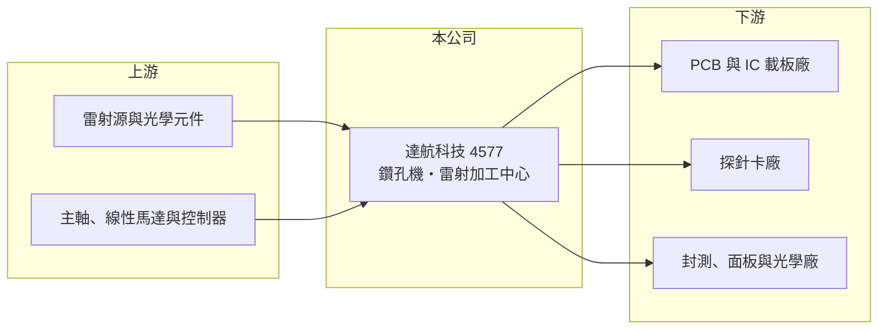

# 4577 達航科技

> 上櫃｜[[產業索引-其他電子業|其他電子業]]｜上市（櫃）日期 2022/06/14

# 第一章：企業模式與商業藍圖

> [!info] 撰寫說明
> 精簡版，由 Claude 依公開資料整理，架構比照 [[2330台積電]]，資料截至 2026-10-07。來源：工商時報（2026 年 4 月達航營運報導）、nstock.tw 達航科技公司概況。營收比重未查到。#待校對

達航是 PCB 鑽孔設備廠，並以雷射加工代工切入載板、探針卡與先進封裝。

- **核心業務：** 達航科技設計製造[[PCB]]用鑽孔機、成型機與清潔機，提供 PCB 加工與維修保養服務，並經營[[雷射加工]]中心。
- **營收結構：** 本次未查到設備與加工代工的比重；應用涵蓋 PCB 與 [[IC載板]]、半導體[[探針卡]]、[[FOPLP]] 與晶圓製程。
- **營運據點：** 台灣設有雷射加工中心，部署近百台設備、24 小時滿載運作，公司預計 2026 年產能提升 35% 以上。
- **長期方向：** 從傳統 PCB 機械鑽孔設備，轉向 10 微米以下極小孔徑的高精度雷射加工，搭上 AI 伺服器帶動的載板與探針卡需求。

# 第二章：護城河深度與競爭優勢

達航的優勢在於自主開發設備加上自有加工產能，可以兩邊互相驗證。

- **競爭優勢：** 具備自動 CCD 光學補償與 ±3 微米精度的雷射平台；與全球前十大探針卡廠中的四家合作，客戶包括 [[2330台積電]]、[[3711日月光投控]]、[[2409友達]]、[[3481群創]]、[[3008大立光]]。
- **主要對手：** 日本 Via Mechanics、三菱電機等鑽孔與雷射設備大廠，台灣的 [[3167大量]]、[[4526東台]]。
- **觀察重點：** 營收快速成長後能否轉為穩定獲利，2026 年上半年累計 EPS 仍為負。

# 第三章：財務體質與盈利規模

資料日期：2026-10-07，以下數字是撰寫當時的快照；最新月營收、毛利率、累計 EPS 由自動排程寫在本筆記的屬性欄位（月營收、毛利率、累計EPS 等）。#待校對

達航 2026 年營收大幅成長，獲利剛轉正。

- **營收規模：** 2025 年全年營收 7.46 億元；2026 年 1 至 8 月累計 6.24 億元、年增 49.7%，第一季營收 2.11 億元、年增 54.49%。
- **獲利：** 2025 年全年 EPS -0.73 元；2026 年第二季 EPS 0.13 元、[[毛利率]] 26.88%，上半年累計 EPS -0.08 元。
- **財務特色：** 2025 年度未配發股利，近五年平均現金股利 0.63 元。

# 第四章：總體風險與地緣政治

達航的風險在於 PCB 設備景氣循環與擴產後的產能利用。

- **產業週期：** PCB 設備需求跟著電子產業資本支出起伏，AI 伺服器拉貨若降溫，鑽孔與雷射需求會跟著下滑。
- **營運風險：** 雷射加工擴產 35% 需要足夠訂單填滿，否則折舊會侵蝕獲利；毛利率仍低於多數半導體設備同業。
- **其他風險：** 日系設備大廠的技術與價格競爭、匯率與關鍵光學零件進口。

# 專有名詞解析

## 半導體

- **[[IC載板]]**：承載晶片並連接到 PCB 的高密度基板，線路比一般 PCB 細很多，AI 晶片需要大尺寸、多層數的載板。
- **[[探針卡]]**：晶圓測試時用來接觸晶片接點、傳送測試訊號的介面卡，針數與精度隨晶片複雜度提高。
- **[[FOPLP]]**：面板級扇出型封裝，以方形大面板取代圓形晶圓進行扇出封裝，可提高面積利用率、降低成本。

## 金融

- **[[毛利率]]**：毛利除以營收，代表產品扣除直接成本後的獲利空間。

## 產業

- **[[PCB]]**：印刷電路板，用銅線路連接電子零件的基板，幾乎所有電子產品都需要。
- **[[雷射加工]]**：以高能量雷射進行切割、鑽孔或打標，精度高且不需實體刀具。

# 核心供應鏈

- 上游：雷射源、光學元件、主軸與運動控制零件供應商
- 下游／客戶：PCB 與 IC 載板廠、探針卡廠，以及 [[2330台積電]]、[[3711日月光投控]]、[[2409友達]]、[[3481群創]]、[[3008大立光]]
- 同業：[[3167大量]]、[[4526東台]]、Via Mechanics、三菱電機

## 最新新聞
<!-- news:start（自動產生，請勿手動編輯此範圍） -->
- 2026-10-06 🏛️ 重訊 17:16｜公告本公司買回股份期間屆滿執行情形｜[觀測站](https://mops.twse.com.tw/mops/#/web/t05st01)

完整紀錄：[[4577達航科技 新聞]]
<!-- news:end -->

## 相關連結
- [公開資訊觀測站](https://mopsov.twse.com.tw/mops/web/t05st03?step=1&firstin=1&co_id=4577)
- [Goodinfo](https://goodinfo.tw/tw/StockDetail.asp?STOCK_ID=4577)
- [Yahoo 股市](https://tw.stock.yahoo.com/quote/4577)
- [鉅亨網新聞](https://www.cnyes.com/twstock/4577/news)
