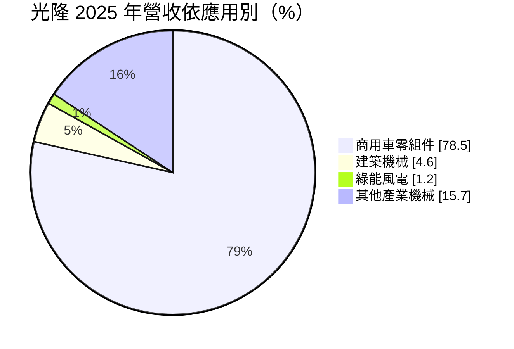
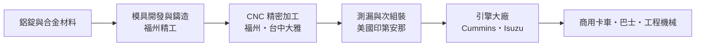
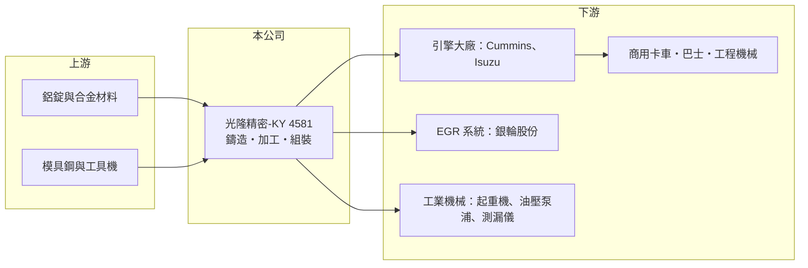

# 4581 光隆精密-KY

> 上市｜[[產業索引-汽車工業|汽車工業]]｜上市（櫃）日期 2020/03/09

# 第一章：企業模式與商業藍圖

> [!info] 撰寫說明
> 本文由 Claude 依公開資料整理，架構比照 [[2330台積電]] 的四章研究，資料截至 2026-10-08。財務數字來源：Goodinfo 年度經營績效頁、富果研究 2025 年 12 月法說會整理、證交所開放資料（基本資料、2026 年第二季資產負債與綜合損益、股利）；產業描述為整理性內容，尚未逐條比對原始文件。#待校對

在評估單一個股的長期投資價值時，首要步驟是拆解企業的底層獲利邏輯。本章說明光隆精密-KY（股票代號：4581，以下簡稱光隆）如何從一家鋁合金鑄件廠，成為國際商用車引擎大廠的長期零件供應商。

## 一、核心定位：商用車引擎的鋁合金鑄件與精密加工廠

光隆是在開曼群島註冊的控股公司，2015 年成立、2020 年在台灣上市，實收資本額約 3.39 億元，董事長為呂皇甫。公司的本業是鋁合金[[精密鑄造]]與 [[CNC 精密加工]]，產品是柴油與天然氣引擎上的進排氣、冷卻、油路等功能零件，以及工業煞車、油壓泵浦閥體等工業零件。光隆並不賣整顆引擎或整車，而是替引擎大廠生產需要高精度、耐高溫高壓的金屬零件，屬於汽車供應鏈中的二階至一階供應商。

公司的商業模式重點在於「從鑄造到加工再到組裝」的一條龍服務。客戶只要交出設計圖，光隆就能完成開模、鑄造、機械加工、測漏與次組裝，交出可以直接上線的零件。這種模式讓客戶減少管理多家供應商的成本，也讓光隆能把每一個環節的附加價值留在自己手上。

## 二、產品板塊：商用車零件占近八成

依富果研究整理的 2025 年法說會資料，光隆的應用別營收中商用車零組件約占 78.5%，建築機械約 4.6%，綠能風電約 1.2%，其餘為船舶、港口起重機煞車、油壓泵浦、測漏儀閥體等產業機械零件（未查得細項比重）。

* **商用車零組件：** 這是光隆的核心事業，最大客戶是美國引擎大廠 Cummins（康明斯），另外也打入日本 Isuzu（五十鈴）的供應鏈，成為其第一家中國鑄件供應商。商用車引擎設計週期長，一個零件一旦量產，通常會供貨到該引擎平台停產為止，因此訂單黏著度高。
* **工業與綠能零件：** 包括港口起重機煞車零件、智慧型油壓泵浦閥體、風電零件與高精密測漏儀用鋁合金閥體。這些產品規模還小，但讓光隆不必完全依賴卡車景氣。
* **地區分布：** 2025 年美洲約占 36.8%、歐洲約 20.5%（前一年約 15%）、日本約 17.4%，其餘為中國與其他地區。客戶以歐美日跨國企業為主。

## 三、資本轉化邏輯：模具、鑄造與加工的一條龍

* **生產據點：** 主要生產基地在中國福州，具備鋁合金鑄造與機加工能力，鄰近港口方便出口；台灣台中大雅的光隆精工負責鋁、不鏽鋼、銅合金的高精度加工與少量多樣產品；美國印第安那州子公司原本是倉儲，近年加建組裝產線，提供引擎零件的總成組立。
* **獲利來源：** 鑄造與加工的毛利主要取決於良率、機台稼動率與產品組合。光隆在 2023 年把毛利率從過去約 25% 拉高到 32% 以上，並維持到 2025 年，代表產品組合往高附加價值的加工件與總成件移動，而不只是賣鑄件毛胚。

## 四、企業長期藍圖：分散產地、往總成與多元產業發展

光隆的長期方向可以歸納為三點。第一是分散產地：在嘉義馬稠後興建新廠，預計 2026 年第三季完工，承接台灣高階精密加工訂單；美國印第安那組裝廠則讓光隆可以在客戶所在地交貨，回應「中國以外產能」與美國關稅的要求。第二是往總成件發展，從單一零件延伸到組裝好的模組，提高每台引擎的供貨金額。第三是產業多元化，拓展風電、工業自動化（智慧泵浦）、半導體與電子設備（測漏儀）等領域。公司對中國市場的策略是「保利潤、不衝量」，不追求低價大量訂單。2025 年公司發行 5 億元無擔保[[可轉換公司債]]，作為擴產資金來源。

# 第二章：護城河深度與競爭優勢

本章分析光隆在汽車零件供應鏈中的競爭優勢，以及這些優勢在國際引擎大廠的供應鏈重組中能守住多少。

## 一、護城河的核心組成要素

* **認證與轉換成本：** 商用車引擎零件必須通過客戶的 [[PPAP]] 等量產驗證，一個料號從打樣到量產往往需要一至兩年。客戶一旦驗證完成，換供應商就要重新驗證，因此只要品質與交期穩定，訂單通常能延續整個引擎平台的生命週期。
* **一條龍製程：** 光隆同時具備模具、鑄造、加工、測漏與組裝能力，對客戶來說可以少管理好幾家供應商，對光隆來說則能掌握品質與成本，並把各環節的利潤留在公司內。
* **多地生產：** 中國、台灣、美國三地生產，加上嘉義新廠，讓光隆能配合客戶「台灣加一」或「中國以外」的採購政策。這是許多純中國鑄件廠做不到的條件。
* **國際大客戶的長期關係：** 以 Cummins 為首的歐美日客戶，採購行為以長期合作為主，價格調整常與原物料指數連動，讓光隆的毛利不至於大起大落。

## 二、主要競爭對手格局

| 對手 | 定位 | 與光隆的比較 |
|---|---|---|
| 中國鋁合金壓鑄與機加工廠 | 成本低、產能大 | 價格競爭力強，但較難符合國際客戶的「中國以外」要求 |
| 銀輪股份等中國汽車零件廠 | 熱交換與 EGR 系統 | 既是合作夥伴（天然氣重卡 EGR 零件），也在部分產品重疊 |
| [[1522堤維西]]、[[1536和大]] 等台灣車用零件廠 | 車燈、傳動齒輪 | 產品不同，但同屬台灣出口型車用零件族群 |
| 歐美日在地鑄造廠 | 貼近客戶、交期短 | 人工成本高，光隆以台中、嘉義與美國據點應對 |

## 三、優勢轉化：守得住、守不住與觀察重點

* **守得住：** 已量產的引擎平台零件。這些訂單受認證與模具綁定，只要商用車引擎沒有被大規模取代，就能提供穩定營收。
* **守不住：** 單純鑄件或低階加工件的價格。這類產品的技術門檻較低，容易遭遇中國同業殺價。
* **觀察重點：** 第一，嘉義新廠與美國組裝廠能否帶來更高毛利的總成訂單；第二，非商用車業務能否從目前約兩成提升到更具規模；第三，商用車從柴油走向天然氣、氫能或電動化的過程中，光隆能否拿到新動力系統的零件。

# 第三章：財務體質與盈利規模

資料日期：2026-10-08。數字取自 Goodinfo 年度經營績效頁、富果研究法說會整理與證交所開放資料，表格是撰寫當時的快照；最新月營收、毛利率、累計 EPS 由自動排程寫在本筆記的屬性欄位（月營收、毛利率、累計EPS 等）。#待校對

財務報表是檢驗護城河是否真實存在的最終標準。本章用多年度的三率、ROE 與資本報酬，檢視光隆的獲利品質。

## 一、獲利能力的基石：三率

| 年度 | 營收（新台幣） | [[毛利率]] | [[營業利益率]] | EPS（元） | [[ROE]] |
|---|---|---|---|---|---|
| 2019 | 10.4 億 | 25.8% | 10.7% | 3.09 | 12.7% |
| 2020 | 8.64 億 | 23.4% | 9.13% | 2.06 | 8.47% |
| 2021 | 10.0 億 | 24.6% | 9.76% | 2.38 | 9.21% |
| 2022 | 10.2 億 | 25.3% | 10.7% | 3.34 | 12.3% |
| 2023 | 12.0 億 | 32.5% | 18.4% | 6.00 | 20.1% |
| 2024 | 10.8 億 | 32.5% | 16.5% | 5.02 | 15.4% |
| 2025 | 10.9 億 | 33.2% | 17.1% | 4.73 | 13.5% |
| 2026 上半年 | 5.96 億 | 32.98% | 17.42% | 2.03 | 未查得 |

* **毛利率的結構性提升：** 2019 至 2022 年光隆毛利率約 23% 至 26%，2023 年起躍升到 32% 以上，並連續三年維持。這不是單一年度的景氣紅利，比較可能來自產品組合轉向加工與總成件、以及中國市場「保利潤、不衝量」的選單策略（推估）。
* **營業槓桿：** 光隆的營業費用規模不大，毛利率提高 7 個百分點時，營業利益率幾乎同步提高 7 個百分點，從約 10% 升到 17% 左右。
* **營收成長有限：** 2021 至 2025 年營收從 10.0 億元成長到 10.9 億元，年複合成長率約 2.2%（推算）。光隆的長期價值更多來自獲利率而不是營收規模，這也受商用車市場本身成長緩慢影響。

## 二、[[ROE]]：資本效率

2021 至 2025 年平均 ROE 約 14.1%（推算）。2023 年的 20.1% 是高點，之後隨營收持平與股本、權益累積而回落到 13% 至 15%。以一家年營收約 11 億元的零件廠而言，這個 ROE 水準屬於中上。2026 年第二季底負債總計約 14.3 億元、權益約 12.4 億元（證交所開放資料），負債比約 53%，比過去高，主要因為發行可轉債與擴廠，未來 ROE 會受到新廠折舊與利息影響。

## 三、資本支出、自由現金流與股利

光隆正處於擴產期：嘉義新廠與美國組裝廠同時進行，2025 年發行 5 億元可轉債支應。這段期間自由現金流可能轉弱（推估，具體金額未查得）。股利方面，2025 年度配發現金股利 3 元，以 EPS 4.73 元計算配發率約 63%（推算）；Goodinfo 統計上市以來一般平均現金股利約 2.69 元，配息大致穩定。

## 四、[[ROIC]] 與 [[WACC]]：價值創造利差

**ROIC 推算：** 2025 年營業利益約 1.86 億元（營收 10.9 億元 × 營業利益率 17.1%），扣除 20% 稅率後約 1.49 億元。2026 年第二季底權益約 12.4 億元，負債總計約 14.3 億元，假設其中約六成為有息負債（含可轉債與銀行借款，推估約 8.6 億元），投入資本約 21 億元，ROIC 約 7.1%（推算）。若以 2023 年高峰的營業利益約 2.2 億元與較小的資本基礎計算，當時 ROIC 約 10% 以上（推算）。

**WACC 推算：** 假設台灣 10 年期公債殖利率 1.75%、市場風險溢酬 6%、β 取汽車零件業常見值 1.0，股東權益成本約 7.75%。負債成本假設 2.5%，稅後約 2.0%；以帳面價值計權益約占 59%、負債約占 41%，WACC 約 5.4%（推算）。

**結論：** 光隆的 ROIC 約 7%，高於約 5.4% 的資金成本，利差約 2 個百分點，代表目前仍在創造價值，但空間不算大。擴產期間投入資本增加、獲利尚未跟上，利差可能暫時縮小；新廠能否帶來更高毛利的訂單，決定這個利差未來是擴大還是消失。

# 第四章：總體風險與地緣政治

任何企業都無法脫離宏觀環境獨立存在。本章分析光隆長期必須面對的產業週期、地緣政治與營運風險。

## 一、地緣政治與貿易

* **中國生產基地的關稅風險：** 光隆的主要產能在福州，而美洲是最大市場。美國對中國製品加徵關稅時，客戶可能要求轉移產地，這正是光隆在美國與嘉義擴產的原因，但轉移期間會增加成本。
* **KY 公司結構：** 光隆是開曼註冊的 [[KY 股]]，營運主體在海外，資訊揭露與股東權益保障和本國公司有差異，投資人需要注意公司治理與資金匯回的透明度。

## 二、產業週期與市場結構

* **商用車景氣循環：** 卡車與工程機械的需求跟隨貨運量、基礎建設與排放法規換代週期，常見 3 至 5 年一次的高低起伏。光隆近八成營收來自商用車，獲利會跟著這個週期波動。
* **動力系統轉型：** 商用車是電動化較慢的領域，但長期仍可能走向天然氣、氫能或純電。內燃機零件需求若在十年後明顯下降，光隆需要在新動力系統取得零件訂單，否則核心業務會萎縮。

## 三、營運環境的隱性風險

* **客戶集中：** Cummins 是最大客戶，單一客戶的採購策略改變，會對營收造成明顯影響。
* **原物料與匯率：** 鋁價波動影響成本，雖然多數合約有價格連動機制，但通常有時間落差。營收以美元、歐元計價，新台幣與人民幣匯率變動會影響帳面獲利，2026 年上半年業外出現約 2,000 萬元損失，部分可能與匯兌有關（推估）。
* **擴產執行：** 嘉義與美國新廠若接單不如預期，折舊與人事費用會壓低毛利率。

## 四、科技與法規演進

排放法規（如美國 EPA 與歐盟歐七標準）會推動引擎重新設計，對光隆而言既是新零件的機會，也是舊料號停產的風險。另一方面，[[輕量化]]是商用車的長期趨勢，鋁合金取代鑄鐵的需求有利於光隆這類鋁件廠。

# 專有名詞解析

## 金融

- **[[KY 股]]**：在海外註冊、來台上市的公司，代號後加註 KY，營運主體多在中國或東南亞。
- **[[可轉換公司債]]**：持有人可在一定期間內依約定價格轉換成公司股票的債券，利率較低，但轉換後會稀釋股本。
- **[[ROIC]]**：投入資本報酬率，稅後營業利益除以股東權益與有息負債的合計，衡量本業對所有資金提供者的報酬。
- **[[WACC]]**：加權平均資金成本，依股東權益與負債的比重加權計算的資金成本，ROIC 高於它才代表創造價值。

## 產業

- **[[精密鑄造]]**：把熔融金屬倒入精密模具中成形的製程，能做出形狀複雜、尺寸接近成品的零件，減少後續加工。
- **[[CNC 精密加工]]**：以電腦數值控制的工具機切削金屬，達到微米等級的尺寸精度，是汽車與機械零件的關鍵工序。
- **[[PPAP]]**：生產件核准程序，汽車業要求供應商在量產前提交的品質文件與樣品驗證流程。
- **[[輕量化]]**：以鋁合金、複合材料等較輕材料取代鋼鐵，降低車輛重量以減少油耗與排放。

# 核心供應鏈

## 1. 上游：材料與設備
- 鋁錠與鋁合金材料供應商
- 模具鋼、國內外 CNC 工具機廠

## 2. 中游：光隆本身與同業
- 中國福州、台灣台中與嘉義、美國印第安那生產據點
- 台灣車用零件同業：[[1522堤維西]]、[[1536和大]]

## 3. 下游：客戶
- 商用車引擎：Cummins（康明斯）、Isuzu（五十鈴）、UD Trucks
- 汽車熱交換與 EGR 系統：銀輪股份
- 港口起重機、油壓泵浦、測漏儀等工業設備廠

## 最新新聞
<!-- news:start -->
<!-- news:end -->

## 相關連結
- [公開資訊觀測站](https://mopsov.twse.com.tw/mops/web/t05st03?step=1&firstin=1&co_id=4581)
- [Goodinfo](https://goodinfo.tw/tw/StockDetail.asp?STOCK_ID=4581)
- [Yahoo 股市](https://tw.stock.yahoo.com/quote/4581)
- [鉅亨網新聞](https://www.cnyes.com/twstock/4581/news)
