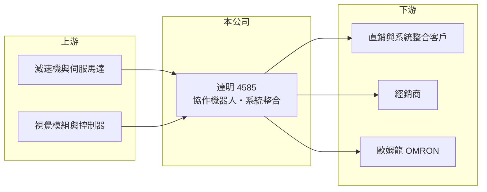

# 4585 達明

> 上市｜[[產業索引-其他電子業|其他電子業]]｜上市（櫃）日期 2025/09/26

# 第一章：企業模式與商業藍圖

> [!info] 撰寫說明
> 精簡版，由 Claude 依公開資料整理，架構比照 [[2330台積電]]，資料截至 2026-10-07。來源：經濟日報（2026 年第二季財報報導）。集團淵源依一般公開資訊整理，未逐條查證。產品比重未查到。#待校對

達明是台灣主要的協作機器人品牌，近期成長動能來自半導體自動化。

- **核心業務：** 達明機器人設計製造[[協作機器人]]，特色是手臂內建視覺系統，可與人在同一產線作業，用於組裝、檢測、上下料等工序；屬廣達集團，源自 [[6188廣明]] 的機器人事業（推估）。
- **營收結構：** 依銷售通路，直銷與[[系統整合]]超過四成、經銷商約三成、日系夥伴歐姆龍（OMRON）約 23%；產品別比重本次未查到。
- **營運據點：** 本次未查到詳細據點資料。
- **長期方向：** 擴大系統整合能力，承接半導體與電子業的整線自動化需求，而非只賣單支手臂。

# 第二章：護城河深度與競爭優勢

達明的優勢是內建視覺與集團電子製造經驗，但國際對手規模更大。

- **競爭優勢：** 手臂整合視覺，降低客戶另外整合相機與軟體的門檻；歐姆龍以自有品牌代銷，提供日本與國際通路。
- **主要對手：** Universal Robots、FANUC、ABB、安川等國際機器人大廠，以及中國的協作機器人廠；台灣的 [[2049上銀]] 也有機械手臂產品。
- **觀察重點：** 半導體自動化需求能否延續，以及營益率能否從 2026 年第二季的 7.95% 繼續提高。

# 第三章：財務體質與盈利規模

資料日期：2026-10-07，以下數字是撰寫當時的快照；最新月營收、毛利率、累計 EPS 由自動排程寫在本筆記的屬性欄位（月營收、毛利率、累計EPS 等）。#待校對

達明 2026 年第二季營收與獲利都創單季新高。

- **營收規模：** 2026 年第二季營收 5.12 億元、季增 6%、年增 29.3%。
- **獲利：** 第二季稅後純益 1.23 億元、EPS 1.18 元，[[毛利率]] 52.27%、[[營業利益率]] 7.95%；上半年稅後純益 1.91 億元、EPS 1.83 元。
- **財務特色：** 毛利率超過五成，但研發與通路費用高，營業利益率仍不到一成；第二季淨利明顯高於營業利益，推估含業外收益，待確認。

# 第四章：總體風險與地緣政治

達明的風險在於製造業資本支出與國際價格競爭。

- **產業週期：** 機器人需求跟著製造業擴產與自動化投資，電子與半導體擴產放緩時訂單會減少。
- **營運風險：** 歐姆龍通路約占兩成多，合作條件變動會影響營收；系統整合專案毛利與交期較難控制。
- **其他風險：** 中國協作機器人低價競爭、匯率，以及減速機、伺服馬達等關鍵零件供應。

# 專有名詞解析

## 應用

- **[[協作機器人]]**：可與人在同一空間安全共同作業的機械手臂，具碰撞偵測與力量限制，導入門檻低於傳統工業機器人。
- **[[系統整合]]**：把設備、軟體與產線流程整合成可運作的完整方案，常由系統整合商替終端客戶完成。

## 金融

- **[[毛利率]]**：毛利除以營收，代表產品扣除直接成本後的獲利空間。
- **[[營業利益率]]**：營業利益除以營收，代表本業扣除營業費用後的獲利能力。

# 核心供應鏈

- 上游：減速機、伺服馬達、視覺模組與控制器供應商
- 下游／客戶：半導體與電子製造業客戶、系統整合商、經銷商、歐姆龍
- 同業：[[2049上銀]]、Universal Robots、FANUC、ABB、安川

## 最新新聞
<!-- news:start -->
<!-- news:end -->

## 相關連結
- [公開資訊觀測站](https://mopsov.twse.com.tw/mops/web/t05st03?step=1&firstin=1&co_id=4585)
- [Goodinfo](https://goodinfo.tw/tw/StockDetail.asp?STOCK_ID=4585)
- [Yahoo 股市](https://tw.stock.yahoo.com/quote/4585)
- [鉅亨網新聞](https://www.cnyes.com/twstock/4585/news)
