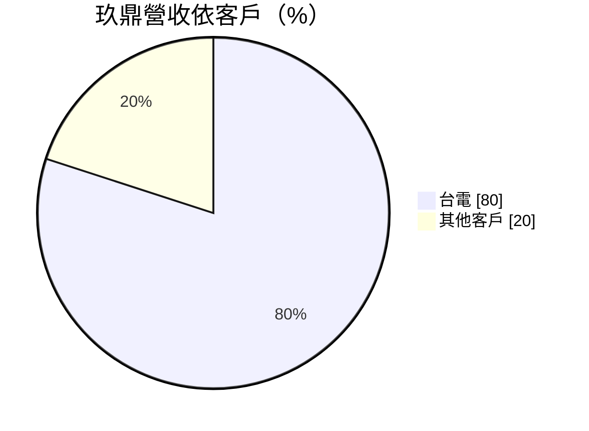
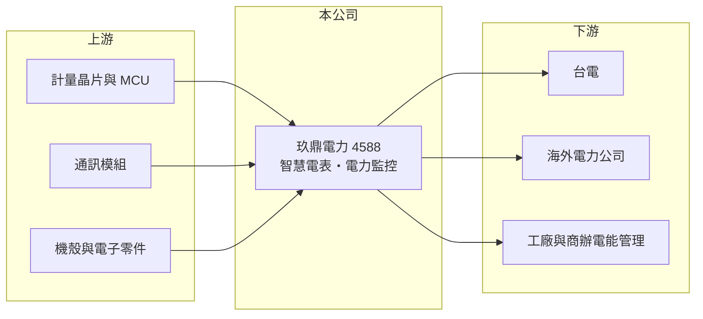

# 4588 玖鼎電力

> 上市｜[[產業索引-其他電子業|其他電子業]]｜上市（櫃）日期 2024/01/29

# 第一章：企業模式與商業藍圖

> [!info] 撰寫說明
> 精簡版，由 Claude 依公開資料整理，架構比照 [[2330台積電]]，資料截至 2026-10-07。來源：旺得富／中時（2025 年 11 月玖鼎報導）、nstock.tw 玖鼎電力公司概況、winvest.tw 營收快訊。#待校對

玖鼎是台電智慧電表的主要供應商之一，營收高度依賴台電標案。

- **核心業務：** 玖鼎電力生產[[智慧電表]]、電力監控設備與電能管理系統，屬於[[智慧電網]]的終端量測設備。
- **營收結構：** 依報導，台電約占營收 80%。

- **營運據點：** 新竹香山新廠已啟用，設四條產線：兩條台電智慧電表、一條電力監控設備、一條海外智慧電表，產能較過去倍增。
- **長期方向：** 承接台電 90 萬具智慧電表標案（約 19.17 億元，執行至 2027 年，2028 年可再追加 50%），並開拓海外電表市場。

# 第二章：護城河深度與競爭優勢

玖鼎的護城河是台電規格認證與大型標案實績，但客戶過度集中。

- **競爭優勢：** 智慧電表需符合台電規格與計量檢定，取得大型標案代表技術與產能已被驗證，未來數年出貨有一定能見度。
- **主要對手：** [[2371大同]]、[[1513中興電]]等國內電表與電力設備廠，以及參與台電標案的其他電表業者。
- **觀察重點：** 海外電表產線的接單進度，以及 2028 年後台電標案能否延續。

# 第三章：財務體質與盈利規模

資料日期：2026-10-07，以下數字是撰寫當時的快照；最新月營收、毛利率、累計 EPS 由自動排程寫在本筆記的屬性欄位（月營收、毛利率、累計EPS 等）。#待校對

玖鼎年營收約 9 億元，2026 年營收成長三成。

- **營收規模：** 2025 年全年營收 9.2 億元；2026 年 1 至 8 月累計 6.82 億元、年增 31.53%，8 月營收 1.05 億元。
- **獲利：** 2025 年全年 EPS 3.2 元；2026 年第二季 EPS 0.74 元、[[毛利率]] 34.55%，上半年累計 EPS 1.36 元。
- **財務特色：** 2024 與 2025 年度皆配發現金股利 3 元；標案依交貨認列，月營收波動大（2026 年 4 月僅 1,174 萬元），第四季通常是全年高峰。

# 第四章：總體風險與地緣政治

玖鼎的風險集中在單一客戶與標案時程。

- **產業週期：** 營收取決於台電電表汰換與智慧電網預算，政策或預算調整會直接影響訂單。
- **營運風險：** 台電占八成營收，交貨與驗收時點延後就會讓單月營收大幅波動；新廠產能擴大後若標案銜接不上，折舊會壓低獲利。
- **其他風險：** 電子零件與晶片價格、標案價格競爭，以及海外市場的認證門檻。

# 專有名詞解析

## 應用

- **[[智慧電表]]**：具雙向通訊功能的數位電表，可遠端讀取用電資料，是智慧電網的基礎設備。

## 金融

- **[[毛利率]]**：毛利除以營收，代表產品扣除直接成本後的獲利空間。

## 產業

- **[[智慧電網]]**：結合通訊與資訊技術、能即時監控與調度電力的電網，有助再生能源併網與需量管理。

# 核心供應鏈

- 上游：計量晶片、MCU、通訊模組與電子零件供應商
- 下游／客戶：台電（約八成營收）、海外電力公司、工廠與商辦電能管理客戶
- 同業：[[2371大同]]、[[1513中興電]]

## 最新新聞
<!-- news:start -->
<!-- news:end -->

## 相關連結
- [公開資訊觀測站](https://mopsov.twse.com.tw/mops/web/t05st03?step=1&firstin=1&co_id=4588)
- [Goodinfo](https://goodinfo.tw/tw/StockDetail.asp?STOCK_ID=4588)
- [Yahoo 股市](https://tw.stock.yahoo.com/quote/4588)
- [鉅亨網新聞](https://www.cnyes.com/twstock/4588/news)
