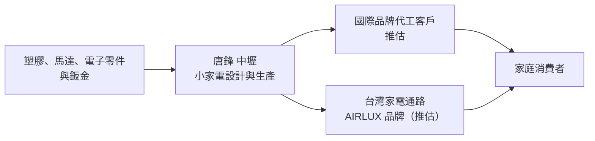
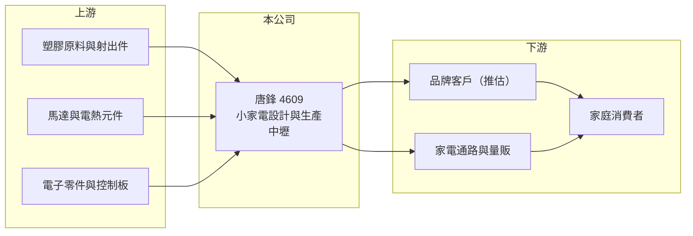

# 4609 唐鋒

> 上櫃｜[[產業索引-居家生活|居家生活]]｜上市（櫃）日期 2000/05/19

# 第一章：企業模式與商業藍圖

> [!info] 撰寫說明
> 本文由 Claude 依公開資料整理，架構比照 [[2330台積電]] 的四章研究，資料截至 2026-10-08。財務數字來源：Goodinfo 台灣股市資訊網年度經營績效、MoneyDJ 公司基本資料（富邦證券版）、櫃買中心開放資料（本筆記 _data 快照）。公開資料有限：本次來源只確認營收全部來自小家電，具體產品線、客戶與生產據點未查得，產業描述為整理性內容，尚未逐條比對原始文件。#待校對

在評估單一個股的長期投資價值時，首要步驟是拆解企業的底層獲利邏輯。本章說明唐鋒（股票代號：4609）這家中壢的老牌小家電公司，如何在營收長期萎縮的情況下經營，以及它面臨的轉型課題。

## 一、核心定位：老牌小家電公司

唐鋒實業成立於 1976 年，總部與工廠位於桃園中壢，2000 年在櫃買中心掛牌，英文名稱為 AIRLUX，公司網址也以此命名。依 MoneyDJ 整理的 2025 年營收比重，小家電占 100%，代表公司目前只經營單一事業。

小家電包括電暖器、電風扇、除濕機、空氣清淨機、廚房家電等品類，具體由唐鋒生產哪些產品，本次來源未能確認。台灣小家電產業過去有不少廠商替國際品牌代工（[[OEM]]），也有廠商經營自有品牌在台灣通路銷售。唐鋒使用 AIRLUX 名稱，推估同時有自有品牌的經營（推估）。

## 二、產品板塊：單一小家電事業

* **小家電（100%）：** 公司營收全部來自小家電。小家電屬於消費性耐久財，需求受天氣、季節與消費景氣影響，例如電暖器與除濕機的銷售高度依賴冬季溫度與梅雨季的濕度。
* **規模持續縮小：** 營收從 2018 年的 7.83 億元下降到 2025 年的 1.66 億元，七年間縮小約八成。2022 年營收更一度只有 1.74 億元、2023 年只有 0.98 億元，代表原有的代工或通路訂單大量流失（推估）。

## 三、資本轉化邏輯：規模不足的製造業

* **毛利率偏低：** 毛利率長期在 8% 至 17%，2025 年回升到 25.7%。低毛利率代表產品的定價能力有限，多數年份更接近代工的獲利水準。
* **固定成本無法攤平：** 營收縮小後，工廠與管理費用無法同步下降，營業利益率八年全部為負，2023 年更低到 -87%。製造業需要一定的產量才能攤平固定成本，唐鋒目前的營收規模明顯不足。

## 四、企業長期藍圖：止血與轉型

* **毛利率改善：** 2023 至 2025 年毛利率從 15% 提升到 25.7%，營業虧損率從 -87% 縮小到 -32.5%，淨損也從每股 0.78 元縮小到 0.10 元，顯示公司在調整產品組合或降低成本，虧損正在收斂。
* **資本配置習慣：** 2019 至 2025 年度皆未配發現金股利。實收資本額約 4.79 億元，但 2026 年第二季股東權益僅約 1.31 億元，代表累積虧損已侵蝕大部分資本，公司的資源主要用於維持營運。

# 第二章：護城河深度與競爭優勢

在長期價值投資中，「護城河」指企業抵禦競爭、維持超額利潤的保護機制。本章分析唐鋒在小家電市場的位置，以及它面對的競爭壓力。

## 一、護城河的核心組成要素

以目前的財務數字來看，唐鋒沒有明顯的護城河。

* **1. 長期經營經驗：** 公司經營近五十年，累積了小家電的設計、生產與品質管理經驗，這是它仍能維持營運的基礎。
* **2. 台灣本地生產：** 在中壢設有工廠（推估仍在運作），對需要台灣製造或少量多樣的客戶有一定吸引力，但成本高於中國與東南亞廠。
* **3. 規模劣勢：** 年營收不到 2 億元，與國際家電大廠及中國代工廠相比，採購、生產與研發規模都差距很大，難以在價格上競爭。

## 二、主要競爭對手格局

| 對手 | 定位 | 對唐鋒的威脅 |
|---|---|---|
| 中國小家電代工與品牌廠（如美的、艾美特等） | 規模大、成本低 | 搶走代工訂單與通路價格帶（推估） |
| 台灣本土小家電品牌 | 本地品牌與通路 | 在台灣市場競爭（推估） |
| 國際家電品牌 | 品牌力與行銷資源 | 占據中高價位市場（推估） |

## 三、優勢轉化：守得住／守不住／觀察重點

* **守得住：** 少量多樣、需要台灣生產或快速交貨的利基訂單（推估）。
* **守不住：** 大量標準化的小家電代工。中國廠商的成本優勢明顯，訂單流失是營收大幅下滑的主因（推估）。
* **觀察重點：** 長期可以觀察三件事：營收能否穩定回到 2 億元以上；毛利率能否維持在 25% 以上；以及營業虧損能否轉為損益兩平。

# 第三章：財務體質與盈利規模

資料日期：2026-10-08。數字取自 Goodinfo 年度經營績效、MoneyDJ 與櫃買中心開放資料快照，表格是撰寫當時的快照；最新月營收、毛利率、累計 EPS 由自動排程寫在本筆記的屬性欄位（月營收、毛利率、累計EPS 等）。#待校對

財務報表是檢驗護城河是否真實存在的最終標準。本章用多年度的三率與 ROE，檢視唐鋒的財務狀況。

## 一、獲利能力的基石：三率

| 年度 | 營收（新台幣） | [[毛利率]] | [[營業利益率]] | EPS（元） | [[ROE]] |
|---|---|---|---|---|---|
| 2018 | 7.83 億 | 9.4% | -12.6% | -1.29 | -18.1% |
| 2019 | 6.11 億 | 13.6% | -14.0% | -1.05 | -17.3% |
| 2020 | 3.98 億 | 14.5% | -21.5% | -1.06 | -21.5% |
| 2021 | 5.50 億 | 12.0% | -13.1% | -0.39 | -9.5% |
| 2022 | 1.74 億 | 7.9% | -54.0% | 0.08 | 2.0% |
| 2023 | 0.98 億 | 15.0% | -87.0% | -0.78 | -20.1% |
| 2024 | 1.34 億 | 17.4% | -55.7% | -0.47 | -13.8% |
| 2025 | 1.66 億 | 25.7% | -32.5% | -0.10 | -3.4% |

* **[[毛利率]]：** 2018 至 2022 年在 8% 至 15%，2023 年後逐年提升到 25.7%，是近年最正面的變化。
* **[[營業利益率]]：** 八年全部為負，營收越小虧損率越大，典型的固定成本無法攤平。
* **淨利與業外：** 2022 年營業虧損約 0.94 億元，淨利卻有小幅盈餘，推估來自處分資產等 [[業外收益]]；2025 年營業虧損約 0.54 億元，淨損只有約 0.05 億元，業外收入也明顯抵銷本業虧損（推估），屬一次性成分較高的收益。
* **長期指標：** 2020 至 2025 年營收年複合成長率約 -16%（推算）；2021 至 2025 年五年平均 ROE 約 -9.0%（推算）；2019 至 2025 年度皆未配息。

## 二、[[ROE]]：資本效率

除 2022 年外，ROE 全部為負。依 2026 年第二季資產負債表，總資產約 6.19 億元、總負債約 4.88 億元、股東權益約 1.31 億元，負債比約 79%，其中非流動負債約 2.80 億元，推估包含長期借款。股東權益僅為實收資本額的約 27%，財務緩衝相當薄。

## 三、資本支出與自由現金流

* **[[CapEx]]：** 營收規模縮小，推估資本支出以維持現有設備為主，具體金額未查得。
* **[[自由現金流]]：** 本業連年虧損，推估營業現金流長期為負或接近零，需要靠資產處分或借款支應，逐年數字未查得。

## 四、[[ROIC]] 與 [[WACC]]：價值創造利差

唐鋒的營業利益八年皆為負，ROIC 為負值。以 2025 年為例，營業虧損約 0.54 億元（營收 1.66 億元 × 營業利益率 -32.5%）；以股東權益約 1.31 億元加上非流動負債約 2.80 億元、合計約 4.1 億元作為投入資本，ROIC 約 -13%（推算）。

WACC 以 CAPM 推估：台灣 10 年期公債約 1.5% 至 2%，市場風險溢酬約 6%。MoneyDJ 所列 β 為 0.11，推估受交易量偏低影響，參考性不足，改以虧損中小型製造業較高的 1.0 至 1.2 假設，股東權益成本約 7.5% 至 9.2%。負債比約八成、負債成本假設約 3%（稅後 2.4%），WACC 約 3.5% 至 4%（推算）；但由於公司長期虧損，實際的權益風險應高於 CAPM 的估計。

ROIC 長期遠低於 WACC，代表唐鋒過去八年持續消耗股東價值。虧損雖在收斂，但要轉為創造價值，至少需要營業利益率先轉正。

# 第四章：總體風險與地緣政治

任何企業都無法脫離宏觀環境獨立存在。本章分析唐鋒長期必須面對的競爭、財務與營運風險。

## 一、地緣政治與貿易

* **中國供應鏈競爭：** 全球小家電生產高度集中在中國，中國廠商的規模與成本優勢，是台灣小家電廠長期萎縮的主因。
* **關稅與轉單：** 國際貿易摩擦可能帶來部分非中國生產的轉單機會，但需要具備價格與產能的競爭力。

## 二、產業週期與市場結構

* **季節與天氣：** 電暖器、除濕機等季節性家電的銷售受氣候影響大，暖冬或乾燥的年份需求會明顯下降（推估，產品線未確認）。
* **消費景氣：** 小家電屬於可延後的消費，景氣轉弱時汰換需求減少。

## 三、營運環境的隱性風險

* **財務結構脆弱：** 負債比約 79%、股東權益僅約 1.31 億元，若持續虧損，可能面臨增資、減資或資產處分的需要。
* **營收規模過小：** 年營收不到 2 億元，難以攤平工廠與管理成本，任何訂單變化都會大幅影響財報。
* **業外收益依賴：** 部分年度靠業外收入縮小虧損，這類收益不具持續性。

## 四、科技或法規演進

* **節能與安全標準：** 家電的能源效率標示、安全認證與環保規範持續更新，需要持續投入產品開發與認證。
* **智慧家電：** 小家電往連網、智慧控制發展，研發門檻提高，規模小的廠商較難跟上。

# 專有名詞解析

## 金融

- **[[業外收益]]**：本業以外的收入，例如處分資產、投資收益、匯兌利益，波動大且常不持續。
- **[[ROIC]]**：投入資本報酬率，稅後營業利益除以投入資本，衡量本業運用資金創造報酬的能力。
- **[[WACC]]**：加權平均資金成本，股東與債權人要求報酬率的加權平均，是 ROIC 要超過的門檻。

## 產業

- **[[OEM]]**：原廠委託製造，代工廠依品牌商的設計與規格生產產品，貼上品牌商的商標銷售。

# 核心供應鏈

## 1. 上游：零組件
- 塑膠、馬達、電熱元件與電子零件，供應商未揭露

## 2. 本公司：唐鋒
- 小家電設計與生產，英文名稱 AIRLUX，總部與工廠位於桃園中壢

## 3. 下游：客戶
- 品牌客戶與家電通路（推估），名單未揭露

## 4. 同業
- 中國小家電廠、台灣家電廠（推估）

## 最新新聞
<!-- news:start -->
<!-- news:end -->

## 相關連結
- [公開資訊觀測站](https://mopsov.twse.com.tw/mops/web/t05st03?step=1&firstin=1&co_id=4609)
- [Goodinfo](https://goodinfo.tw/tw/StockDetail.asp?STOCK_ID=4609)
- [Yahoo 股市](https://tw.stock.yahoo.com/quote/4609)
- [鉅亨網新聞](https://www.cnyes.com/twstock/4609/news)
