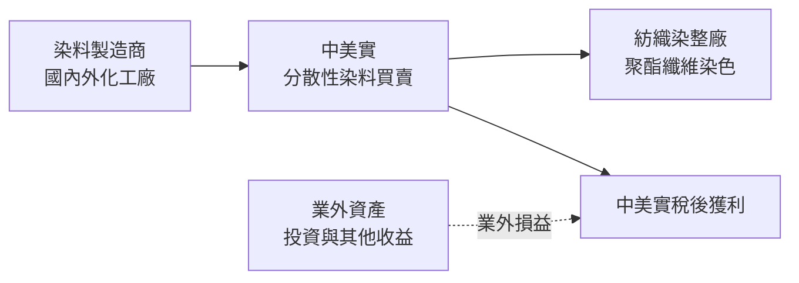
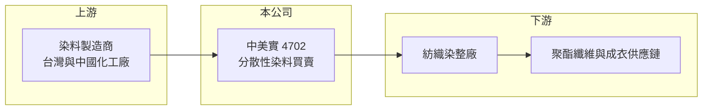

# 4702 中美實

> 上櫃｜[[產業索引-居家生活|居家生活]]｜上市（櫃）日期 1995/04/21

# 第一章：企業模式與商業藍圖

> [!info] 撰寫說明
> 本文由 Claude 依公開資料整理，架構比照 [[2330台積電]] 的四章研究，資料截至 2026-10-08。財務數字來源：Goodinfo 年度經營績效頁、nStock 公司簡介與營收快訊標題。公開資料有限，業外收益來源、營收衰退原因與經營層資訊未查得，產業描述為整理性內容。#待校對

在評估單一個股的長期投資價值時，首要步驟是拆解企業的底層獲利邏輯。本章說明中美聯合實業（股票代號：4702，以下簡稱中美實）的業務性質，以及它近年本業大幅縮小後的樣貌。

## 一、核心定位：以染料買賣為主的小型貿易商

- **核心業務：** 依公開資料，中美實主要業務是[[分散性染料]]等[[染料]]商品的買賣，屬於[[化學品貿易]]商，而不是自行生產染料的製造商。分散性染料主要用於聚酯纖維的染色，客戶通常是紡織染整廠，因此公司的生意和紡織業的景氣緊密相連。
- **營收結構：** 公司未揭露產品別營收比重。可以確定的是營收規模急速縮小：2020 至 2022 年每年約 10 億元，2023 年降到 5.13 億元，2024 年 1.80 億元，2025 年只剩 0.69 億元。營收縮小到原本的不到一成，代表貿易本業已大幅收斂，原因在公開資料中未查得。
- **獲利來源：** 2024 至 2025 年本業都是營業虧損，但稅後仍有獲利，靠的是業外收益，2025 年業外損益約 1.01 億元，高於營業虧損 0.36 億元。對投資人而言，這表示中美實目前的價值主要在資產與業外收益，而不是貿易本業的經營能力。

## 二、資本轉化邏輯：貿易商的薄利結構

- **營運據點：** 公司在台灣掛牌超過 30 年，資本額約 7.23 億元，屬於規模很小的上市公司。貿易商不需要大量廠房設備，主要投入是存貨與應收帳款，這讓它在營收萎縮時不會背負沉重折舊，但也代表本業缺乏可以累積的實體門檻。
- **毛利結構：** 2020 至 2023 年毛利率只有 7% 至 10%，是典型的貿易薄利。2024 年後毛利率雖升到 20% 至 42%，但營收太小，毛利不足以支應固定的管銷費用，因此營業利益率反而跌到 -51.7%。

## 三、長期方向

- **長期方向：** 公開資料沒有說明公司未來是否會重建貿易規模、轉型或專注於資產管理。在缺乏具體計畫的情況下，長期觀察重點是公司如何運用約 13 億元的股東權益，以及業外收益是否穩定。若本業持續萎縮，中美實的性質會越來越接近一家持有資產的投資控股型公司。

# 第二章：護城河深度與競爭優勢

「護城河」指企業抵禦競爭、維持超額利潤的保護機制。本章分析中美實在染料貿易上的競爭位置。

## 一、護城河評估

- **競爭優勢：** 染料貿易的門檻低，貿易商的價值在於與上游原廠的代理關係、對下游染整廠的熟悉度，以及調貨與信用管理能力。中美實經營多年，過去曾維持約 10 億元的年營收，代表它曾有穩定的客戶網絡；但營收在三年內縮小九成以上，顯示這些關係目前很難視為可靠的護城河。
- **主要對手：** 台灣染料業有自行生產的廠商如 [[1711永光]]，也有許多中小型化工貿易商，中國染料大廠則以規模和價格主導全球分散性染料市場。貿易商夾在製造商直銷與低價進口之間，議價空間有限。
- **觀察重點：** 公司若沒有獨家代理或特殊配方，長期很難在毛利率上建立優勢。投資人應關注的是業外收益的來源與持續性，以及公司是否提出明確的本業發展方向，而不是短期營收的月增減。

# 第三章：財務體質與盈利規模

資料日期：2026-10-08。數字取自 Goodinfo 年度經營績效頁，表格是撰寫當時的快照；最新月營收、毛利率、累計 EPS 由自動排程寫在本筆記的屬性欄位（月營收、毛利率、累計EPS 等）。#待校對

財務報表是檢驗護城河是否真實存在的最終標準。本章用六年的數字檢視中美實本業縮小後的財務樣貌。

## 一、多年度經營績效

| 年度 | 營收（新台幣） | [[毛利率]] | [[營業利益率]] | EPS（元） | [[ROE]] |
|---|---|---|---|---|---|
| 2020 | 9.59 億 | 8.55% | -4.06% | 0.60 | 4.54% |
| 2021 | 10.8 億 | 7.96% | 0.57% | 1.15 | 8.30% |
| 2022 | 10.3 億 | 7.02% | 0.44% | 1.64 | 10.7% |
| 2023 | 5.13 億 | 10.0% | -0.36% | 0.72 | 4.41% |
| 2024 | 1.80 億 | 20.6% | -10.7% | 0.58 | 3.43% |
| 2025 | 0.69 億 | 42.2% | -51.7% | 0.88 | 4.97% |

- **營收規模：** 2020 至 2025 年營收年複合成長率約 -41%（推算），本業幾乎退場。即使在營收最高的 2021 至 2022 年，營業利益率也不到 1%，代表貿易本業從來不是主要的獲利來源。
- **獲利：** 六年 EPS 都是正數，介於 0.58 至 1.64 元，但多數年度靠業外收益支撐。2021 至 2025 年平均 ROE 約 6.4%（推算），每股淨值從 2020 年的 13.41 元緩步升到 2025 年的 17.99 元，股東權益沒有被侵蝕。
- **股利：** Goodinfo 統計的長期平均現金股利只有約 0.03 元，公司長期很少配息，獲利多保留在公司內。

## 二、[[ROIC]] 與 [[WACC]]

**ROIC 推算：** 2025 年營業虧損約 0.36 億元，股東權益約 13.1 億元（每股淨值 17.99 元 × 約 0.727 億股）。依 ROA 4.31% 推算總資產約 14.8 億元、總負債約 1.7 億元，假設有息負債接近零（推估），ROIC 約 -2.7%（推算）。2022 年營收最高時，營業利益也只有約 0.05 億元，ROIC 接近 0%。

**WACC 推算：** 假設台灣 10 年期公債 1.75%、市場風險溢酬 6%、β 取小型貿易股常見值 0.6（推估），股東權益成本約 5.4%；公司幾乎沒有負債，WACC 約 5.4%（推算）。

**結論：** 中美實的本業 ROIC 長期低於資金成本，貿易本業並未創造經濟價值；ROE 能維持 3% 至 10%，靠的是業外收益。評估這家公司應以資產價值與業外收益的品質為核心。

# 第四章：總體風險與地緣政治

任何企業都無法脫離宏觀環境獨立存在。本章分析中美實長期面對的風險。

## 一、產業與本業風險

- **產業週期：** 分散性染料的需求取決於聚酯紡織品的產量，台灣紡織染整業多年外移東南亞與中國，本地需求長期縮小。中國染料廠擁有規模與原料優勢，價格波動大，貿易商很難轉嫁成本。
- **營運風險：** 營收已縮小到不足 1 億元，固定的人事與管理費用無法攤提，本業持續虧損。若業外收益減少，公司可能轉為整體虧損。

## 二、其他風險

- **資訊透明度：** 公開資料對業外收益來源、未來計畫著墨很少，投資人難以評估公司的長期方向。股本小、流動性低，也容易出現股價與基本面脫節的情況。
- **原物料與法規：** 染料屬化學品，進出口受環保與化學品管理法規規範，中國環保政策變動也會影響上游供應與價格。

# 專有名詞解析

## 金融

- **[[ROIC]]**：投入資本報酬率，稅後營業利益除以股東權益加有息負債，衡量本業運用資本的效率。
- **[[WACC]]**：加權平均資金成本，股東與債權人要求報酬的加權平均，ROIC 高於它才代表創造價值。

## 產業

- **[[染料]]**：使纖維著色的有機化合物，依纖維種類分為反應性、分散性等不同系列。
- **[[分散性染料]]**：難溶於水、以微粒分散在染浴中的染料，主要用於聚酯纖維染色。
- **[[化學品貿易]]**：不自行生產，而是向化工廠採購後轉售給下游客戶的通路業務，毛利通常較薄。

# 核心供應鏈

## 1. 上游：染料製造
- 台灣染料廠：[[1711永光]]（產業參考，是否為供應商未查得）
- 中國分散性染料大廠

## 2. 中游：中美實
- 分散性染料等商品買賣

## 3. 下游：紡織
- 紡織染整廠與聚酯纖維加工業者（具體客戶未查得）

## 最新新聞
<!-- news:start -->
<!-- news:end -->

## 相關連結
- [公開資訊觀測站](https://mopsov.twse.com.tw/mops/web/t05st03?step=1&firstin=1&co_id=4702)
- [Goodinfo](https://goodinfo.tw/tw/StockDetail.asp?STOCK_ID=4702)
- [Yahoo 股市](https://tw.stock.yahoo.com/quote/4702)
- [鉅亨網新聞](https://www.cnyes.com/twstock/4702/news)
