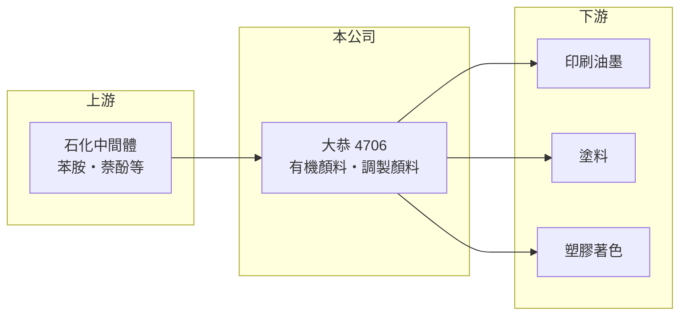

# 4706 大恭

> 上櫃｜[[產業索引-化學工業|化學工業]]｜上市（櫃）日期 1998/04/17

# 第一章：企業模式與商業藍圖

> [!info] 撰寫說明
> 精簡版，由 Claude 依公開資料整理，架構比照 [[2330台積電]]，資料截至 2026-10-08。來源：winvest 營收快訊（公司簡介與 EPS）、富邦證券（MoneyDJ）財務比率年表、櫃買中心開放資料（基本資料、2026 年上半年損益與資產負債、股利）。公開資料有限，產品別營收比重與客戶名稱未查得。#待校對

大恭化學是台灣少數的[[有機顏料]]製造商，產品替油墨、塗料與塑膠上色，屬於成熟、競爭激烈的色料產業，公司以零負債般的保守財務長期經營。

- **核心業務：** 公司主要生產有機顏料與調製應用顏料。有機顏料是以石化中間體合成的色粉，顏色鮮豔、著色力強，是印刷油墨、汽車與工業塗料、塑膠著色的基本原料；調製顏料則是依客戶用途預先分散、調色好的半成品，可以省去客戶自行研磨分散的工序。
- **營收結構：** 產品別比重未查得。依產品性質，主要下游為印刷油墨、塗料與塑膠加工三大類，景氣分別跟著包裝印刷、營建與汽車、消費性塑膠製品起伏（推估）。
- **營運據點：** 公司 1966 年成立，1998 年登錄櫃買中心，資本額約 7.90 億元，總部位於台北。顏料產業的主要市場與競爭者多在亞洲，產品兼營內外銷（推估）。
- **長期方向：** 有機顏料的長期趨勢是往高性能、低重金屬與符合食品包裝和玩具法規的品項移動。大恭能否提高高性能顏料比重，決定它能否擺脫標準品的價格競爭。

# 第二章：護城河深度與競爭優勢

有機顏料市場已高度成熟，大恭規模不大，護城河主要來自長年的配方與色彩穩定度。

- **競爭優勢：** 顏料客戶最在意每一批的色相、著色力與分散性一致，換供應商就要重新調色與測試，因此存在一定的轉換成本。大恭經營近 60 年，累積的品質紀錄與客戶關係是主要資產。
- **主要對手：** 國際上有日本、歐洲的大型色料集團，中國大陸與印度則有大量成本較低的顏料廠（推估）。標準品的價格主要由中國與印度的產能決定，台灣廠商較難主導報價。
- **經營與資本配置：** 2026 年第二季底負債比僅約 11%，幾乎沒有財務槓桿，屬於非常保守的經營風格。2025 年度配發現金股利 0.3 元，以 EPS 0.35 元計算配息率約 86%，本業成長有限時傾向把盈餘發還股東。
- **觀察重點：** 毛利率能否回到 2020 至 2021 年接近 20% 的水準，以及高性能顏料的開發進度。

# 第三章：財務體質與盈利規模

資料日期：2026-10-08，表格是撰寫當時的快照；最新月營收、毛利率、累計 EPS 由自動排程寫在本筆記的屬性欄位（月營收、毛利率、累計EPS 等）。#待校對

大恭近 5 年營收在 10 億至 14 億元之間波動，營業利益率偏低，獲利能力明顯弱於資本規模。

| 年度 | 營收（億元，推算） | 營收年增率 | [[毛利率]] | [[營業利益率]] | EPS（元） | [[ROE]] |
|---|---|---|---|---|---|---|
| 2021 | 約 14.3 | 11.19% | 19.91% | 7.70% | 1.13 | 5.99% |
| 2022 | 約 12.0 | -15.65% | 16.14% | 2.86% | 0.64 | 3.41% |
| 2023 | 約 10.6 | -11.77% | 13.06% | -0.79% | 0.07 | 0.39% |
| 2024 | 約 11.8 | 11.46% | 17.77% | 5.18% | 0.99 | 5.24% |
| 2025 | 約 11.0 | -7.34% | 15.51% | 3.05% | 0.35 | 1.84% |

註：年增率、毛利率、營業利益率、EPS、ROE 取自富邦證券（MoneyDJ）財務比率年表；營收金額依 2025 年 EPS、股本與稅後淨利率推算，再以各年年增率回推，屬推算值。

- **營收規模：** 2021 至 2025 年營收年複合成長率約 -6.3%（推算）。營收在 2022 至 2023 年連續衰退，反映全球油墨、塗料去庫存與中國同業降價。
- **獲利：** 近 5 年平均 ROE 約 3.4%，2023 年本業甚至小幅虧損。顏料屬於固定成本較高的化學合成業，營收下滑時毛利率會同步下降。
- **財務特色：** 2026 年第二季底股東權益約 15.48 億元、負債總計僅約 1.91 億元，每股淨值約 19.58 元。資產負債表非常健康，但大量股東權益沒有轉化成相應的獲利。
- **[[ROIC]] 與 [[WACC]]：** 以 2025 年推算營收約 11 億元、營業利益率 3.05%、稅率 20% 計算，稅後營業利益約 0.27 億元；投入資本以股東權益 15.48 億元加有息負債（未查得，負債總計僅 1.91 億元）計，ROIC 約 1.5% 至 1.7%（推算），近 5 年平均也只有 2% 上下（推算）。WACC 以 CAPM 推估：無風險利率 1.75%、市場風險溢酬 6%、β 取化工中小型股常見值 0.9（未查得個股 β），股權成本約 7.2%；公司幾乎沒有有息負債，WACC 約 7%（推算）。ROIC 長期低於 WACC，代表本業目前沒有替股東創造價值，財務穩健不等於資本效率高。

# 第四章：總體風險與地緣政治

大恭的風險在於顏料產業的價格競爭、原料波動與環保法規。

- **產業週期：** 顏料需求跟著包裝印刷、建築與汽車塗料、塑膠製品的景氣起伏，下游去化庫存時訂單會被放大縮減，屬於[[長鞭效應]]的一環。
- **營運風險：** 有機顏料以苯胺、萘酚等石化中間體為原料，價格隨油價與中國供應變動；合成過程產生廢水，環保要求提高會增加處理成本。
- **其他風險：** 中國與印度顏料廠產能龐大，標準品長期面臨價格壓力；各國對重金屬、芳香胺等化學物質的限制持續加嚴，產品需要不斷調整以符合法規；新台幣升值也會影響外銷利潤。

# 專有名詞解析

## 金融

- **[[長鞭效應]]**：終端需求的小幅變動，沿供應鏈往上游傳遞時被逐級放大，造成上游庫存與訂單劇烈波動。
- **[[ROIC]]**：投入資本報酬率，稅後營業利益除以股東權益加有息負債，衡量本業運用資本的效率。
- **[[WACC]]**：加權平均資金成本，股東與債權人要求報酬率的加權平均，是 ROIC 要超過的門檻。

## 產業

- **[[有機顏料]]**：以石化中間體合成、不溶於介質的色粉，用於油墨、塗料與塑膠著色，色彩鮮豔、著色力強。

# 核心供應鏈

- 上游：苯胺、萘酚等石化中間體與助劑供應商（推估）
- 下游／客戶：印刷油墨、塗料與塑膠加工廠（推估，公司未揭露客戶名稱）
- 同業：日本與歐洲色料集團、中國大陸與印度顏料廠（推估）

## 最新新聞
<!-- news:start -->
<!-- news:end -->

## 相關連結
- [公開資訊觀測站](https://mopsov.twse.com.tw/mops/web/t05st03?step=1&firstin=1&co_id=4706)
- [Goodinfo](https://goodinfo.tw/tw/StockDetail.asp?STOCK_ID=4706)
- [Yahoo 股市](https://tw.stock.yahoo.com/quote/4706)
- [鉅亨網新聞](https://www.cnyes.com/twstock/4706/news)
