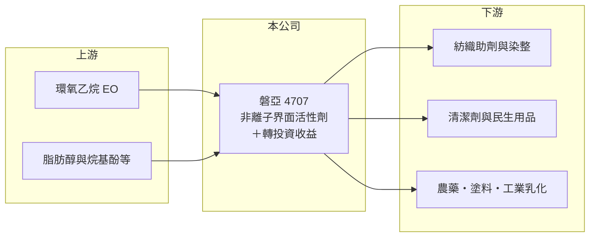

# 4707 磐亞

> 上櫃｜[[產業索引-化學工業|化學工業]]｜上市（櫃）日期 1998/05/20

# 第一章：企業模式與商業藍圖

> [!info] 撰寫說明
> 精簡版，由 Claude 依公開資料整理，架構比照 [[2330台積電]]，資料截至 2026-10-08。來源：winvest 營收快訊（公司簡介與 EPS）、富邦證券（MoneyDJ）財務比率年表（個別財報）、櫃買中心開放資料（基本資料、2026 年上半年損益與資產負債、股利）。公開資料有限，產品別營收比重、轉投資明細與客戶名稱未查得。#待校對

磐亞是生產非離子界面活性劑的化工公司，但從財報看，它更像一家「本業小、轉投資大」的控股型公司：本業長年微利或虧損，獲利主要來自業外的投資收益。

- **核心業務：** 公司主要業務為[[非離子界面活性劑]]。界面活性劑能讓油和水混合，是清潔劑、紡織助劑、農藥乳化劑、塗料與工業清洗的基本原料；非離子型的特色是不帶電荷，耐硬水、與其他成分相容性好，用途很廣。
- **營收結構：** 產品別比重未查得。本業營收規模約十多億元，而股東權益超過 80 億元，代表公司大部分資產是轉投資，而不是界面活性劑的生產設備（依 2026 年第二季資產負債表推估）。
- **營運據點：** 公司 1982 年成立，1998 年登錄櫃買中心，資本額約 40.37 億元，總部位於台北，董事長為王貴賢。生產據點與產能未查得。
- **長期方向：** 公開資料沒有揭露明確的本業擴張計畫。界面活性劑的長期趨勢是往生物可分解、低毒性與特殊用途配方移動，磐亞本業能否轉向較高附加價值的特用品，是獲利改善的前提。

# 第二章：護城河深度與競爭優勢

界面活性劑屬於大宗型特用化學品，磐亞本業護城河薄，真正的價值支撐來自轉投資組合。

- **競爭優勢：** 長年供應紡織、清潔與工業客戶，有穩定的客戶基礎與配方經驗。但非離子界面活性劑的生產技術成熟，原料環氧乙烷（[[EO]]）取得成本往往決定競爭力，沒有上游原料的廠商難以建立成本優勢（推估）。
- **主要對手：** 國際化工大廠的界面活性劑部門，以及中國大陸、東南亞的大型乙氧基化產品廠（推估）。台灣上市櫃同業中，[[1709和益]] 生產清潔劑原料，屬於同一產業鏈的不同環節。
- **經營與資本配置：** 2025 年度配發現金股利 0.5 元，以 EPS 0.89 元計算配息率約 56%。公司的資本主要配置在轉投資，股利來源也主要來自[[業外收益]]，投資人評估時應把它視為「投資組合加小型化工本業」。
- **觀察重點：** 本業毛利率能否轉正並回到 2022 年約 15% 的水準，以及轉投資收益的穩定性。

# 第三章：財務體質與盈利規模

資料日期：2026-10-08，表格是撰寫當時的快照；最新月營收、毛利率、累計 EPS 由自動排程寫在本筆記的屬性欄位（月營收、毛利率、累計EPS 等）。#待校對

磐亞近 5 年 EPS 穩定在 0.9 至 1.1 元，但本業從 2023 年起連續虧損，獲利幾乎全部來自業外。

| 年度 | 營收（億元，推算） | 營收年增率 | [[毛利率]] | [[營業利益率]] | EPS（元） | [[ROE]] |
|---|---|---|---|---|---|---|
| 2021 | 約 17.7 | 18.52% | 11.21% | 4.06% | 1.05 | 5.99% |
| 2022 | 約 18.7 | 5.86% | 14.66% | 6.84% | 1.14 | 6.99% |
| 2023 | 約 13.5 | -27.66% | 6.93% | -0.83% | 0.92 | 5.94% |
| 2024 | 約 14.7 | 8.95% | 1.35% | -5.29% | 0.95 | 6.34% |
| 2025 | 約 13.7 | -6.78% | -2.02% | -8.88% | 0.89 | 5.89% |

註：數字取自富邦證券（MoneyDJ）財務比率年表，為個別財報口徑；營收金額依 2025 年 EPS、股本與稅後淨利率推算，再以各年年增率回推，屬推算值。

- **營收規模：** 2021 至 2025 年營收年複合成長率約 -6.2%（推算）。2023 年營收大減 27.66%，之後未能回到 2022 年的水準。
- **獲利：** 毛利率從 2022 年的 14.66% 一路降到 2025 年的 -2.02%，代表產品售價已經無法覆蓋生產成本；但稅後淨利率長年維持在 20% 以上，近 5 年平均 ROE 約 6.2%，顯示業外投資收益相當穩定。2026 年上半年同樣是營業虧損約 0.25 億元、稅前淨利約 2.84 億元。
- **財務特色：** 2026 年第二季底股東權益約 82.68 億元、負債總計約 26.21 億元，負債比約 24%，每股淨值約 20.48 元。
- **[[ROIC]] 與 [[WACC]]：** 以 2025 年推算營收約 13.7 億元、營業利益率 -8.88%、稅率 20% 計算，本業稅後營業利益約 -0.97 億元，本業 ROIC 為負（推算）。WACC 以 CAPM 推估：無風險利率 1.75%、市場風險溢酬 6%、β 取化工中小型股常見值 0.9（未查得個股 β），股權成本約 7.2%；稅前負債成本假設 2.5%、稅後 2.0%，有息負債約占資本一成多，WACC 約 6.4%（推算）。本業 ROIC 低於 WACC，而含投資收益的 ROE 約 6%，也略低於股權成本，代表公司整體大致只賺回資金成本，價值創造有限。

# 第四章：總體風險與地緣政治

磐亞的風險分成兩層：本業的原料與價格競爭，以及高度依賴轉投資收益。

- **產業週期：** 界面活性劑需求跟著紡織、清潔用品與工業生產的景氣變動，原料環氧乙烷與脂肪醇價格跟著石化與油脂行情波動，售價調整往往落後於成本。
- **營運風險：** 本業連續三年營業虧損，若毛利率無法改善，生產設備可能需要減損或調整產能。獲利高度集中在轉投資，被投資公司景氣轉弱或股利減少時，EPS 會直接下滑。
- **其他風險：** 中國大陸與東南亞大型產能帶來價格競爭；各國對界面活性劑的生物可分解性與毒性要求持續提高；轉投資明細未查得，投資人難以獨立評估其中的集中度風險。

# 專有名詞解析

## 金融

- **[[業外收益]]**：本業以外的收入，例如投資收益、處分資產利益或匯兌利益，通常不具持續性。
- **[[ROIC]]**：投入資本報酬率，稅後營業利益除以股東權益加有息負債，衡量本業運用資本的效率。
- **[[WACC]]**：加權平均資金成本，股東與債權人要求報酬率的加權平均，是 ROIC 要超過的門檻。

## 產業

- **[[非離子界面活性劑]]**：不帶電荷、可讓油水混合的化學品，耐硬水、相容性佳，廣泛用於清潔劑、紡織助劑與工業乳化。
- **[[EO]]**：環氧乙烷，乙烯氧化製成的石化原料，是乙二醇與非離子界面活性劑的主要原料。

# 核心供應鏈

- 上游：環氧乙烷、脂肪醇等石化與油脂原料供應商（推估）
- 下游／客戶：紡織助劑與染整廠、清潔劑廠、農藥與塗料等工業用戶（推估，公司未揭露客戶名稱）
- 同業：國際化工集團的界面活性劑部門、中國大陸與東南亞乙氧基化產品廠；產業鏈相關公司 [[1709和益]]（推估）

## 最新新聞
<!-- news:start（自動產生，請勿手動編輯此範圍） -->
- 2026-10-08 🏛️ 重訊 19:09｜公告本公司一百一十五年九月財務狀況及金融資產評價調整情形｜[觀測站](https://mops.twse.com.tw/mops/#/web/t05st01)

完整紀錄：[[4707磐亞 新聞]]
<!-- news:end -->

## 相關連結
- [公開資訊觀測站](https://mopsov.twse.com.tw/mops/web/t05st03?step=1&firstin=1&co_id=4707)
- [Goodinfo](https://goodinfo.tw/tw/StockDetail.asp?STOCK_ID=4707)
- [Yahoo 股市](https://tw.stock.yahoo.com/quote/4707)
- [鉅亨網新聞](https://www.cnyes.com/twstock/4707/news)
