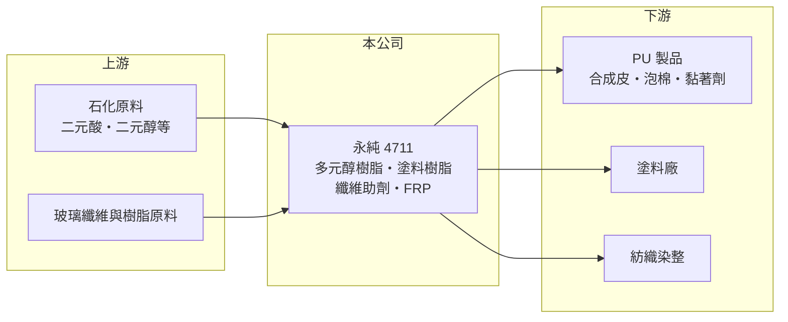

# 4711 永純

> 上櫃｜[[產業索引-化學工業|化學工業]]｜上市（櫃）日期 1999/02/24

# 第一章：企業模式與商業藍圖

> [!info] 撰寫說明
> 精簡版，由 Claude 依公開資料整理，架構比照 [[2330台積電]]，資料截至 2026-10-08。來源：nStock 公司簡介（產品、同業、2025 年營收與股利）、富邦證券（MoneyDJ）財務比率年表、櫃買中心開放資料（基本資料、2026 年上半年損益與資產負債）。公開資料有限，產品別營收比重與客戶名稱未查得。#待校對

永純化學是成立超過一甲子的樹脂與助劑廠，產品是 PU、塗料與紡織業使用的中間原料，規模小、獲利薄，但長年維持低負債與穩定配息。

- **核心業務：** 公司主要製造與銷售[[多元醇]]樹脂、特殊塗料樹脂與纖維助劑，另有強化塑鋼（[[FRP]]）製品的製造加工，以及相關原料的進出口。多元醇是 PU 的兩大原料之一，與異氰酸酯反應後可做成泡棉、合成皮、黏著劑與彈性體；塗料樹脂決定塗膜的附著力與耐候性；纖維助劑則用在紡織染整的加工。
- **營收結構：** 產品別比重未查得。依 nStock 資料，2025 年全年營收約 7.29 億元，營收規模在台灣上市櫃化工股中偏小。
- **營運據點：** 公司 1965 年成立，1999 年登錄櫃買中心，資本額約 6.11 億元，總部位於台北，生產以台灣為主（推估）。
- **長期方向：** 公開資料沒有揭露明確的擴張計畫。PU 與塗料產業的長期趨勢是水性化、低 VOC 與生質原料，永純若能把多元醇與塗料樹脂往環保配方升級，才有機會提高附加價值。

# 第二章：護城河深度與競爭優勢

永純屬於利基型的樹脂配方廠，護城河主要來自長年客戶關係，但規模與成本優勢有限。

- **競爭優勢：** 多元醇與塗料樹脂需要依客戶的 PU 或塗料配方客製分子量與官能度，客戶換料必須重新試作與驗證，因此有一定黏著度。永純經營近 60 年，累積的配方資料庫與穩定品質是主要優勢。
- **主要對手：** nStock 列出的同產業公司包括 [[1718中纖]]、[[1717長興]]、和桐；國際上則有大型化工集團的 PU 原料部門，以及中國大陸的多元醇廠（推估）。
- **經營與資本配置：** 2026 年第二季底負債比約 18%，財務非常保守。依 nStock 資料，近五年平均現金股利約 0.6 元，2025 年度配發 0.5 元，高於當年 EPS 0.15 元，代表公司在獲利不足時仍動用保留盈餘維持配息。
- **觀察重點：** 毛利率能否回到 2021 年約 15% 的水準、營業利益率能否明顯高於 1%，以及環保型產品的開發成果。

# 第三章：財務體質與盈利規模

資料日期：2026-10-08，表格是撰寫當時的快照；最新月營收、毛利率、累計 EPS 由自動排程寫在本筆記的屬性欄位（月營收、毛利率、累計EPS 等）。#待校對

永純近 5 年營收從 11 億元降到 7 億元左右，營業利益率多在 1% 上下，屬於低利潤的成熟事業。

| 年度 | 營收（億元，推算） | 營收年增率 | [[毛利率]] | [[營業利益率]] | EPS（元） | [[ROE]] |
|---|---|---|---|---|---|---|
| 2021 | 約 11.3 | 41.80% | 15.43% | 7.85% | 1.27 | 6.87% |
| 2022 | 約 11.2 | -1.25% | 4.34% | -2.39% | -0.31 | -1.74% |
| 2023 | 約 7.6 | -32.22% | 13.13% | 2.55% | 0.30 | 1.74% |
| 2024 | 約 7.6 | -0.69% | 11.27% | 0.82% | 0.10 | 0.56% |
| 2025 | 7.29 | -4.50% | 12.11% | 0.85% | 0.15 | 0.90% |

註：年增率、毛利率、營業利益率、EPS、ROE 取自富邦證券（MoneyDJ）財務比率年表（合併報表）；2025 年營收取自 nStock，其餘年度以年增率回推，屬推算值。

- **營收規模：** 2021 至 2025 年營收年複合成長率約 -10%（推算）。2021 年受原料漲價與需求回升帶動營收大增，之後 2023 年大幅回落，顯示營收主要受原料價格與下游景氣推動。
- **獲利：** 近 5 年平均 ROE 約 1.7%，2022 年毛利率僅 4.34%、本業虧損，說明原料成本劇烈變動時，小型樹脂廠很難即時轉嫁。
- **財務特色：** 2026 年第二季底股東權益約 10.31 億元、負債總計約 2.31 億元，每股淨值約 16.89 元。財務安全性高，但資本運用效率偏低。
- **[[ROIC]] 與 [[WACC]]：** 以 2025 年營收 7.29 億元、營業利益率 0.85%、稅率 20% 計算，稅後營業利益約 0.05 億元；投入資本以股東權益 10.31 億元加有息負債（未查得，介於 0 與負債總計 2.31 億元之間）計，ROIC 約 0.4% 至 0.5%（推算），近 5 年平均約 1%（推算）。WACC 以 CAPM 推估：無風險利率 1.75%、市場風險溢酬 6%、β 取化工中小型股常見值 0.9（未查得個股 β），股權成本約 7.2%；稅前負債成本假設 2.5%、稅後 2.0%，有息負債約占資本一成，WACC 約 6.6%（推算）。ROIC 長期明顯低於 WACC，代表目前的事業規模與利潤率不足以替股東創造價值。

# 第四章：總體風險與地緣政治

永純的風險集中在原料價格、下游景氣與規模劣勢。

- **產業週期：** 多元醇與塗料樹脂的原料來自石化產品，價格跟著油價與石化景氣波動；下游 PU、塗料與紡織業去化庫存時，訂單會被放大縮減，形成[[長鞭效應]]。
- **營運風險：** 營收規模小，固定費用占比高，營收減少時營業利益率很快轉為虧損。若長期配息高於獲利，保留盈餘會逐步下降。
- **其他風險：** 中國大陸大型多元醇與樹脂廠的價格競爭；各國對 VOC 與化學品的管制趨嚴，需要持續投入研發；製鞋與紡織客戶外移東南亞，也會影響內銷需求。

# 專有名詞解析

## 金融

- **[[長鞭效應]]**：終端需求的小幅變動，沿供應鏈往上游傳遞時被逐級放大，造成上游庫存與訂單劇烈波動。
- **[[ROIC]]**：投入資本報酬率，稅後營業利益除以股東權益加有息負債，衡量本業運用資本的效率。
- **[[WACC]]**：加權平均資金成本，股東與債權人要求報酬率的加權平均，是 ROIC 要超過的門檻。

## 產業

- **[[多元醇]]**：分子上帶多個羥基的化合物，是與異氰酸酯反應生成 PU 的兩大原料之一。
- **[[FRP]]**：玻璃纖維強化塑膠，俗稱玻璃鋼，重量輕、耐腐蝕，用於儲槽、管材與船體。

# 核心供應鏈

- 上游：二元酸、二元醇等石化原料與玻璃纖維供應商（推估）
- 下游／客戶：PU 製品、塗料與紡織染整業者（推估，公司未揭露客戶名稱）
- 同業：[[1718中纖]]、[[1717長興]]、和桐（nStock 列為同產業公司）

## 最新新聞
<!-- news:start -->
<!-- news:end -->

## 相關連結
- [公開資訊觀測站](https://mopsov.twse.com.tw/mops/web/t05st03?step=1&firstin=1&co_id=4711)
- [Goodinfo](https://goodinfo.tw/tw/StockDetail.asp?STOCK_ID=4711)
- [Yahoo 股市](https://tw.stock.yahoo.com/quote/4711)
- [鉅亨網新聞](https://www.cnyes.com/twstock/4711/news)
