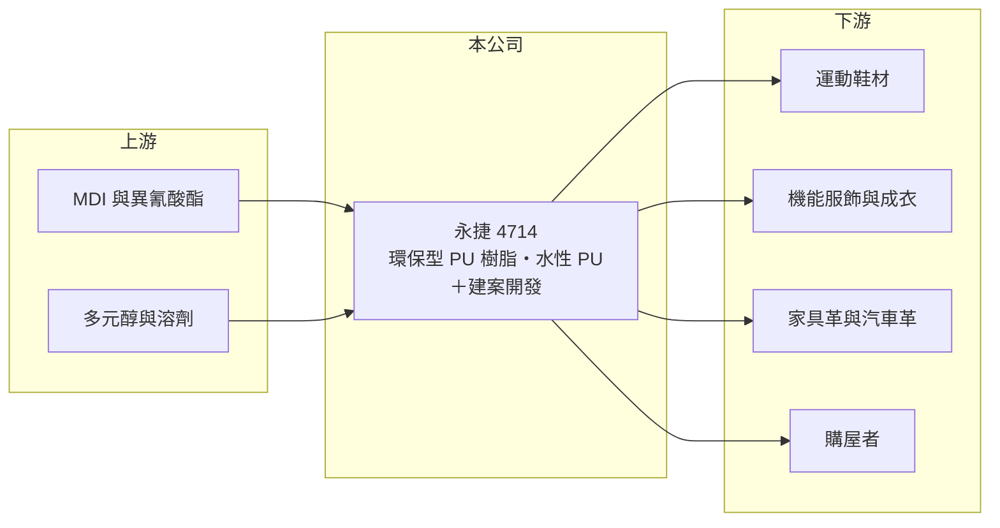

# 4714 永捷

> 上櫃｜[[產業索引-化學工業|化學工業]]｜上市（櫃）日期 2000/03/27

# 第一章：企業模式與商業藍圖

> [!info] 撰寫說明
> 精簡版，由 Claude 依公開資料整理，架構比照 [[2330台積電]]，資料截至 2026-10-08。來源：優分析 2026 年 8 月永捷上半年營運報導、富邦證券（MoneyDJ）財務比率年表、櫃買中心開放資料（基本資料、2026 年上半年損益與資產負債）。產品別營收比重、轉投資明細與客戶名稱未查得。#待校對

永捷是台南的 PU 合成材料廠，本業供應鞋材、機能服飾與皮革用的 PU 樹脂，近年以「垂直整合、多角化」為策略，跨足房地產開發，財報結構因此變得複雜。

- **核心業務：** 依優分析報導，永捷主要生產環保型 [[PU樹脂]]與水性 PU 材料，客戶涵蓋運動鞋材、機能服飾與傳統皮革。公司未來布局的產品包括高固成分與無溶劑的濕氣反應型 PU 熱熔膠（[[PUR]]）、[[TPU]]、油性與水性家具革、汽車革用樹脂，以及成衣用的環保水性產品。
- **營收結構：** 產品別比重未查得。2026 年上半年營收大幅成長，報導指出原因包括環保型 PU 材料出貨增加，以及旗下「荷久暻」建案完工交屋並認列房產銷售收入，可見房地產已成為營收的重要變數。
- **營運據點：** 公司 1991 年成立，2000 年登錄櫃買中心，資本額約 17.81 億元，總部與工廠位於台南安定。公司表示以台灣廠作為全球研發與運籌中心，並積極尋求海外策略聯盟。
- **長期方向：** 本業方向是把產品從傳統溶劑型 PU 轉向水性、無溶劑等環保高附加價值產品，並延伸到電子產業應用；另一方面以建案開發分散 PU 本業的景氣風險。兩條路線並行，代表公司的長期獲利將同時受化工與房地產週期影響。

# 第二章：護城河深度與競爭優勢

永捷的本業護城河來自環保型 PU 配方，但本業長年營業虧損，轉型成效仍待驗證。

- **競爭優勢：** 品牌鞋廠與服飾業對揮發性有機物的要求愈來愈嚴，能提供水性與無溶劑 PU 的供應商較容易進入國際品牌供應鏈。客戶一旦以永捷的樹脂完成材料驗證，更換供應商需要重新測試，具有一定黏著度。
- **主要對手：** 台灣同業包括 [[1776展宇]]、[[1721三晃]] 等 PU 樹脂廠，以及中國大陸大型 PU 樹脂廠（推估）。
- **經營與資本配置：** 2026 年第二季底股東權益總計約 79.92 億元，其中歸屬母公司業主只有約 21.25 億元，代表集團內有規模很大、由其他股東共同持有的子公司（推估）。公司近年未配發現金股利，資本主要投入多角化事業，股東需要特別留意母公司實際分得的盈餘。
- **觀察重點：** PU 本業能否轉為營業獲利、建案收入結束後的營收水準，以及子公司結構對母公司獲利的影響。

# 第三章：財務體質與盈利規模

資料日期：2026-10-08，表格是撰寫當時的快照；最新月營收、毛利率、累計 EPS 由自動排程寫在本筆記的屬性欄位（月營收、毛利率、累計EPS 等）。#待校對

永捷近 5 年營業利益率每年都是負數，EPS 與 ROE 的正負主要由業外與非控制權益決定。

| 年度 | 營收 | 營收年增率 | [[毛利率]] | [[營業利益率]] | EPS（元） | [[ROE]] |
|---|---|---|---|---|---|---|
| 2021 | 未查得 | 108.22% | 14.07% | -3.40% | 0.28 | 6.06% |
| 2022 | 未查得 | 25.86% | 14.62% | -4.70% | -0.38 | -4.36% |
| 2023 | 未查得 | -41.89% | 16.95% | -19.09% | 0.14 | 1.99% |
| 2024 | 未查得 | 59.88% | 16.97% | -20.79% | 0.81 | 23.48% |
| 2025 | 未查得 | 85.08% | 9.86% | -23.30% | -0.54 | 10.40% |

註：數字取自富邦證券（MoneyDJ）財務比率年表（合併報表）；ROE 為合併口徑，與歸屬母公司的 EPS 方向可能不同。年度營收金額未查得；2026 年上半年合併營收 11.85 億元（優分析）。

- **營收規模：** 營收年增率在 -42% 到 108% 之間劇烈擺盪，推估與建案認列時點有關，PU 本業的真實成長率難以從合併數字判斷。
- **獲利：** 近 5 年營業利益率平均約 -14%，本業持續虧損；2024 年稅後淨利率高達 153.76%、2025 年 51.15%，代表獲利主要來自[[業外收益]]，例如處分資產或投資收益（推估）。2025 年合併 ROE 10.40% 但母公司 EPS 為 -0.54 元，說明獲利大多歸屬非控制權益。
- **財務特色：** 2026 年第二季底資產總計約 118.12 億元、負債總計約 38.20 億元，負債比約 32%。歸屬母公司每股淨值約 11.93 元。
- **[[ROIC]] 與 [[WACC]]：** 永捷近 5 年營業利益皆為負數，以稅後營業利益 ÷（股東權益 79.92 億元＋有息負債）計算，本業 ROIC 為負（推算）。WACC 以 CAPM 推估：無風險利率 1.75%、市場風險溢酬 6%、β 取化工中小型股常見值 0.9（未查得個股 β），股權成本約 7.2%；稅前負債成本假設 2.5%、稅後 2.0%，有息負債約占資本兩成，WACC 約 6.2%（推算）。本業 ROIC 長期低於 WACC，表示 PU 本業尚未替股東創造價值，公司的價值目前主要繫於資產與業外收益。

# 第四章：總體風險與地緣政治

永捷的風險同時來自化工本業、房地產週期與複雜的集團結構。

- **產業週期：** PU 樹脂需求跟著運動鞋與服飾品牌的庫存循環起伏，原料 MDI、多元醇與溶劑價格隨石化景氣波動，本業毛利容易被擠壓。
- **營運風險：** 建案收入屬於[[建案交屋]]時一次認列，案子結束後營收可能大幅回落；房地產受利率、信用管制與房市景氣影響，與化工本業的風險性質不同。
- **其他風險：** 合併報表中非控制權益比重很高，母公司股東實際分得的獲利需要另外計算；地緣政治與通膨壓力促使客戶調整供應鏈，若海外布局落後，可能流失外移的鞋材客戶。

# 專有名詞解析

## 金融

- **[[業外收益]]**：本業以外的收入，例如投資收益、處分資產利益或匯兌利益，通常不具持續性。
- **[[建案交屋]]**：建設公司在房屋交屋給買方時才一次認列銷售收入，因此營收集中在交屋期間。
- **[[ROIC]]**：投入資本報酬率，稅後營業利益除以股東權益加有息負債，衡量本業運用資本的效率。

## 產業

- **[[PU樹脂]]**：聚氨酯樹脂，塗布在布料上可製成合成皮革，也用於塗料、黏著劑與鞋材。
- **[[PUR]]**：濕氣反應型 PU 熱熔膠，加熱塗布後吸收空氣中水分固化，黏著力與耐熱性高於一般熱熔膠。
- **[[TPU]]**：熱可塑性聚氨酯，兼具橡膠彈性與塑膠加工性的高分子材料，可做成薄膜、鞋材與醫療耗材。

# 核心供應鏈

- 上游：MDI、多元醇、溶劑等石化原料供應商（推估）
- 下游／客戶：運動鞋材、機能服飾、傳統皮革、家具革與汽車革客戶；建案部分為購屋者（客戶名稱未揭露）
- 同業：[[1776展宇]]、[[1721三晃]] 與中國大陸 PU 樹脂廠（推估）

## 最新新聞
<!-- news:start -->
<!-- news:end -->

## 相關連結
- [公開資訊觀測站](https://mopsov.twse.com.tw/mops/web/t05st03?step=1&firstin=1&co_id=4714)
- [Goodinfo](https://goodinfo.tw/tw/StockDetail.asp?STOCK_ID=4714)
- [Yahoo 股市](https://tw.stock.yahoo.com/quote/4714)
- [鉅亨網新聞](https://www.cnyes.com/twstock/4714/news)
