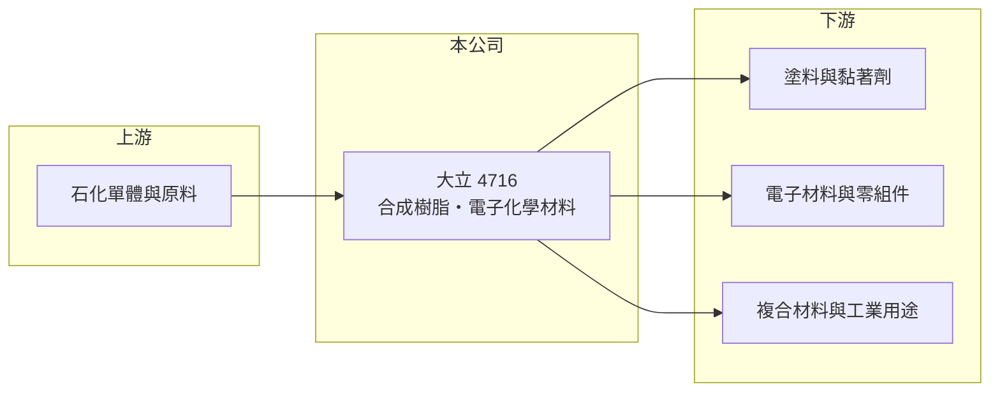

# 4716 大立

> 上櫃｜[[產業索引-化學工業|化學工業]]｜上市（櫃）日期 2000/03/27

# 第一章：企業模式與商業藍圖

> [!info] 撰寫說明
> 精簡版，由 Claude 依公開資料整理，架構比照 [[2330台積電]]，資料截至 2026-10-08。來源：winvest 營收快訊（公司簡介與 EPS）、富邦證券（MoneyDJ）財務比率年表、櫃買中心開放資料（基本資料、2026 年上半年損益與資產負債）。公開資料有限，具體產品、營收比重與客戶名稱未查得。#待校對

大立高分子是位於高雄永安的合成樹脂廠，業務包括合成樹脂與電子化學材料，營收規模約五億元，本業多年營業虧損，是一家資訊揭露有限、需要謹慎看待的小型化工股。

- **核心業務：** 公司主要業務為[[合成樹脂]]與電子化學材料。合成樹脂是塗料、黏著劑、複合材料與電子材料的基礎原料；電子化學材料則供應電子產業製程或零組件使用，附加價值通常高於一般工業樹脂。具體產品品項本次未查得。
- **營收結構：** 產品別比重未查得。2026 年 1 至 8 月累計營收約 3.67 億元，年增約 1.8%，營收規模在台灣上市櫃化工股中屬於很小的一群。
- **營運據點：** 公司 1970 年成立，2000 年登錄櫃買中心，資本額約 9.44 億元，登記地址在高雄永安工業區。董事長由法人股東成大職業帆船股份有限公司的代表人擔任。
- **長期方向：** 公開資料沒有揭露明確的長期策略。若要扭轉本業虧損，提高電子化學材料等較高毛利產品的比重，是最可能的方向（推估）。

# 第二章：護城河深度與競爭優勢

大立規模小、毛利率約一成，在合成樹脂市場缺乏明顯的護城河。

- **競爭優勢：** 樹脂產品需要依客戶配方客製，長期合作的客戶有一定黏著度；公司經營超過 50 年，累積了生產經驗與客戶關係。不過近年毛利率只有 9% 至 14%，代表產品議價能力有限。
- **主要對手：** 台灣與中國大陸眾多合成樹脂廠，以及國際化工集團的樹脂部門（推估）。電子化學材料方面，需要與日本、歐美的專業材料廠競爭（推估）。
- **經營與資本配置：** 公司近年沒有配發現金股利，2026 年第二季底負債比約 34%。本業長年虧損，但部分年度靠業外收益轉為獲利，資本配置的成效難以從本業看出。
- **觀察重點：** 毛利率能否回到 2020 年約 21% 的水準，營業費用能否被毛利覆蓋，以及業外收益的來源與持續性。

# 第三章：財務體質與盈利規模

資料日期：2026-10-08，表格是撰寫當時的快照；最新月營收、毛利率、累計 EPS 由自動排程寫在本筆記的屬性欄位（月營收、毛利率、累計EPS 等）。#待校對

大立自 2020 年起營業利益率每年都是負數，EPS 的正負幾乎由業外決定。

| 年度 | 營收（億元，推算） | 營收年增率 | [[毛利率]] | [[營業利益率]] | EPS（元） | [[ROE]] |
|---|---|---|---|---|---|---|
| 2021 | 約 7.6 | -8.74% | 16.35% | -7.78% | 3.55 | 25.82% |
| 2022 | 約 6.6 | -12.76% | 13.66% | -5.98% | -0.17 | -1.24% |
| 2023 | 約 5.3 | -20.45% | 10.62% | -10.70% | -0.18 | -1.92% |
| 2024 | 約 5.8 | 9.58% | 9.46% | -11.30% | 0.94 | 7.00% |
| 2025 | 約 5.3 | -7.94% | 10.16% | -14.06% | -0.87 | -7.24% |

註：年增率、毛利率、營業利益率、EPS、ROE 取自富邦證券（MoneyDJ）財務比率年表；營收金額依 2025 年 EPS、股本與稅後淨利率推算，再以各年年增率回推，屬推算值。

- **營收規模：** 2021 至 2025 年營收年複合成長率約 -8.6%（推算），營收從 2019 年起多數年度衰退，顯示產品需求或競爭力持續流失。
- **獲利：** 近 5 年平均 ROE 約 4.5%，但被 2021 年的 25.82% 拉高；2021 年稅後淨利率 32.99%、2024 年 13.24%，在營業虧損下仍獲利，推估來自處分資產等[[業外收益]]。扣除業外，本業每年都在虧損。
- **財務特色：** 2026 年第二季底股東權益約 11.40 億元、負債總計約 5.94 億元，每股淨值約 12.07 元。
- **[[ROIC]] 與 [[WACC]]：** 以 2025 年推算營收約 5.3 億元、營業利益率 -14.06%、稅率 20% 計算，稅後營業利益約 -0.60 億元；投入資本以股東權益 11.40 億元加有息負債（未查得，介於 0 與負債總計 5.94 億元之間）計，ROIC 約 -3.4% 至 -5.2%（推算）。WACC 以 CAPM 推估：無風險利率 1.75%、市場風險溢酬 6%、β 取化工中小型股常見值 0.9（未查得個股 β），股權成本約 7.2%；稅前負債成本假設 2.5%、稅後 2.0%，有息負債約占資本兩成，WACC 約 6.1%（推算）。ROIC 長期為負且遠低於 WACC，代表本業正在消耗股東資本。

# 第四章：總體風險與地緣政治

大立的風險集中在本業持續虧損與資訊揭露有限。

- **產業週期：** 合成樹脂的原料來自石化產品，價格跟著油價與石化景氣波動；下游塗料、黏著劑與電子產業去化庫存時，小型樹脂廠的訂單會先受到影響。
- **營運風險：** 營業費用長期高於毛利，若營收無法擴大或毛利率無法提升，虧損會持續侵蝕股東權益；過去依賴的業外收益不一定能重複出現。
- **其他風險：** 產品與客戶資訊揭露少，投資人難以評估集中度風險；中國大陸樹脂廠的價格競爭、環保法規趨嚴與減碳成本，都會加重小型化工廠的負擔。

# 專有名詞解析

## 金融

- **[[業外收益]]**：本業以外的收入，例如投資收益、處分資產利益或匯兌利益，通常不具持續性。
- **[[ROIC]]**：投入資本報酬率，稅後營業利益除以股東權益加有息負債，衡量本業運用資本的效率。
- **[[WACC]]**：加權平均資金成本，股東與債權人要求報酬率的加權平均，是 ROIC 要超過的門檻。

## 產業

- **[[合成樹脂]]**：以石化原料聚合而成的高分子材料，是塗料、黏著劑、塑膠與複合材料的基礎原料。

# 核心供應鏈

- 上游：石化單體與化學原料供應商（推估）
- 下游／客戶：塗料、黏著劑、電子材料與工業用戶（推估，公司未揭露客戶名稱）
- 同業：台灣與中國大陸合成樹脂廠、國際化工集團的樹脂與電子材料部門（推估）

## 最新新聞
<!-- news:start -->
<!-- news:end -->

## 相關連結
- [公開資訊觀測站](https://mopsov.twse.com.tw/mops/web/t05st03?step=1&firstin=1&co_id=4716)
- [Goodinfo](https://goodinfo.tw/tw/StockDetail.asp?STOCK_ID=4716)
- [Yahoo 股市](https://tw.stock.yahoo.com/quote/4716)
- [鉅亨網新聞](https://www.cnyes.com/twstock/4716/news)
