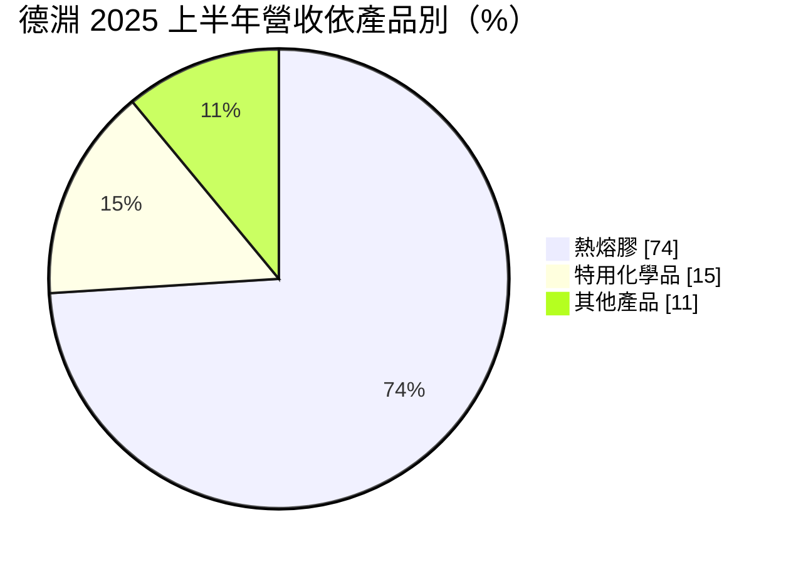
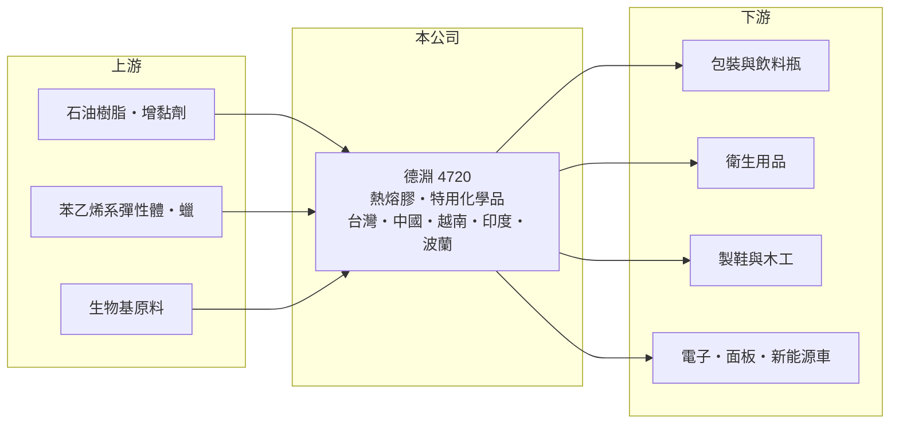

# 4720 德淵

> 上市｜[[產業索引-化學工業|化學工業]]｜上市（櫃）日期 2015/06/24

# 第一章：企業模式與商業藍圖

> [!info] 撰寫說明
> 精簡版，由 Claude 依公開資料整理，架構比照 [[2330台積電]]，資料截至 2026-10-08。來源：富果研究德淵 2025 年 8 月法說會整理、富邦證券（MoneyDJ）財務比率年表、證交所開放資料（基本資料、2026 年上半年損益、資產負債與股利）。#待校對

德淵是台灣最大的[[熱熔膠]]製造商之一，旗下有合得妙、三秒膠等品牌，以「全球設廠、就近供應」的方式服務包裝、衛生用品、製鞋與電子等上百個國家的客戶。

- **核心業務：** 熱熔膠是加熱融化後塗布、冷卻即固化的黏著劑，不含溶劑、黏合速度快，廣泛用於紙箱包裝、尿布與衛生棉、木工、製鞋與電子組裝。德淵另有特用化學品，應用在電子、新能源車與伺服器不斷電系統（UPS）相關的電路板材料等利基市場。
- **營收結構：** 依 2025 年上半年法說會，熱熔膠占營收 74%、特用化學品 15%、其他產品 11%。熱熔膠是穩定的基本盤，特用化學品與綠色材料則是公司刻意拉高比重的成長項目。

- **營運據點：** 公司 1976 年成立，2015 年上市，總部位於新北五股，全球設有 6 座研發中心、8 座工廠，產品行銷超過 100 個國家。生產據點涵蓋台灣、中國大陸、越南、印度與波蘭，美國則透過合作夥伴工廠因應關稅。印度第二座工廠預計 2025 年底前量產，越南也已決議增資擴建第二廠。
- **長期方向：** 公司以 GPS 綠色材料平台（同質回收、生物基、生物可分解）為核心，推出 BIONIS 生物基材料、免塑膠纏繞膜、PET 瓶易脫標等方案；2025 年在桃園啟用亞洲首條生物可分解熱熔膠專用產線。長期目標是從大宗黏著劑走向綠色與電子利基材料。

# 第二章：護城河深度與競爭優勢

熱熔膠是講究配方與在地服務的產業，德淵的護城河來自全球產能布局、客戶驗證與綠色材料的先行者位置。

- **競爭優勢：** 包裝與衛生用品客戶的產線速度很快，黏著劑稍有不穩就會造成停機或瑕疵，因此客戶一旦驗證通過，很少輕易更換供應商。德淵在東協、印度、歐洲就近設廠，能跟著跨國客戶移動，這是多數小型膠廠做不到的。
- **主要對手：** 國際上有美國與德國的大型黏著劑集團，台灣同業有 [[4766南寶]]；中國大陸則有大量傳統熱熔膠廠，法說會提到當地市場「內捲」嚴重，價格壓力大。
- **經營與資本配置：** 2025 年度配發現金股利 0.4 元，以 EPS 0.74 元計算配息率約 54%。公司持續把資本投入海外擴廠、研發實驗室擴大與新莊國際行銷總部，屬於「用資本換全球布局」的路線，但目前獲利率還沒跟上投資規模。
- **觀察重點：** 特用化學品與綠色材料的營收比重、印度與越南新廠的利用率，以及中國市場價格競爭對毛利的影響。

# 第三章：財務體質與盈利規模

資料日期：2026-10-08，表格是撰寫當時的快照；最新月營收、毛利率、累計 EPS 由自動排程寫在本筆記的屬性欄位（月營收、毛利率、累計EPS 等）。#待校對

德淵營收規模約 35 億元，毛利率逐年改善，但營業利益率長期偏低，費用負擔重。

| 年度 | 營收（億元，推算） | 營收年增率 | [[毛利率]] | [[營業利益率]] | EPS（元） | [[ROE]] |
|---|---|---|---|---|---|---|
| 2021 | 約 35 | 12.26% | 18.20% | 1.94% | 0.30 | 2.75% |
| 2022 | 約 36 | 2.97% | 17.59% | 1.26% | 0.20 | 1.82% |
| 2023 | 約 33 | -9.44% | 19.84% | 0.91% | 0.74 | 4.20% |
| 2024 | 約 36 | 11.12% | 23.81% | 4.72% | 1.50 | 10.11% |
| 2025 | 約 36 | -2.31% | 23.03% | 3.38% | 0.74 | 4.78% |

註：年增率、毛利率、營業利益率、EPS、ROE 取自富邦證券（MoneyDJ）財務比率年表（合併報表）；營收金額依 2025 年 EPS、股本與稅後淨利率推算，再以各年年增率回推，屬推算值（2025 年上半年法說會營收 17.82 億元，與推算量級相符）。

- **營收規模：** 2021 至 2025 年營收年複合成長率接近 0%（推算），成長主要來自海外新市場，抵銷了中國市場的價格競爭。
- **獲利：** 毛利率從 2022 年的 17.59% 提升到 2024 至 2025 年的 23% 左右，反映產品組合往特用與綠色材料移動；但營業利益率只有 1% 至 5%，代表全球據點與研發的費用相當高。近 5 年平均 ROE 約 4.7%。法說會也提到，匯兌損失與原物料成本紅利消失會明顯影響單季獲利。
- **財務特色：** 2026 年第二季底股東權益約 17.90 億元、負債總計約 20.07 億元，負債比約 53%，在本次 12 家化工股中屬於槓桿較高的一家，與海外擴廠的資金需求有關。
- **[[ROIC]] 與 [[WACC]]：** 以 2025 年推算營收約 36 億元、營業利益率 3.38%、稅率 20% 計算，稅後營業利益約 0.96 億元；投入資本以股東權益 17.90 億元加有息負債（未查得，介於 0 與負債總計 20.07 億元之間）計，ROIC 約 2.5% 至 5.4%（推算）。WACC 以 CAPM 推估：無風險利率 1.75%、市場風險溢酬 6%、β 取化工股常見值 0.9（未查得個股 β），股權成本約 7.2%；稅前負債成本假設 2.5%、稅後 2.0%，有息負債約占資本三成多，WACC 約 5.3%（推算）。ROIC 大致等於或低於 WACC，表示海外擴張目前只是勉強賺回資金成本，新廠利用率能否拉高是價值創造的關鍵。

# 第四章：總體風險與地緣政治

德淵的風險來自原料價格、中國市場競爭、匯率與海外擴廠的執行。

- **產業週期：** 熱熔膠主要原料是石油樹脂、苯乙烯系彈性體與蠟，價格跟著油價波動。原料下跌時毛利會短暫受惠，原料上漲時則會被壓縮，2025 年上半年獲利下滑就與原料成本紅利消失有關。
- **營運風險：** 印度、越南等新廠初期折舊與費用較高，若訂單成長不如預期，會拖累整體獲利率；多國營運也帶來管理與人才的挑戰。
- **其他風險：** 外銷比重高，匯率變動直接影響業外損益；美國關稅與各國貿易壁壘可能改變客戶的採購地點；歐盟等地的塑膠與包裝法規，則同時是綠色材料的機會與研發投入的壓力。

# 專有名詞解析

## 金融

- **[[ROIC]]**：投入資本報酬率，稅後營業利益除以股東權益加有息負債，衡量本業運用資本的效率。
- **[[WACC]]**：加權平均資金成本，股東與債權人要求報酬率的加權平均，是 ROIC 要超過的門檻。

## 產業

- **[[熱熔膠]]**：加熱融化後塗布、冷卻即固化的無溶劑黏著劑，用於包裝、衛生用品、製鞋與電子組裝。
- **[[生物基材料]]**：以植物等可再生資源取代部分石化原料製成的材料，可降低產品的碳足跡。
- **[[生物可分解]]**：材料在特定環境中可被微生物分解成水與二氧化碳，減少塑膠廢棄物殘留。

# 核心供應鏈

- 上游：石油樹脂、增黏劑、苯乙烯系彈性體、蠟與生物基原料供應商（推估）
- 下游／客戶：包裝、衛生用品、製鞋、木工、電子與面板客戶；免塑膠纏繞膜方案已獲 [[9939宏全]] 等 20 多家客戶採用
- 同業：[[4766南寶]]、國際大型黏著劑集團與中國大陸熱熔膠廠

## 最新新聞
<!-- news:start（自動產生，請勿手動編輯此範圍） -->
- 2026-10-08 📰 媒體 19:51｜營收速報 - 德淵(4720)9月營收3.92億元年增率高達32.97％｜[鉅亨網](https://news.cnyes.com/news/id/6625885)
- 2026-10-07 🏛️ 重訊 16:11｜因本公司有價證券於集中市場達公布注意交易資訊標準， 故公布相關財務業務等重大訊息，以利投資人區別瞭解。｜[觀測站](https://mops.twse.com.tw/mops/#/web/t05st01)

完整紀錄：[[4720德淵 新聞]]
<!-- news:end -->

## 相關連結
- [公開資訊觀測站](https://mopsov.twse.com.tw/mops/web/t05st03?step=1&firstin=1&co_id=4720)
- [Goodinfo](https://goodinfo.tw/tw/StockDetail.asp?STOCK_ID=4720)
- [Yahoo 股市](https://tw.stock.yahoo.com/quote/4720)
- [鉅亨網新聞](https://www.cnyes.com/twstock/4720/news)
