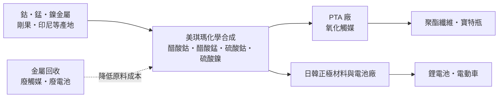
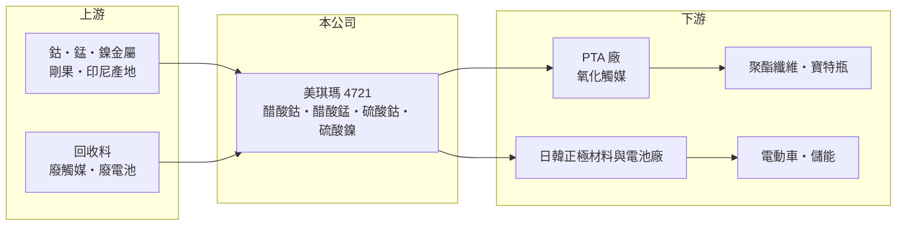

# 4721 美琪瑪

> 上櫃｜[[產業索引-化學工業|化學工業]]｜上市（櫃）日期 2001/03/09

# 第一章：企業模式與商業藍圖

> [!info] 撰寫說明
> 本文由 Claude 依公開資料整理，架構比照 [[2330台積電]] 的四章研究，資料截至 2026-10-08。財務數字來源：Goodinfo 年度經營績效頁、nstock 公司資料頁（股利）、富果研究 2025 年 8 月法說會整理、CMoney 投資快訊標題；產業描述為整理性內容，尚未逐條比對原始文件。公開資料有限，產品別營收比重未查得。#待校對

在評估單一個股的長期投資價值時，首要步驟是拆解企業的底層獲利邏輯。本章說明美琪瑪（股票代號：4721）如何從聚酯原料的觸媒供應商，延伸到電池材料與金屬回收，以及這門生意為什麼和鈷、錳等金屬價格高度連動。

## 一、核心定位：PTA 氧化觸媒起家的鈷錳化合物廠

美琪瑪成立於 1992 年，主要生產醋酸鈷、醋酸錳等鈷與錳的化合物，並從事鈷、錳金屬的買賣與進出口。它的創始業務是 [[PTA]] 氧化觸媒：PTA 是生產聚酯纖維與寶特瓶的基礎原料，在製程中需要以醋酸鈷、醋酸錳作為觸媒，讓對二甲苯順利氧化。觸媒在 PTA 廠的成本占比很小，卻直接影響良率與反應效率，因此客戶重視穩定品質勝過價格，這個業務成為美琪瑪長期穩定的現金流來源。

第二條產品線是電池材料。公司把同樣的鈷、錳化學技術延伸到鋰電池正極材料所需的醋酸鈷、醋酸錳、[[硫酸鈷]]與硫酸鎳。依 2025 年法說會，電池材料是目前主要的成長動能，客戶集中在日本與韓國，中國不是主要市場。這個客戶結構的意義在於，日韓電池供應鏈對材料認證嚴格，一旦導入就不易更換，但也讓美琪瑪的成長和日韓電池廠的擴產節奏綁在一起。

## 二、產品板塊與營收特性

公司未揭露各產品線的營收比重，因此本文不畫比重圖。可以確定的是三條產品線的角色不同：PTA 氧化觸媒是穩定的基本盤；電池材料是成長引擎；金屬回收與特用化學品目前不直接貢獻營收，主要用來降低前兩條產品線的原料成本。

美琪瑪的營收高度受金屬價格影響。產品售價通常隨鈷、錳、鎳的市價調整，因此營收的起伏有很大一部分來自原料價格，而不是出貨量。2022 年營收衝到 52.7 億元、2023 年跌到 23.2 億元，推估主要反映鈷價從高點回落，而非需求腰斬。讀者看這家公司的營收時，應該把「金屬價格」與「加工利差」分開看：真正代表本業實力的是毛利額與加工利差，而不是營收規模。

## 三、資本轉化邏輯：金屬原料加工與回收降本

美琪瑪的獲利來自「買進金屬、加工成高純度化合物、賣給化工與電池客戶」之間的加工利差。依 2025 年法說會，產能利用率約 70% 至 80%。台灣廠區因土地成本高，資本支出以去瓶頸與製程 AI 化為主，不做大規模擴廠，這讓公司維持輕資本的特性。

回收是這套模式中最有長期價值的一環。公司把廢觸媒與廢電池中的鈷、鎳重新提煉成原料，等於自建一條較便宜、較不受產地政治影響的原料來源。金屬價格高時，回收料的成本優勢更明顯；金屬價格低時，回收至少能穩定原料供應。

## 四、企業長期藍圖：回收、泰國與歐盟電池法規

公司在 2025 年法說會提到三個長期方向。第一是評估在泰國設廠，貼近東南亞客戶並分散地緣政治風險，公司預期兩年內會有較明確進展。第二是擴充鈷、鎳化學品產線，並把 AI 導入回收製程以提高回收率。第三是瞄準 2028 年前後的電動車電池退役潮：歐盟新電池法規要求 2031 年起鋰電池中的鈷至少 16% 來自回收料，這會讓具備回收能力的材料商在歐洲供應鏈中更有籌碼。2025 年公司也合併了美戶公司，負債比因此略為上升。這些布局若落實，美琪瑪的定位會從「觸媒與金屬鹽供應商」轉向「電池金屬循環材料商」。

# 第二章：護城河深度與競爭優勢

「護城河」指企業抵禦競爭、維持超額利潤的保護機制。本章分析美琪瑪在小眾化學品市場的優勢、競爭者，以及哪些優勢守得住。

## 一、美琪瑪護城河的核心組成要素

第一是客戶認證與小眾市場地位。PTA 觸媒與電池用金屬鹽都是用量不大、但純度要求極高的化學品，PTA 廠與電池廠更換供應商需要重新驗證，風險遠大於省下的成本。媒體常以「全球 PTA 氧化觸媒供應商」形容美琪瑪，代表它在這個小市場已建立長期客戶關係。

第二是回收與原料彈性。能從廢料中回收金屬的業者，原料成本與供應穩定度都優於只能向礦商採購的同業，這在剛果出口政策反覆、鈷價大起大落的環境下特別重要。

第三是非中國供應鏈的定位。主要客戶在日本與韓國，中國不是主要市場，在各國推動電池供應鏈「去中國化」的趨勢下，台灣廠商可以成為日韓客戶的替代來源。

## 二、全球主要競爭對手格局

| 對手 | 定位 | 對美琪瑪的威脅 |
|---|---|---|
| 中國鈷化學品大廠（如華友鈷業等） | 從礦場到前驅體一條龍，規模大 | 以垂直整合的成本優勢壓低金屬鹽報價 |
| 歐美日特用化學品廠 | 觸媒與高純度金屬鹽 | 在 PTA 觸媒與高階電池材料爭取同一批客戶 |
| 電池回收新進業者 | 專做廢電池金屬回收 | 退役潮來臨時搶奪回收料來源 |

## 三、優勢轉化：守得住／守不住／觀察重點

守得住的是 PTA 觸媒與日韓客戶的高純度金屬鹽。這類產品看重品質與交期，客戶黏著度高，2024 與 2025 年毛利率維持在 18% 以上，就是加工利差仍然存在的證據。

守不住的是金屬價格本身。美琪瑪無法決定鈷、鎳價格，2022 至 2023 年營收從 52.7 億元降到 23.2 億元、2023 年還出現虧損，說明金屬價格劇烈下跌時，存貨與利差都會受傷。

長期觀察重點有三個：泰國設廠是否落地、回收業務能否從降本工具變成獨立的獲利來源，以及電池材料在日韓客戶的占比能否持續提升。

# 第三章：財務體質與盈利規模

資料日期：2026-10-08。數字取自 Goodinfo 年度經營績效與富果研究法說會整理，表格是撰寫當時的快照；最新月營收、毛利率、累計 EPS 由自動排程寫在本筆記的屬性欄位（月營收、毛利率、累計EPS 等）。#待校對

財務報表是檢驗護城河是否真實存在的最終標準。本章用五年的三率、ROE 與資本報酬，檢視美琪瑪在金屬價格循環中的獲利品質。

## 一、獲利能力的基石：三率

| 年度 | 營收（新台幣） | [[毛利率]] | [[營業利益率]] | EPS（元） | [[ROE]] |
|---|---|---|---|---|---|
| 2021 | 41.3 億 | 13.5% | 10.1% | 4.81 | 28.3% |
| 2022 | 52.7 億 | 9.57% | 6.87% | 5.09 | 26.5% |
| 2023 | 23.2 億 | 10.3% | 5.01% | -0.33 | -1.87% |
| 2024 | 21.2 億 | 19.7% | 12.7% | 3.36 | 20.7% |
| 2025 | 25.3 億 | 18.3% | 11.9% | 3.01 | 16.9% |

這五年的數字有一個重要特徵：營收和毛利率常常反向變動。2022 年營收最高，毛利率卻只有 9.57%；2024 年營收最低，毛利率卻升到 19.7%。原因是金屬價格高漲時，營收被原料成本墊高，但加工利差沒有同比例增加，毛利率反而被稀釋。2021 至 2025 年營收年複合成長率約 -11.5%（推算），但這主要反映金屬價格回落，不代表本業萎縮。

2023 年營業利益率仍為 5.01%，EPS 卻是 -0.33 元，代表當年有可觀的業外損失（推估與金屬價格下跌、匯兌或投資損益有關，原因未查得，需查閱年報）。2025 年上半年營收年增 30%、毛利率由 21% 降到 15%，又是金屬價格上漲稀釋毛利率的例子。

## 二、[[ROE]]：資本效率

近五年平均 ROE 約 18.1%（推算），扣除 2023 年的虧損年度，其餘四年都在 16% 以上。以化學品製造業來說，這是相當高的資本效率，原因是公司不需要大規模擴廠，台灣廠以去瓶頸為主，資本支出相對營收很低。

## 三、股利與現金流

依 nstock，近五年平均現金股利約 2.83 元，2024 年度配發 2.36 元、配發率約 70%，2025 年度配發 2.3 元。高配發率與低資本支出的組合，推估自由現金流多數年度為正（推估，現金流量表未查得）。

## 四、[[ROIC]] 與 [[WACC]]：價值創造利差

**ROIC 推算：** 2025 年營業利益約 3.01 億元（25.3 億 × 11.9%），稅後約 2.41 億元。股東權益以 2025 年上半年淨利 1.16 億元與 EPS 1.55 元回推流通股數約 0.75 億股，全年淨利約 2.25 億元，再除以 ROE 16.9%，股東權益約 13.3 億元（推算）。負債比未查得，假設有息負債約 4 億元（推估），投入資本約 17.3 億元，ROIC 約 14%（推算）。2024 年營業利益約 2.69 億元，稅後約 2.15 億元，以相近的資本規模估計 ROIC 約 12% 至 13%（推算）。

**WACC 推算：** 股東權益成本以 CAPM 估計，假設台灣 10 年期公債殖利率 1.75%、市場風險溢酬 6%、β 取化學品同業常見值 0.9，股東權益成本約 7.2%。負債成本假設 2.5%，稅後 2.0%，權益占資本約 77%（推估），WACC 約 6.0%（推算）。

**結論：** 除了 2023 年金屬價格崩跌的虧損年度，美琪瑪的 ROIC 大致在 12% 以上，高於約 6% 的資金成本，代表它在小眾化學品市場長期創造經濟價值。這個利差的來源是低資本支出與客戶黏著度；風險則是金屬價格急跌時的存貨損失，會讓個別年度的報酬率大幅偏離。

# 第四章：總體風險與地緣政治

任何企業都無法脫離宏觀環境獨立存在。本章分析美琪瑪長期必須面對的原料、產業週期與營運風險。

## 一、原物料與地緣政治

鈷的主要產地是剛果，鎳的主要產地是印尼，兩國都曾以出口禁令或配額影響全球供給。2025 年剛果實施鈷出口限制，市場預期轉為配額制。原料產地的政策變化會直接改變美琪瑪的成本與售價，金屬價格急跌時，手上的存貨也可能出現跌價損失。另一方面，中國掌握大部分鈷精煉產能，若中國調整出口政策，也會牽動全球鈷化學品的價格。

## 二、產業週期與市場結構

PTA 屬於聚酯產業，受紡織與包裝需求影響，週期性明顯；中國 PTA 產能持續擴張，也讓非中國 PTA 廠的開工率承壓，間接影響觸媒需求。電池材料則受電動車銷售與電池技術路線影響，鈷含量較低或不含鈷的磷酸鐵鋰電池占比提高，長期可能減少對鈷鹽的需求，這是美琪瑪必須以鎳、錳產品與回收業務來對沖的結構性變化。

## 三、營運環境的隱性風險

公司規模不大，客戶集中在日韓少數大廠，任一客戶調整採購都會明顯影響營收。產品以外幣計價，2025 年上半年就出現約 1,000 萬元的匯兌損失。化學品製程涉及重金屬，環保與工安法規趨嚴會提高營運成本。泰國設廠若落地，也會帶來海外管理與初期折舊的壓力。

## 四、科技或法規演進

歐盟新電池法規要求回收鈷的使用比例，是對回收業者有利的法規趨勢；但電池化學配方持續演進，若主流電池進一步降低鈷、鎳用量，美琪瑪必須找到新的金屬化合物應用，才能延續成長。

# 專有名詞解析

## 金融

- **[[ROIC]]**：投入資本報酬率，稅後營業利益除以股東權益加有息負債，衡量本業運用資本的效率。
- **[[WACC]]**：加權平均資金成本，股東與債權人要求報酬的加權平均，ROIC 高於它才代表創造價值。

## 產業

- **[[PTA]]**：純對苯二甲酸，與乙二醇聚合成聚酯，是紡織與包裝用聚酯的基礎原料。
- **[[硫酸鈷]]**：鈷金屬與硫酸反應製成的化合物，用於三元鋰電池正極，可提高電池穩定性。
- **[[氧化觸媒]]**：加速氧化反應、本身不被消耗的化學物質，PTA 製程以醋酸鈷、醋酸錳作為氧化觸媒。
- **[[電池回收]]**：從退役電池與製程廢料中提煉鈷、鎳、鋰等金屬再利用，可降低對礦產的依賴。

# 核心供應鏈

## 1. 上游：金屬原料
- 鈷、錳、鎳金屬（主要產地剛果、印尼；中國掌握多數精煉產能）
- 回收料：廢觸媒與退役電池

## 2. 中游：美琪瑪與同業
- 中國鈷化學品大廠（如華友鈷業）、歐美日特用化學品廠

## 3. 下游：PTA 與聚酯
- 台灣 PTA 生產者如 [[1326台化]]、[[1402遠東新]] 旗下亞東石化（產業參考，實際客戶未查得）；日韓 PTA 廠

## 4. 下游：電池材料
- 日本與韓國的正極材料與電池廠（公司未公開名稱）

## 最新新聞
<!-- news:start -->
<!-- news:end -->

## 相關連結
- [公開資訊觀測站](https://mopsov.twse.com.tw/mops/web/t05st03?step=1&firstin=1&co_id=4721)
- [Goodinfo](https://goodinfo.tw/tw/StockDetail.asp?STOCK_ID=4721)
- [Yahoo 股市](https://tw.stock.yahoo.com/quote/4721)
- [鉅亨網新聞](https://www.cnyes.com/twstock/4721/news)
