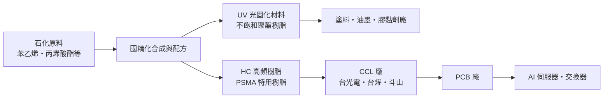
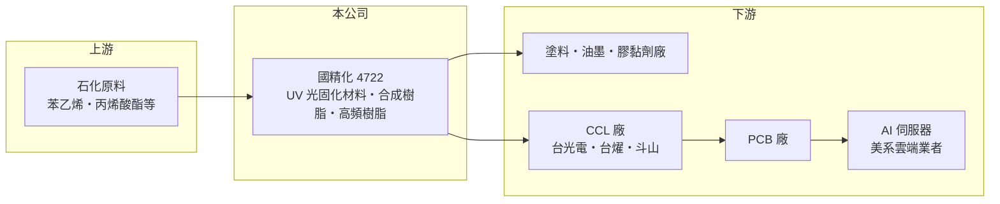

# 4722 國精化

> 上市｜[[產業索引-化學工業|化學工業]]｜上市（櫃）日期 2012/08/15

# 第一章：企業模式與商業藍圖

> [!info] 撰寫說明
> 本文由 Claude 依公開資料整理，架構比照 [[2330台積電]] 的四章研究，資料截至 2026-10-08。財務數字來源：Goodinfo 年度經營績效頁、nstock 公司資料頁（股利）、工商時報 2026 年 8 月報導；產業描述為整理性內容，尚未逐條比對原始文件。公開資料有限，產品別營收比重未查得。#待校對

在評估單一個股的長期投資價值時，首要步驟是拆解企業的底層獲利邏輯。本章說明國精化學（股票代號：4722，以下簡稱國精化）如何從傳統合成樹脂與 UV 光固化材料，轉向 AI 伺服器所需的高頻銅箔基板樹脂。

## 一、核心定位：合成樹脂與 UV 光固化材料廠

國精化成立於 1978 年，主要營業項目是 [[UV固化]]材料、不飽和聚酯樹脂與各種用途的合成樹脂。UV 光固化材料是一種照紫外光幾秒內就會硬化的樹脂，常見於木器與塑膠塗料、印刷油墨、電子用膠與光學塗層。它的好處是不需溶劑揮發、省能源，符合環保法規趨勢，因此長期需求穩定；但產品技術門檻不算高，中國與台灣都有不少廠商，價格競爭激烈。

這個定位決定了國精化過去十年的財務樣貌：營收在 34 億至 50 億元之間起伏，毛利率約 15% 至 21%，屬於典型的特用化學品中段班。公司賺的是配方與應用服務的錢，但很難擺脫原料價格與同業削價的壓力。

## 二、產品板塊：傳統樹脂為基本盤，高頻樹脂為新引擎

公司未揭露最新的產品別營收比重，因此本文不畫比重圖。可以確定的是公司正在把產品組合分成兩層。第一層是 UV 光固化材料、不飽和聚酯樹脂等傳統產品，提供基本營收，但處於工商時報所稱的「低價紅海競爭」。第二層是新的電子化學材料，包括 HC 高頻樹脂與 PSMA 特用樹脂，用於高階 [[CCL]]（銅箔基板）。

高頻樹脂的重要性在於 AI 伺服器。AI 伺服器與高速交換器的訊號頻率越來越高，電路板材料必須降低訊號損耗，因此 CCL 廠需要[[低介電樹脂]]這類特殊配方。依 2026 年 8 月報導，國精化的產品已通過 [[2383台光電]]、[[6274台燿]] 與韓國斗山等 CCL 大廠認證並量產出貨，最終進入美系雲端服務業者的 AI 伺服器供應鏈。

## 三、資本轉化邏輯：配方能力加上客戶認證

國精化的生意是把石化原料合成成特定功能的樹脂，再依客戶需求調整配方。傳統產品的利潤取決於原料價差與產能利用率；高頻樹脂則不同，它要先通過 CCL 廠的材料認證，再隨 CCL 廠一起通過終端伺服器客戶的驗證，整個過程可能長達一到兩年。認證期長是新進者的門檻，也是一旦打入後訂單較穩定的原因。

## 四、企業長期藍圖：轉型為高階電子化學材料廠

公司的長期目標是「轉型為全球高階電子化學材料大廠」。依 2026 年 8 月報導，原本規劃 2027 年以後的擴產全面提前，安南新廠與永安廠的高階電子化學材料產線加速開出，2026 年底前會有多條高頻材料產線陸續投產。這是改變公司長期結構的投資：如果高頻樹脂成為主要營收來源，國精化的毛利率與資本報酬率有機會擺脫傳統樹脂的水準；反之，若 AI 伺服器材料規格轉向其他樹脂系統，新產能的利用率將是最大風險。

# 第二章：護城河深度與競爭優勢

「護城河」指企業抵禦競爭、維持超額利潤的保護機制。本章分析國精化在傳統與新興產品的競爭位置。

## 一、國精化護城河的核心組成要素

第一是配方與應用技術。合成樹脂看似原料，實際上每家客戶的塗布條件、硬化速度、耐候性需求都不同，供應商必須長期累積配方資料庫並提供現場技術服務。國精化有四十多年的樹脂合成經驗，這是它能跨入高頻樹脂的基礎。

第二是 CCL 大廠的認證。高頻樹脂必須同時通過 CCL 廠與伺服器終端客戶的驗證，認證後若更換材料，整片電路板的電性都要重新測試，轉換成本很高。已經進入台光電、台燿、斗山供應鏈，是國精化目前最有價值的資產。

第三是台灣在地供應。台灣是全球高階 CCL 與 PCB 的生產重鎮，在地樹脂供應商能提供較短的交期與即時的技術支援，對 CCL 廠分散日系供應來源也有吸引力。

## 二、全球主要競爭對手格局

| 對手 | 定位 | 對國精化的威脅 |
|---|---|---|
| [[1717長興]] | 台灣大型特用化學品廠，UV 固化材料與電子材料齊全 | 在 UV 材料與電子化學品直接競爭 |
| 中國 UV 單體與寡聚物廠 | 產能大、價格低 | 壓低傳統 UV 材料報價 |
| 日系與美系電子樹脂廠（如 SABIC 的 PPE 樹脂等） | 高頻 CCL 樹脂的既有供應商 | 技術領先，掌握主要 CCL 廠的既有規格 |

## 三、優勢轉化：守得住／守不住／觀察重點

守得住的是已通過認證的高頻樹脂訂單，以及需要技術服務的特殊配方客戶。這些客戶在意的是穩定品質與電性表現，價格敏感度較低。

守不住的是一般 UV 材料與不飽和聚酯樹脂的價格。2021 年營業利益率 9.69%，2023 年降到 4.8%，2025 年約 6.26%，顯示傳統產品在景氣下行與同業削價時毫無招架之力。

長期觀察重點是高頻樹脂占營收的比重能否持續提高、新產線的利用率，以及公司能否從一兩家 CCL 客戶擴展到更多客戶與更多世代的材料規格。

# 第三章：財務體質與盈利規模

資料日期：2026-10-08。數字取自 Goodinfo 年度經營績效與 nstock 股利資料，表格是撰寫當時的快照；最新月營收、毛利率、累計 EPS 由自動排程寫在本筆記的屬性欄位（月營收、毛利率、累計EPS 等）。#待校對

財務報表是檢驗護城河是否真實存在的最終標準。本章用五年的三率、ROE 與資本報酬，檢視國精化轉型前的獲利基礎。

## 一、獲利能力的基石：三率

| 年度 | 營收（新台幣） | [[毛利率]] | [[營業利益率]] | EPS（元） | [[ROE]] |
|---|---|---|---|---|---|
| 2021 | 48.3 億 | 20.8% | 9.69% | 3.73 | 13.8% |
| 2022 | 42.2 億 | 18.0% | 7.78% | 3.15 | 11.1% |
| 2023 | 34.5 億 | 15.3% | 4.80% | 1.67 | 5.76% |
| 2024 | 40.4 億 | 16.8% | 6.44% | 2.25 | 7.58% |
| 2025 | 37.3 億 | 16.8% | 6.26% | 2.00 | 6.47% |

2021 年是這五年的高點，之後營收與利潤率同步下滑，2023 年谷底的營業利益率只剩 4.8%。2021 至 2025 年營收年複合成長率約 -6.3%（推算）。拉長到十年看，2016 年營收 46.6 億元、2025 年 37.3 億元，營收規模沒有成長，獲利水準也呈緩步下降，這正是公司必須轉型的原因：傳統樹脂業務已經進入成熟期，無法再帶來成長。

## 二、[[ROE]]：資本效率

近五年平均 ROE 約 8.9%（推算），2023 年以後落在 6% 至 8%。每股淨值從 2021 年的 27.83 元緩步增加到 2025 年的 31.32 元，顯示公司每年仍有獲利並保留部分盈餘。依 Goodinfo 的 ROE 與 ROA 比例推算，總負債約與股東權益相當（推算），財務槓桿中等。

## 三、股利與資本支出

依 nstock，近五年平均現金股利約 1.54 元，2024 年度配發 1.4 元、配發率約 62%，2025 年度配發 1.18 元。股利隨獲利波動，但長期維持配發。2026 年起安南與永安新產線提前投產，資本支出將明顯高於過去（金額未查得），未來幾年自由現金流可能因擴產而轉弱（推估）。

## 四、[[ROIC]] 與 [[WACC]]：價值創造利差

**ROIC 推算：** 2025 年營業利益約 2.33 億元（37.3 億 × 6.26%），稅後約 1.87 億元。股東權益約 31.9 億元（每股淨值 31.32 元 × 約 1.02 億股），依 ROE 6.47% 與 ROA 3.33% 推算總負債約 30 億元，假設其中一半為有息負債約 15 億元（推估），投入資本約 47 億元，ROIC 約 4.0%（推算）。以同樣方法估 2021 年，稅後營業利益約 3.74 億元，ROIC 約 9%（推算）。

**WACC 推算：** 股東權益成本以 CAPM 估計，假設台灣 10 年期公債殖利率 1.75%、市場風險溢酬 6%、β 取化學品同業常見值 0.8，股東權益成本約 6.6%。負債成本假設 2.5%，稅後 2.0%，權益占資本約 68%（推估），WACC 約 5.1%（推算）。

**結論：** 2021 至 2022 年國精化的 ROIC 高於 WACC，2023 年以後降到與資金成本相當甚至略低，代表傳統業務已經難以創造經濟價值。高頻樹脂的轉型能否成功，關鍵就在於能否把 ROIC 拉回明顯高於 5% 的水準；新產能若利用率不足，折舊增加反而會讓利差更小。

# 第四章：總體風險與地緣政治

任何企業都無法脫離宏觀環境獨立存在。本章分析國精化長期必須面對的產業週期、營運與技術風險。

## 一、產業週期與原料

合成樹脂的原料來自石化產業，苯乙烯、丙烯酸酯等原料價格隨油價與石化景氣波動。原料大漲時，產品售價往往要落後一段時間才能調整，毛利率會先受擠壓；中國石化產能持續擴張，也讓傳統樹脂的報價長期承壓。

## 二、客戶集中與 AI 景氣

高頻樹脂的需求集中在少數 CCL 大廠，最終又集中在少數雲端服務業者的 AI 伺服器。這代表新業務的成長高度依賴 AI 資本支出的節奏。若雲端業者放緩投資，或 CCL 廠改用其他樹脂配方，國精化的新產線可能面臨利用率不足，並透過[[長鞭效應]]放大成訂單的劇烈波動。

## 三、營運環境的隱性風險

擴產提前代表資本支出與折舊提前增加，若產品放量速度跟不上，短期獲利會被壓縮。化學品工廠也面臨工安與環保法規，新廠的試車與認證若延誤，會影響客戶交貨。

## 四、科技演進

高頻電路板材料的世代更替很快，每一代 AI 伺服器都會提高對低損耗材料的要求。國精化必須持續投入研發，才能在下一代規格中保住位置；日系與美系樹脂廠的技術領先，也意味著國精化在最高階規格上未必能取得主導權。

# 專有名詞解析

## 金融

- **[[ROIC]]**：投入資本報酬率，稅後營業利益除以股東權益加有息負債，衡量本業運用資本的效率。
- **[[WACC]]**：加權平均資金成本，股東與債權人要求報酬的加權平均，ROIC 高於它才代表創造價值。

## 產業

- **[[UV固化]]**：以紫外光照射讓樹脂在數秒內硬化的技術，不需溶劑揮發，用於塗料、油墨、膠黏劑與 3D 列印。
- **[[CCL]]**：銅箔基板，由銅箔、玻纖布與樹脂壓合而成，是製作印刷電路板的核心材料。
- **[[低介電樹脂]]**：介電常數與介電損耗低的樹脂，可減少高頻訊號在電路板中的衰減，是 AI 伺服器高階 CCL 的關鍵材料。
- **[[長鞭效應]]**：終端需求的小幅變動，沿供應鏈往上游傳遞時被逐級放大，造成上游庫存與訂單劇烈波動。

# 核心供應鏈

## 1. 上游：石化原料
- 苯乙烯、丙烯酸酯等石化原料供應商（實際供應商未查得）

## 2. 中游：國精化與同業
- 台灣同業：[[1717長興]]
- 中國 UV 材料廠、日系與美系電子樹脂廠

## 3. 下游：CCL 與 PCB
- CCL：[[2383台光電]]、[[6274台燿]]、韓國斗山
- 最終應用：美系雲端服務業者的 AI 伺服器（未具名）

## 4. 下游：傳統應用
- 木器與塑膠塗料、印刷油墨、膠黏劑廠

## 最新新聞
<!-- news:start（自動產生，請勿手動編輯此範圍） -->
- 2026-10-08 📰 媒體 17:23｜營收速報 - 國精化(4722)9月營收3.81億元年增率高達31.16％｜[鉅亨網](https://news.cnyes.com/news/id/6625022)

完整紀錄：[[4722國精化 新聞]]
<!-- news:end -->

## 相關連結
- [公開資訊觀測站](https://mopsov.twse.com.tw/mops/web/t05st03?step=1&firstin=1&co_id=4722)
- [Goodinfo](https://goodinfo.tw/tw/StockDetail.asp?STOCK_ID=4722)
- [Yahoo 股市](https://tw.stock.yahoo.com/quote/4722)
- [鉅亨網新聞](https://www.cnyes.com/twstock/4722/news)
