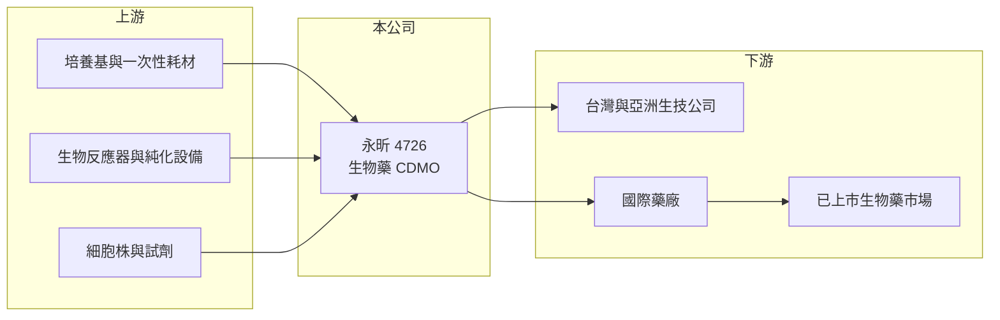

# 4726 永昕

> 上櫃｜[[產業索引-生技醫療業|生技醫療業]]｜上市（櫃）日期 2013/12/25

# 第一章：企業模式與商業藍圖

> [!info] 撰寫說明
> 精簡版，由 Claude 依公開資料整理，架構比照 [[2330台積電]] 的四章研究，資料截至 2026-10-08。來源：Goodinfo 年度經營績效頁（2019 至 2025 年）、櫃買中心開放資料（基本資料、2026 年第二季資產負債與綜合損益、每月營收）、財訊快報 2024 年 12 月永昕法說會報導（Yahoo 股市轉載）；廠區位置等細節憑既有知識撰寫，已標「待校對」。公開資料有限。#待校對

永昕生物醫藥（股票代號：4726，以下簡稱永昕）是台灣少數專做[[生物藥]]的[[CDMO]]，也就是替藥廠與生技公司開發蛋白質藥物的製程，並在自己的 GMP 工廠代工生產。它的商業模式可以類比為「生物藥的晶圓代工」：本身不賣藥，獲利取決於工廠的產能利用率與客戶藥物的成敗。

- **核心業務：** 永昕 2001 年成立，2013 年 12 月上櫃（櫃買中心開放資料），2019 年轉型為專業生物藥 CDMO，此後承接的案件數成長兩倍以上（財訊快報 2024 年 12 月）。服務範圍從細胞株、製程開發、臨床用藥到商業化量產，涵蓋抗體與重組蛋白等生物藥。
- **營收結構：** 營收依服務階段或客戶別的比重本次未查得。CDMO 營收通常分成「開發服務」與「商業化量產」兩類，前者案件多但金額小、波動大，後者需要客戶藥物已上市，才能帶來長期穩定的訂單。
- **營運據點：** 廠區位於新竹（待校對）。一廠具多條產線，適合少量多樣的彈性生產；二廠負責大規模量產，原液（DS）產能為一廠的 6 倍、充填（DP）產能為一廠的 30 倍，充填線於 2025 年第一季開始生產，年產能最高可達 1,000 萬劑（財訊快報 2024 年 12 月）。
- **長期方向：** 公司預計自 2025 年起成為兩項已上市生物藥的國際市場供應商，作為營收成長的基礎；並與建誼生技合作發展抗體藥物複合體（ADC），同時興建符合 PIC/S GMP 的細胞治療先導工廠（財訊快報 2024 年 12 月）。這代表永昕正從「臨床開發服務」走向「商業化量產」，是 CDMO 從虧損走向獲利的關鍵階段。

# 第二章：護城河深度與競爭優勢

CDMO 的護城河來自法規認證、技術經驗與客戶轉換成本，永昕已具備基礎，但規模仍遠小於國際大廠。

- **競爭優勢：** 生物藥一旦在某座工廠完成製程驗證並取得藥證，更換代工廠需要重新做比對試驗與送審，轉換成本很高。永昕若能成為已上市藥物的商業化供應商，這些訂單往往能延續多年，形成穩定的基本盤。
- **主要對手：** 台灣同業有 [[6589台康生技]]，國際上則有 Lonza、三星生物（Samsung Biologics）、藥明生物等大型 CDMO。#待校對 國際大廠動輒擁有數十萬公升的產能，永昕的定位是中小型客戶與亞洲市場的彈性產能。
- **地緣機會：** 美國對中國生技供應鏈的限制（例如生物安全法案的討論）可能讓部分客戶尋找中國以外的代工來源，台灣 CDMO 有機會受惠，但實際效果仍需觀察。#待校對
- **觀察重點：** 第一，二廠產能利用率提升後，毛利率能否轉正；第二，兩項上市藥物的出貨量；第三，ADC 與細胞治療等新服務能否帶來新客戶。

# 第三章：財務體質與盈利規模

資料日期：2026-10-08，表格是撰寫當時的快照；最新月營收、毛利率、累計 EPS 由自動排程寫在本筆記的屬性欄位（月營收、毛利率、累計EPS 等）。#待校對

永昕近年營收持穩，但毛利率長期為負，主因是新廠折舊與產能尚未填滿。

| 年度 | 營收（新台幣） | [[毛利率]] | [[營業利益率]] | EPS（元） | [[ROE]] |
|---|---|---|---|---|---|
| 2021 | 7.74 億 | 17.8% | -11.0% | -0.61 | -5.76% |
| 2022 | 7.32 億 | -15.5% | -60.8% | -2.74 | -18.1% |
| 2023 | 6.53 億 | -57.5% | -92.3% | -3.32 | -24.6% |
| 2024 | 6.84 億 | -35.3% | -67.5% | -2.27 | -20.9% |
| 2025 | 7.40 億 | -24.5% | -54.6% | -2.17 | -24.8% |
| 2026 上半年 | 4.00 億 | -19.4% | -44.7% | -0.96 | 未查得 |

- **營收規模：** 2020 至 2025 年營收年複合成長率約 2.2%（推算），營收停在 6.5 億至 7.7 億元。2026 年 1 至 8 月累計營收較去年同期成長約 37%（櫃買中心每月營收），可能反映二廠量產與商業化訂單開始貢獻（推估）。
- **獲利：** 2020 年曾小幅獲利，2022 年起毛利率轉負，2023 年低到 -57.5%，之後逐年收斂到 2026 年上半年的 -19.4%。CDMO 的成本以折舊與人力為主，屬於固定成本，營收增加時毛利率改善速度會很快，這是觀察轉機的關鍵。2021 至 2025 年平均 ROE 約 -19%（推算）。
- **財務特色：** 2026 年第二季底股本 20.7 億元、總資產 32.8 億元、總負債 18.7 億元、權益 14.1 億元（櫃買中心資料），負債比約 57%，沒有配發股利。

**[[ROIC]] 與 [[WACC]]：**
- ROIC（推算）：2025 年營業利益約 7.40 億元 × -54.6% ≈ -4.04 億元，虧損不計稅。有息負債未查得，假設約 12 億元（建廠借款），加上權益 14.1 億元，投入資本約 26 億元，ROIC 約 -15.5%（推算）。2026 年上半年營業虧損 1.79 億元，年化後 ROIC 約 -14%（推算）。
- WACC（推算）：無風險利率 1.75%、市場風險溢酬 6%，β 取生技 CDMO 常見值 1.2（假設），股東權益成本約 9.0%；負債成本 2.5%、稅後 2.0%，負債約占投入資本 46%，WACC 約 5.8%（推算）。
- 結論：ROIC 遠低於 WACC，目前仍在消耗資本。CDMO 的價值創造要等到產能利用率夠高、毛利率轉正，若二廠能填滿，固定成本攤提效果會讓 ROIC 大幅改善，這是永昕長期投資的核心假設。

# 第四章：總體風險與地緣政治

永昕的風險集中在產能利用率、客戶藥物成敗與資金需求。

- **產業週期：** 生技募資環境影響 CDMO 的開發案件數，2022 年後全球生技資金緊縮，中小型生技公司延後臨床計畫，CDMO 的開發服務需求隨之下降（推估）。
- **營運風險：** 新廠折舊龐大，若商業化訂單不如預期，毛利率會長期為負。客戶的藥物若臨床失敗或銷售不佳，代工訂單也會跟著消失，CDMO 間接承擔客戶的研發風險。
- **資金風險：** 長期虧損加上擴產需求，負債比已升到約 57%，未來可能需要增資或舉債，對既有股東形成稀釋壓力。
- **其他風險：** 生物藥工廠須通過美國 FDA、歐盟 EMA 等查廠，任何品質缺失都可能影響客戶出貨；國際大廠的價格競爭與地緣政治下的供應鏈重組，則同時帶來威脅與機會。

# 專有名詞解析

## 產業

- **[[CDMO]]**：委託開發暨製造服務，替藥廠從製程開發到量產一條龍代工，類似製藥業的晶圓代工。
- **[[PIC S GMP]]**：國際醫藥品稽查協約組織的優良製造規範，台灣藥廠須符合此標準才能生產藥品。
- **[[生物藥]]**：以活細胞生產的大分子藥物，例如抗體與重組蛋白，製程複雜、生產成本高。
- **[[生物相似藥]]**：原廠生物藥專利到期後，其他藥廠開發的高度相似版本，類似化學藥的學名藥。

# 核心供應鏈

- 上游：細胞培養基、一次性生物製程耗材、生物反應器與層析純化設備、細胞株與試劑供應商。
- 下游／客戶：開發新藥或[[生物相似藥]]的台灣與亞洲生技公司、國際藥廠，以及合作夥伴建誼生技（ADC）。
- 同業：[[6589台康生技]]，以及 Lonza、三星生物、藥明生物等國際 CDMO。

## 最新新聞
<!-- news:start（自動產生，請勿手動編輯此範圍） -->
- 2026-10-08 📰 媒體 16:20｜營收速報 - 永昕(4726)9月營收1.16億元年增率高達393.28％｜[鉅亨網](https://news.cnyes.com/news/id/6624896)

完整紀錄：[[4726永昕 新聞]]
<!-- news:end -->

## 相關連結
- [公開資訊觀測站](https://mopsov.twse.com.tw/mops/web/t05st03?step=1&firstin=1&co_id=4726)
- [Goodinfo](https://goodinfo.tw/tw/StockDetail.asp?STOCK_ID=4726)
- [Yahoo 股市](https://tw.stock.yahoo.com/quote/4726)
- [鉅亨網新聞](https://www.cnyes.com/twstock/4726/news)
